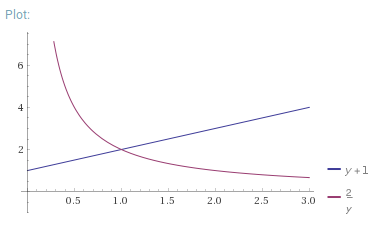

A **griefing factor** is a measure of the extent to which participants in a mechanism can abuse the mechanism to cause harm to other participants, even at some cost to themselves; a mechanism has a griefing factor of $k$ if there exist opportunities to reduce others' payoffs by $\$k$ at a cost of $\$1$ to themselves.

We define an abstract blockchain game as follows. Suppose that there is a set of participants, which are broken up into three sets, where $a + b + c = 1$:

* $a$: in case 1, online and honest, in case 2, colluding to censor $b$
* $b$: in case 1, colluding to be maliciously offline, in case 2, honest victims of censorship
* $c$: in both cases, offline (eg. because they are lazy)

The protocol cannot observe whether it is in case 1 or case 2, and it cannot distinguish $b$ from $c$. But it can distinguish $a$ from $b+c$, because messages from $a$ are included in the canonical chain, and $b$ and $c$ are not. We establish two functions: $R(x)$, which is the payout to group $a$ (assuming the total size of group $a$ is $x$), and $P(x)$, which is the payout to groups $b$ and $c$, once again taking as an input the total size of group $a$.

We can easily calculate the griefing factors of both strategies, taking as a baseline the case where $a$ is not censoring, and $b$ is online:

* Going offline: $\frac{b * (R(a+b) - R(a)) + c * (P(a+b) - P(a))}{a * (R(a+b) - P(a))}$
* Censorship: $\frac{a * (R(a+b) - P(a)) + c * (P(a+b) - P(a))}{b * (R(a+b) - R(a))}$

Note that in the censorship case, we assume that $a > b$, as in an ideal protocol a coalition of less than 50% cannot censor. As an initial observation, note that it's not possible for the global maximum griefing factor to be less than 1; this is because in the case where $c=0$, the two griefing factors are exact inverses of each other, so if one is less than 1 the other is greater than 1.

Another important finding is that if it is possible to _selectively_ censor (that is, censor some honest nodes without censoring other honest nodes), the global maximum griefing factor cannot be less than 2. To see why, consider two cases, where in both cases $a = 0.5 + \epsilon$, $b = 0.5 - \epsilon$ and $c = 0$:

* $a$ censors a $\epsilon$ fraction of $b$. Then, $a$ loses some penalty $(0.5 + \epsilon) * x$ where $x = R(1) - R(1 - \epsilon)$, $b$ suffers $(0.5 - \epsilon) * x$ from the same penalty, and $b$ also suffers $y = \epsilon * (R(1) - P(1 - \epsilon))$.
* $b$ goes offline with $\epsilon$. Then, $b$ loses $y$ and $a$ loses $x$.

The griefing factors are thus $\frac{z+y}{z}$ and $\frac{2z}{y}$ (letting $z = \frac{x}{2}$ and eliding the $\epsilon$ for simplicity). We can solve for the minimum of both by setting the two equal to each other. Setting $z=1$ without loss of generality (if $z$ is not 1 we can scale both $y$ and $z$ down by the same factor without changing the results), we get [the following graph](http://www.wolframalpha.com/input/?i=graph+1%2By+and+2%2Fy+from+y%3D0+to+3):

The minimum is clearly at $z = y$ (or $x = 2y$, or assuming continuity $R'(1) = 2 * (R(1) - P(1))$), with a griefing factor of 2.

If we force censorship to be all-or-nothing, one can show that $R(x) = x^{1.53}$ and $P(x) = 0$ has griefing factors of 1.53 for going offline and for censorship, achieving a clearly better result than 2 (the griefing factor for going offline is clearly $1.53$ because $\frac{x * R'(x)}{R(x) - P(x)} = 1.53$ at any value of $x$, and censoring with the optimal $a=b=\frac{x}{2}$ gives a penalty of $x^{1.53}$ to others and $x^{1.53} - (\frac{x}{2})^{1.53} =$ $x^{1.53} * (1 - \frac{1}{2^{1.53}}) =$ $x^{1.53} * \frac{1}{1.53}$ to oneself).

This implies that [inclusive](https://fc15.ifca.ai/preproceedings/paper_101.pdf) blockchain protocols, where nodes include any not-yet-included messages into their own messages by default, are superior, because they force a situation where censoring any one honest validator requires censoring all honest validators, which allows griefing factors significantly below 2, making 51% attacks less dangerous.

The challenges for consensus mechanisms are:

* Setting $R$ and $P$ to both minimize griefing factors (going lower than 1.53 is possible) and satisfy their other constraints (namely, penalizing attacks)
* Making sure that their protocols are as close to this ideal model as possible