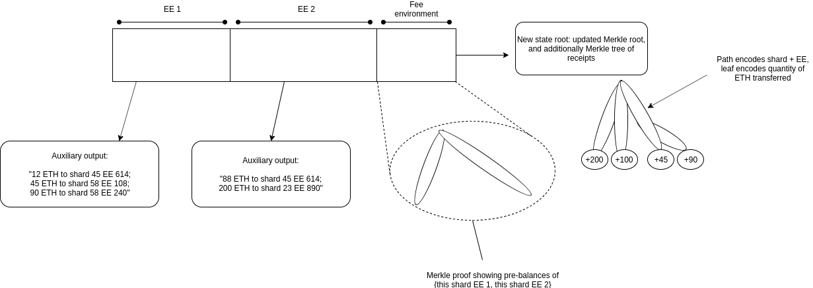
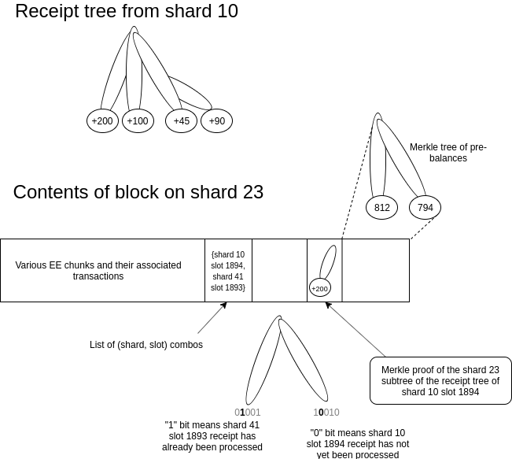

See https://ethresear.ch/t/moving-eth-between-shards-the-problem-statement/6597 for the problem this is trying to solve.

We can create an execution environment, which we'll call "the fee environment", whose primary role will be storing ETH balances held by _other execution environments_. This execution environment will contain a minimal balance-holding and cross-shard receipt system, allowing ETH to be moved between shards quickly.

### Prerequisites

We assume that a block contains (i) data, and (ii) a list of execution environments that access the data. The EEs in the list are called in sequence, and all have access to the entire data (before we had each EE only have access to its own part of data, but there's no cost to not allowing each EE to have access to the entire block data). EE execution also has access to "auxiliary outputs" generated by EEs that have already been processed.

We assume block producers all "understand" the fee environment, in the sense that they understand when they receive coins in it.

### Expected block structure

 

Every block will contain one or more segments that are each dedicated to an execution environment, containing transactions inside of that execution environment. The execution environments themselves make an auxiliary output representing a summary of the cross-shard transfers they want to make; multiple transfers to the same (shard, EE) pair are batched.

At the end of a block, there is a segment dedicated to the fee environment, which includes a Merkle multiproof of all the EEs for which there existed segments (note that those prior EEs themselves would peek into this segment and verify its correctness and the sufficiency of balances [the sufficiency check would require EEs after the first to also peek into auxiliary outputs of previous EEs]). The fee environment would issue a state root that contains the Merkle tree with the updated balances within the shard, as well as a receipt root that contains all of the cross-shard transfers. The receipt root would be designed so that the path encodes a shard+EE combo, and the leaf encodes the amount to be transferred.

For example, if a block on shard A contains a single transaction, `[Alice ---{50 ETH}---> Bob]` where Bob is on another shard B, there would be _two_ receipts, (i) the EE-specific receipt that allows Bob to claim the ETH, and (ii) the EE would generate an auxiliary output, `{B, EE_id, 50}`, and then the fee environment would reduce the balance of `{A, EE_id}` by 50, publish the updated root as its new state root, and make a receipt tree with a single element, `{key=(B, EE_id), value=50}`. If there are N transactions in the same EE, only N+1 branches would be produced; the overhead is only constant.

### Receiving receipts

Now, let us extend the above scheme to allow receipts to also be received. The fee environment's state now contains a third root, a _bitfield root_, a Merkle root of a bitfield, storing for each shard and each slot whether or not a receipt from that slot has already been processed. For efficiency, we will likely want to put the bits corresponding to the same slot beside each other, so we only need one Merkle branch in the "happy case" where receipts are processed immediately.

The section in the block dedicated to the fee environment would also declare which branches of this bitfield it reveals. For every branch it reveals where the bit is a 0, the Merkle proof of the pre-balances would also need to reveal the corresponding EE balance, and the fee environment would also need to provide a Merkle proof of the corresponding receipt. The updated pre-balance root would increase the EE balance by the value in the receipt, and the bit would be flipped to a 1.

 

Meanwhile, the execution environments themselves would enforce a rule that accepting the receipt from Alice to Bob is only valid if the corresponding Merkle branch showing that the EE-level ETH transfer has completed is in the fee environment segment. This prevents Bob from receiving the ETH inside the EE without the execution environment on that shard receiving the ETH. Note that sometimes receipts with the same start and destination shard created in the same slot would be received in different slots. In this case, a proof to the fee EE bitfield showing inclusion of the receipt in slot `n` would have to be included again, and in all inclusions after the first the bitfield would already be set to 1 so the EE-level balance increment would not happen multiple times.

### Fees and cashing out

Execution environments would also be able to, in their auxiliary outputs, specify how much ETH they are paying as a transaction fee. Validators are also able to have accounts in the fee environment, and can collect this ETH. The fee environment additionally allows validators to withdraw their ETH.

### Overhead analysis

Assuming a relatively full and active chain, with ~3 EEs being executed per block, and with every shard sending transactions to every other shard, we can expect the following overhead:

* Balance proof: 3 branches, assuming $2^{16}$ EEs that's ~15 * 3 = 45 hashes or 1440 bytes
* Bitfields: assume that, on average, all receipts are claimed within 5 slots. This would require a proof of all shards in the last 5 slots; these bits are contiguous, so this would only be 320 bytes for the bitfield segment + a single 1024 byte branch = 1356 bytes. A single receipt N slots behind would add log(N) * 32 bytes.
* Transfer value proofs: assuming $2^{16}$ EEs and 64 shards, that's a length-22 Merkle branch to represent a (shard, EE) key. There are 64 of these, so we get 22 * 64 hashes or 22528 bytes. Note that we can try to be clever and put commonly-used EEs higher up in the tree, cutting this by more than half.

Hence, in total, ~10-25 kB of each shard block would be filled with proofs associated with the fee environment.

### Update

See [comment](https://ethresear.ch/t/a-meta-execution-environment-for-cross-shard-eth-transfers/6656/12) for how to replace bitfields with nonces.