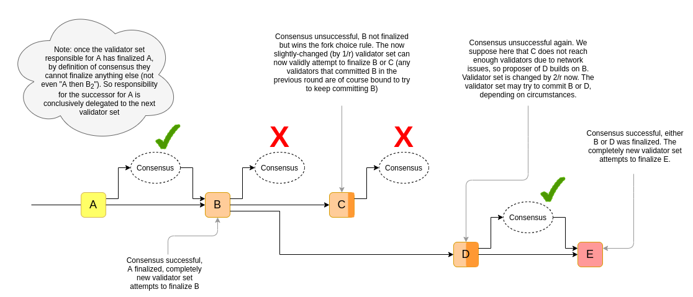

This is a proposed alternative design for the beacon chain, that could be switched to in the longer term (replacing the current planned CBC switch), that tries to provide some key properties:

* Deliver meaningful single-slot economic finality (ie. Tendermint-like properties) under normal circumstances
    * Make [even single-slot reorgs](https://www.paradigm.xyz/2021/07/ethereum-reorgs-after-the-merge/) much more expensive for even a colluding majority to execute, reducing consensus-extractable value (CEV)
* Move away from heavy reliance on LMD GHOST fork choice, avoiding [known](https://ethresear.ch/t/decoy-flip-flop-attack-on-lmd-ghost/6001) [flaws](https://arxiv.org/pdf/2102.02247.pdf) and the need to introduce [complicated hybrid fork choice rules](https://notes.ethereum.org/6EAsltAXSIeMHeRztEGRdg) to fix the flaws.
* Potentially allow a lower min deposit size and higher validator count
* Preserve the property that economic finality eventually approaches a very large number (millions of ETH)

## Preliminaries

Let `CONSENSUS` be a asynchronously-safe consensus algorithm (eg. Tendermint, Casper FFG...). We assume that the consensus algorithm has some notion of slots or views where it makes one attempt at coming to consensus per fixed time period. We also assume that it takes as input a _weighted_ validator set (existing BFT consensus algorithms are trivial to modify to add this property).

In the below design, we modify `CONSENSUS` so that during each view, the set that is required to finalize is different. That is, `CONSENSUS` takes as input, instead of a validator set, a function `get_validator_set(view_number: int) -> Map[Validator, int]` (the int representing the validator's balance) that can generate validator sets for new views. `get_validator_set` should have the property that the validator set changes by at most $\frac{1}{r}$ from one view to the next, where $r$ (eg. $r = 65536$) is the recovery period length. More formally, we want:

$\mathrm{
\Bigl\lvert\ 
diff(get\_validator\_set(i),\ get\_validator\_set(i+1))
\ \Bigr\rvert
\le
\frac{\bigl\lvert\ get\_validator\_set(i)\ \bigr\rvert}{r}
}$

Where $\lvert x\rvert$ returns the sum of absolute values of the values in $x$, and $diff$ returns the per-key subtraction of values (eg. `diff({a: 0.1, b:0.2}, {b:0.1, c:0.3}) = {a: 0.1, b: 0.1, c: -0.3}`).

In practice, the diference between two adjacent validator sets would include existing validators leaking balance, and new validators being inducted at a rate equal to the leaked balance.

**Note that the $\frac{1}{r}$ maximum set difference only applies if the earlier validator set did not finalize. If the earlier validator set did finalize, the `CONSENSUS` instance changes and so the `get_validator_set` function's internal randomness changes completely; in that case, two adjacent validator sets can be completely different.**

Note that this means it is now possible for `CONSENSUS` to double-finalize without slashing if the view numbers of the two finalizations are far enough apart; this is intended, and the protocol works around it in the same way that Casper FFG deals with inactivity leaks today.

## Mechanism

We use a two-level **fork choice**:

1. Select the `LATEST_FINALIZED_BLOCK`
2. From the `LATEST_FINALIZED_BLOCK`, apply some other fork choice (eg. LMD GHOST) to choose the head

A view of the `CONSENSUS` algorithm is attempted at each slot, passing in as an input a validator set generating function based on data from `get_post_state(LATEST_FINALIZED_BLOCK)`. A valid proposal must consist of a valid descendant of `LATEST_FINALIZED_BLOCK`. Validators only prepare and commit to the proposal if it is part of the chain that wins the fork choice.

If `CONSENSUS` succeeds within some view, then the proposal in that view becomes the new `LATEST_FINALIZED_BLOCK`, changing the validator set for future rounds. If it fails, it makes its next attempt in the next slot/view.

_Note: the slot should always equal the current view number plus the sum of the successfully finalizing view number in each previous validator set._

We have the following **penalties**:

* **Regular slashing penalties** as determined by the consensus algorithm
* **Inactivity penalties**: if the chain fails to finalize, everyone who did not participate suffers a penalty. This penalty is targeted to cut balances in half after $\frac{r}{2}$ slots.

### Alternative: single-slot-epoch Casper FFG

An alternative to the above design is to use Casper FFG, but make epochs one slot long. Casper FFG works differently, in that it does not attempt to prevent the same committee from finalizing both a block and a descendant of that block. To adapt to this difference, we would need to enforce (i) a $\frac{1}{4}$ safety threshold instead of $\frac{1}{3}$ and (ii) a rule that, if a slot finalizes, the validator set changes by a maximum of $\frac{1}{4}$ instead of changing completely.

Note that in such a design, reorgs of one slot (but not more than one slot) can still theoretically be done costlessly. Additionally, "slots until max finality" numbers in the chart at the end would need to be increased by 4x.

## Properties

If a block is finalized, then for a competing block to be finalized one of the following needs to happen:

* Some committee is corrupted, and $\ge \frac{1}{3}$ of them get slashed to double-finalize a different block
* The most recent committee goes offline, and after $\frac{r}{3}$ slots the committee rotates enough to be able to finalize a different block without slashing. However, this comes at the cost of heavy inactivity penalties ($\ge \frac{1}{3}$ of the attackers' balance)

In either case, reverting even one finalized block requires at least `DEPOSIT_SIZE * COMMITTEE_SIZE / 3` ETH to be burned. If we set `COMMITTEE_SIZE = 131,072` (the number of validators per slot in ETH2 committees at the theoretical-max 4 million validator limit), then this value is `1,398,101` ETH.

Some other important properties of the scheme include:

* The load of validators would be very stable, processing `COMMITTEE_SIZE` transactions per slot regardless of how many validators are deposited
* The load of validators would be lower, as they could hibernate when they are not called upon to join a committee
* Validators who are hibernating can be allowed to exit+withdraw quickly without sacrificing security

## Extension: chain confirmation with smaller committees

If, for efficiency reasons, we have to decrease the `COMMITTEE_SIZE`, we can make the following adjustments:

* We rename "finalization" to "confirmation", to reflect that a single confirmation no longer reflects true finality
* Instead of selecting the latest confirmed block, we select the confirmed block that is the tip of the longest chain of confirmed blocks (but refuse to revert more than `COMMITTEE_LOOKAHEAD` confirmed blocks, so `COMMITTEE_LOOKAHEAD` confirmations represents true finality)
* `get_validator_set` should _only_ use information from the state more than `COMMITTEE_LOOKAHEAD` confirmations ago
* The view number should just be the slot number (this makes it easier to reason about the case where attempts to come to consensus are happening with the same validator set in different chains, which can only happen if breaking a few confirmations is possible)

This preserves all of the above properties, but it also introduces a new property: if a block gets _multiple_ confirmations (ie. that block gets finalized, and a chain of its descendants gets `k-1` more confirmations, for a total of `k` sequential confirmations that affect that block), then reverting that block requires violating the consensus guarantee in multiple committees. This allows the security level from multiple committees to stack up: one would need `COMMITTEE_SIZE * DEPOSIT_SIZE * k / 3` ETH to revert `k` confirmations, up to a maximum of `k = COMMITTEE_LOOKAHEAD`, at which point the committees diverge.

Note also that the lookahead mechanic is worth doing anyway for p2p subnet safety reasons, so it's probably a good idea to design the system with it, and if desired leave it to clients to determine how they handle confirmation reversions.

## Examples of concrete values

| `COMMITTEE_SIZE` (compare current mainnet: ~6,300) | `COMMITTEE_LOOKAHEAD` (= slots until max finality) | `DEPOSIT_SIZE` (in ETH) | ETH needed to break single confirmation | ETH needed to break finality |
| - | - | - | - | - |
| 4,096 | 128 | 32 | 43,690 | 5,592,405 |
| 8,192 | 512 | 4 | 10,922 | 5,592,405 |
| 16,384 | 1,024 | 1 | 5,461 | 5,592,405 |
| 16,384 | 64 | 32 | 174,762 | 11,184,810 |
| 8,192 | 512 | 1 | 2,730 | 1,398,101 |

Note that the "ETH needed to break finality" numbers assume an attacker that has control over an amount of validators equal to well over half the total amount staking (ie. many millions of ETH); the number is what the attacker would lose. It's _not_ the case that anyone with 2,730 - 174,762 ETH can just come in and burn that ETH to revert a single-slot confirmation.