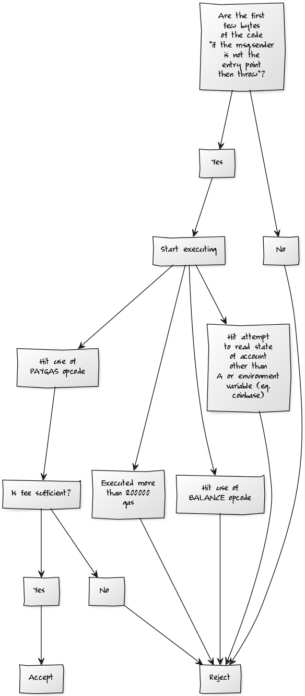

In principle, the account abstractions models that we have all considered so far work in a very similar way:

* All accounts are contracts.
* Specifically, they are _forwarding contracts_: when they receive an incoming message, they perform some signature and nonce checks, and then forward the message along to the intended recipient with the intended data (an alternative model that we should consider switching to is, if the signature and nonce checks pass, they run the provided code in the account's context)
* A transaction is (or almost is) "just" a call to a specified account contract from some standard "entry point address" (eg. 0xffff...ff)
* Contracts at specific addresses can only have a specific piece of init code, and there is a special mechanism which allows that init code to be "filled in" (this allows sending money to addresses before that code is filled in)

The main challenge is the tradeoff between flexibility of account forwarding policy and safety of transaction processing and transmission. In general, it should not be possible to force other nodes in the network (miners or relaying nodes) to perform large amounts of processing work without at least some risk that the transaction actually will be included in the chain and the sender will be forced to pay a fee.

For example, consider the current nonce model. If an account has nonce 40, and someone sends a transaction of nonce 40, with some gasprice above some minimum, and the account balance is enough to pay for the transaction fee, then there's a possibility that this transaction will get included in the chain, and the sender of the transaction will have to pay the fee. If someone sends a series of transactions, with nonces (40, 41 ..... 75), and has enough balance to pay for all of them, then the same reasoning applies (the possibility becomes more tenuous if these transactions together require more than 8 million gas, as that would require multiple blocks, but it's still there).

On the other extreme, consider an abstraction scheme where it is expected for accounts to voluntarily send a fee at the end of transaction execution, and where nodes fully execute transactions and then at the end determine whether or not they pay fees. This is highly problematic because it requires nodes to fully execute transactions, possibly consuming up to 8 million gas worth of execution time (~200ms) per transaction, and then at the end possibly not having any chance of being paid for it; this could be exploited as a serious DoS vector. Everything in between these two extremes (total abstraction, and forcing one specific signature scheme on everyone) is a tradeoff, and it's this tradeoff space that we will be exploring.

----------------------------------

### Signature abstraction only

Suppose that we implement an abstraction scheme that works as follows:

* Every account could specify a pure function (ie. a piece of code that always returns the same output for the same input, and does not read or write to any kind of state), which serves the role of signature verification. This pure function has a gas limit of 200000 (enough to implement many kinds of signature schemes, including threshold sigs and quantum-proof sigs, but still reasonably quick to execute)
* Everything else is the same as it is currently (ie. nonces)

It's clear to see that the properties are very similar; the only way in which the scheme is less robust from a DoS resistance perspective is that the cost of checking a transaction's signature validity goes up from an elliptic curve verification (~3000 gas) to 200000 gas. This could be compensated for by requiring a higher expected probability that the transaction actually will get in; essentially, not allowing transaction queues above a fairly short length (eg. 8 million gas).

### Full Abstraction with Guaranteed Payment

Another approach is the one described here, as PANIC + PAYGAS: https://ethresear.ch/t/tradeoffs-in-account-abstraction-proposals/263

The idea is that there is an opcode called PAYGAS, which pays the transaction fee for a transaction, and does so in a way that is "immune" to reversion, so once transaction execution hits PAYGAS it's guaranteed to pay a fee regardless of what happens after that point. Nodes, upon receiving transactions, would run the transaction for up to 200000 gas, and see if it hit PAYGAS by that point. If they see that it had, then they would accept the transaction; otherwise, they would reject it.

This maintains the property that nodes only need to spend up to 200000 gas verifying a transaction before they accept it. However, it is still fragile in a different way: even if a transaction is valid (as in, fee-paying) on top of the current head, then it could stop being valid if any other transaction gets included first. An attacker could even send a thousand transactions which are all valid on the current head, but all stop being valid as soon as even one of them gets included (or potentially, stop being valid based on some value changing in some third-party contract that gets updated almost every block anyway).

### Constricting the Abstraction Model

Can we try to constrict the abstraction model to remove this fragility, but still maintain the flexibility of allowing users to choose models other than nonces? Yes, we can. But we first need to understand specifically what properties we are looking to preserve.

The key property that I would argue matters is what I would call "external non-cancellability". External non-cancellability is defined as follows: it is impossible to cancel the ability of a transaction T from account A to be included and pay fees, except by another transaction which itself comes from account A.

We can achieve this with similar principles to [access lists](https://ethresear.ch/t/account-read-write-lists/285), with a loophole to allow sending ETH. We need to ensure that:

1. The pre-PAYGAS portion of execution does not read the state of accounts other than A
2. Transactions initiated by accounts other than A cannot modify the state of A, except by sending it ETH
3. Sending ETH to an account cannot cause transactions from A to no longer be valid

We can achieve this by having the pre-PAYGAS execution have additional halting conditions (that is, in addition to the existing halting condition of "stop if the total execution hits 200000 gas"):

* Halt and reject upon any attempt to read the state of account other than A, or an environment variable
* Halt and reject unless the first few bytes of the code are something other than "if the msg.sender is not the entry point, throw"
* Halt and reject if the BALANCE opcode is used (the PAYGAS opcode already does balance checks, so no need to check again in-contract anyway)

Here is an entire node policy, in flowchart form (zooming in mandatory to see clearly):

Now, we are back to having a policy that is guaranteed to be strong against DoS attacks: nodes can store and forward one pending transaction per account, after checking that that transaction hits PAYGAS when executed against the current head state, without first hitting any of the above halting conditions.

But what if we want more than one pending transaction per account?

### Dependency Graphs

One simple answer is: don't bother. This is less absurd than it sounds if we combine it with the abstraction technique mentioned above of "have the transaction just specify a piece of code that runs in the account context if the signature and nonce checks pass", because that would allow multiple operations to be conducted atomically in the context of a single transaction. But it's still inconvenient.

Another strategy is: if a node sees N transactions coming from the same account, it tries to evaluate them in all N! possible orders, and forwards the transactions if any of those orders lead to all transactions paying gas (if it only finds a subset of M that has an order where all M pay gas, then it forwards that along). This has high flexibility, but the complexity balloons factorially in N, so it's impractical for N above 4 (possibly even 3).

A more moderate approach is a greedy algorithm. A node maintains a DAG of transactions coming from a node, and tries to expand the DAG as close to the root as possible. The root node from the DAG represents the current state, and a chain from the root node represents an order of transaction inclusion where all transactions in that chain appear to be fee paying.

Example dependency DAG for transactions with nonces:

[yuml]
[root] -> [tx1]
[tx1] -> [tx2]
[tx2] -> [tx3]
[/yuml]

Example dependency DAG for some txs with UTXOs

[yuml]
[root] -> [c1 in c2 c3 out]
[root] -> [c5 in c6 out]
[root] -> [c7 in c8 out]
[root] -> [c9 in c10 out]
[c1 in c2 c3 out] -> [c2 in c4 out]
[c5 in c6 out]
[c7 in c8 out] -> [c8 c10 in c11 out]
[c9 in c10 out] -> [c8 c10 in c11 out]
[/yuml]

Example dependency DAG for outputs from the same ring signature

[yuml]
[root] -> [o1]
[root] -> [o2]
[root] -> [o3]
[root] -> [o4]
[/yuml]

Upon receiving a new transaction, the algorithm would attempt to process it on top of all vertices in the DAG in order, starting from the root; it would add it as a child of any vertex where it is successful. The node maintains some reasonably low max node depth for the DAG (eg. 8).

Any time the node sees a block where some transactions from a given address are included, it reprocesses the entire pool.

In general, the goal of these algorithms should be to cover a few common cases of multi-transaction broadcasting:

* Replacing an existing transaction with a new one that pays a higher gas price
* Broadcasting multiple transactions that need to be included in a specific order (ie. nonces)
* Broadcasting multiple transactions that could be included in any order (eg. some UTXO-like scheme, or withdrawals from a ring signature mixer)

In all of these cases, the burden on nodes clearly increases, but it is still upper-bounded by the maximum size of the per-account transaction pool, which could be bounded by a fairly low value (eg. N = 8).