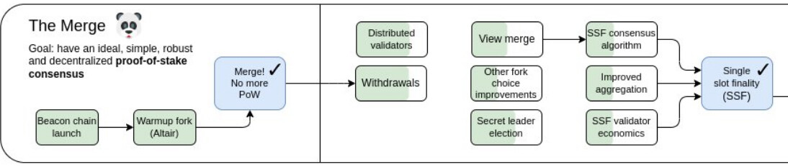
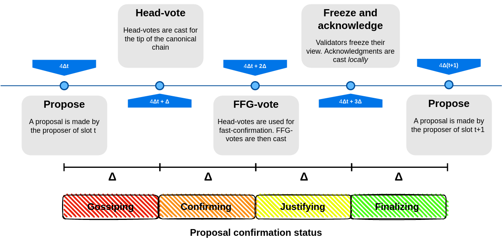
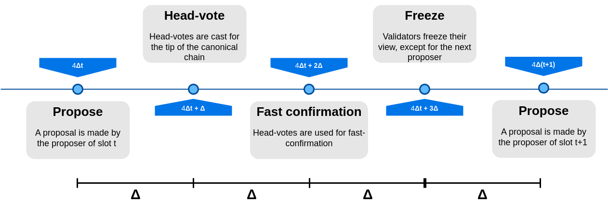
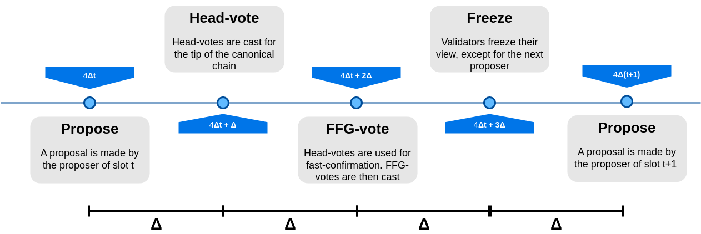

# Single Slot Finality consensus protocol

*Authors: [fradamt](https://twitter.com/fradamt), [Luca Zanolini](https://twitter.com/luca_zanolini)* 
*Based on: [RLMD-GHOST paper](https://arxiv.org/abs/2302.11326), [SSF paper](https://arxiv.org/abs/2302.12745)*

With withdrawals being enabled on mainnet in the upcoming fork, the initial phase of Ethereum's transition to Proof of Stake, began with the Beacon chain launch and continued with the Merge, is nearly completed. Still, a transformative upgrade of Ethereum's Proof of Stake foundation lies ahead: the transition to [Single Slot Finality (SSF)](https://notes.ethereum.org/@vbuterin/single_slot_finality), including "endgame versions" of both the consensus protocol and the validator set economics. Being this a huge overhaul of the consensus layer of Ethereum, there are many lines of work involved. Here, we are going to focus purely on the consensus protocol side of things, setting aside the issues of [validator set management](https://notes.ethereum.org/@vbuterin/single_slot_finality#What-are-the-issues-with-validator-economics) and of [how to allow all validators to vote in parallel](https://ethresear.ch/t/horn-collecting-signatures-for-faster-finality/14219). These questions are orthogonal to the design of a suitable SSF consensus protocol, and can be tackled independently. 

A major requirement for the consensus protocol of Ethereum is that it should be *available* (or, *dynamically* available), meaning that its functioning should not depend on some arbitrary participation threshold, like requiring 2/3 or 1/2 of the validator set to be online. This is partly what motivated the hybrid design of the current consensus protocol, [Gasper](https://arxiv.org/abs/2003.03052), which combines an *available protocol*, [LMD-GHOST](https://arxiv.org/abs/2003.03052), with a *finality gadget*, [Casper-FFG](https://arxiv.org/abs/1710.09437). The purpose of the first is precisely to always produce an *available chain*, preventing the consensus protocol from merely halting when there are not enough validators online. When 2/3 of the validators are online, Casper-FFG finalizes portions of the available chain, endowing them with *economic finality*, also known as accountable safety, the guarantee that no conflicting finalization can happen without 1/3 of the validator set being slashable. 

An SSF protocol for Ethereum should also satisfy this requirement, allowing both for economic finality and for availability. Since it is impossible to have both properties for a single chain, the design must then still involve an available chain and a finalized prefix of it, which should coincide when enough validators are online and the chain can finalize. The protocol we propose is in fact a combination of a variant of LMD-GHOST, which we call RLMD-GHOST (where R stands for *Recent*, because the protocol considers only *recent latest messages*, i.e., latest messages from recent slots) as the available protocol, and still Casper-FFG as the finality gadget, combined together in a simple way. Here you can see a preview of what a slot of the final protocol looks like, before we dive into the details.

## RLMD-GHOST, the available protocol

### Background 

Generally speaking, a protocol is dynamically available if, in a context of dynamic participation (i.e., where participants are allowed to go [offline](https://eprint.iacr.org/2016/918.pdf)), safety and liveness can be ensured. One problem of such protocols is that they do not tolerate network partitions; no consensus protocols can both satisfy liveness (under dynamic participation) and safety (under temporary network partitions). For this reason, dynamically available protocols are generally assumed to be synchronous. Neu et al. formally prove this result by presenting the [availability-finality dilemma](https://arxiv.org/abs/2009.04987), which states that there cannot be a consensus protocol, one that outputs a single ledger, that is
both dynamically available and that can finalize, i.e., that can always provide safety, even during asynchronous periods or network partitions, and liveness during synchrony.

In the context of Ethereum, the available ledger is output by LMD-GHOST. However, in the process of formalizing the security requirements of Gasper, Neu et al. show that the (original version of) LMD-GHOST is actually [not secure even in a context of full-participation](https://arxiv.org/abs/2009.04987), by presenting a [balancing attack](https://ethresear.ch/t/a-balancing-attack-on-gasper-the-current-candidate-for-eth2s-beacon-chain/8079). The [proposer boost technique](https://notes.ethereum.org/@vbuterin/lmd_ghost_mitigation) was later introduced as a mitigation, though the resulting protocol [falls short](https://ethresear.ch/t/balancing-attack-lmd-edition/11853) of being dynamically available.

To cope with the problems of LMD-GHOST, D'Amato et al. devise [Goldfish](https://arxiv.org/abs/2209.03255), a synchronous protocol that enjoys safety and liveness *under fully variable participation*, and thus that is dynamically available. Goldfish is based on two techniques, [view-merge](https://ethresear.ch/t/view-merge-as-a-replacement-for-proposer-boost/13739), which allows validators to join the sets of the messages they received (at some point during the execution) before making any protocol's decision, and [vote expiry](https://arxiv.org/abs/2209.03255), where only messages received within a specific time window influence the protocol’s behavior. However, Goldfish is not considered practically viable to replace LMD-GHOST in Ethereum, due to its brittleness to temporary asynchrony: even a single slot of asynchrony can lead to a catastrophic failure, jeopardizing the safety of any previously confirmed block. 

### RLMD-GHOST protocol

We overcome the limitation of Goldfish with [RLMD-GHOST](https://arxiv.org/pdf/2302.11326.pdf), a protocol that generalizes both LMD-GHOST and Goldfish. As the former, RLMD-GHOST implements the latest message rule (LMD). As the latter, it implements view-merge and vote expiry. Differently from Goldfish, where only votes from the most recent slot are considered, RLMD-GHOST is parameterized by a *vote expiry period $\eta$*, i.e., only messages from the most recent $\eta$ slots are utilized. For $\eta = 1$, RLMD-GHOST reduces to Goldfish, and for $\eta = \infty$ to (a more secure variant of the original) LMD-GHOST.

RLMD-GHOST proceeds in *slots* consisting of $4\Delta$ seconds, each having a proposer $v_p$, chosen through a proposer selection mechanism among the set of validators. In particular, at the beginning of each slot $t$, the proposer $v_p$ proposes a block $B$. Then, all active validators vote after $\Delta$ seconds for block, after having merged their *view*, a set containing the messages they received (at some point during the execution), with the view of the proposer. Moreover, we require every validator $v_i$ to have a buffer $\mathcal{B}_i$, a collection of messages received from other validators, and a view $\mathcal{V}_i$, used to make consensus decisions, which admits messages from the buffer only at specific points in time, i.e., during the last $\Delta$ seconds for a slot. The need for a buffer is to prevent [some attacks](https://ethresear.ch/t/view-merge-as-a-replacement-for-proposer-boost/13739). RLMD-GHOST is characterized by a deterministic fork-choice, which is used by honest proposers and voters to decide how to propose and vote, respectively, based on their view while performing those actions. In particular, the fork-choice that we implement considers the last (non equivocating) messages sent by validators that are not older than $t − \eta$ slots, in order to make protocol’s decisions.

RLMD-GHOST results in a synchronous protocol that has interesting practical properties. It is dynamically available and reorg resilient in a generalization of the sleepy model, which we explain in the next section. This is weaker than security in the usual sleepy model, because we put some extra constraints on the adversary, not allowing for fully variable participation. As we shortly discuss, these assumptions are fairly weak, and in our opinion entirely reasonable in practice. Importantly, RLMD-GHOST *is resilient to asynchronous periods lasting less than $\eta-1$ slots*, meaning that honest proposals made before the period of asynchrony are still canonical after it. In essense, we are trading off allowing fully variable participation (like Goldfish does) for more resilience to temporary asynchrony, which we think is a very sensible tradeoff in practice.

### Security model 

RLMD-GHOST is provably secure in a generalization of the [sleepy model](https://eprint.iacr.org/2016/918.pdf), which allows for more generalized and stronger constraints in the corruption and sleepiness power of the adversary. In particular, we assume in this model that the honest validators that are online in the consensus protocol at slot $t-1$ are always more than the adversarial validators online at slot $t$, together with the honest validators that were online at *some point* during slots $[t-\eta, t-1)$ and that now, at slot $t$, are not anymore online (i.e., we count them as adversarial). Letting $H_t, A_t$ be the honest and adversarial validators at slot $t$, and $H_{s,t}$, the honest validators online in slots $[s,t]$, we require the following: 

$$
|H_{t-1}| > |A_{t} \cup (H_{t-\eta, t-2}\setminus H_{t-1})|
$$

The reasoning for this is very simple: the only votes which matter at slot $t$ in RLMD-GHOST with expiry $\eta$ are those from slots $[t-\eta, t)$, and the "stale" votes from (even honest) validators which are now offline are potentially dangerous. In essence, we want the votes of honest and online validators to be a majority of all unexpired votes, so that they alone determine the outcome of the fork-choice (see [this post](https://ethresear.ch/t/reorg-resilience-and-security-in-post-ssf-lmd-ghost/14164) for clarification on why this matters). For Goldfish ($\eta = 1$), this reduces to a simple majority assumption of honest and online validators over adversarial validators ($|H_{t-1}| > |A_t|$), which is of course necessary, as we can't be resilient to majority corruption. As the expiry period $\eta$ increases, the assumption becomes stronger, because the RHS takes into account more and more honest validators which are now offline.  For LMD-GHOST ($\eta = \infty$), this becomes much too strong, essentially requiring that at least $n/2$ honest validators are always online.

In practice, we think that choosing a reasonably sized $\eta$ leads to very reasonable assumptions. Say we choose $\eta$ so that we consider all votes from the last hour. Then, our protocol is secure as long as not too many honest validators have gone offline during this period. For example, if 60% of the validators are honest, we can tolerate that 10% of the validator set goes offline within an hour, because the remaining honest validators are still a majority. If even more catastrophic events happen, like 90% of the validator set going offline at once (which completely breaks our assumption), nothing too bad actually happens. It may be that blocks proposed during this period are not safe, and easy reorg opportunities are present, but everything goes back to normal once an hour goes by and the stale messages are expired (assuming the network still functions at that point, which in practice is likely to be far more problematic than the reorg opportunities which can theoretically be available due to stale votes. These reorgs are in practice not at all guaranteed to be feasible).

## SSF protocol

### High level idea

Once we have an appropriate available chain at our disposal, creating a single slot finality protocol turns out to be suprisingly easy. The currently understood way to construct secure ebb-and-flow protocols from an available chain and a finality gadget is what one might call the *confirm-finalize paradigm*, where only blocks which are confirmed in the available chain are input to the finality gadget. In practice, this means that honest validators would not vote to finalize a block which they do not see as confirmed. When network synchrony holds and confirmations in the available chain are safe, this prevents the finality gadget from interfering with the available chain, so that its standalone security properties are preserved. This ensures that the ebb-and-flow protocol is dynamically available *as long as the underlying available protocol is*. In our case, we do not attempt to even justify unconfirmed blocks, because, as in Gasper, the fork-choice starts from the latest justified checkpoint, so we need justifications to not interfere with the available chain. As an example of interference, consider the [bouncing attack](https://ethresear.ch/t/analysis-of-bouncing-attack-on-ffg/6113), where justifications in Gasper are used to repeatedly reorg the available chain, precisely due to the checkpointed fork-choice used by Gasper.

Due to working in this paradigm and wanting single slot finality, a key property of RLMD-GHOST turns out to be that it supports fast confirmations, so that honest proposals are confirmed during their proposal slot, when at least 2/3 honest validators are online. This is crucial for single slot finality, because fast confirmed honest proposals can then be immediately justified and finalized. To ensure that this happens whenever a proposer is honest and network synchrony holds, we once again exploit the view-synchronization allowed (under network synchrony) by the [view-merge technique](https://ethresear.ch/t/view-merge-as-a-replacement-for-proposer-boost/13739), in order to get all honest voters to agree on what the latest justified checkpoint is, to be used as source of their FFG votes. 

### Protocol

Similarly to Gasper, we employ a *justification-respecting* hybrid fork-choice, in this case based on RLMD-GHOST. It simply starts from the latest justified block, and then runs RLMD-GHOST from there. As in Gasper, the protocol proceeds in slots, each one having a single proposer, and involves two types of votes, head votes, which are relevant to the available protocol (RLMD-GHOST) and FFG votes, to justify and finalize. Unlike Gasper, where these votes are cast at the same time and with a single message (an attestation), there are now two rounds of voting in each slot. Overall, slots look like this:
1. A proposal is made
2. Head votes are cast for the tip of the canonical chain, determined by the fork-choice
3. Validators use the head votes from the current slot to *fast confirm* some block, the highest one whose subtree has received votes from 2/3 of the validator set, if any. At best (honest proposer, synchrony and honest supermajority online), the current proposal is immediately fast confirmed.
4. FFG votes are cast. At best (honest proposer, synchrony and honest supermajority online), the current proposal is justified. 
5. Validators freeze their view as they normally do in the view-merge technique.

When a proposer is honest, the network is synchronous and an honest supermajority is online, the outcome is that the proposal gets fast confirmed and then justified, before the end of the slot. Moreover, if honest validators see the justification before the next slot, they will never cast an FFG vote with an earlier source, and so the proposal will never be reorged, *even if later the network becomes asynchronous*. 

### Acknowledgment

As we just saw, blocks proposed by honest proposers under good conditions have very strong *reorg resilience* guarantees. On the other hand, their unreorgability is not known to observers by the end of the slot, and moreover no economic penalty can yet be ensured in case of a reorg, so we rely at this point on honesty assumptions. Finality is only achieved at the earliest after two slots. If we want to truly have single slot finality, in the sense that an honest proposal can be finalized (and *is* finalized, under synchrony) within its proposal slot, then we can add another FFG voting round, or, as we decide to do in the paper, we can ask that validators send a different type of message *acknowledging* the justification. For example, if the checkpoint $(B,t)$ is justified at slot $t$, validators can send the acknowledgment message $((B,t), t)$, confirming their knowledge of the justification of $(B,t)$. This way, they signal that in future slots they will never cast an FFG vote with a source from a slot earlier than $t$. We can attach a slashing condition to this, almost identical to surround voting: it is slashable to cast an acknowledgment $((C,t),t)$ and an FFG vote $(A,t') \to (B,t'')$ with $t' < t < t''$, i.e., where the FFG vote *surrounds* the acknowledged checkpoint. Then, if 2/3 of the validators cast an acknowledgment, we can finalize the acknowledged checkpoint. The complete protocol is then the following, as we already previewed:

The reasoning for achieving single slot finality this way, rather than by adding another voting round, is that [voting rounds where the whole validator set participates are quite expensive](https://ethresear.ch/t/horn-collecting-signatures-for-faster-finality/14219). First, adding one would in practice significantly increase the slot time, because each voting round requires aggregating hundreds of thousands (if not millions) of BLS signatures, likely requiring a lengthier multi-step aggregation process. Moreover, it would be expensive in terms of bandwidth consumption and computation, because such votes would have to all be gossiped and verified by each validator, costly even if already aggregated. On the other hand, acknowledgments do not affect the consensus protocol in any way, as they are really just meant to be consumed by external observers which quickly want economic finality guarantees (e.g., exchanges), so they do not even need to be aggregated or gossiped globally. Validators can just gossip them locally, in some subnets, and only the interested observers need to subscribe to many of them.