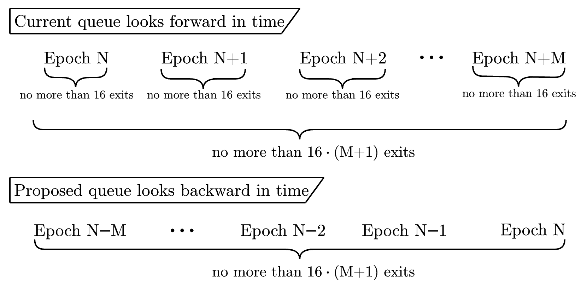

# Adding flexibility to Ethereum's exit queue 

*This article motivates the recently proposed [EIP-7922](https://github.com/ethereum/EIPs/pull/9552).*

^src: https://www.youtube.com/watch?v=bl91wk5fB4g

by [mike neuder](https://x.com/mikeneuder), [mallesh pai](https://x.com/malleshpai), [mikhail kalinin](https://x.com/mkalinin2) (mik-mal-mik) – *april 1, 2025*
&nbsp;&nbsp;&nbsp;&nbsp;&nbsp;&nbsp;&nbsp;&nbsp;&nbsp;&nbsp;&nbsp;&nbsp;&nbsp;&nbsp;&nbsp;&nbsp;&nbsp;&nbsp;&nbsp;&nbsp;&nbsp;&nbsp;&nbsp;&nbsp;&nbsp;&nbsp;&nbsp;&nbsp;&nbsp;&nbsp;&nbsp;&nbsp;&nbsp;&nbsp;&nbsp;&nbsp;&nbsp;&nbsp;&nbsp;&nbsp;&nbsp;&nbsp;&nbsp;&nbsp;&nbsp;&nbsp;&nbsp;&nbsp;&nbsp;&nbsp;&nbsp;&nbsp;&nbsp;&nbsp;&nbsp;&nbsp;&nbsp;&nbsp;&nbsp;&nbsp;&nbsp;&nbsp;&nbsp;&nbsp;&nbsp;&nbsp;&nbsp;&nbsp;&nbsp;&nbsp;&nbsp;&nbsp;&nbsp;&nbsp;&nbsp;&nbsp;&nbsp;&nbsp;&nbsp;&nbsp;&nbsp;&nbsp;&nbsp;&nbsp;&nbsp;&nbsp;&nbsp;&nbsp;&nbsp;&nbsp;&nbsp;&nbsp;&nbsp;&nbsp;&nbsp;&nbsp;&nbsp;&nbsp;&nbsp;&nbsp;&nbsp;&nbsp;&nbsp;&nbsp;&nbsp;&nbsp;&nbsp;&nbsp;&nbsp;&nbsp;$\uparrow$ but not an april fools' joke

---

### Contents
[`1. Introduction`](#p-53633-h-1-introduction-3)
[`2. Revisiting the current exit queue`](#p-53633-h-2-revisiting-the-current-exit-queue-4)
[`3. Improving the exit queue`](#p-53633-h-3-improving-the-exit-queue-5)
[`4. Connection to past work`](#p-53633-h-4-connection-to-past-work-6)

---

**tl;dr;** *We describe a potential change to the Ethereum exit queue as proposed in [EIP-7922](https://github.com/ethereum/EIPs/pull/9552). Our [ELI5](https://hackmd.io/@mikeneuder/eli5-ethereum-validator-exits) post discussed how Ethereum manages validator exits today and the changes coming in the Prague/Electra upgrade. This post motivates an additional change to the queue to improve its efficiency without changing the security model of the protocol.*

### 1. Introduction

The Proof-of-Stake mechanism in Ethereum implements an exit queue to preserve the accountable safety of finalized transactions (for more context see ["Why have an exit queue?"](https://hackmd.io/@mikeneuder/eli5-ethereum-validator-exits#13-%E2%80%93-Aside-Why-have-an-exit-queue)). While limiting the rate of validator exits (sometimes called the *validator churn*) is necessary, being overly restrictive impacts honest validators who face the risk of lengthy delays if they need to withdraw. This is also costly for the protocol: standard financial theory informs us that relatively illiquid assets have to offer a higher rate of return to attract the same amount of capital. This applies, *mutatis mutandis*, to staking. Therefore, the exit queue should be made as efficient as possible, subject to protocol security constraints. 

In this article, we motivate [EIP-7922](https://github.com/ethereum/EIPs/pull/9552), which proposes adding a dynamic churn limit based on [our research on the design of exit queues](https://arxiv.org/pdf/2406.05124). This change dramatically improves the validators' quality of life **without compromising Ethereum's security**.

### 2. Revisiting the current exit queue

As described in "[The exit process](https://hackmd.io/@mikeneuder/eli5-ethereum-validator-exits#12---The-exit-process)," the first phase of a voluntary exit is the *exit queue*. The "churn" limit determines how many validators can exit in a given epoch, and is currently calculated as $\max(8, \lfloor \# \text{ validators} / 2^{16} \rfloor)$ ([see `get_validator_activation_churn_limit`](https://github.com/ethereum/consensus-specs/blob/8918bc8dcf232454afff025a4560892486972c9a/specs/phase0/beacon-chain.md#get_validator_churn_limit)); as of April 1 2025, this corresponds to $\lfloor 1,065,882/2^{16} \rfloor=16$ exits per epoch  (e.g., if there are 160 validators in the queue, a newly enqueued validator will be exited 10 epochs, about an hour, later).

Recall that we are rate-limiting to ensure that the economic security of a transaction does not decrease too quickly. Another way of understanding the 16 exits per epoch security model is that it encodes the following "constraints" around validator exits:

1. at most 16 validators exit in the next one epoch, and
2. at most 32 validators exit in the next two epochs, and
3. at most 48 validators exit in the next three epochs, and
...
4. at most 16 $\cdot$ n validators exit in the next n epochs,
...

Equivalently, with 1,065,882 validators, we can describe these constraints as the *rate of decrease of economic security of a finalized transaction*. The economic security of a transaction decreases by no more than:

1. $16/1,065,882 = 0.0015\%$ in one epoch,
2. $32/1,065,882 = 0.0030\%$ in two epochs, 
...
4. $3600/1,065,882 = 0.34\%$ in 225 epochs (one day), 
...
5. $50,400/1,065,882 = 4.7\%$ in 3,150 epochs (two weeks), 
...
5. $108,000/1,065,882 = 10.1\%$ in 6,750 epochs (30 days), 
...
5. $324,000/1,065,882 = 30.4\%$ in 20,250 epochs (90 days), 

These constraints are easy to interpret. For example, we can read (5) as "a finalized transaction will lose no more than 10% of its accountable safety over the next 30 days." Recall that while the economic security of a transaction *decreases* over time, the probability of a long-range reorganization/safety fault also *decreases*. Thus, the settlement assurances of the transaction stay extremely high as more time elapses.

> **Key observation:** Some of the above constraints are more important to the protocol, and therefore it is overly restrictive to only allow 16 exits per epoch irrespective of historical withdrawals.

We illustrate this with an example. With one million validators, the current protocol specifies that 16 validators may exit per epoch. Over two weeks, this corresponds to 50,400 exits. This translates directly to "no more than 5.04% of the validators (equiv. stake) can exit within two weeks." Let's assume this is the only constraint the protocol cares about. Now imagine that in the past 13 days, no validators have exited the protocol, and thus, none of the two-week churn limit has been used. If a large staking operator with 3% of the validator set (30,000 validators) seeks to withdraw immediately, they should be able to -- this doesn't violate the two-week limit of 5.04%. However, since only 16 exits can be processed per epoch moving forward, they are forced to wait 1875 epochs (equiv. 8.33 days).

> **Key observation:** If we enable the protocol to <u>look backward</u> at the exit history, we no longer need the hard per-epoch limit <u>looking forward</u>.

For example, in [EIP-7922](https://github.com/ethereum/EIPs/pull/9552) as currently proposed, we chose the following constraint explicitly:

> **Proposed weak subjectivity constraint:** *No more than 50,400 validator exits in any rolling two week period.*

Then, we only need to ensure that the constraint is honored over every rolling two-week period without setting a hard cap on exits during every epoch. A dynamically adjusted churn limit based on historical validator exit data allows Ethereum to flexibly accommodate spikes in exit demand while *preserving the same security over every two-week period*.

### 3. Improving the exit queue 

[EIP-7922](https://github.com/ethereum/EIPs/pull/9552) implements this change. We first redenominate exits in terms of "amount of ETH" instead of "number of validators" because, with [EIP-7251](https://eips.ethereum.org/EIPS/eip-7251), validators may have different balances. Again, using today's values, we have approximately 34mm of ETH staked. This corresponds to 16 $\cdot$ 32 = 512 ETH eligible to churn per epoch. Due to complexity in EIP-7251, the per-epoch churn limit for exits is capped at 256 ETH (see ["2.2 – Exit queue churn limit changes"](https://hackmd.io/@mikeneuder/eli5-ethereum-validator-exits#22-%E2%80%93-Exit-queue-churn-limit-changes) for more details). Over 3584 (= 256 $\cdot$ 14) epochs (approx. 17 days, which we use below as our approximate weak-subjectivity period), this amounts to 256 $\cdot$ 3584 = 917504 ETH (2.7% of the total 34mm ETH staked) that can exit.

Our proposed EIP encodes these values as the *single* constraint that the exit queue guarantees:

> **EIP-7922 constraint (using today's stake numbers)** - No more than 917504 (=256 $\cdot$ 256 $\cdot$ 14) ETH can churn (2.7% of the total 34mm ETH staked) in 17 days.

Critically, this single constraint is still the key to ensuring that the weak subjectivity of the protocol remains intact. The mechanism can be more responsive without compromising security by providing the exit queue more flexibility on shorter time horizons. The figure below demonstrates the proposed change.

> **Figure 1.** *Both queues implement the same constraint, which ensures that no more than $16 \cdot (M+1)$ exits occur over an $M+1$ epoch time horizon. The current queue enforces this by setting a per-epoch constraint on the number of allowable exits. We propose a simplified queue that explicitly checks the single constraint over the past $M+1$ epochs.*

See [EIP-7922](https://github.com/ethereum/EIPs/pull/9552) for more specifics on how the mechanism is implemented. As alluded to in [`1. Introduction`](#p-53633-h-1-introduction-3), the limitations of the current exit queue have financial implications for ETH, the asset. We believe this upgrade would have far-reaching consequences for Ethereum's staking ecosystem:

1. **Lower staking premiums**: By reducing delays and associated liquidity risk, these mechanisms could lower the required staking rewards necessary to attract capital.
2. **Improved capital efficiency**: More responsive exit mechanisms enable more dynamic capital allocation in the broader Ethereum ecosystem.
3. **Enhanced protocol robustness**: Better exit mechanisms reduce the risk of validators being "trapped" during market volatility events.

It is worth noting that there *still is* a hard limit on the amount of withdrawals that can be processed, and this proposal doesn't guarantee any exit speed. Instead, it aims to give the exit queue more flexiblity in dealing with sudden spikes in withdrawal demand. We welcome community feedback as we work toward potential inclusion in a future network upgrade.

### 4. Connection to past work

This EIP directly extends our previous [paper](https://arxiv.org/pdf/2406.05124) with [Max Resnick](https://x.com/MaxResnick1) on optimal exit queues. In that work, we introduced **MINSLACK**, a dynamic queue system. Like this EIP, instead of processing a constant maximum number of validators each epoch, MINSLACK calculates how many validators can safely exit based on historical data and a given collection of security constraints. Specifically, it checks the "slack" – the unused withdrawal capacity from recent epochs – to determine the allowable exits. MINSLACK leverages this slack by recognizing that if fewer validators exited in previous epochs than the maximum allowed, the protocol can safely process more exits in the current epoch while maintaining the same overall accountable safety guarantee across the entire time window.

This EIP is a simplified version of MINSLACK that only implements the *single* constraint described in [`3. Improving the exit queue`](#p-53633-h-3-improving-the-exit-queue-5). Our analysis proved that MINSLACK is optimal when all validators have similar urgency for exiting (homogeneous values). In simpler terms, MINSLACK achieves the fastest possible exit rates, given Ethereum's security. Based on this theoretical framework, we are confident that the MINSLACK algorithm with a single constraint encoding the weak subjectivity period improves the status quo. If the community feels more constraints over different time horizons are necessary, this EIP can easily extend to implement the complete MINSLACK algorithm. Further, our paper also examines the ability of exits to bid for priority. We show that a modified version of MINSLACK that orders the queue based on bid size (implementing a priority queue) is nearly optimal under the heterogeneous-value setting. This could serve as an additional follow-up improvement to the exit queue process, and we are eager to discuss if the community is interested. 

--
*made with ♥ and markdown by mik-mal-mik*