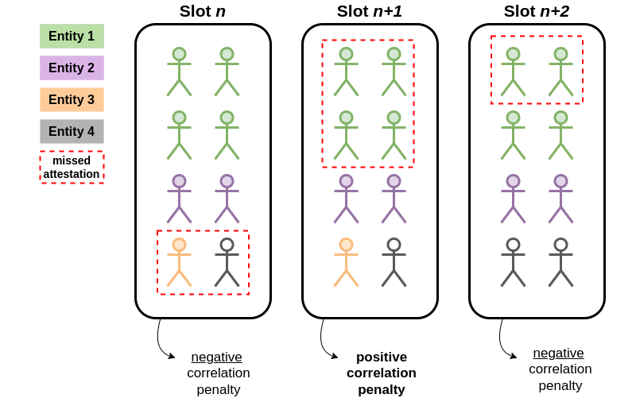
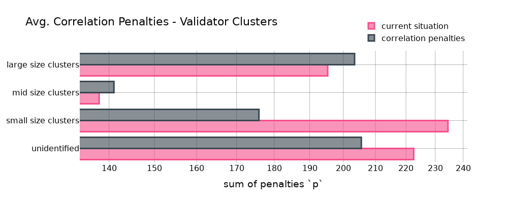
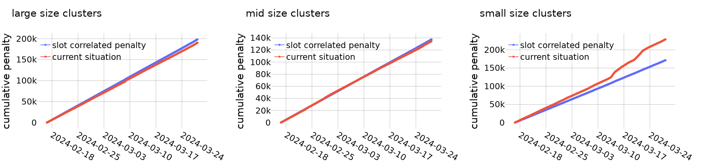
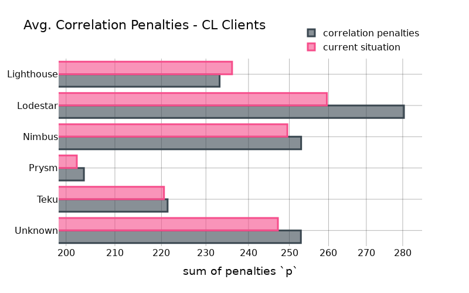
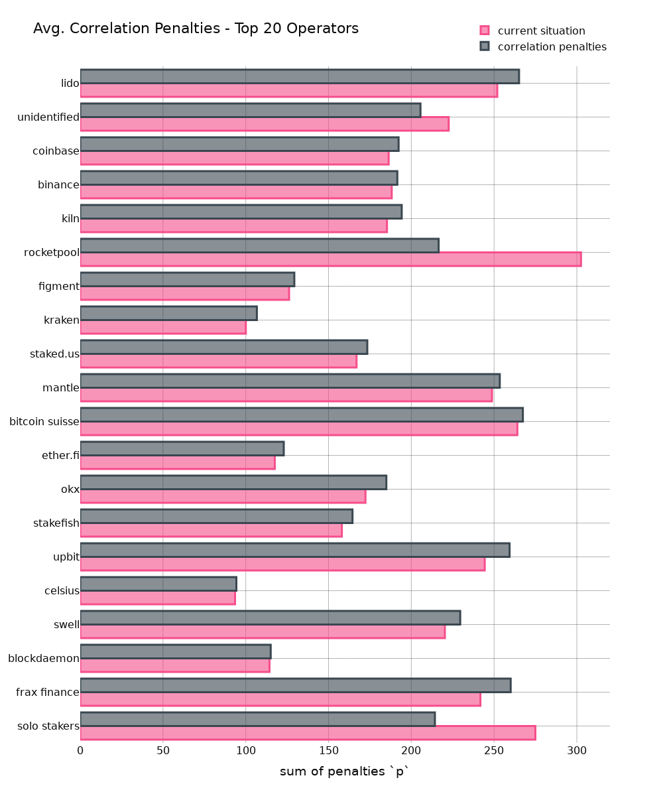

# Analysis on ''Correlated Attestation Penalties''

This is a quick quantitative analysis on anti-correlation penalties looking into its potential impact on staking operators and CL clients. Before getting into it, make sure to check out [Vitalik's recent proposal](https://ethresear.ch/t/supporting-decentralized-staking-through-more-anti-correlation-incentives/19116/12) on anti-correlation incentives in his latest blog post.

## Anti-correlation Penalties

In the current landscape, stakers benefit from economies of scale: enhanced network connectivity, superior hardware reliability, and the expertise of devs managing the infra all improve with scale. Consequently, economies of scale act as a strong force towards centralization within blockchain networks.

**To strengthen decentralization**, it is essential to architect mechanisms that counteract the advantages of economies of scale.

Fortunately, **economies of scale are intrinsically linked with correlation effects**: When a single operator runs many validators on one machine and experiences downtime, all those validators are affected at once. Thus, leveraging economies of scale comes with correlation effects. This results in a correlated risk and anti-correlation penalties punish those who leverage economies of scale to their advantage.

> In this context, the distinction between "anti-correlation incentives" and "correlation penalties" is minimal, as both strategies aim towards the same objective of promoting decentralization.

It is important to note that the **beacon chain lacks awareness of validator clusters**. It perceives only individual validators, which appear largely indistinguishable from one another. Hence, anti-correlation incentives target the "hidden" connections among validators. While not guaranteeing improved decentralization in **every** instance, anti-correlation penalties may contribute positively to the broader objective of reducing centralization forces.

## Vitalik's initial proposal

The initial proposal introduces the formula $p[i] = \frac{misses[i]}{\sum_{j=i-32}^{i-1} misses[j]}$ and caps it at p = 4.

This means, to determine the penalties of a specific slot, we maintain a moving average on the number of missed attestations over 32 slots and then compare it with the number of missed attestations for the current slot. In the case that the number of missed attestations in a slot is higher than the moving average, $p > 1$, a correlated penalty is applied.

This might look like the following example (assuming a moving avg. of 3 validators):

In the illustration above, validators missing their attestations in slots $n$ and $n+2$ benefit because few others missed theirs at the same time
For slot $n+1$, a correlation penalty applies due to the number of missed attestations exceeding the moving average threshold of 3 per slot.

## Analysis

First, for reproduciability, the dataset I'm using contains all attestations between epoch 263731 (Feb-16-2024) and 272860 (Mar-28-2024).
These are **>40 days of attestations**, amounting to a total number of **~9,3 billion observations**.

In the following, we simulate having implemented the formula that Vitalik suggested (see above) and determine the impact it would have had on attestation penalties. Furthermore, we compare it to the status quo to see what would change.

### Staking Operators

First, let's look at the sum of all penalties for 4 clusters containing multiple different entities. While the large size cluster contains entities such as Lido, Coinbase or Kiln, the small size cluster is composed of solo stakers and rocket pool stakers. The mid-size cluster is everything in between.

* The large-size cluster would have had a higher penalty compared to the status quo. The same applied to the mid-size cluster although the effect is less strong.
* The small-size cluster would have profited by ending up with less penalties.
* The "unidentified" category comprises around 15% of all validators and definitely contains a large number of solo stakers that weren't correctly classified as such because my solo-staker-classifier is highly conservative.

**This initially confirms the expectation that there exist correlations that cause individual validators to either not miss or miss together with other validators run by the same entity.**
--> *Check the Appendix I for the same graph showing the individual entities.*

**Let's look at the cumulative impact anti-correlation penalties would have:**

* As expected, for **large entities** (*left*), we can see a drift of the "anti-correlation penalty"-line from the status quo. This means that those entities categorized as "large-size" would have had higher penalties.
* For **mid-size clusters** (*mid*), this effect is the opposite, even though it's not very significant.
* For **small-size clusters** (*right*), we see an improvement compared to the status quo. Those entities would have had smaller penalties with anti-correlation penalties in place.

### CL Clients

We can basically do the same for CL clients. The expectation is that there is a correlation in validators running the same client. Anti-correlation penalties should thus be higher for validators running majority clients.

Small deviations from the "*current situation*" bar are generally a good sign as it points towards the non-existance of "hidden" client bugs that cause validators missing out to attest - at least for the analysed time frame. Although, we do see some deviations from the status quo for all clients, the effects are rather negligible for Teku and Prysm.
Lighthouse validators would improve their position while Lodestar validators would be worse-off with anti-correlation penalties. 

Notable, the result shown in the above chart is heavily depended on staking operators: e.g. if a single large staking operator who is using Lodestar goes offline because of network problems, it directly increases the correlation penalties for the client at the same time, even though the client software might be totally fine.

# Conclusion

Implementing anti-correlation penalties is a great way to counter economies of scale without requiring the protocol to differentiate between individual validators.
While this analysis looked and staking operators and CL client, there are many more properties to analyse. This includes, for example, hardware setup, EL client, geographical location, ISP provider, etc.

Finally, anti-correlation penalties are a great way to improve decentralization and the Ethereum community should definitely consider it in future updates.

## Appendix

