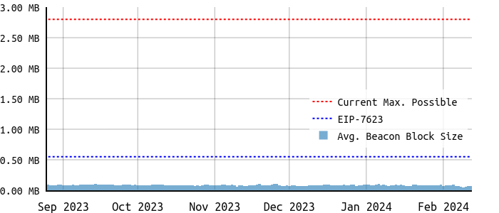
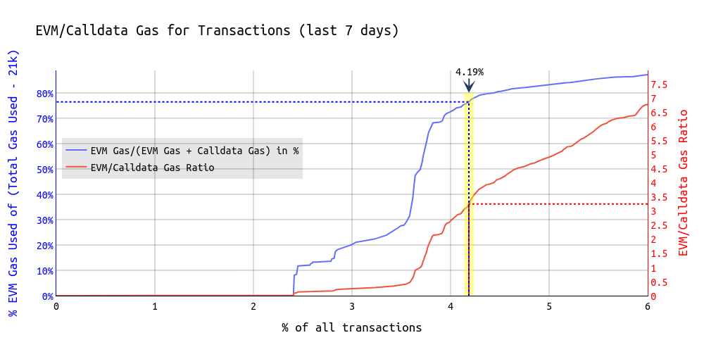
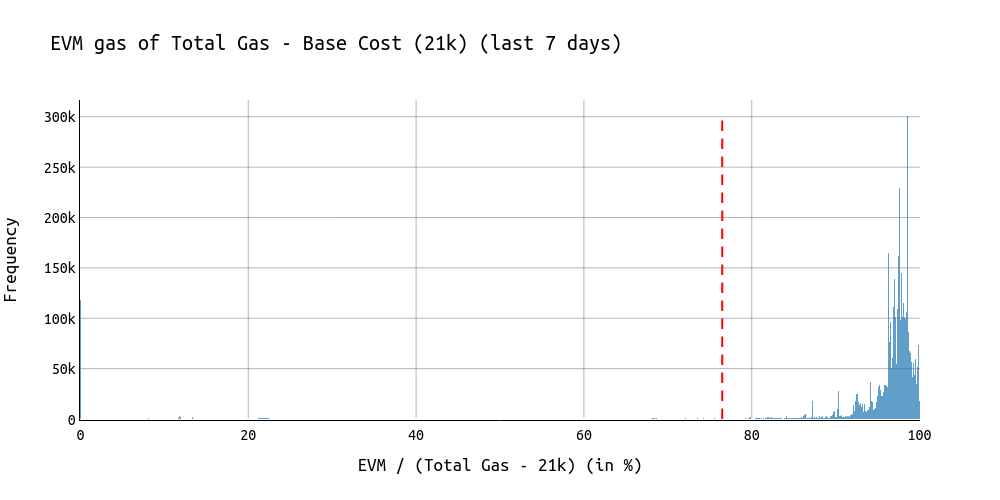
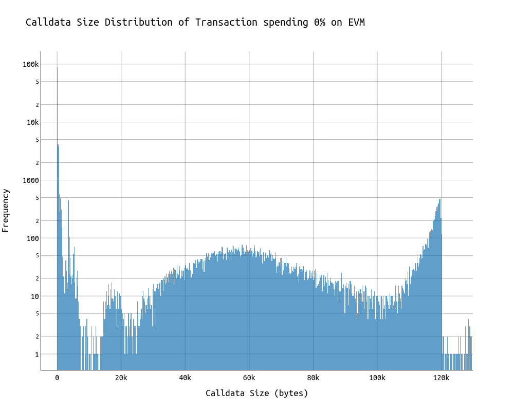

# EIP-7623: Increase Calldata Cost

> EDIT, April 2024: With ongoing analysis, the `TOTAL_COST_FLOOR_PER_TOKEN` was reduced from 16 to 12 in the current status of the EIP.

[EIP-7623](https://eips.ethereum.org/EIPS/eip-7623) aims to recalibrate the cost of calldata bytes.

The proposal's goal is to **reduce the maximum possible block size** without affecting regular users who are not using Ethereum exclusively for DA. This comes with **reducing the variance in block size** and **makes room for scaling** the block gas limit or the blob count.

With implementing this EIP:
* DA transactions pay 16/68 gas per zero/nonzero calldata byte.
* All others pay 4/16 gas per zero/nonzero calldata byte.

This is achived with a conditional formula for determining the gas used per transaction.


## Why EIP-7623?

Today, we see a huge discrepancy between the the average/median block size and the maximum possible block size. 


***This comes with the following downsides:*** 
* Inefficiencies as a result of not fully leveraging available resources while having them ready.
* Big variance in block size.
* Max-size blocks have no use case except DoS.

With [EIP-4844](https://eips.ethereum.org/EIPS/eip-4844), DA users have the option to move to using blobs -> "*they can just switch*".

**With increasing calldata cost for DA transactions to 68 gas per byte, the maximum possible block size can be reduced from ~2.8 MB to ~0.5 MB.**


<center>

</center>
<br>

 **Reducing the Beacon block size makes room to increase the blob count and/or the block gas limit.**


## EIP-7623

We have two constants:


| Parameter | Value | 
| -------- | -------- |
| `STANDARD_TOKEN_COST` | 4  |
| `TOTAL_COST_FLOOR_PER_TOKEN` | 17 |

Currently we determine the **gas used for calldata per transaction** as **`nonzero_bytes_in_calldata * 16 + zero_bytes_in_calldata * 4`**.

*We now one-dimensionalize the current gas formula:*
Let **`tokens_in_calldata = zero_bytes_in_calldata + nonzero_bytes_in_calldata * 4`**.

*This effectively combines zero and nonzero byte calldata into `tokens_in_calldata`.*

**The current formula for determining the gas used per transaction is then is equivalent to:**
```python
tx.gasused = (
    21000 \ 
        + isContractCreation * (32000 + InitCodeWordGas * words(calldata)) \
        + STANDARD_TOKEN_COST * tokens_in_calldata \
        + evm_gas_used
)
```

**The EIP changes it to:**

```python
tx.gasUsed = {
    21000 \ 
    + 
    max (
        STANDARD_TOKEN_COST * tokens_in_calldata \
           + evm_gas_used \
           + isContractCreation * (32000 + InitCodeWordGas * words(calldata)),
        TOTAL_COST_FLOOR_PER_TOKEN * tokens_in_calldata
    )
```

This formula ensures that transactions that spend at least 52 (68-16) gas per calldata byte on EVM operations (=any Opcode) will continue having a calldata cost per byte of 16 gas.
DA transactions will pay 68 gas per calldata byte.

> E.g. widely used methods such as `transfer` or `approve` consume ~45k and require 64 bytes calldata. Thus, they spend more than the threshold of 52 (68-16) bytes per calldata byte on EVM operations (`45_000 - 21_000 - 64*16 > 52*64`).

**This formula ensures that regular users remain unaffected.**


## When?

Based on the low complexity and the community's preference to scale blobs and/or block gas limit, this EIP should be considered for the Pectra hardfork.


## Who would pay the 68 gas?

Transactions are unaffected if they spend at least 3.25 times more gas on EVM operations than on calldata. The same can be expressed as spending ~76% of the total gas minus the 21k base cost:

We have the following following variables:

- $G_{\text{total}}$ as the total gas used by a transaction.
- $G_{\text{base}}$ as the base cost of a transaction, which is 21,000 gas.
- $G_{\text{calldata}}$ as the gas used for calldata.
- $G_{\text{EVM}}$ as the gas used for EVM operations with $G_{\text{EVM}} = G_{\text{total}} - G_{\text{base}} - G_{\text{calldata}}$


The conditions described can be translated into the following expressions:

1. **Transactions continue with 16 gas per calldata byte if:**
   $$G_{\text{EVM}} \geq 3.25 \times G_{\text{calldata}}$$

2. **The same can be expressed as transactions need to spend at least ~76% of the total gas minus the 21k base cost:**
   $$\frac{G_{\text{EVM}}}{G_{\text{total}} - G_{\text{base}}} \geq 0.76$$




As visible in the above chart, in the last 7 days (17-24 Feb), 4.19% of the transaction would have paid the 68 gas cost. Those 4.19% of transactions were executed by **1.5% of the total addresses** who are responsible of **20% of the total calldata**.
For more information on the impact on individual Solidity methods, check [this](https://nerolation.github.io/eip-7623-impact-analysis/).

A vast majority of transactions have a significantly higher *EVM/calldata gas* ratio.



As visible above, most transactions already spend >90% of their gas on EVM operations, compared to the total gas minus the 21k base cost.

The thin bar on the very left of the chart at the 0% tick is mainly caused by DA and transactions having messages/comments in their calldata.

The following chart visualizes the calldata size in bytes of those transations that spend 0% on EVM resources (ignoring the 21k base cost now).
We can see that the large number of transaction had a very low number of calldata bytes. The higher numbers are DA transactions.



## Useful Links

* [Impact on individual Solidity methods.](https://nerolation.github.io/eip-7623-impact-analysis/)
* EIP-7623 (https://eips.ethereum.org/EIPS/eip-7623)
* [Draft implementation](https://github.com/ethereum/go-ethereum/pull/29040) by Marius Van Der Wijden
* [On Increasing the Block Gas Limit](https://ethresear.ch/t/on-increasing-the-block-gas-limit/18567?u=nerolation)
* [On Block Sizes, Gas Limits and Scalability](https://ethresear.ch/t/on-block-sizes-gas-limits-and-scalability/18444?u=nerolation)