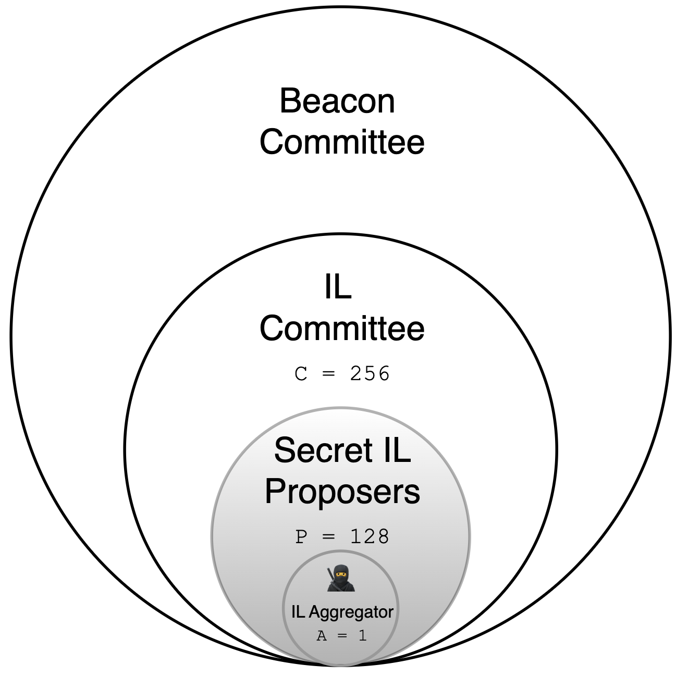
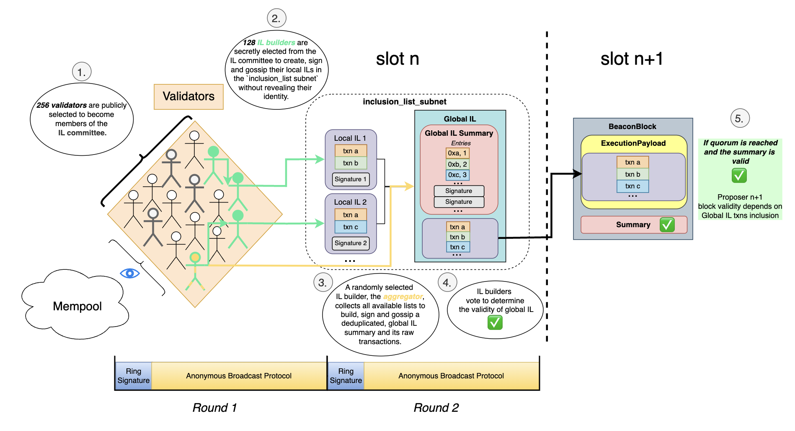
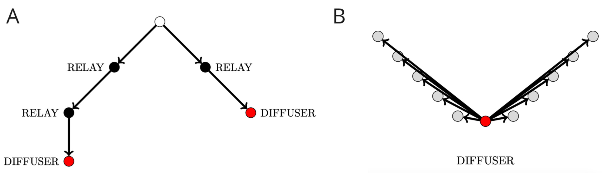
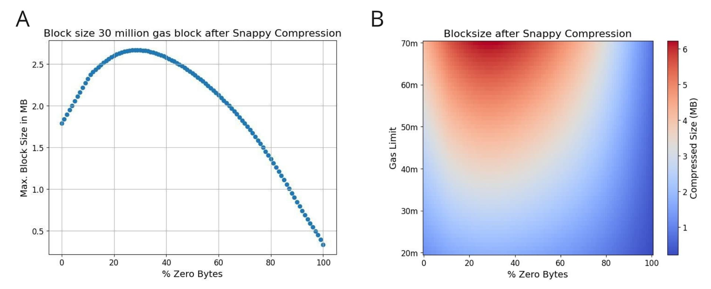
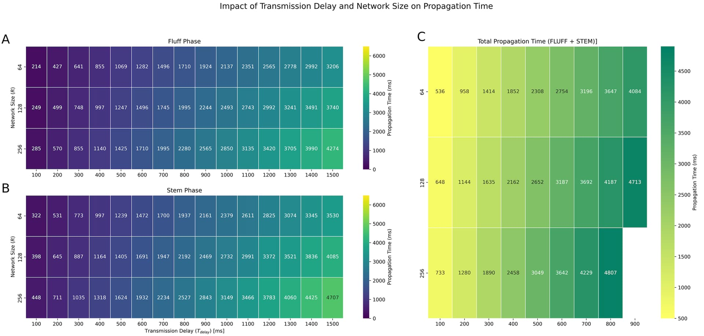
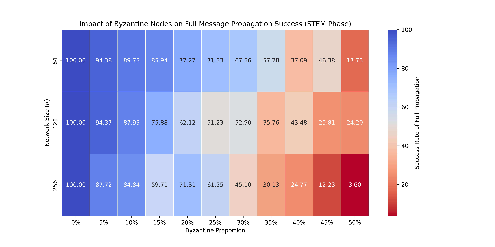

by [Thomas Thiery](https://ethresear.ch/u/soispoke/summary) and [Luca Zanolini](https://x.com/luca_zanolini), in collaboration with [Mary Maller](https://ethresear.ch/u/mmaller/summary), [Mark Simkin](https://x.com/Simk1n), and [Antonio Sanso](https://ethresear.ch/u/asanso/summary) 

-- May 23rd, 2024

*Special thanks to [Julian Ma](https://ethresear.ch/u/julian/summary), [Barnabé Monnot](https://ethresear.ch/u/barnabe/summary) and [Francesco D'Amato](https://ethresear.ch/u/fradamt/summary) for helpful comments and feedback.*

## Introduction

Relying on a few sophisticated entities for building blocks on Ethereum weakens the network's censorship resistance properties. Currently, more than [60% of blocks](https://censorship.pics/) are made by builders who actively censor transactions interacting with sanctioned addresses. As a result, there has been renewed interest in finding ways to enable the [more decentralized set](https://www.ethernodes.org/countries) of proposers to force-include transactions in Ethereum blocks. This interest has materialized in [research and development](https://github.com/michaelneuder/mev-bibliography?tab=readme-ov-file#censorship-resistance) efforts focused on Inclusion Lists (ILs). Significant progress has been made towards the first practical implementation of ILs, which is currently considered for inclusion in the upcoming Pectra fork (see [design](https://ethresear.ch/t/no-free-lunch-a-new-inclusion-list-design/16389), [EIP](https://eips.ethereum.org/EIPS/eip-7547), and [specs](https://notes.ethereum.org/@mikeneuder/il-spec-overview) [here](https://gist.github.com/michaelneuder/ba32e608c75d48719a7ecba29ec3d64b)).

Concurrent efforts have focused on improving the robustness of IL designs by limiting dependence on single entities for creating and proposing ILs, such as through [Committee-enforced Inclusion Sets (COMIS)](https://ethresear.ch/t/the-more-the-less-censored-introducing-committee-enforced-inclusion-sets-comis-on-ethereum/18835) and [Multiple Concurrent Proposers](https://ethresear.ch/t/concurrent-block-proposers-in-ethereum/18777/6). However, to our knowledge, no efforts have been made to develop a mechanism that protects the identity of participants involved in the construction of an IL, while also reducing the surface for [commitment attack vectors](https://ethresear.ch/t/fun-and-games-with-inclusion-lists/16557) like bribing and extortion games. 

Protecting the identity of IL proposers is crucial to ensure privacy, safeguard against any form of accountability or identity reveal, and boost the adoption of ILs on Ethereum. This principle is akin to the confidentiality provided in voting systems, where participants can express their preferences without the risk of exposure or retaliation (e.g., legal repercussions). Here, we address this gap by introducing anonymous Inclusion Lists (anon-IL), a design that leverages linkable ring signatures and an anonymous broadcast protocol (ABP) to anonymize IL proposers on Ethereum. 

#### Disclaimer

This post is intended as an initial exploration of a distributed mechanism for anonymizing IL proposers, setting the stage for future research and discussions. We build the mechanism in a modular fashion, detailing each module's role and the properties we believe are necessary to achieve anonymity. These modules can be swapped with others or studied as independent building blocks.

## High-level idea

Every slot `n`, a subset $C$ of the beacon committee, referred to as the IL committee, is randomly selected from validators to participate in the construction of a global inclusion list ($IL^G$), composed of transactions $t$ pending in the mempool. During the construction of $IL^G$, a subset $P$ of IL committee members are secretly elected to become IL proposers and create, sign, and disseminate local inclusion lists $IL^L$ without revealing their identities (**Round 1**). A randomly selected IL proposer, the IL aggregator $A$, collects all observed $IL^L$ to create and distribute the raw $IL^G$ transactions and their associated $IL^G_\text{summary}$ to the rest of $IL$  committee members, who then vote on the $IL^G_\text{summary}$ validity (**Round 2**). Figure 1. illustrates how $P$, $C$ and $A$ are selected from validators in the beacon committee. If deemed valid, block `n+1` must include the $IL^G_\text{summary}$, a quorum certificate proving its validity and the transactions that satisfy summary entries. Crucially, we use a linkable ring signature scheme and an anonymous broadcast protocol (ABP) to ensure IL committee members can sign and broadcast messages (ILs, votes) without revealing their identity. 

> **Figure 1.** **Anon-IL participant selection.** In each slot, 256 validators are randomly selected from the beacon committee to form the publicly known IL committee $C$. Half of the IL committee members (i.e., `≈128`), the IL proposers $P$, are secretly elected to participate in the IL construction. One of these proposers is randomly selected to serve as the IL aggregator $A$, who is in charge of gossiping the final global IL so it can be validated by other IL proposers.

## **Design**

In this section, we illustrate (Figure 2.) and provide a step-by-step description of the anon-IL mechanism.

> **Figure 2.** **Diagram illustrating the anon-IL design.**

### **Round 1**

1. In each slot, 256 validators are selected from the beacon committee to build inclusion lists. These `256` IL committee members are publicly known.
2. Out of the `256` IL committee members, only half of them, on average (i.e., `≈128`) are secretly elected as IL proposers $P$ to prepare local inclusion lists ($IL^L$) of transactions observed in the mempool and participate in a ring signature scheme. Each IL proposer signs their list using their private key, along with the public keys of all `256` IL committee members. Each IL proposer then gossips their $IL^L$, along with its ring signature, to a dedicated `inclusion_set` subnet through an ABP, before the slot `n` deadline $d$.

### Round 2

1. An IL aggregator is randomly selected amongst IL proposers that successfully sent commitments during the first round of the linkable ring signature scheme (see *Building Blocks* section below). Its role is to collect all observed $IL^L$ before the deadline $d$, constructs a final, deduplicated global inclusion list ($IL^G$) if transactions are seen in more than the inclusion threshold (e.g., `10%`) of the available $IL^L\text{s}$, and derives an $IL^G$ summary from them. $IL^G_\text{summary}$  consists of a list of (`address`, `gasLimit`) pairs, which specify the `from` and `gasLimit` for each transaction across all  $IL^L$. Each pair is referred to as an `Entry`. The aggregator’s $IL^G_\text{summary}$ with signatures from all IL proposers and the list of raw transactions corresponding to summary entries are then broadcast in the `inclusion_set` subnet using the ABP used in **Round 1**.
2. IL proposers also collect all observed $IL^L$, and construct their own $IL^Gs$ to evaluate the $IL^G_\text{summary}$ produced by the aggregator. If transactions in their own $IL^G$ overlap with a given percentage of entries in the aggregator’s $IL^G_\text{summary}$, they vote `TRUE`.  This step ensures a quality check on the global IL proposed by the aggregator, and prevents the generation of arbitrary ILs by a single party. To preserve the anonymity of voters, votes are also gossiped using the same ring signature scheme and ABP.  If enough `TRUE` votes are received, the IL aggregator (anonymously) broadcasts a valid  $IL^G_\text{summary}$, $IL^G$ raw transactions, and a quorum certificate that verifies the accumulation of sufficient `TRUE` votes (✅) over the global topic, via the ABP.  

### **Block validity**

1. To be considered valid, the block `n+1` must include:
    - The $IL^G_\text{summary}$ and its associated quorum certificate ✅
    - Raw transactions satisfying the $IL^G_\text{summary}$ entries
    
    Attesters must verify whether the block proposed by proposer `n+1` included all transactions satisfying the valid $IL^G_\text{summary}$ entries gossiped by the aggregator, in addition to all other standard validity checks before casting an attestation for the block `n+1`.
    
    Upon confirming the block's validity, attesters cast an attestation for block `n+1`.
    
    If an $IL^G$ is not made available on time or if a quorum of `TRUE` votes is not reached, block `n+1` is valid without including transactions satisfying an IL. 
    

## **Building blocks**

In this section, we introduce the process for selecting validators to become IL committee members and present the two main components of anon-IL: a linkable ring signature scheme, which allows selected validators to sign their local inclusion lists and votes, thereby proving their membership in the IL committee without revealing their identity; and a synchronous anonymous broadcast protocol, which enables IL committee members to disseminate messages across the peer-to-peer subnet without their identities being revealed by network traffic patterns.

### Linkable ring signatures scheme

A linkable ring signature is a cryptographic construct that allows a member of a group (ring) to anonymously sign a message on behalf of the group. This type of signature ensures the following properties:

1. **Anonymity**: The identity of the signer is hidden within the group. Any member of the ring could have potentially signed the message, making it impossible to determine the actual signer.
2. **Linkability**: Even though the identity of the signer is hidden, it is possible to determine if two different messages were signed by the same member of the group. This is done without revealing which member it was. This property prevents double-signing by the same individual without revealing their identity.

Each participant in the ring maintains a pair of public and private keys. The public keys are known to everyone and are collectively used to form the ring. The signer selects several public keys from the group, typically including their own, to create a ring. This selection is done such that it is impossible to identify who among the participants is the actual signer, preserving anonymity within the group. Importantly, verification of the signature is straightforward and does not require any special access or permissions; anyone with access to the public keys of the ring members can verify that the signature is valid and was created by one of the ring's members. This ensures that any participant could potentially be the signer of a specific transaction, maintaining robust anonymity and security.

For the anon-IL design, we use the [“one-out-of-many”](https://eprint.iacr.org/2014/764.pdf) ring signature scheme by [Groth and Kohlweiss](https://eprint.iacr.org/2014/764). In this scheme, participants “*have public keys that are commitments and demonstrate knowledge of an opening for one of the commitments to unlinkably identify themselves as belonging to the group”*. The only cryptography this scheme relies on is group operations and hash functions. The zero-knowledge prover and verifier also work out of the box and do not need edits, making it particularly suited for the anon-IL use case. Finally, we expect it to scale well for the number of participants selected in the IL committee.

### IL committee selection

- Each slot, `256` validators in the beacon committee are randomly chosen to form the IL committee $C$ (i.e., the ring). These IL committee members have to send a commitment to prove they are part of the ring.
- Half of the IL committee members (`128`) are then secretly elected to be IL proposers $P$  and actively participate in the construction of the IL.
- One IL aggregator $A$ is chosen from the set of IL proposers that successfully sent a commitment during the first round of the ring signature scheme.

### Anonymous Broadcast Protocol

While we employ a linkable ring signature scheme to conceal the identity of the signer of an IL, it is also crucial to anonymize the sender. This necessity arises because, despite the signer's identity being obscured by the ring signature scheme, there remains a risk that observers might link the signer's identity to the entity that transmitted the ring-signed IL. This linkage could occur through the analysis of metadata or network patterns associated with the transmission. To prevent this and fully protect the anonymity of the proposer, an anonymous broadcast protocol seems essential. This protocol would ensure that the transmission of the signed IL cannot be traced back to its origin, thereby safeguarding the identities involved.

**Overview**

We introduce an Anonymous Broadcast Protocol (ABP) inspired by [Dandelion](https://arxiv.org/pdf/1701.04439.pdf) and [Dandelion ++](https://arxiv.org/pdf/1805.11060.pdf) and tailored to fit Ethereum’s requirements. The ABP is designed to safeguard committee members from de-anonymization attacks when gossiping messages (i.e., ILs and votes). This is achieved by routing their communications through a randomized, multi-phase process that conceals the origins of messages, thereby significantly complicating the efforts to trace these back to their original source based on network traffic. The protocol consists of two phases: the *STEM* phase and the *FLUFF* phase. During the *STEM* phase, each committee member, acting either as a relay or a diffuser, forwards their locally generated inclusion list to one or two peers. A committee member can either be a relay or a diffuser. If a committee member acts as a relay, upon receiving a local inclusion list, it will forward this list to another peer or two peers. If a committee member is a diffuser, it initiates the *FLUFF* phase by broadcasting the received list to all members. It is important to note that a diffuser's role, which involves functioning as such for every message, is determined through a randomized mechanism that takes into account the slot number and the member's identity. 

> **Figure 3. Life cycle of a message during the execution of the ABP** in slot `n` during (A) the STEM and (B) the FLUFF phase. Sender nodes are coloured in white, relay nodes are coloured in black, and diffuser nodes in red. 

For further clarity:

- The protocol starts with the *STEM* phase: each committee member sends their local inclusion list via two different routes within a 4-regular graph (i.e., a type of network where every node is connected to exactly 4 nodes). This 4-regular graph is part of a larger network $G$, which overlays all IL committee members selected for the specific slot.
- The structure of this graph requires each committee member to randomly select the next two relay nodes, which also introduces a random delay for each message hop throughout the graph.
- Upon receiving a local inclusion list from another member, the recipient determines its role for that slot — either a relay or a diffuser. As a relay, the member follows the forwarding procedure described in the previous point. As a diffuser, the member starts the *FLUFF* phase.
- In the *FLUFF* phase, committee members disseminate their local inclusion lists simultaneously to all members.
- While functioning as a relay during the *STEM* phase, a committee member also starts a timing deadline $f$ for every message it receives. In this way we implement a fail-safe mechanism that requires relays to monitor whether their forwarded message is successfully diffused. This is designed to prevent black-hole attacks, where a malicious node in the path decides not to forward the message. Specifically, the protocol sets a random expiration timer at each *STEM* relay immediately upon receiving transaction messages. The relay then monitors the network to see if the transaction reappears. If the timer expires without the transaction reappearing, the node autonomously diffuses the transaction. In Dandelion++, this mechanism offers two key advantages: (1) it ensures that messages are guaranteed to eventually propagate through the network, and (2) the random timers help to anonymize peers initiating the spreading phase, mitigating the risk of black-hole attacks.

**ABP Parameters**

We conducted preliminary analyses to determine the ABP parameters necessary for it to function effectively under Ethereum's time and bandwidth constraints. These analyses are an initial step toward understanding the trade-offs and consequences of selecting these parameters. A detailed, comprehensive analysis should also be conducted to evaluate the effects of delays, the number of participants, and role distribution (relays vs. diffusers) on the security and anonymization guarantees that anon-IL provides. As previously mentioned, our design requires two rounds of message exchange (one for local ILs, one for voting on the global IL), meaning the ABP must run twice per 12-second slot. We assume a maximum IL size of `3M` gas, which corresponds to approximately `0.33 Mb` (see Appendix 1.1 for more details). We expect the ring signature scheme to take around 1 second per round, leaving `5 seconds` per round for the ABP to complete both the *STEM* and *FLUFF* phases. We evaluated the impact of transmission delays and network size on propagation time (Appendix 1.2), and the impact of Byzantine nodes on message propagation success (Appendix 1.3). This evaluation helped us choose initial parameters for the ABP and allocate `2.5 seconds` for each phase (*STEM* and *FLUFF*), a network size of `128 nodes`, and an added transmission delay randomly chosen between `100 ms` and `900 ms`.

## Evaluation and tradeoffs

In this section, we discuss how to evaluate anon-IL and the tradeoffs that were made in its design.

### Anonymity guarantees

The core idea behind anon-IL is to allow validators to participate in building ILs without revealing their identity. This is achieved using a linkable ring signature scheme. Importantly, having twice as many IL committee members (`256`) as secret IL proposers (`128`) allows each participant to plausibly deny having signed or sent any specific message. Moreover, IL proposers use an anonymous broadcast protocol to gossip messages, further protecting their anonymity from external observers analyzing network traffic. The effectiveness of these anonymity guarantees depends on:

- The cryptographic integrity of the chosen ring signature scheme: Here, we utilize Groth-Kohlweiss signatures that enable all IL proposers to sign in under a second while maintaining robust security. The signatures can theoretically provide long-term anonymity that is secure against advances in cryptanalysis because the protocol achieves statistical zero-knowledge. A caveat: this assumes the validators are using good sources of randomness and that there are no implementation bugs.
- The ABP design and its associated parameters were inspired by [Dandelion++](https://arxiv.org/pdf/1805.11060). The parameters were adapted to meet the time constraints imposed by Ethereum’s 12-second slot duration. Further analyses are necessary to assess the anonymity guarantees provided by the roles assigned to nodes (relays or diffusers), the network size (i.e., the number of IL proposers), and the maximum random delay introduced when messages are broadcast to other nodes. Preliminary analyses in Appendix 1 helped establish credible parameters for this post. To comprehensively evaluate the protocol's robustness, it is crucial to conduct in-depth simulations and set up devnets to assess the anonymity guarantees under real and varied network conditions.

Assuming anon-IL provides strong anonymity guarantees, we believe it represents a substantial improvement over other IL designs. Allowing validators to participate in preserving [chain neutrality](https://ethresear.ch/t/uncrowdable-inclusion-lists-the-tension-between-chain-neutrality-preconfirmations-and-proposer-commitments/19372) while being protected from targeted legal or regulatory measures significantly improves the chances of IL adoption. Currently, according to censorship.pics, about 7.5% of proposers censor transactions. This percentage might increase with the introduction of ILs because proposer agency would be explicitly required. By protecting their identity, we allow the entire validator set, including proposers censoring transactions today, to participate in improving the censorship resistance properties of the network without being targeted by regulatory measures. Furthermore, relying on a secretly chosen set of IL proposers to participate in the construction of ILs decreases the viability of [commitment attacks](https://ethresear.ch/t/fun-and-games-with-inclusion-lists/16557). It seems reasonable to conjecture that our design would require an attacker to bribe a significant fraction of the `256` IL committee members to have a transaction included or excluded from the global IL. Unlike [COMIS](https://ethresear.ch/t/the-more-the-less-censored-introducing-committee-enforced-inclusion-sets-comis-on-ethereum/18835), in anon-IL the IL aggregator also uses the ABP to broadcast its global IL to other committee members, which essentially removes commitment attacks targeted to a single party, unless the aggregator willingly self-reveals. An attacker can always target the proposer `n+1`, but it would force it to miss its slot (otherwise the block isn’t valid), missing out on all execution and consensus layer rewards, and potentially incurring [missed slot penalties](https://ethresear.ch/t/missed-slot-penalties-temperature-check/18713?u=barnabe) in the future. 

### Inclusion guarantees

In anon-IL, inclusion guarantees are explicitly determined during **Round 2** with the inclusion threshold, with which IL aggregators include transactions if they are seen in more than `X%` of the $IL^L\text{s}$ they collected. We propose to set this inclusion threshold to `10%`, which means every transaction that ends up being included in more than `12 out 128` IL proposers’ local ILs should be included in the $IL^G$ and its associated summary.  Choosing a relatively low, non-zero inclusion threshold provides good inclusion guarantees while preventing spam transactions coming a single party from filling the global IL. This approach avoids the scenario where a single IL proposer could flood the system with its transactions, ensuring that only those transactions that overlap with other proposers’ local ILs are included. By requiring that transactions must be seen in multiple local lists, the protocol mitigates the risk of a malicious IL proposer dominating the global list with spam transactions. This selective inclusion helps maintain the integrity and efficiency of the IL. Another parameter in **Round 2** also affects inclusion guarantees, since `TRUE` votes are cast only if transactions IL proposers $IL^G\text{s}$ satisfy at least some proportion of entries in the aggregator’s $IL^G_\text{summary}$. This gives some leeway for IL proposers who may have missed some of the $IL^L\text{s}$ gossiped during Round 1 due to p2p network latency. However, we recommend a high overlap percentage (e.g., 90%) to constrain the aggregator’s  $IL^G$ construction and improve inclusion guarantees.

We also need to consider scenarios where ILs are full. How should IL proposers and the aggregator construct ILs when transactions eligible for inclusion exceed the IL gas limit (i.e., `3M` gas)? If stuffing ILs becomes a profitable strategy, coordinated IL proposers exceeding the inclusion threshold could potentially add the exact same transactions in their $IL^L\text{s}$, thereby crowding out other candidate transactions. To mitigate this concern, we could:

- Establish a priority rule for ordering IL transactions: Transactions that appear most frequently across all collected $IL^L\text{s}$ should be given priority for inclusion.
- Increase the inclusion threshold.
- Increase IL size to fit more transactions. We could also consider conditional ILs that could be larger, or ILs with [cumulative, non-expiring](https://ethresear.ch/t/cumulative-non-expiring-inclusion-lists/16520) properties.

### Incentives scheme

The most obvious drawback of protecting IL proposers' identities is that it makes it very difficult to devise incentive schemes to reward parties that provide useful inputs to the mechanism or penalize those who do not. In this post, anon-IL does not reward IL committee members in any way, and assumes that contributing to improving the censorship-resistance properties of the network is a task that validators can take on without expecting additional rewards. That said, we could design incentives that rely on metrics to evaluate the quality of the global IL constructed by IL proposers without having to identify specific contributors to reward individual inputs. For example, the IL committee members could be uniformly rewarded based on the overlap between all local ILs, encouraging IL proposers to include all public transactions they see pending in the mempool. 

Here's a simple model to implement this, if we assume rewards come from fees associated with transactions (see conditional tipping). We let $C$ represent the total number of committee members (in the current anon-IL design, `256`), and $T$ denote the set of all transactions pending in the mempool. Each transaction $t$ in $T$ is associated with a fee $f_t$, and $I_i$ is the set of transactions included by proposer $i$ in their local ILs. 

- **Reward Calculation**:
    - The intersection $U$ of transactions included by all IL committee members is computed as $U = I_1 \cap I_2 \cap \ldots \cap I_N$.
    - The reward for each committee member $i$, $R_i$, is calculated as follows:

$$
R_i = \frac {1} {N} ∑_{t ∈ U} f_t
$$

- **Example Scenarios**:
    - **Scenario 1**: All members (A, B, and C) include all 5 transactions in their ILs, with the transactions being $T = {t_1, t_2, t_3, t_4, t_5}$ and fees $f_{t_1} = 0.1, f_{t_2} = 0.3, f_{t_3} = 0.4, f_{t_4} = 1, f_{t_5} = 0.6$. Given all members include all transactions, the reward calculation simplifies as each proposer includes the same set of transactions $U = T$, and
    $R_i = \frac {1} {3}(0.1+0.3+0.4+1+0.6) = 0.8$ for each member.
    - **Scenario 2**: Suppose proposers A and B include 4 transactions each (say $t_1$ to $t_4$), while C includes only 2 transactions ($t_1$ and $t_2$). The transactions common to all members are $U = {t_1, t_2}$, and the rewards are computed as: $R_i = \frac {1} {3}(0.1+0.3) = \frac {0.4} {3} ≈ 0.133$ each.

Note that if rewards came from issuance, we could also consider the number of IL proposers (out of all possible ones) who contributed to incentivize participation. Another interesting avenue would be to all committee members participate in a lottery. All `256` participants have a chance of winning the lottery and getting a share of the rewards, but the winning probability can be biased by having IL proposers and the aggregator secretly prove things about their role and their contributions. This would provide a way to reward individual roles or contributions, while still providing plausible deniability (e.g., “I got rewards because I got lucky but I didn’t actually participate in creating a list at all”). We think that exploring solutions to reward IL proposers for their contributions without compromising their anonymity—such as using shielded reward pools, stealth addresses, or fully homomorphic encryption in the future—merits further investigation. 

### IL properties

- **Spot:** Since parties other than proposers are responsible for building $IL$s ($IL$ proposers and aggregators), the anon-IL mechanism can run in parallel of the block construction process, which effectively gives real-time censorship resistance at the block level.
- **[Unconditional](https://ethresear.ch/t/unconditional-inclusion-lists/18500)**: This property ensures that once an IL includes a transaction, that transaction is guaranteed to go onchain at the latest in slot `n+1`.
    - **End-of-block**: The spot, unconditional anon-ILs should be appended at the end of block `n+1`. Importantly, if transactions satisfying IL summary requirements are already included in the payload, they will take precedence over IL transactions. Should this occur, IL transactions would be reverted.
- **[Uncrowdability](https://ethresear.ch/t/uncrowdable-inclusion-lists-the-tension-between-chain-neutrality-preconfirmations-and-proposer-commitments/19372):** We believe the aforementioned anon-IL properties make them “inconvenient enough” for uses other than chain neutrality. Frontrunnable, end-of-block transactions that need to be seen by a set of secretly elected participants (i.e., made public) offer few opportunities to introduce secondary markets for MEV or preconfirmations.

### Byzantine and fault tolerance

In anon-IL, Byzantine nodes are capable of launching various attacks at different stages of the mechanism. These attacks can be broadly categorized into two types:

- **De-anonymization Attacks:** These are attempts by either external or internal parties to compromise the anonymity of IL committee members, proposers, and aggregators, thereby increasing the likelihood of revealing their identities. A critical factor to consider is that a single entity owning a significant stake could control a large portion of the IL committee. Therefore, the mechanism must be designed to resist de-anonymization efforts, even when many of the committee's validators are affiliated with the same entity.
- **Liveness Attacks:** IL proposers may choose not to engage in the creation, signing, or broadcasting of ILs. This non-participation can lead to liveness faults, characterized by the failure to propagate messages throughout the network. An example of this can be found in Appendix 1.2, where we examine the impact of so-called "black-hole" attacks — scenarios in which Byzantine nodes choose not to forward any messages — on the success of message propagation during the *STEM* phase. To counteract this attack, we introduce a fail-safe mechanism that requires nodes to monitor whether their messages have been successfully propagated by the end of the *STEM* phase and to initiate message diffusion themselves if propagation has not occurred.

Thorough security analyses must be conducted to mitigate de-anonymization and liveness attacks to the best of our ability. However, it is also important to keep in mind that the worst case scenario leads to an IL not being built for one slot: Censorable transactions would likely still be pending in the mempool, and can be picked up by the next IL committee.

## Limitations

Our approach to anonymizing IL proposers on Ethereum, while robust in its design, encounters specific limitations that merit attention:

- **Adaptation of the Anonymous Broadcast Protocol (ABP)**: A central element in our mechanism is the ABP, a modified version of the Dandelion++ protocol originally designed for asynchronous communication. For our purposes, we have adapted it to a synchronous setting, maintaining the original structure but with adjusted expectations for message propagation. A critical observation guiding this adaptation is that the complete propagation of all proposed ILs to every committee member is not necessary. This assumption allows for specific deadlines and acknowledges that some transactions, despite passing through multiple relays, may not reach all committee members. This could potentially exclude some transactions from consideration. Although this does not pose a significant concern, as our objective is to include a substantial portion of the proposed IL in the global inclusion list, a thorough security analysis is necessary to assess the trade-offs between anonymity and security stemming from these changes. While it is advantageous to begin with a protocol that has already been implemented elsewhere, it might be more practical in the future to design a protocol from scratch—one with fewer parameters. Conducting the necessary analyses to evaluate its robustness and security will ensure that it is optimally tailored to meet our specific needs.
- **Single Aggregator Model**: The current protocol considers a single aggregator randomly selected among the IL proposers. While this simplifies the design and is not a constraint per se—multiple aggregators can be integrated without altering the core mechanism—this setup can introduce specific challenges. Discussions are needed to explore potential issues that may arise from having only one aggregator, such as bottlenecks in processing or points of failure that could be exploited by malicious actors.
- It is also crucial to examine how the RANDAO affects our protocol as validators are able to bias is to a small extent. An analysis should be conducted to understand how such biases could influence the parts of our mechanism where RANDAO is utilized.

## Supplementary Material

### Appendix 1. ABP Parameters

**1.1. IL gas and size (h/t Toni)** 

Previous IL specs have often mentioned using an IL size of `3M gas`. We chose the same amount of gas for the anon-IL design, and demonstrate that the maximum size in bytes a block can have after snappy compression is one with `28%` of zero bytes (Figure S1). Given that zero bytes are cheaper (`4 gas`) than non-zero bytes (`16 gas`), we calculate the maximum size an IL of `3M gas` can have as follows: $3M \times 0.28/4 + 3M \times 0.72/16 = 0.33Mb$.

> **Figure S1.** A. Maximum block size in Mb after Snappy compression relative to the percentage of zero bytes for a 30M gas block. B. Heatmap showing the relationship between the percentage of zero bytes in a block and the compressed size (in MB) of the block after applying Snappy compression, with respect to varying gas limits (h/t Toni for both figures). 

**1.2. Impact of Transmission Delay and Network Size on Propagation Time**

We then evaluated how changing the maximum transmission delay and the size of the network (i.e., the number of IL proposers) affected to the propagation time of a given message during the *STEM* and *FLUFF* phases.

- *FLUFF* phase: According to the [consensus specifications](https://github.com/ethereum/consensus-specs/blob/836bc43a0667990dd1243cf3aaad7e35a32eab99/specs/phase0/p2p-interface.md#the-gossip-domain-gossipsub) and given a mesh size $MS$ of `8`, and secret IL proposers sending messages using the ABP for each round, we assume a minimum of `100 ms` transmission delay $T_{delay}$, and a maximum determined by a maximum random delay we add to each message transmission to help de-anonymizing participants. We thus use a simple analytical model to compute the propagation time $PT_{FLUFF}$ needed to reach all nodes during the *FLUFF* phase: 

$PT_{FLUFF} = T_{delay} \times \log_{(MS - 1)}(R)$

Where $\log_{(MS - 1)}(R)$ is used to calculating the number of hops required for a given message to reach all nodes. Using these parameters, the computed propagation time $*PT_{FLUFF}$* to reach all nodes during the *FLUFF* phase depending on $T_{delay}$ is shown in Figure S2. A.
- *STEM* phase: As a reminder, each slot, half of nodes are randomly chosen to be relays (forward to 1 or 2 neighbours), the other half are diffusers (forward to all other nodes). Given the more complex network dynamics involved in this phase, we use simulations to estimate $PT_{STEM}$ relative to the network size and  $T_{delay}$ (Figure S2.B.)

We then simply add $PT_{FLUFF}$ and $PT_{STEM}$ to find viable parameters allowing to propagate messages to everyone under `5 seconds` per round (Figure S2.C.). As a result, we chose to allocate `2.5 seconds` for each phase, setting parameters to a network size of `128 nodes`, with a maximum added random delay of `900ms`.

> **Figure S2.** **Propagation Time relative to transmission delay and network size** for (**A**) the FLUFF phase, (**B**) the STEM phase across 100 simulation runs, and (**C**) the total propagation time for a given round (FLUFF + STEM). The x-axis indicates the transmission delay $T_{delay}$, and the y-axis shows network sizes (64, 128, 256 nodes).  Color intensity varies from fast to slow propagation time.

**1.3 Impact of Byzantine Nodes on Message Propagation Success**

We considered the impact that Byzantine nodes could have on the propagation of messages (ILs and votes) across the network of IL committee members. In Figure S3, we show the proportion of messages successfully reaching all nodes, given different percentages of Byzantine participants during the STEM phase, for various network sizes.

> **Figure S3. Impact of Byzantine Nodes on Message Propagation Success.** This heatmap displays the success rate of full message propagation across networks with varying sizes and proportions of Byzantine nodes, for the *STEM* phase and averaged across 100 simulation runs. The x-axis indicates the percentage of Byzantine nodes (0% to 50%), and the y-axis shows network sizes (64, 128, 256 nodes). Color intensity varies from blue (higher success rates) to red (lower success rates), illustrating how increased Byzantine presence affects network reliability.