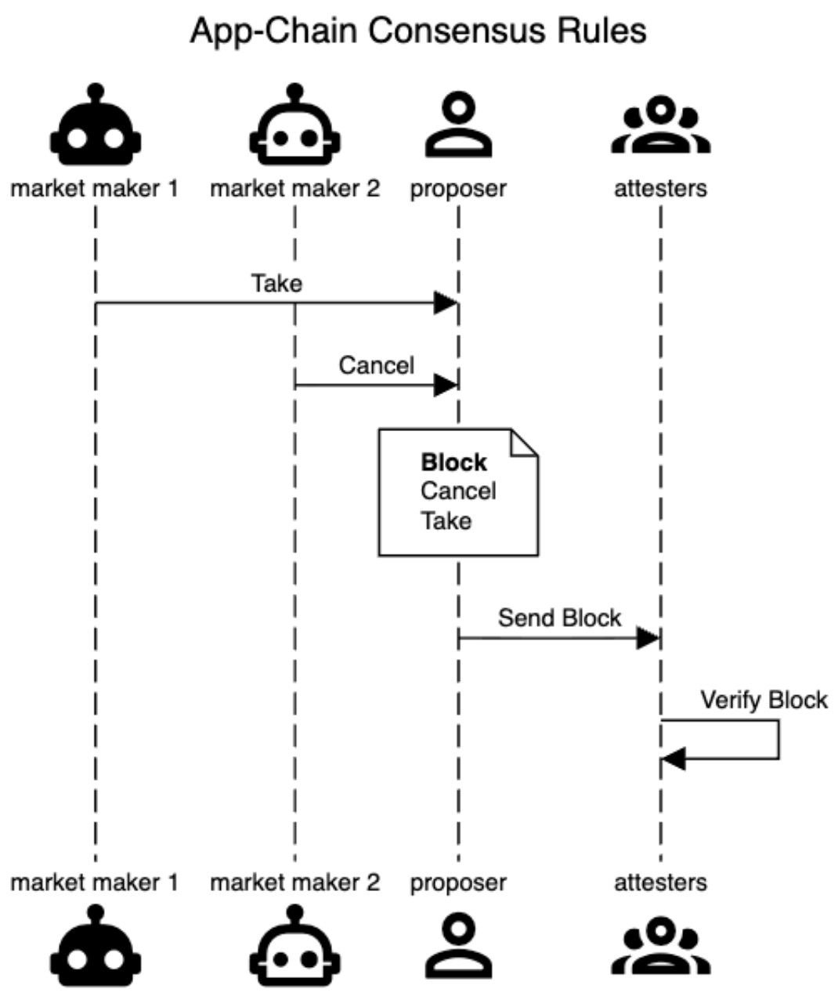
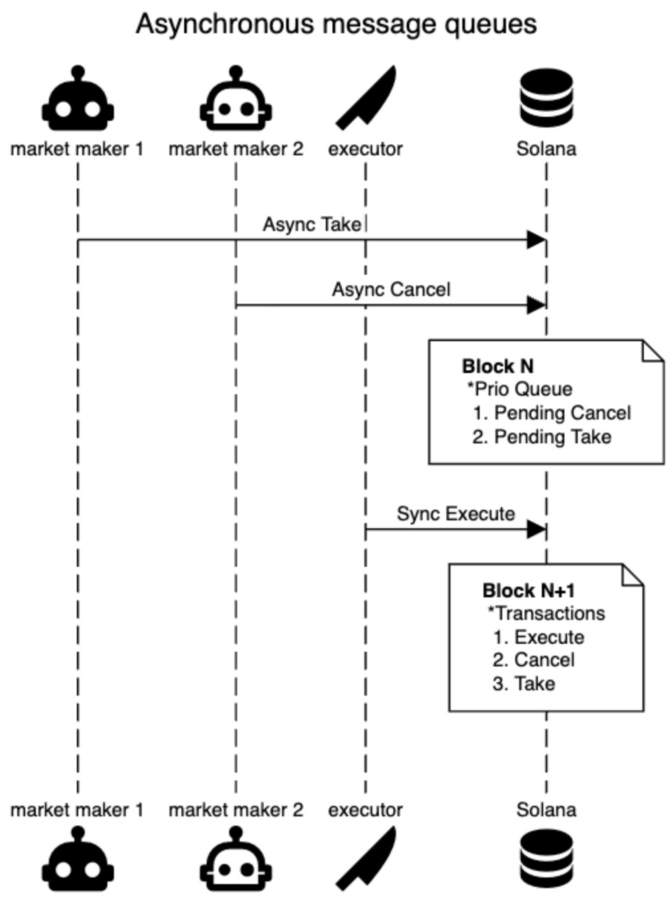
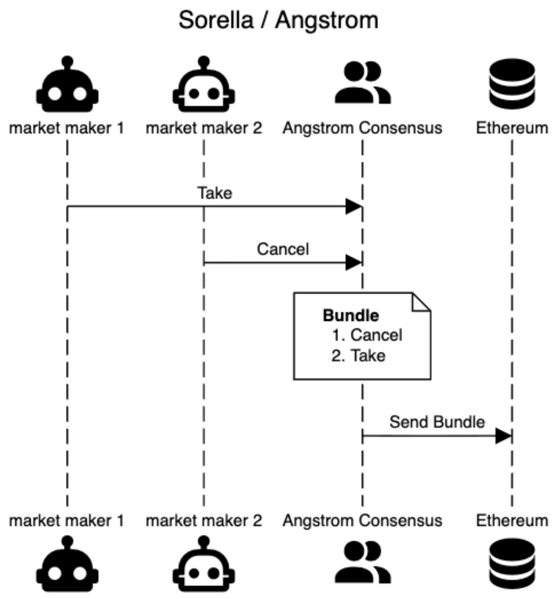
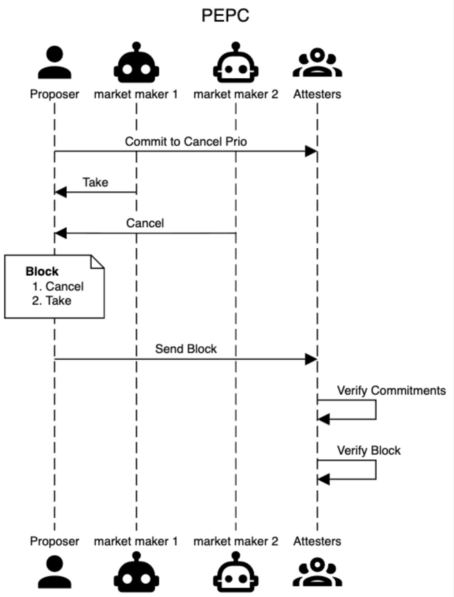
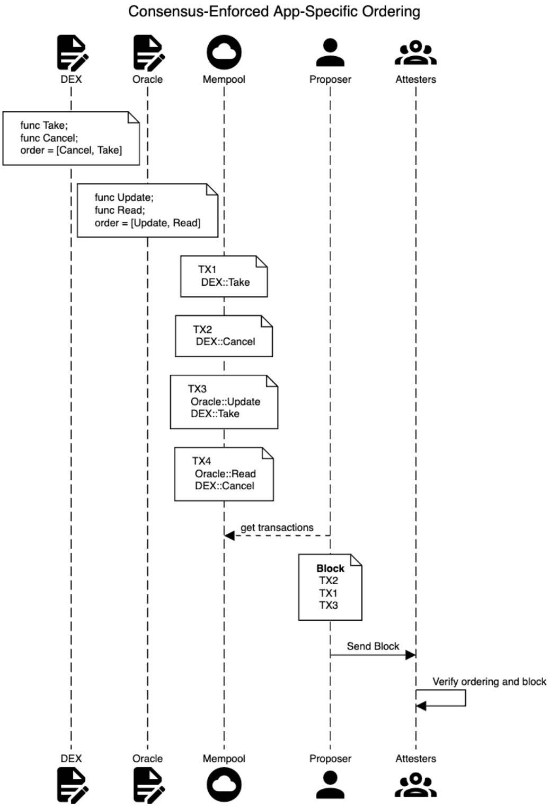

## Application-controlled execution: A case study on cancel prioritization

by [maryam](https://x.com/bahrani_maryam) and [mike](https://x.com/mikeneuder) – *january 29, 2026.*

**tl;dr;** Application-controlled execution (abbr. ACE) is a mechanism that grants power over transaction sequencing to applications. Hyperliquid's use of cancel prioritization is the most notable example of ACE today, and it demonstrates that ACE can be used to significantly improve onchain trading. This post analyzes four proposed mechanisms to implement ACE and how each of them could instantiate cancel prioritization. We also consider a more general, enshrined form of ACE that could be implemented in the smart contract language and enforced by L1 consensus. Within that paradigm, we use examples to demonstrate the specific downsides of increased block-building complexity and decreased composability. The high-level goal of this post is to distill the discussion around different forms of ACE. We hope it shows that these designs have many commonalities and that something as powerful as cancel prioritization can be implemented without too much complexity.

#### Contents
(1) [Introduction](#p-58146-h-1-introduction-4)
(2) [Existing designs](#p-58146-h-2-existing-designs-5)
$\quad$(2.1) [App-chains](#p-58146-h-21-app-chains-6)
$\quad$(2.2) [Batching on a general-purpose chain](#p-58146-h-22-batching-on-a-general-purpose-chain-7)
$\quad$(2.3) [Batching by off-chain parties](#p-58146-h-23-batching-by-off-chain-parties-8)
$\quad$(2.4) [Protocol-enforced proposer commitments](#p-58146-h-24-protocol-enforced-proposer-commitments-9)
(3) [Consensus-enforced app-specified ordering](#p-58146-h-3-consensus-enforced-app-specified-ordering-10)
$\quad$(3.1) [Block building complexity](#p-58146-h-31-block-building-complexity-11)
$\quad$(3.2) [Composability](#p-58146-h-32-composability-12)
$\quad$(3.3) [Possible adaptations & mitigations](#p-58146-h-33-possible-adaptations-mitigations-13)
(4) [Conclusion](#p-58146-h-4-conclusion-15)

#### Related articles

| Description |  |
|-------------|------|
| Hyperliquid | [link](https://hyperliquid.medium.com/latency-and-transaction-ordering-on-hyperliquid-cf28df3648eb) |
| AMQs | [link](https://www.temporal.xyz/writings/application-controlled-execution-ace-through-asynchronous-market-queues-amqs) |
| Sorella design | [link](https://sorellalabs.xyz/writing/a-new-era-of-defi-with-ass) |
| Angstrom whitepaper | [link](https://app.angstrom.xyz/whitepaper-v1.pdf) | 
| PEPC | [link](https://ethresear.ch/t/unbundling-pbs-towards-protocol-enforced-proposer-commitments-pepc/13879) |


### (1) Introduction

This article studies application-controlled execution (abbr. ACE), where applications are able to specify constraints on the ordering of transactions that interact with them. For our purposes, we will use the following definition of ACE.

> **Application-controlled execution** enforces ordering rules on batches of transactions interacting with them.

It is up to the application to specify what constitutes a batch, but for now, we will focus on one batch per block, which is the most natural choice. ACE is a very broad concept and definition, so we will make it concrete by focusing specifically on cancel prioritization, which Hyperliquid implemented. We will use the following definition of cancel prioritization.

> **Cancel prioritization** enforces that within each batch, cancel orders precede take orders.

Note that, in Hyperliquid's [words](https://hyperliquid.medium.com/latency-and-transaction-ordering-on-hyperliquid-cf28df3648eb), "cancels and post-only orders are prioritized above GTC and IOC orders" (see their order-type descriptions [here](https://hyperliquid.gitbook.io/hyperliquid-docs/trading/order-types#order-options)). For simplicity, we will informally just define "cancels" as orders that remove liquidity from the trading venue without executing a trade, and "takes" as those that execute a trade. We ignore most of the exact details of the exchange (e.g., a DEX vs. an on-chain CLOB), but will clarify within examples if necessary.

[Section 2](#2-Existing-designs) explores four existing designs for implementing ACE and analyzes the trade-offs that each makes. To help unify the different designs, we study specifically the task of cancel prioritization, even if the original proposal wasn't specific to this use case. 
[Section 3](#3-Consensus-enforced-app-specified-ordering) considers a more general in-protocol instantiation of ACE where smart contracts specify function ordering and consensus enforces the ordering at the state-transition function. This "enshrined" solution has two immediate downsides: increased block-building complexity and decreased composability; we build up small examples demonstrating each of these.


### (2) Existing designs

The following four subsections outline different proposed mechanisms for implementing ACE and present how each could instantiate cancel prioritization. Without being exhaustive, we analyze the main pros and cons of each design.

#### (2.1) App-chains

The first crypto project to implement cancel prioritization was Hyperliquid; Jeff articulated his motivation [here](https://hyperliquid.medium.com/latency-and-transaction-ordering-on-hyperliquid-cf28df3648eb), and argued that this decision helped ensure tighter spreads for users, despite sacrificing the exchange's volume, which is often seen as a vanity metric. Since Hyperliquid is an app-specific L1 designed for trading, they implement this design decision at the protocol level:

> "This ordering is enforced onchain by the L1 itself. The only correct way for a node to execute a block on the Hyperliquid L1 is to sort cancels and post-only orders first." 
> – *[Hyperliquid’s design](https://hyperliquid.medium.com/latency-and-transaction-ordering-on-hyperliquid-cf28df3648eb).*

This is the simplest and most robust way to enforce application-specific ordering rules. The sequence diagram below shows this flow. The "enforcement in consensus" occurs in the **Verify Block** stage, where the attesters determine the validity of a block by checking that Cancels precede Takes.



**Pros of app-chains for cancel prioritization:**
- *Fine-grained control:* By nature of being an app-chain, the application gets maximal control over its execution environment. Giving each app-chain control over how blocks are built and validated is a long-held thesis of the Cosmos ecosystem (though the interoperability between these independent domains has not borne out). There are other, opinionated ways that app-chains can produce blockspace. [Injective](https://injective.com/blog/injective-exchange-upgrade-a-novel-order-matching-mechanism/), for example, runs a frequent batch auction at the speed of block production. Instead of each transaction being processed sequentially, they are executed concurrently as a batch. Similarly, [dYdX](https://www.dydx.xyz/blog/architecture-to-mitigate-mev) uses vote extensions to constrain the power of the block proposer by limiting the set of transactions the proposer can exclude (a very similar design to [FOCIL](https://eips.ethereum.org/EIPS/eip-7805)). 

**Cons of app-chains for cancel prioritization:**
- *Censorship resistance:* The robustness of the Hyperliquid ordering rule (and app-chain commitments generally) is only as strong as the censorship resistance of the chain and its validator set. The proposer can always execute the take and not the cancel by simply excluding the cancel from their block altogether. While this forgoes transaction fee revenue from the cancel, it may be rational if `market maker 1` is willing to bribe the proposer to do so. 
- *"Bridging-only" settlement:* For this analysis, we define "settlement" as the amount of delay between the inclusion of the transaction and the time at which the outputs of the transaction can be used in other applications on a general-purpose L1. While this may seem unfair for Hyperliquid and other app chains, they do live in isolation from the rest of the crypto market, and the network effects of most assets already existing on major public chains are extremely sticky. In order to interact with the output of a Hyperliquid transaction on Ethereum L1, the assets must first be bridged, introducing meaningful delays (potentially several blocks). In particular, there is no meaningful atomic settlement between Hyperliquid and any other chain.

Hyperliquid has demonstrated that if an application can fully control its sequencing, it should make opinionated decisions based on the specific use case of the app. The Atlas team made a [similar argument](https://atlasxyz.medium.com/the-case-for-opinionated-financial-infrastructure-fb29efc5001b) about the decisions they are making in the context of their "DeFi-specific L2." 

However, by building an independent chain, app-chains suffer from the same fragmentation issues that Ethereum L2s face. In response to this fragmentation, some applications will choose to build directly on general-purpose blockchains like Ethereum and Solana to tap into the atomic composability enabled by other applications living in the same state. These applications cannot control consensus rules and must be implemented as a combination of smart contract code on public chains, along with any out-of-protocol infrastructure needed to facilitate the app. The following two sections explore some of the proposed designs for these applications and draw parallels to what we have seen already. 

#### (2.2) Batching on a general-purpose chain

Cavey, Jakob, and Max [proposed](https://www.temporal.xyz/writings/application-controlled-execution-ace-through-asynchronous-market-queues-amqs) "Asynchronous Message Queues" (abbr. AMQs), as a mechanism that enables applications to implement cancel prioritization on Solana today. The mechanism works as follows: 
1. **In block N, async transactions are queued, but not executed.** The queue is held as state in the smart contract and serves as the batch. 
2. **In block N+1, queued transactions are executed as a batch.** The "execute" itself is also a transaction, which actuates the trades in the priority order specified by the application. 

The diagram below shows this process over two blocks. 



**Pros of AMQs for cancel prioritization:**
- *No change to consensus:* By using the L1 state and timestamping, AMQs can be implemented on Solana (or Ethereum) today using only smart contracts without changing anything about the core protocol.

**Cons of AMQs for cancel prioritization:**
- *Transaction delays:* There is at least a one-slot delay between when trades are originated and when they are settled. While the users may benefit from better liquidity and execution from having cancel prioritization, the UX clearly would suffer from having to wait an additional block for the trade to complete (though this may be a larger issue for Ethereum than Solana due to slot times). There are two immediate potential solutions, both of which require changing consensus rules. First, the chain could allow "scheduled transactions," which execute batches at the end of each block. Alternatively, the chain could allow contracts to introspect about each transaction's position in the block. With this insight, the contract knows when the last transaction is and could trigger execution of the batch immediately after (this type of "callback" mechanism is similar to a [UniV4 hook](https://docs.uniswap.org/contracts/v4/concepts/hooks)).
- *"Next-block" Settlement:* As a consequence of the transaction delays and as pointed out in the [AMQ post](https://www.temporal.xyz/writings/application-controlled-execution-ace-through-asynchronous-market-queues-amqs), the async nature of transaction execution eliminates atomic settlement with other Solana transactions within the same block. Even if there are no more AMQ transactions in block N (and thus the outcome of the batched execution is deterministically known), the *settlement* of the trade won't happen until block N+1, and thus none of the block N transactions can interact with those outputs (e.g., by repaying a flash loan).
- *Censorship:* As with the app-chain design above, the credibility of the AMQ mechanism depends greatly on the censorship resistance of the underlying chain. A Solana validator can simply censor any incoming cancels in block N to render the priority queue ineffective. The authors acknowledged this directly 
  > "Similar to all other forms of ACE that do not involve multiple proposers, AMQs can still be bypassed by a validator within protocol-enforced tick boundaries through censorship and delay."
  > – [*Enforcing ACE*](https://www.temporal.xyz/writings/application-controlled-execution-ace-through-asynchronous-market-queues-amqs).


AMQs rely on the Solana validators to enforce ACE. Some applications may instead choose off-chain batching solutions to shift their trust to parties that are more specifically aligned with their application. 


#### (2.3) Batching by off-chain parties

Another way of implementing app-specific ordering rules is by delegating sequencing power to off-chain entities. [Sorella](https://sorellalabs.xyz/writing/a-new-era-of-defi-with-ass) implements [Angstrom](https://app.angstrom.xyz/whitepaper-v1.pdf) a hybrid on-chain-off-chain DEX on Ethereum. Their design leverages a separate consensus mechanism to determine the batch of transactions to execute against the liquidity positions held on the Ethereum L1. 

**Note #1**: In Uniswap parlance, you can think of a cancel as the "removal of a liquidity position." Similarly, a take is akin to a "swap." In Angstrom's design, cancels are distinct from removing liquidity (and cancels are prioritized), but for our purposes we just focus on the takes versus cancel distinction.

The diagram below shows a hypothetical cancel prioritization flow on Angstrom. (The actual batch-clearing mechanism is much more complex than illustrated in this figure; see Figure 4 of the [whitepaper](https://app.angstrom.xyz/whitepaper-v1.pdf) for further details). 




**Pros of off-chain batching for cancel prioritization:**
- *No change to consensus:* As with AMQs, off-chain batching is fully implementable on general-purpose L1s today, without modifying the core protocol.
- *Censorship prevention:* Since Angstrom has control over its own consensus mechanism, it can build in censorship resistance directly (see Appendix B.3 in their [whitepaper](https://app.angstrom.xyz/whitepaper-v1.pdf) for implementation details). In some ways, Angstrom also benefits from having a separate set of consensus participants that are major stakeholders in their ecosystem specifically, and thus are more closely aligned with the long-term success of the project (compared to the validators of a general-purpose L1).

**Downsides of off-chain batching for cancel prioritization:**
- *Liveness:* By relying on a separate consensus mechanism from Ethereum, Angstrom takes on additional liveness risk. If Angstrom's consensus stalls or turns malicious, the traders and liquidity providers will not be able to interact with the application. It is worth noting that it is possible to permissionlessly remove liquidity (akin to L2 forced exits), but the application itself will not function if Angstrom's consensus stalls. The authors mention this specifically:
  > "Consequently, [ACE] inevitably involves external parties who introduce additional liveness and trust assumptions."
  > – [*Liveness and Trust Assumption*](https://sorellalabs.xyz/writing/a-new-era-of-defi-with-ass).
- *"After-bundle" Settlement:* Angstrom is not directly composable with Ethereum transactions, as all Angstrom transactions are bundled and trade against the L1 pool atomically. However, once the Angstrom bundle is placed within a block, the trades are fully settled, and any subsequent transactions (even within the same Ethereum block) can make use of the resulting state. Further, the Angstrom design is capable of integrating with other Ethereum transactions directly in the bundle (see "Order hooks" in Section 5.1 of the [whitepaper](https://app.angstrom.xyz/whitepaper-v1.pdf) for more details), but there is nuance here around how reverting transactions are handled. 


**Note #2**: Angstrom's consensus mechanism could easily be substituted with a different transaction ordering mechanism. For example, [BuilderNet](https://buildernet.org/blog/introducing-buildernet) uses TEEs to run block building in a verifiable way. Angstrom could be modified to only allow bundles that are signed by delegated TEEs, instead of from the output of Angstrom consensus. The liveness, censorship, and settlement stories are similar under this model, with the only difference in trust assumptions arising from TEE guarantees versus Byzantine consensus guarantees. 


#### (2.4) Protocol-enforced proposer commitments

Barnabé [outlined](https://ethresear.ch/t/unbundling-pbs-towards-protocol-enforced-proposer-commitments-pepc/13879) protocol-enforced proposer commitments (abbr. PEPC) motivated by the evolution of consensus duties, especially in light of the outsourcing of block building to the MEV-boost auction. In a PEPC world, proposers could commit to taking a more general set of actions than committing to the winning block builder. Unlike MEV-boost, which relies on relays as trusted third parties, the PEPC commitments would be enforced by the Ethereum consensus itself. This generality could also be used to implement cancel prioritization in Ethereum directly. The diagram below shows this.



**Pros of PEPC for cancel prioritization:**
- *No additional trust assumptions:* If PEPC were implemented, the enforcement of commitments made by the proposers would be as strong as Ethereum's consensus guarantees.
- *"Native" Settlement:* PEPC is expressive enough to enforce that cancels precede takes without breaking composability with the rest of the Ethereum transactions. The block building and validation process would become more complex (more on this in [Section 3.1](#31-Block-building-complexity)), but from the UX perspective, atomic settlement would be fully retained.

**Cons of PEPC for cancel prioritization:**
- *Cold-start problem:* The biggest weakness PEPC faces is the fact that it is voluntary. Similar to pre-confirmations, PEPC-enforced cancel prioritization would require a relatively large number of validators to make it usable. In order to get cancel prioritization, only validators that have opted in would be eligible to update the state of the contract. If only 1/10 Ethereum validators (which is still a huge amount!) committed to cancel prioritization, the application would only be updated on average once every 10 blocks, which is prohibitively slow for many trading use-cases.
- *Requires changes to consensus:* Ethereum L1 would need to be changed so that the block validity conditions could depend on PEPC commitments.

### (3) Consensus-enforced app-specified ordering

PEPC is effectively an opt-in market between app designers and validators to reach an agreement, and suffers from the cold-start problem. A relatively unexplored direction is to make participation mandatory for validators. This seems like the dream scenario: a general-purpose L1 with a decentralized validator set acting as a Schelling point for liquidity and economic activity, which gives application developers control over the ordering of their transactions with no bootstrapping required. But is that possible?

The answer is mostly yes, though the details are surprisingly nuanced. In the rest of this post, we will walk through the simplest change to Ethereum consensus that could enable Hyperliquid's prioritization of cancellations before takes. We'd like to emphasize that the design space is much richer than the solution we've proposed here and warrants further work to properly explore.

Consider a simple modification of the smart contract language that allows each contract to specify a per-block ordering of its functions. For example, we could encode cancel prioritization as

```
DEX contract

func Take;
func Cancel;
order = [Cancel, Take]
```

Now, within any block, the transactions that call either function on the DEX contract would need to respect the ordering in order for the block to be valid. The figure below shows an example with two contracts, four transactions, and a single block.



A few notes about the figure:
- There are two contracts: DEX and Oracle, each with two functions respectively. 
- For the DEX, any Cancel has to precede any Take within a block.
- For the Oracle, any Update has to precede any Read within a block.
- There are four transactions that have various function calls to the DEX and Oracle contracts.
- The final block includes the sequence `[TX2, TX1, TX3]`, which has the following order of function calls: `[DEX::Cancel, DEX::Take, Oracle::Update, DEX::Take]`. 
- The final ordering respects both contracts' local ordering rules.
- `TX3` and `TX4` are mutually exclusive, because both `[TX3, TX4]` and `[TX4, TX3]` orderings violate one of the contract ordering rules. More on this in [Section 3.1](#31-Block-building-complexity).

There is no fundamental reason why this type of control can't be given to applications by changing the smart contract language and enforcing it at consensus (this is effectively what Hyperliquid did with cancel prioritization specifically). In many ways, doing ACE in-protocol is a cleaner solution than the previous four alternatives outlined above (e.g., it is effectively PEPC, where the proposers are *required* to honor the ordering constraints specified by applications). In particular, it has native settlement, it has the same guarantees as L1 consensus with no additional trust assumptions, and it solves the cold-start problem by requiring validator participation. 

However, there are some clear downsides, especially when considering the limited complexity of block building on the L1 (which is an explicit goal of Ethereum) and the composability of applications within the same chain (which is a defining feature of smart contract platforms generally). The following subsections explore each of these issues with concrete examples.

#### (3.1) Block building complexity

Allowing contracts to specify ordering constraints increases the complexity of building valid blocks. To help illustrate, it is useful to consider block building in Ethereum today. While most blocks are built through PBS by sophisticated block builders, around 8% of blocks are still built directly by the proposer (see [mevboost.pics](https://mevboost.pics/)). While packing the priority fee-maximizing block within the gas limit is NP-complete (0/1 knapsack), most blocks are well below the max capacity, and simply including all valid and base-fee-paying transactions in the mempool is usually possible. If there are more transactions in the mempool than the block gas limit, simply running the greedy algorithm by priority fee will give a good heuristic to those who want to build their blocks in an unsophisticated way. Even if some of the transactions revert, including them in the block is still valid, and they pay the per-unit gas required to process until the reversion. The local builder can continue adding transactions with the highest tip until the block is full, and be assured that the resulting block is valid and its tip revenue is at least 1/2 optimal.

If we allow smart contracts to specify per-block ordering rules (as above), the task of even finding a single valid block (with a reasonable amount of fee revenue) given a list of pending transactions could become complex. The following example demonstrates this. We consider two transaction types and use UniswapV2-style function names.

1. SWAP exchanges one asset in the pool for the other (a "take").
2. REMOVE pulls liquidity from the pool at a specific price (a "cancel").

We let our smart contract specify that, within each block, any calls to REMOVE must precede any calls to SWAP (cancel prioritization). For our example, both REMOVE and SWAP can change the parity of the price. For REMOVEs, you could imagine that the LP can remove a specific token from the pool and change the price. For SWAPs, the size of the swap determines if the parity of the price changes or remains the same. 

Consider three hypothetical transactions, whose behavior is conditioned on the parity of the pool's price when they start executing, and the parenthetical indicates the impact of that operation on the parity of the price.


| TX ID | odd | even |
|---|---|---|
| TX1 | REMOVE (keeps) | SWAP (flips) |
| TX2 | REMOVE (keeps) | SWAP (flips) |
| TX3 | SWAP (keeps)   | REMOVE (flips) |


All of the transactions can be either a REMOVE or a SWAP, depending on the parity. Consider a candidate block `[TX1, TX2, TX3]`; let's see what happens when the pool starts in the even state. 
1. TX1 executes first and SWAPs, flipping the parity of the price to odd.
2. TX2 sees that the pool price is odd, and thus tries to execute REMOVE.

We already have an issue! Our ordering rule specified that REMOVEs had to precede SWAPs, so `[TX1, TX2, TX3]` *is not a valid execution ordering.* In fact, of all of the $3!=6$ permutations of the transaction orderings, only the two that start with TX3 are valid. The list below shows each candidate's ordering and the resulting function calls. Remember that the pool price parity is even to begin with.

- `123`: 1 (SWAP: odd) -> 2 (REMOVE: odd) -> 3 (SWAP: odd)
    - Outcome: SWAP, REMOVE, SWAP => invalid ❌
- `132`: 1 (SWAP: odd) -> 3 (SWAP: odd) -> 2 (REMOVE: odd)
    - Outcome: SWAP, SWAP, REMOVE => invalid ❌
- `213`: 2 (SWAP: odd) -> 1 (REMOVE: odd) -> 3 (SWAP: odd)
    - Outcome: SWAP, REMOVE, SWAP => invalid ❌
- `231`: 2 (SWAP: odd) -> 3 (SWAP: odd) -> 1 (REMOVE: odd)
    - Outcome: SWAP, SWAP, REMOVE => invalid ❌
- `312`: 3 (REMOVE: odd) -> 1 (REMOVE: odd) -> 2 (REMOVE: odd)
    - Outcome: REMOVE, REMOVE, REMOVE => valid ✅
- `321`: 3 (REMOVE: odd) -> 2 (REMOVE: odd) -> 1 (REMOVE: odd)
    - Outcome: REMOVE, REMOVE, REMOVE => valid ✅

Of course, the pool price could also be odd at the beginning of the block. In that case, `[TX3, TX2, TX1]` and `[TX3, TX1, TX2]` are now both *invalid* orderings, and the only valid orderings are  `[TX1, TX2, TX3]` and `[TX2, TX1, TX3]`.


Even with our toy example and three transactions, we had to check a lot of permutations to find a valid ordering. With more transactions, more functions, and more constraints, the problem of finding a valid ordering becomes combinatorially more complex. 

#### (3.2) Composability

Beyond block building complexity, ACE also weakens the composability that smart contracts and transactions normally enjoy when executing on the same blockchain. Consider if two DEXes (A and B) each had the same ordering rule that we described above, where REMOVEs must precede SWAPs:
- All REMOVE(A) must come before all SWAP(A)
- All REMOVE(B) must come before all SWAP(B)

Now, imagine the following two transactions in the mempool:
- TX1: REMOVE(A) + SWAP(B)
- TX2: REMOVE(B) + SWAP(A)

While these may seem arbitrary, consider the case where the off-chain price moved significantly, and Alice has an LP position in pool A, and Bob has an LP position in pool B. Both Alice and Bob are trying to remove their liquidity from their pools, which both have a stale price, and they also want to use those removed LP tokens to swap against the other pool's stale price. 

Note that the resulting transactions cannot be included together as either of them preceding the other violates one of the two ordering rules enforced on each separate DEX. Of course, Alice and Bob could split their REMOVEs from their corresponding SWAPs, but then the atomicity of their actions is no longer preserved, and they might not have the capital necessary to make the SWAP on the other pool unless they remove liquidity from their home pool.

As another example, consider the following ordering rules for an Oracle and DEX.

- Oracle: UPDATE must precede READ
- DEX: REMOVE must precede SWAP

The Oracle wants to make sure that any reads have access to the latest data, and the DEX continues using our cancellation prioritization rule. Now consider the following two transactions:

- TX1: UPDATE (ORACLE) + SWAP (DEX)
- TX2: READ (ORACLE) + REMOVE (DEX)

Again, both transactions could arise naturally. In the first, the user is updating the price from an Oracle and atomically swapping afterwards. In the second, the Oracle price is read before the LP position is removed. Yet both transactions cannot be included in the same block, because it would result in an ordering violation in one of the two contracts. Again, the actions could be split into individual transactions to be reordered, but the composability between these two apps starts breaking down.

The complexity of block building further increases under different ordering rules and many transactions that interact with many contracts. Consider the following example, where each transaction makes one call to the Oracle contract and one call to the DEX contract.

|TX ID | Oracle call | DEX call| 
|---|---|---| 
| TX1| READ | SWAP | 
| TX2| READ | REMOVE |
| TX3| UPDATE | REMOVE |

Again, let's see what happens when we try the sequence `[TX1, TX2, TX3]`. This clearly doesn't work because both the Oracle and DEX ordering rules are broken. Here, the only sequence that results in a valid set of transactions is `[TX3, TX2, TX1]`. Each bullet below shows one candidate ordering.


- `123`: 1 (READ, SWAP) $\to$ 2 (READ, REMOVE) $\to$ 3 (UPDATE, REMOVE)
    - (READ precedes UPDATE) and (SWAP precedes REMOVE) => Invalid ❌
- `132`: 1 (READ, SWAP) $\to$ 3 (UPDATE, REMOVE) $\to$ 2 (READ, REMOVE)
    - (READ precedes UPDATE) and (SWAP precedes REMOVE) => Invalid ❌
- `213`: 2 (READ, REMOVE) $\to$ 1 (READ, SWAP) $\to$ 3 (UPDATE, REMOVE)
    - (READ precedes UPDATE) and (SWAP precedes REMOVE) => Invalid ❌
- `231`: 2 (READ, REMOVE) $\to$ 3 (UPDATE, REMOVE) $\to$ 1 (READ, SWAP)
    - (READ precedes UPDATE) => Invalid ❌
- `312`: 3 (UPDATE, REMOVE) $\to$ 1 (READ, SWAP) $\to$ 2 (READ, REMOVE)
    - (SWAP precedes REMOVE) => Invalid ❌
- `321`: 3 (UPDATE, REMOVE) $\to$ 2 (READ, REMOVE) $\to$ 1 (READ, SWAP) => Valid ✅

In some ways, the block building problem for this example is easier to solve than the runtime check of the parity of the pool in the previous example, because the ordering of the functions can be checked before running the transactions. However, the point remains that much more computation may be required to find a valid ordering of all three transactions than a simple greedy ordering by priority fee. Further, more complex examples can easily be constructed where the function that the transaction calls on either the DEX or the Oracle contract depends on the price of the pool and/or the price feed from the Oracle, and these change during runtime. 

#### (3.3) Possible adaptations & mitigations

In the previous section, we saw that enshrining ACE into a general-purpose L1 is possible with small changes to consensus at the cost of increased block-building complexity. Increasing block building complexity has several downsides. It can be centralizing because it makes it harder/impossible for local builders (unsophisticated validators who build their own blocks instead of outsourcing) to get a good approximation of optimal transaction-fee revenue. Additionally, and maybe more importantly, users, wallets, and frontends would have to adapt their transaction fee logic and the set of functions they choose to call to account for the increased complexity of sequencing their transactions.

For example, users who have strong preferences about the timeliness of their transaction inclusion (e.g., those wishing to make an urgent cancel to prevent stale quotes from getting picked off) can make their transaction logic maximally simple and amenable to static analysis by the builder. This enables the builder to better predict transaction behavior ex-ante without needing to rerun it at different positions within the block. However, this push for simplicity can be limiting and hinder composability. As transactions get more complex and interact with more contracts, the builder's confidence in their static prediction of what functions and contracts a transaction will touch goes down. A sufficiently complex transaction might be so likely to change behavior that a builder might simply exclude it (or may exclude many other transactions as a result of including the complex one). So this poses a trade-off between expressivity and expected time-to-inclusion for transactions. Even transactions that *don't* interact with ACE-sequenced contracts share blockspace with transactions that do, meaning they too have to reason about this trade-off, since there are no perfectly reliable ways of signaling the exact behavior of the transaction before execution.

Note that we aren't being formal about many of the above claims. For example, we aren't precisely quantifying the amount of liveness degradation as a function of expressivity. We are also not modelling how the confidence of a builder is affected by more transaction complexity. Both of these are interesting directions warranting further work. For example, the former requires explicitly modelling the approximation guarantees of different block-building algorithms, and the latter requires domain knowledge of static/dynamic analysis on the EVM/SVM. Our goal here is to flag these interesting trade-offs qualitatively, and hopefully convince domain experts that these are cool questions worth exploring.

##### Explicit signalling
Instead of asking the builders to shoulder the full transaction sequencing analysis, the protocol can support or require more explicit signalling by adding metadata for transactions to eagerly attest to the functions they will call. In Ethereum, this pre-commitment for transactions is akin to [Block-Access Lists](https://ethresear.ch/t/block-level-access-lists-bals/22331), which are currently being considered for inclusion in the next hard fork. In Solana, transactions already commit to [account addresses](https://solana.com/docs/core/transactions#account-addresses), but in both cases, adding function-level metadata would also be critical to improve the ability of block builders to begin the ordering process without executing the transactions directly. 

With this structure, transactions would only be considered valid if they accurately declare their function signatures, and a transaction would revert but still pay gas if it calls a non-declared function. This mechanism would help guarantee block builders that they will receive their gas, and means the transactions can be arbitrarily complex without risking liveness. Of course, this change would shift the analysis burden to the transaction originators. While it seems intuitively true that wallets and frontends should be able to specify their function calls, there may be state-dependent situations where the transaction cannot know ex-ante what functions it will call (e.g., an on-chain routing transaction wouldn't want to precommit to calling swap on each DEX that it probes when searching for the best price). Again, from the non-execution-layer-expert perspective, this design space seems rich and potentially promising. 

It is also worth noting that the block building complexity far exceeds the *block validation* complexity in ACE. When validating a block (e.g., as an attester deciding how to vote), the list of contracts touched and the order of transactions can be checked dynamically at runtime, and any violation of the ordering rules set forth by the contracts can immediately cause the state-transition function to return invalid, without increasing the block verification complexity meaningfully. 

### (4) Conclusion

This article explores many different candidate designs for ACE through the lens of cancel prioritization. Each of these designs makes various trade-offs that we highlighted above. We also explore what enshrining ACE into the L1 could look like in a basic form, where contracts could specify an ordering on their functions that must be respected within the context of a single block. The design space of possible ordering rules one can enable is wide and worth exploring. For example, you could imagine more expressive ordering rules that trip if the price on a DEX moves too dramatically. Further, the sequencing rules could be more complex than merely specifying an ordering over the functions within a contract.

ACE is an example of the protocol imposing additional validity constraints on blocks. These restrictions are elicited from application developers, who specify the ordering of function calls. Hyperliquid has shown that this kind of restriction can be useful for the end users, especially in an app-chain environment specifically built around trading. This idea seems to be pointing at a larger design space for protocols, where the main questions would be

1. *Feasability:* what restrictions are *possible* for a general-purpose blockchain to enforce (without blowing up complexity)?
2. *Desirability:* what restrictions are good for the welfare of the end user or ecosystem broadly?

This is similar in spirit to "[Analyzing the Economic Impact of Decentralization on Users](https://arxiv.org/pdf/2512.11739)," which performs an analysis of how the protocol committing to supply constraints affects the end user pricing. We believe there is value in extending this work to application-specific commitments that the protocol can make.

Hopefully, this article helped unify disparate ACE mechanisms through the cancel prioritization example, elucidate some of the subtleties around ACE by providing concrete examples demonstrating the block building complexity and composability issues, and explore the potential of enshrined ACE in the context of Ethereum. We believe this is a powerful idea that continues to warrant future work and exploration.