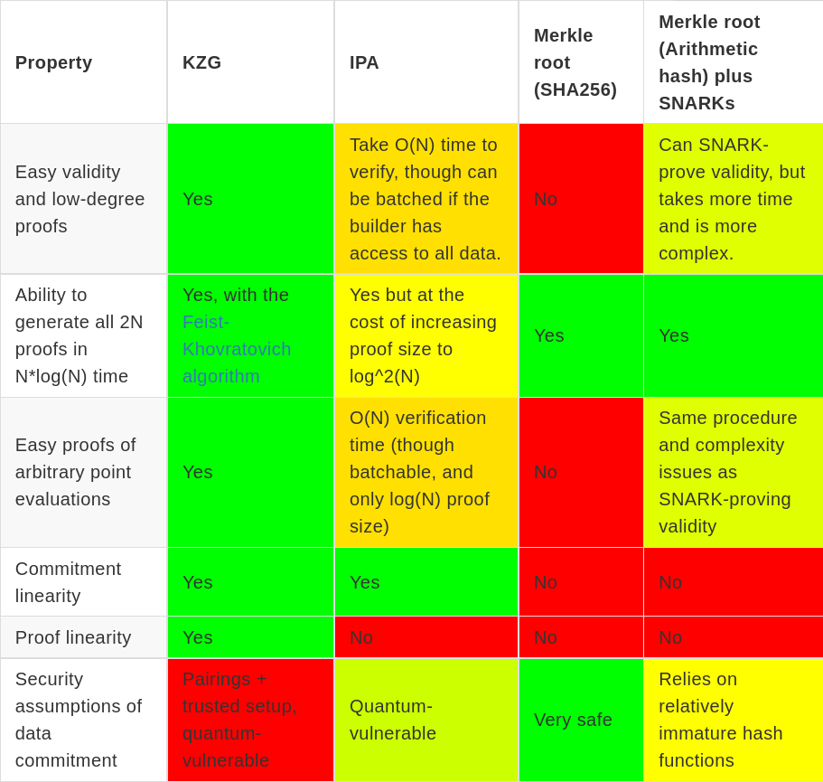
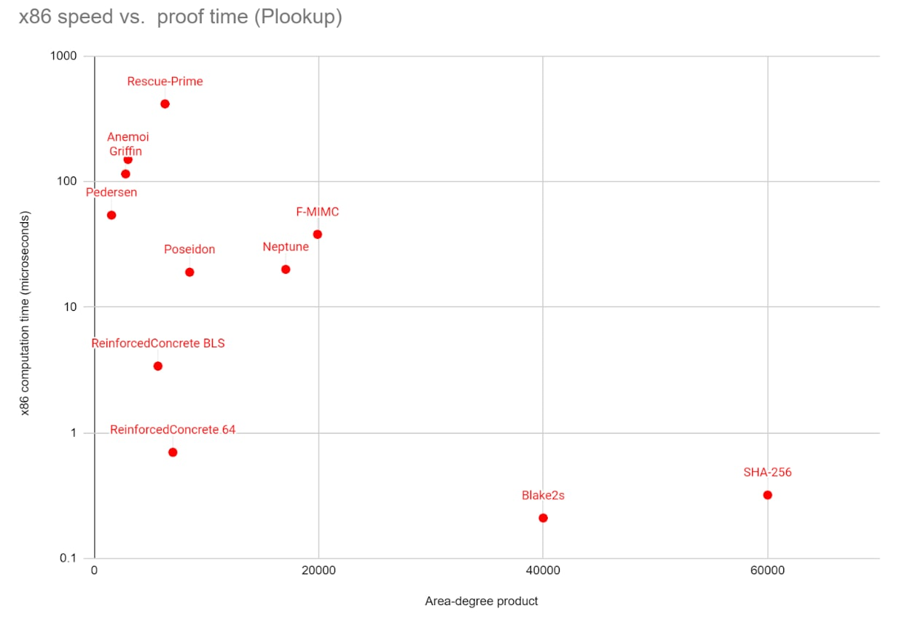

Currently, the proto-danksharding proposal (see [EIP-4844](https://eips.ethereum.org/EIPS/eip-4844), [FAQ](https://notes.ethereum.org/@vbuterin/proto_danksharding_faq)) uses [KZG commitments](https://dankradfeist.de/ethereum/2020/06/16/kate-polynomial-commitments.html) as its commitment scheme for blobs. This provides important benefits, but it also has two key downsides: (i) reliance on a [trusted setup](https://vitalik.ca/general/2022/03/14/trustedsetup.html) (though a "small" setup that's easy to scale to thousands of participants), and (ii) use of complex pairing-based cryptography parts of which are not yet implemented in clients. There are two realistic alternatives to KZG commitments: discrete-log-based IPA commitments (see description of how they work in [this post on Halo](https://vitalik.ca/general/2021/11/05/halo.html)), and Merkle roots based on arithmetic-friendly hash functions. This post focuses on the latter.

## Key properties provided by KZG commitments

KZG was chosen for EIP-4844 because it provides a set of properties that are very important to the goals of EIP-4844 and are difficult to achieve any other way. This includes the following:

* **Easy validity and low-degree proofs**: for [data availability sampling](https://www.paradigm.xyz/2022/08/das) purposes, we need to prove that a commitment is a valid commitment, and is committing to 2N values that are on the same degree < N polynomial. This ensures that any N of the values can be used to reconstruct the remaining N. Because KZG is a polynomial commitment, and the trusted setup length provides the maximum degree it can commit to, KZG provides this automatically.
* **Ability to generate all 2N proofs in `N*log(N)` time**. It should be possible for a prover that generates and commits to some polynomial $P$ to generate the proofs for all 2N openings of $P$ that reveal its evaluation at 2N positions, and do so quickly.
* **Easy proofs of arbitrary point evaluations**: given a commitment $P$ and _any_ arbitrary $x$ (including $x$ not in the original set of 2N coordinates we committed at), we want to be able to prove an evaluation of $P(x)$. This is useful to allow ZK rollups to [easily and forward-compatibly plug in to the scheme](https://notes.ethereum.org/@dankrad/kzg_commitments_in_proofs) and use it for their data.
* **Commitment linearity**: given $M$ commitments $C_1 ... C_m$ to data blobs $D_1 ... D_m$, it should be possible to generate an additional set of commitments $C_{m+1} ... C_{2m}$ to data blobs $D_{m+1} ... D_{2m}$, where each "column" $\{D_1(x_i), D_2(x_i) ... D_{2m}(x_i)\}$ is on the same degree < m polynomial. This is very valuable for two-dimensional DAS purposes, as it means that given half of a column we can reconstruct the other half.
* **Proof linearity**: given a column of proofs $\{P_{1,i} ... P_{2m,i}\}$ proving $\{D_1(x_i) ... D_{2m}(x_i)\}$ where we know at least half of the proofs, we want to be able to reconstruct the other half of the proofs. Note that this is challenging: we want to be able to reconstruct proofs _from other proofs_, without seeing the rest of the _data_ in the rows that the new proofs are corresponding to.

## Comparison of KZG and other commitment schemes

 

 

"Arithmetic hashes" here refers to hash functions that are designed to have a "simple" arithmetic representation, allowing us to SNARK-prover them with a prover that is simple, and has a low constraint count. The most established arithmetic hash function is **[Poseidon](https://eprint.iacr.org/2019/458.pdf)**.

## How practical is Poseidon?

### Concrete efficiency of hashing

A single round of 2 -> 1 Poseidon over a 256-bit field requires ~816 field multiplications, or about 20 microseconds. Merkle-hashing $n$ field elements requires $n-1$ hashes, so a 128 kB blob (8192 field elements, including the 2x redundancy) can be hashed in 160 ms. An average block would contain 8 blobs and a max-sized block 16 blobs; the hashes would take 1.28s and 2.56s to verify, respectively.

These numbers are not strictly speaking prohibitive, especially taking into account that clients would have received the blobs through the mempool anyway. But they are "on the edge" of being so. Hence, some optimization effort would be required to make this viable.

### Complexity of SNARKing

To prove that a Poseidon Merkle tree is constructed correctly, you need to do two things:

* Prove that a given root $R$ actually is the Merkle root of the given set of data.
* Prove that the $2N$ values it commits to are on the same $deg < N$ polynomial.

One way to interpret the Merkle root check is that if you create a vector $v$ where the leaves are at position $2N ... 4N-1$, and you ensure the equation $v(x) = hash(v(2x), v(2x+1))$ across $1 \le x < 2N$, then $v[1]$ is the root.

The easiest way to check the low-degree property is to choose a pseudorandom challenge value, interpret it as a coordinate, and use [barycentric evaluation](https://hackmd.io/@vbuterin/barycentric_evaluation) to check that an evaluation using the odd points and an evaluation using the even points lead to the same value. For simplicity, the Merkle root itself can be used as a challenge.

In terms of complexity, this is slightly more complex than the use of SNARKs in existing simple privacy solutions (which typically involve proving one Merkle branch and a few other calculations inside a proof), but it is vastly less complex than other likely future applications of SNARKs, particularly SNARKing the Ethereum consensus layer. It would still take longer to implement than anything KZG-related, however.

The cost of making a proof is dominated by the Merkle root check; the low-degree check is a tiny cost by comparison. If you can fit degree-5 constraints into your proof system, it implies roughly 64 * 8192 = 524288 constraints. In PLONK, this means about ten elliptic curve fast linear combinations of that size. This is doable on a fast machine, but it is considerably less accessible than a KZG commitment, which requires only a single size-4096 EC fast linear combination to commit to the same data. However, it is only a prover burden; the verifier's work is, as in KZG, constant-time.

### Readiness

The Poseidon hash function [was officially introduced](https://eprint.iacr.org/2019/458.pdf) in 2019. Since then it has seen considerable [attempts](https://hal.inria.fr/hal-02883253/document) at [cryptanalysis](https://link.springer.com/article/10.1007/s10559-021-00352-y) and [optimization](https://www.zprize.io/prizes/accelerating-the-poseidon-hash-function). However, it is still very young compared to popular "traditional" hash functions (eg. SHA256 and Keccak), and its general approach of accepting a high level of algebraic structure to minimize constraint count is relatively untested.

There are layer-2 systems live on the Ethereum network and other systems that already rely on these hashes for their security, and so far they have seen no bugs for this reason. Use of Poseidon in production is still somewhat "brave" compared to decades-old tried-and-tested hash functions, but this risk should be weighed against the risks of proposed alternatives (eg. pairings with trusted setups) and the risks associated with centralization that might come as a result of dependence on powerful provers that can prove SHA256.

### What about alternatives to Poseidon?

One natural alternative to Poseidon is [**Reinforced Concrete**](https://eprint.iacr.org/2021/1038), which is designed to be fast both for native execution and inside a prover. It works by combining Poseidon-like arithmetic layers with a non-arithmetic layer that quickly increases the arithmetic complexity of the function, making it robust against attacks that depend on algebraic analysis of the function, but which is designed to be fast to prove in bulk by using [PLOOKUP](https://eprint.iacr.org/2020/315.pdf) techniques.

Reinforced Concrete takes ~3 ms to compute compared to ~20 ms for Poseidon, and has similar ZK-proving time, reducing max proto-danksharding hashing time from ~2.56 s to ~400 ms. However, Reinforced Concrete is newer and even less tested than Poseidon.

## How does the complete danksharding rollout look like with KZG?

Danksharding based on KZG is split into two phases:

1. **[Proto-danksharding](https://notes.ethereum.org/@vbuterin/proto_danksharding_faq)**, a first phase where the data structures cryptography and scaffolding of danksharding are introduced, but no data is actually "sharded"
2. **Full danksharding**, which introduces data availability sampling to allow clients to sample for data easily

The intent is for the upgrade from proto-danksharding to full-danksharding to require minimal consensus changes. Instead, most of the work would be done by clients individually moving over to data availability sampling validation on their own schedule, with some of the network moving over before the rest. Indeed, the KZG danksharding strategy accomplishes this well: the only difference between proto-danksharding and full danksharding is that in proto-danksharding, the blob data is in a "sidecar" object passed around the p2p network and downloaded by all nodes, whereas in full danksharding, nodes verify the existence of the sidecar with data availability sampling.

Rollups work as follows. If a rollup wants to publish data $D$, then it publishes a blob transaction where $D$ is the blob contents, and it also makes a ZK-SNARK in which the data $D$ is committed to separately as a private input. The rollup then uses a [proof-of-equivalence scheme](https://notes.ethereum.org/@dankrad/kzg_commitments_in_proofs) to prove that the $D$ committed in the proof and the $D$ committed in the blob are the same. This proof of equivalence scheme interacts with the data commitment only by checking a single point evaluation proof at a Fiat-Shamir challenge coordinate, which is done by calling the **point evaluation precompile**, which verifies that $D(x) = y$ given the commitment $com(D)$, $x$, $y$ and a proof.

This proof of equivalence scheme has some neat properties:

* It does not require the ZK-SNARK's own cryptography to "understand" KZG, compute elliptic curve operations or pairings, or do anything KZG-specific inside the circuit
* The point evaluation logic used for the proof-of-equivalence techique is fully "black boxed", allowing the data commitment scheme to be upgraded at any time if needed. Rollups would not have to make _any_ changes to their logic after they are released, even if the Ethereum consensus layer changes drastically underneath them.

## How does the complete danksharding rollout look like with Poseidon Merkle trees?

To roll out the equivalent of proto-danksharding, we would not need to create a ZK-SNARK to check the correctness of blobs. Simply reusing the current proto-danksharding scheme, where blob data from the sidecar object is checked directly by the nodes to make sure the degree bound is respected and the root matches the root in the block headers, is sufficient. Hence, we could delay the implementation and full rollout of the proof of correctness until full danksharding is released.

But this approach faces a big challenge: **the proof of equivalence scheme used in the current danksharding rollout also requires SNARKs**. Hence, we would have to either bite the bullet and implement a SNARK, or use a different strategy based on Merkle branches.

For optimistic rollups, Merkle branches are sufficient, because fraud proofs only require revealing a single leaf within the data, and a simple Merkle branch verification would suffice for this. This could be implemented forward-compatibly as a point evaluation precompile that would at first be restricted to verifying proofs at coordinates that are inside the evaluation set.

For ZK rollups, this is not sufficient. There are two alternatives:

* **ZK rollups roll their own circuits for doing point evaluations** inside blobs, or simply importing the root into their circuit as a public input, the leaves as a private input, and checking the root in the proof directly.
* **Limit point evaluation to roots that are included within the same block**, and have clients evaluate challenges on the data directly. A challenge evaluation is only a size-4096 linear combination, which is cheaper than a pairing evaluation.

Combining these two, a hybrid proposal might be to have a point evaluation precompile that only verifies outputs in two cases:

1. The coordinate is within the evaluation set, and the proof provided is a Merkle branch to the appropriate leaf
2. The root is included in the current block, so the client can run the evaluation directly

Optimistic and ZK rollups could either fit into using one of these two approaches, or "roll their own" technology and accept the need to manually upgrade if the commitment scheme ever changes. The precompile would be expanded to being fully generic as soon as some SNARK-based scheme is ready.

## Issues with aggregate or recursive proofs

Once full danksharding is introduced, we get an additional issue: we would want to use STARKs to avoid trusted setups, and **STARKs are big - too big to have many proofs in one block, so we have to prove every point evaluation claim that we want to prove in one STARK**.

This could be done in two ways: a combined proof that directly proves all evaluations, or a recursive STARK. Recursive STARKs are fortunately not too difficult, because STARKs use only one modulus and this avoid needing mismatched field arithmetic. However, either approach introduces one piece of complexity that does not work nicely with the point evaluation precompile in EIP-4844 in its current form: **a list of claims and a combined proof would need to be held outside the EVM**.

In the current implementation of EIP-4844, the point evaluation precompile expects a $(root, x, y, proof)$ tuple to be provided directly, and it immediately verifies the proof. This means that in a block with N point evaluations, N proofs need to be provided separately. This is acceptable for tiny KZG proofs, but is not acceptable for STARKs.

In a STARK paradigm, the proof mechanism would need to work differently: the block would contain an extra "point evaluation claims" structure that consists of a list of $(root_i, x_i, y_i)$ claims and a combined or recursive STARK that verifies the whole list of claims. The point evaluation precompile (perhaps making it be an opcode would be more appropriate as it's no longer a pure function) would then check for the presence of the claim being made in the list of claims in the block.

_Addendum 2022.10.26: technically we don't need a STARK for point evaluations; because we already have a STARK proving correctness of an erasure coded Merkle root, we could point-evaluate directly use FRI. This is much cheaper to generate proofs, and much simpler code in the verifier, though it unfortunately doesn't make the proofs significantly smaller, so merged verification would still be required._

## How would data availability sampling, distributed reconstruction, etc work with Poseidon roots where we lack commitment and proof linearity?

There are two approaches here:

1. **Give up 2D data availability sampling**. Instead, accept that sampling will be one-dimensional. A sample would consists of a 256 byte chunk from each blob at the same index, plus a 320 byte Merkle proof for each blob. This would mean that the DAS procedure requires significantly more data: at a $p = 1 - 2^{-20}$ confidence level, with full dank sharding (target 16 MB = 128 blobs), this would require downloading 20 samples of 128 blobs with 576 bytes per sample per blob: 1.47 MB total. This could be reduced to 400 kB by increasing the blob size to 512 kB and reducing the blob count by 4x. This keeps things simple, but reduces the data efficiency gains of DAS to a mere ~40x.
2. **Require the block builder to generate extra roots, and prove equivalence**. Particularly, the block builder would "fill in the columns", providing the roots for data blobs $\{D_{m+1} ... D_{2m}\}$, also provide the _column roots_ $\{S_1 ... S_{2n}\}$ where $S_i$ commits to $\{D_1(x_i) ... D_{2m}(x_i)\}$. This allows 2D data availability sampling and independent recovery. They would then add a proof that this data is all constructed correctly.

In case (2), the proof could be a single large SNARK, but there is also a cheap way to build it with existing ingredients:

* Choose a random challenge coordinate pair $(x, y)$
* Also provide $R_y$ that commits to $D_y$, where $D_y(x_i)$ is the evaluation at $y$ of the polynomial that evaluates to $\{D_1(x_i) ... D_{2m}(x_i)\}$ at the points $\{0 ... \omega^{2m-1}\}$ where $\omega$ is an order-$2m$ root of unity
* Similarly provide $R_x$ that commits to $D_x$, where $D_x(y_i)$ is the evaluation at $x$ of the polynomial that evaluates to $\{T_1(y_i) ... T_{2n}(y_i)\}$ where $T_i$ is the data committed to by $S_i$
* Provide an evaluation proof of $D_y(x)$ and $D_x(y)$, verify that they are identical
* Also provide evaluation proofs of all $D_y(x_i)$ and $D_x(y_i)$, and verify that they are on polynomials of the appropriate degree

The main weakness of this approach is that it makes it much harder to implement a **[distributed builder](https://joncharbonneau.substack.com/p/decentralizing-the-builder-role)**: it would not require a fairly involved multi-step protocol. This could be compensated for by requiring all data blobs to be pre-registered early in the slot (eg. in the proposer's inclusion list), giving ample time for a distributed builder algorithm to construct the proofs and avoiding a large advantage to centralized builders.

## Why not just do EIP-4488 now and "proper" danksharding later?

[EIP-4488](https://eips.ethereum.org/EIPS/eip-4488) is an EIP that introduces a limited form of multi-dimensional fee market for existing calldata. This allows the calldata of existing Ethereum blocks to be used as data for rollups, avoiding the complexity of adding new cryptography and data structures now. This has several important weaknesses:

1. **Proto-danksharding blob data can be easily pruned, calldata cannot**. The fact that blob data in proto-danksharding is in a separate sidecar makes it easy to allow nodes to stop storing blob data much sooner than the rest of the block (eg. they could store blobs for 30 days, and other data for 365 days). EIP-4488 would require us to either constrict the storage period of _all_ block data, or accept that nodes would have a significantly higher level of disk storage requirements.
2. **Proto-danksharding gets the big consensus-altering changes over with soon, EIP-4488 does not**. It will likely continue getting harder to make a consensus-altering change with every passing year. Proto-danksharding, by getting these changes over with quickly, sets us on a path to future success with full danksharding, even if protocol changes become extremely hard soon. EIP-4488 now sets us up for needing to be ready to make large changes a long time into the future, and risks causing scaling to stagnate.
3. **Proto-danksharding allows rollups to ossify earlier**. With proto-danksharding, rollups can freeze their logic in place sooner, and be confident that they will not need to update any on-chain contracts even as underlying technology changes. EIP-4488 leaves the difficult changes until potentially many years in the future.

## Why not SHA256-based Merkle trees now and switch to arithmetic-friendly hashes later?

A possible alternative is to implement SHA256-based Merkle trees in proto-danksharding, and then switch to arithmetic Merkle trees later when SNARKs become available. Unfortunately, this option combines many disadvantages frm both:

* It suffers from weakness (2) from the previous section
* It also suffers from weakness (3) if rollups take the route of rolling their own verification logic
* It still inherits the complexity of being a proto-danksharding implementation

It's the only idea of all ideas explored here that requires a large consensus-layer change, with all the transition complexity involved in properly architecting it both at consensus layer and at the application layer, _twice_.

## If we do KZG now, can we upgrade to something trusted-setup-free later?

Yes! The natural candidate to upgrade to in that case would be STARKs, as they are trusted-setup-free, future-proof (quantum-resistant) and have favorable properties in terms of branch sizes. The point evaluation precompile could be seamlessly upgraded to accept both kinds of proofs, and correctly-implemented rollups that interact with blobs only through the precompile would seamlessly continue working with the new commitment type.

More precisely, the precompile would have logic that would verify a KZG proof if a KZG proof and KZG root are given as inputs, and if a hash root and an empty proof are given as inputs, it would check for membership in the block's evaluation claims list as described in [the section above](#issues-with-aggregate-or-recursive-proofs-10).

One important issue is that an upgrade to STARKs will likely involve changing the modulus, potentially radically. Some of the best STARK protocols today use hashes over a 64-bit prime, because it speeds up STARK generation and it allows arithmetic hashes to be computed extremely quickly (see: [Poseidon in 1.3 μs](https://github.com/mir-protocol/plonky2/pull/536#issue-1206061515)).

Ensuring forward compatibility with modulus changes today requires:

1. An opcode or precompile that returns the field modulus of a given root.
2. ZK rollup circuits doing equivalence checks being able to handle different moduluses, and load data from the blob polynomial differently if the modulus (and therefore the bits-per-evaluation) is much greater or much smaller.

If, for "purity" reasons, it's desired to convert the point evaluation precompile into an opcode (as it would not be a pure function, since it would depend on other data in the block), this could be done by introducing the opcode, and replacing the precompile in-place with a piece of EVM code that calls that opcode.