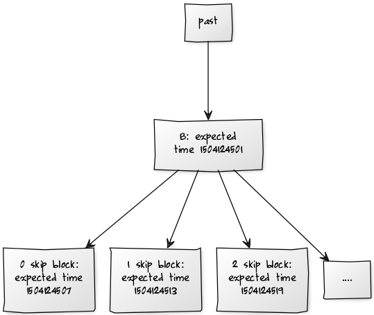
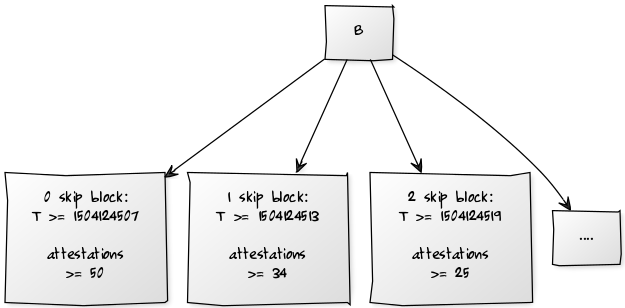

**Status: not a new idea but discussed before, but deserves its own post for reference and to assist with understanding. The last section is original.**

Suppose that you have a PoS chain, where there is some validator set V, and every block has an associated random beacon state R. If `block.parent.random_beacon = R`, then `block.random_beacon = F(R, block)` for some deterministic `F` which outputs 32 bytes; there may be (in fact, definitely should be!)( constraints on the values put into the block that are factored into F. 

The simplest way to use this to build a PoS chain is that for every block, you can use V and R to calculate an infinite sequence of potential signers for children of this block: `skip0_signer(V, R)`, `skip1_signer(V, R)`.....

Any of these blocks is valid, but blocks can only be accepted by a client once that client's clock time exceeds the block's expected time, where expected time is calculated by `GENESIS_TIME + k1 * height + k2 * total_skips_since_genesis`; hence, blocks with earlier skip counts can always be accepted earlier. It may be reasonable to set `k1 = k2`, but not necessary.

### Adding attestation committees

We can improve the stability of this design by requiring every block to also be attested by a committee: to build a block with parent B, one must first gather signatures from, say, at least 1/2 of a set of M validators, which is itself pseudorandomly sampled from V based on the value of R. This makes forking less likely, as it means that a relatively large number of validators need to collude to make a fork.

[yuml]

[B] -> [attester 1]
[B] -> [attester 2]
[B] -> [attester 3]
[B] -> [attester 4]
[B] -> [attester 5]
[attester 1] -> [B']
[attester 2] -> [B']
[attester 3] -> [B']
[attester 4] -> [B']
[attester 5] -> [B']
[B'] -> [attester 1 ]
[B'] -> [attester 2 ]
[B'] -> [attester 3 ]
[B'] -> [attester 4 ]
[B'] -> [attester 5 ]
[attester 1 ] -> [B'']
[attester 2 ] -> [B'']
[attester 3 ] -> [B'']
[attester 4 ] -> [B'']
[attester 5 ] -> [B'']
[/yuml]

However, this design by itself loses liveness: if less than ~1/2 of nodes are online, then almost no block will be successfully attested to and the chain will halt. We can fix this problem by making the attestation committee have a variable size: for a block created by the k-skip signer, we require the attestation of the parent to contain at least `M / (2 + * k)` signatures. This means that the 0-skip block must contain at least a 1/2 committee, but blocks with skips can make do with smaller committees.

Notice that if portion `p` of nodes is online, then it will on average take ~1/(p-2) skips before the online nodes will be enough to form a sufficiently sized committee each round, and then after that point each individual signer has a probability of `p` of being online, so the chain will progress at a rate of 1 height per ~2.5p rounds. This is comparable to the ~1/p progress of a simple chain.

### Attack analysis

Suppose that parameters are set as above, and an attacker has less than 50% of the total stake. As M approaches infinity, this means that on both the canonical chain and a hypothetical attacking chain, in the best case, where an attacker has at least 33%, a 1-skip or height block will always succeed, but a 0-skip block will only succeed on the canonical chain. The average inter-block delay on the canonical chain, with `p > 0.5` support, will be:

    k1 + k2 * (1-p) + k2 * (1-p)² + k2 * (1-p)³ + .....

On the attack chain, it will be:

    k1 + k2 + k2 * p + k2 * p² + .....

It is clear that the latter expression is greater, and so the attacker's chain will grow more slowly than the canonical chain.

Note that the above assumes that which validator goes in which "slot" is set in stone. If it is modifiable, then more complex analysis is required; that said, the attestation requirement is clearly an improvement because it penalizes the rate of growth of chains that have less than 50% of validators supporting them, by a factor of ~1/4. Note also that a chain with p=0.500001 with average luck will on average create a block in `k1 +  k2 - ε` seconds, and a chain with p=0.499999 with hypothetical "perfect luck" will on average create a block in `k1 +  k2 + ε` seconds, so the disparity is large enough to overcome all [path search attacks](https://ethresear.ch/t/randao-beacon-exploitability-analysis-round-2/1980).

### Adding short-range "something at stake" without micro-penalties

The next question is: how do we solve the nothing-at-stake problem in the short range? The simplest fix is to have penalties for creating or attesting to an offchain block: if you were to be rewarded R for creating or attesting to a block that becomes part of the canonical chain, you get penalized R for creating or attesting to a block that does not become part of the canonical chain. This replicates the incentives of PoW, where mining an offchain block is implicitly penalized because the miner needs to consume CPU resources to create the block but is not rewarded for it.

But with large attester committees this creates a lot of overhead processing frequent penalties, and we could do better by removing the need for small penalties entirely, instead relying on slashing conditions to prevent validators from attesting to absolutely everything under the sun. Suppose that the data used to select the attester set for a block comes not from that block's beacon value, but from that of _its parent_. Then, the various children to the same parent block will share the same attester set. We can then add a slashing condition heavily penalizing validators for attesting to two children of the same block, and thus attesting to one block has the implied cost that one can no longer also attest to its siblings, and so this creates a cost to attesting a potential challenger to the head of a chain. However, this does not extend to cousins and more distant relations.

We could extend this by making attester sets pre-selected far earlier. If hypothetically the validator set never changed and attester sets at each height were selected at genesis, then attesting to any one block would preclude the attester from attesting any other block at the same height, and so it would be risky to attest to any block that is not the head. However, pre-selecting attesters too early itself sacrifices flexibility and has its risks. One option is to re-select attester sets every time a block gets finalized; there is no value in signing messages on non-finalized chains as it is not possible for them to finalize in any case. Another hybrid route is to introduce some randomness, but only, for example, swap 1-10% of validators in the attester set every block based on that block's new entropy. This creates the effect that attesting to a block definitely precludes one from attesting to its siblings, probably precludes one from attesting to any specific close cousin, and makes it marginally less likely that one will be able to attest to a distant cousin (but there is also very very little value in attesting to blocks far away from the head, so large disincentives are not really needed to begin with).

--------------
[past] -> [B: expected time 1504124501]
[B: expected time 1504124501] -> [....]
[B: expected time 1504124501] -> [2 skip block: expected time 1504124519]
[B: expected time 1504124501] -> [1 skip block: expected time 1504124513]
[B: expected time 1504124501] -> [0 skip block: expected time 1504124507]
[img]
[B]
[B] -> [....]
[B] -> [2 skip block: T >= 1504124519; attestations >= 25]
[B] -> [1 skip block: T >= 1504124513; attestations >= 34]
[B] -> [0 skip block: T >= 1504124507; attestations >= 50]
[/yuml]