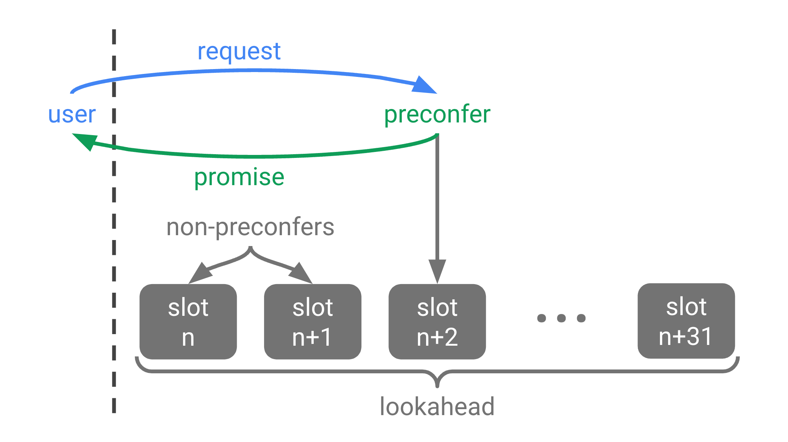

*Special thanks to Dan Robinson, Mike Neuder, Brecht Devos for detailed design discussions.*

**TLDR**: We show how [based rollups](https://ethresear.ch/t/based-rollups-superpowers-from-l1-sequencing/15016) (and based validiums) can offer users preconfirmations ("preconfs" for short) on transaction execution. Based preconfs offer a competitive user experience for based sequencing, with latencies on the order of 100ms.

**construction**

Based preconfs require two pieces of onchain infrastructure:

 * **proposer slashing**: A proposer must have the ability to opt in to additional slashing conditions. This write-up assumes slashing is achieved with EigenLayer-style restaking.
 * **proposer forced inclusions**: A proposer must have the ability to forcefully include transactions onchain, even with PBS when self-building is non-economical. This write-up assumes forced inclusions are achieved with [inclusion lists](https://ethresear.ch/t/no-free-lunch-a-new-inclusion-list-design/16389).

A L1 proposer may become a **preconfer** by opting in to two preconf slashing conditions described below. Preconfers issue signed **preconf promises** to users and get paid **preconf tips** by users for honouring promises.

Preconfers are given precedence over other preconfers based on their slot position in the proposer lookahead—higher precedence for smaller slot numbers.

A transaction with a preconf promise from the next preconfer can be immediately included and executed onchain by any proposer ahead of that preconfer. The preconfer is then expected to honour any remaining promises on their slot using the inclusion list.

There are two types of promise faults, both slashable:

 * **liveness faults**: A promise liveness fault occurs when the preconfer's slot was missed and the preconfed transaction was not previously included onchain.
 * **safety faults**: A promise safety fault occurs when the preconfer's slot was not missed and the promise is inconsistent with preconfed transactions included onchain.

Safety faults are fully slashable since honest preconfers should never trigger safety faults. The preconf liveness slashing amount, mutually agreed by the user and preconfer, can be priced based on the risk of an accidental liveness fault as well as the preconf tip amount.

Non-preconfed transactions included onchain by non-preconfers will not execute immediately. Instead, to give execution precedence to preconfed transactions over non-preconfed transactions, an execution queue for non-preconfed transactions is introduced. Non-preconfed transactions included onchain are queued until the first preconfer slot is not missed. At that point all transactions execute, with preconfed transactions executed prior to queued non-preconfed transactions.

**promise acquisition**

A user that wants their transaction preconfed should aim to acquire a promise from, at minimum, the next preconfer in the proposer lookahead. This process starts with the user sending a promise request to the next preconfer.

The offchain mechanisms by which users acquire promises are not dictated by the onchain preconf infrastructure. There is an open design space with several considerations relevant to any preconf infrastructure, not just based preconfs.

 * **endpoints**: Preconfers can publicly advertise point-to-point API endpoints to receive promise requests and return promises. At the cost of latency, p2p gossip channels can be used instead of point-to-point endpoints.
 * **latency**: When a point-to-point connection is used between a user and preconfer, preconf latencies can happen on the order of [100ms](https://wondernetwork.com/pings).
 * **bootstrapping**: Sufficient L1 validators must be preconfers to have at least one preconfer in the lookahead with high probability. The beacon chain has at least 32 proposers in the lookahead so if 20% of validators are preconfers there will be a preconfer with probability at least 1 - (1 - 20%)32 ≈ 99.92%.
 * **liveness fallback**: To achieve resilience against promise liveness faults a user can acquire promises in parallel from more than one of the next preconfers. If the first preconfer triggers a liveness fault a user can fallback to a promise from the second preconfer.
 * **parallelisation**: Different types of promises can have different preconf conditions. The strictest type of promise commits to the post-execution state root of the L2 chain, creating a sequential bottleneck for promise issuance. A weaker form of promise only commits to the execution state diff, unlocking parallel promise issuance across users. Even weaker intent-based promises (e.g. "this swap should receive at least X tokens") are possible. The weakest form of promise, which only commits to transaction inclusion by a preconfer slot, may be relevant for some simple transfers.
 * **replay protection**: To avoid replay attacks by preconfers such as sandwiching via transaction reordering, transaction validity is recommended to be tied to the preconf condition. This can be achieved with a new L2 transaction type, either with account abstraction or a native transaction type.
 * **SSLE**: Preconfer discovery in the lookahead remains possible with Single Secret Leader Election (SSLE). Indeed, preconfers can advertise (offchain and onchain) zero-knowledge proofs they are preconfers at their respective slots without revealing further information about their validator pubkey. Preconf relays intermediating users and preconfers can shield IP addresses on either side.
 * **delegated preconf**: If the bandwidth or computational overhead of issuing promises is too high for a L1 proposer (e.g. a home operator), preconf duties can be delegated (fully or partially) to a separate preconfer. The preconfer can trustlessly front collateral for promise safety faults. Liveness faults are the dual responsibility of the L1 proposer and the preconfer, and can be arbitrated by a preconf relay.
 * **fair exchange**: There is a fair exchange problem with promise requests and promises. Given a promise request, a preconfer may collect the preconf tip without sharing the promise to the user. A simple mitigation is for users to enforce that promises be made public (e.g. streamed in real time) before making new promise requests. This mitigation solves the fair exchange problem for all but the latest preconf promises. A relay mutually trusted by the user and the proposer can also solve the fair exchange problem. Finally, a [purely cryptographic tit-for-tat signature fair exchange protocol](https://eprint.iacr.org/2012/288.pdf) can be used.
 * **tip pricing**: We expect that for many transactions a fixed preconf gas price can be mutually agreed. Some transactions may have to pay a correspondingly larger tip to compensate for any reduction to the expected MEV the proposer could otherwise extract. For example, a DEX transaction preconfed several seconds before the preconfer's slot may reduce the expected arbitrage opportunity for the preconfer. Mutually trusted relays may help users and preconfers negotiate appropriate preconfirmation tips.
 * **negative tips**: Negative tips may be accepted by preconfers, e.g. for DEX transactions that move the onchain price away from the offchain price, thereby increasing the expected arbitrage opportunity for the preconfer.