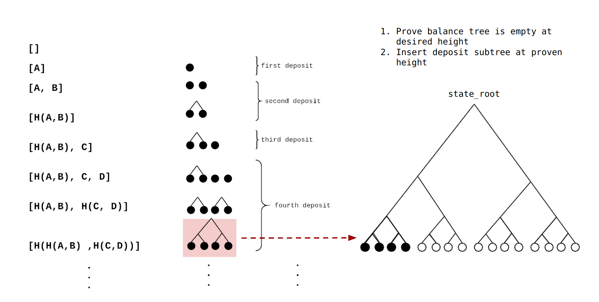

Thanks to John Adler for review and feedback.
Thanks to Ying Tong for feedback and providing images. 

# Intro 

In a bunch of different projects we need to allow the user to deposit from the EVM into some off-chain state which is represented on-chain as a Merkle accumulator (e.g. the root of a Merkle tree). This Merkle tree is updated by [validity proof](https://ethresear.ch/t/on-chain-scaling-to-potentially-500-tx-sec-through-mass-tx-validation/3477) (e.g. a SNARK) or a [fraud proof + synchrony assumption](https://ethresear.ch/t/minimal-viable-merged-consensus/5617).

SNARK-friendly hash functions are very expensive, so minimizing this cost is useful. In optimistic rollup world it is not as expensive, but having a cost for each deposit limits certain usecases, such as mass migrations.

To deposit from the EVM into a Merkle tree you need to perform `tree_depth` hashes in order to include a leaf. Even if there are two deposits in a block they both cost `tree_depth` hashes. It would be nice to merge these together so that they only cost `tree_depth` + 1 hashes.

These deposits are $O(n * \mathtt{tree\_depth})$. Here we propose a method of deposit batching that is $O(n + \mathtt{tree\_depth})$. In a companion post we apply these optimizations to mixers and optimistic rollups.

# Previous Work 

[Merkle Mountain Ranges](https://lists.linuxfoundation.org/pipermail/bitcoin-dev/2016-May/012715.html) are focused on creating Merkle trees whose depth grows over time. In this usecase we need to have a constant-depth tree as is fixed and cannot have variable number of hashes. In optimistic rollup this is not ideal either because as your tree depth grows the data that you are required to put on-chain changes.

Using this for deposits is problematic because peak bagging becomes rarer as the set gets bigger so deposits can become very rare. Which could lead to users waiting indefinitely for their funds to be deposited.

Another approach is [multiproofs](https://www.wealdtech.com/articles/understanding-sparse-merkle-multiproofs/). This cannot be used here because it requires coordinator between depositors. Given a deposit que that is constantly changing it is likely that the state will have changed before the coordinated update gets processed. 

# Method

## Deposit Queue Creation

If you ever played the [2048](https://hczhcz.github.io/2048/20ez/) you may have derived pleasure from merging two blocks of the same value together. We do this here but for Merkle trees.

We start with an empty deposit tree. When a deposit comes in we store that in the queue and wait. When the next deposit comes in the hash this and save this hash as our current deposit_tree with depth 1 with 2 pending deposits. We then can stop storing any data related to the first deposit.

When another deposit comes in we store it again. Then for the next deposit we hash it with the qued value and then hash the result with the deposit tree. To create our deposit tree with depth 2 with 4 pending deposits.

We have effectively merged deposits together.

## Insert deposit_tree into balance_tree

So at this point we have a deposit tree which is depth 2 with 4 pending deposits. We also have a balance_tree which contains some accounts that have previously been deposited and zeros everywhere else. We don't want to overwrite the accounts in the tree. Because this would destroy these users accounts. We only want to replace zeros.

In order to insert the new leaves into the balance tree we need to prove that:

1. That a node has all zeros children. We need to do this to prevent overwriting already-deposited accounts.

Lets take an example say that we have a node at with 2 children. We know that if the 2 children are 0 then the `node == hash(0,0)`.

But if the tree is really deep it might not be efficient to compute this hash in the EVM/SNARK. So instead pre-compute this list and deploy the smart contract with this stored as a mapping.

| Tables        | Are           |
| ------------- |:-------------:|
Layer 1 | hash(0,0)
Layer 2 | hash(hash(0,0), hash(0,0))
... | ...
Layer Tree_Depth | hash(hash(hash(...hash(0,0),))...)

Then whenever we want to check that a node has all zeros children we just look up this mapping.

So someone proves that the node is in the tree with a Merkle proof and then proves that it has all zero children by checking the stored mapping.

2. The new Merkle root has only the zero node changed with everything else the same.

We have previously proven a leaf has all zero children and now we want to change that leaf while keeping the rest of the tree the same.

Using the same Merkle path we calculate the root with the zero leaf replaced with the deposit_tree.

We then store this new Merkle root as the new balance tree which contains all the deposited leaves. Using the same Merkle path that we used to prove that the leaf was in the tree holds all other leaves constant and only allow us to update the children of the zero node.

# Note on syncronousity

Some systems like zksnarks/optimistic rollup require proving time before the deposit can be executed. If the deposit_tree changes while this is happening the proof could be invalidated. So it would be good to have a method to pause updates to a certain deposit tree while it is being deposited.

# Summary 

Here we have proposed a method of merging deposits. We que deposits in the EVM and them merge them when they are deposited into the bigger merkle tree.

 In a follow up post we will apply this to mixer deposits and optimistic rollup deposits / mass migrations.