# Bid cancellations considered harmful[*](https://homepages.cwi.nl/~storm/teaching/reader/Dijkstra68.pdf)

*[mike neuder](https://twitter.com/mikeneuder) & [thomas thiery](https://twitter.com/soispoke) in collaboration with [chris hager](https://twitter.com/metachris) – May 5, 2023*

> tl;dr; Under the current implementation of `mev-boost` block auctions, builders can cancel bids by submitting a later bid with a lower value. While relays facilitate bid cancellations, they cannot guarantee their effectiveness because proposers can end the auction at any given time by asking the relay for the highest bid. In this post, we explore the usage and implications of bid cancellations. We present the case that they are harmful because they (i) incentivize validators to behave dishonestly, (ii) increase the “gameability” of the auction, (iii) waste relay resources, and (iv) are incompatible with current enshrined-PBS designs.

*Thanks to [Barnabé](https://twitter.com/barnabemonnot), [Julian](https://twitter.com/_julianma), and Jolene for the helpful comments on the draft! Additional thanks to [Xin](https://twitter.com/sxysun1), [Davide](https://twitter.com/DavideCrapis), [Francesco](https://twitter.com/fradamt), [Justin](https://twitter.com/drakefjustin), the Flashbots team, relay operators, and block builders for discussions around cancellations.*

## Block proposals using `mev-boost`
Ethereum validators run [`mev-boost`](https://github.com/flashbots/mev-boost-relay) to interact with the external block-building market. Builders submit blocks and their associated [bids](https://github.com/attestantio/go-builder-client/blob/fe1a8d4e7677d47e00e8fe61a752548e45585498/api/v1/bidtrace.go#L20) to relays in hopes of winning the opportunity to produce the next block. The relay executes a first-price auction based on the builders' submissions and provides the proposer with the header associated with the highest-paying bid. The figure below shows the flow of messages between the proposer, the relay, and the p2p layer. 

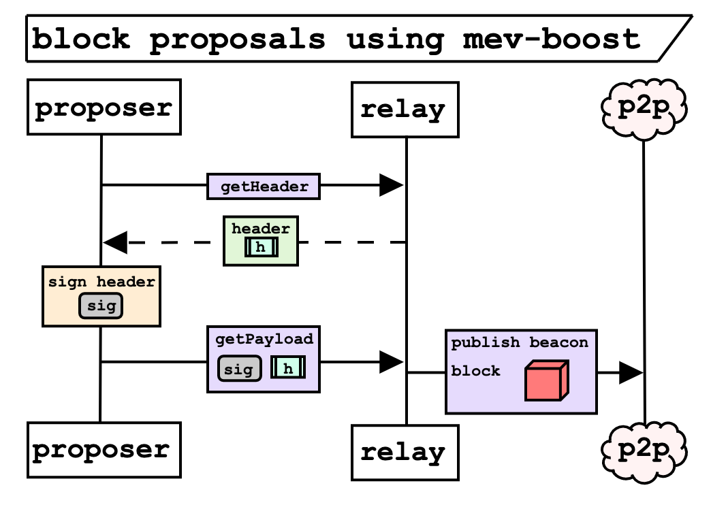

> *__Figure 1.__ Builders compete to have the highest bid by the time the proposer calls `getHeader`, which fetches an [`ExecutionPayloadHeader`](https://github.com/ethereum/consensus-specs/blob/b617c62e8d1a7f2ebf6985ba94a485c85df76a5d/specs/capella/beacon-chain.md#executionpayloadheader) from the relay. The relay returns the header corresponding to the highest-paying bid among the builders' submissions. The proposer then signs the header and returns it to the relay by calling `getPayload`, which causes the relay to publish the block to the p2p network.*

Let `n` denote the proposer's slot. The block auction mostly takes place during slot `n-1`. The figure below shows an example auction with hypothetical timestamps where `t=0` represents the beginning of slot `n`. 

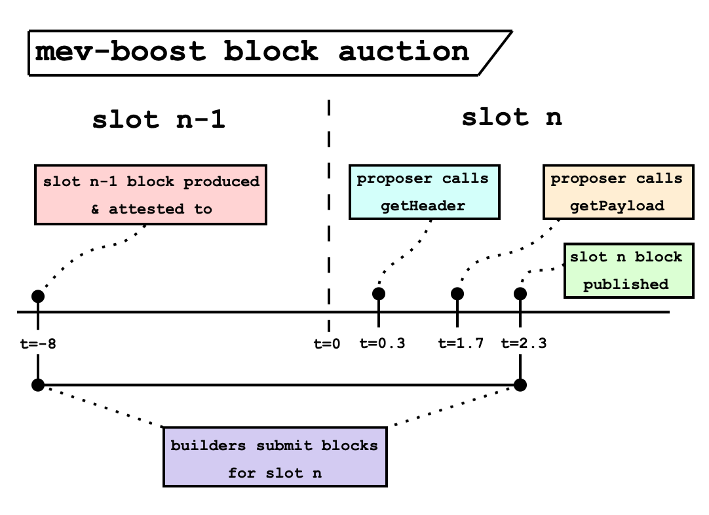

> *__Figure 2.__ An example timeline of the auction for slot `n`. At `t=-8` (the attestation deadline of slot `n-1` – see [Time, slots, and the ordering of events in Ethereum Proof-of-Stake](https://website-git-feat-mev-consensus-paradigm-operations.vercel.app/2023/04/mev-boost-ethereum-consensus)), a canonical block will generally be observed by the network. Builders immediately begin building blocks for slot `n`, and compete by submitting bids relative to the extractable value from transactions. The proposer calls `getHeader` at `t=0.3`, right after the slot boundary. Note that the auction is effectively over at this point, but neither the builders nor the relay know because `getHeader` doesn't check the identity of the caller. After signing the header, the proposer initiates a `getPayload` request to the relay at `t=1.7`. Once the signature is verified, the relay knows the auction is over, and stops accepting bids for slot `n`. At `t=2.3`, the relay beacon nodes publish the new beacon block, and the builders immediately begin building for slot `n+1`. Units are displayed in seconds.*

During the auction, new MEV-producing transactions are created. Builders compete by using these new transactions to construct higher-paying blocks thereby increasing the value of their bids; the winning bid typically arrives very near to or right after the start of slot `n`. In Figure 3, we show increasing bids being submitted by builders and collected by the relay over the duration of a single slot. 

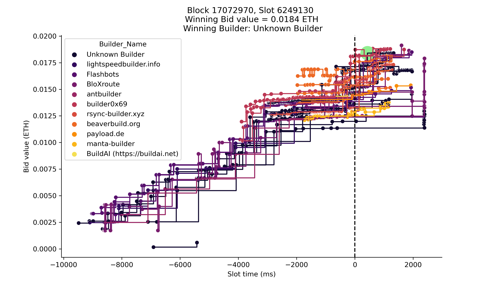

> *__Figure 3.__ The value of builder bids as time passes. The green circle denotes the winning bid for this slot. A majority of builder bids arrive around `t=0`, which marks the beginning of the proposer’s slot. Bids generally increase as time passes, because new MEV opportunities arise.*

> NOTE: builder bid data is public via the `Data API` as specified in the [relay spec](https://flashbots.github.io/relay-specs/#/Data/getReceivedBids).

## Bid cancellations
A lesser-known feature in the relay architecture allows builders to decrease the value of their bid by submitting a subsequent bid with a lower value (and the [`cancellations argument`](https://github.com/flashbots/mev-boost-relay/blob/9338ce3d897ff1a5b2d9f5a2b0ba0a52c420f398/services/api/service.go#L1182) in the request). The cancelling bid has to arrive at the relay *later* then the cancelled bid; the relay only tracks the latest bid received from each builder pubkey. The cancellation property is applied to the incoming bid, and the relay determines what to do with this bid according to the [following logic](https://github.com/flashbots/mev-boost-relay/pull/379):
> 1. if the bid is higher than the existing bid from that builder, update the builder’s bid
> 2. if the bid is lower than the existing bid from that builder
>    * if cancellations are enabled, update the builder’s bid
>    * if cancellations are not enabled, do not update the builder’s bid

> For example, consider a builder who currently has a bid of `0.1 ETH`. If they submit a bid with `0.2 ETH`, that bid will become the builder’s bid no matter what. If they submit a bid with `0.05 ETH`, it will become the builder’s bid only if cancellations are enabled. 
 
Builder cancellations are used to provisionally allow searchers to cancel bundles sent to builders. One of the prominent use cases for searcher cancellations is CEX <-> DEX arbitrage, where the bundles are non-atomic with on-chain transactions. Centralized exchanges typically have ticker data and price updates on a much higher frequency than the 12 second slot duration. Thus a CEX<->DEX arb opportunity that is available at the beginning of the slot might not be available by the end and searchers would like to cancel the bundle to avoid a non-profitable trade. If we decide to keep cancellations, further research around the searcher cancellation strategies should be done.

## Cancellations impacting the outcome of the auction
Effective cancellations change the outcome of the auction. Given a winning bid, we define a bid as an *effective cancellation* if (a) its value is larger than the winning bid, and (b) it was eligible in the auction before the winning bid.

> We need (b) because the relay cannot always know when the proposer called `getHeader`. From the winning bid, we know the `getHeader` call came after that bid became eligible (otherwise it wouldn't have won the auction), thus any bids that were eligible *before* the winning bid must also have arrived before `getHeader`.

This subset of bids is relevant as each could have won the auction had cancellations not been allowed. We found that effective cancellations are quite common; from a sample of data from [ultra sound relay](http://relay.ultrasound.money) over a 24-hour period on April 27-28th (slot `6316941` to `6324141`), `269/2846 (9.5%)` of the slots relayed had at least 1 effective cancellation. Similarly, a sample from [Flashbots' relay](https://boost-relay.flashbots.net/) over the same time showed `256/2110 (12.1%)` slots with effective cancellations. Figure 3 shows that most cancellations are submitted around `t=0` (`median = -510 ms`), as well as the distributions of  cancellation bid values (`median = 0.07 ETH`), and the percentage of cancellation value increase relative to winning bids (`median = 0.97%`). 

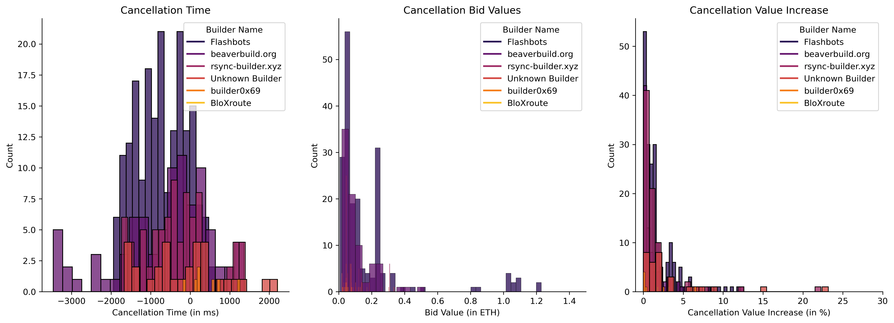

> *__Figure 4.__ (left) The distribution of cancellation times for various builders, where 0 denotes the beginning of slot n. (middle) The distribution of the value of the canceled bids. (right) The percentage increase of canceled bids. For example, a value of 10% means the canceled bid was 10% larger than the bid that replaced it.*

## Why are bid cancellations considered harmful?
We highlight four issues:
1. cancellations are not incentive compatible for validators
2. cancellations increase the “gameability” of the block auction
3. cancellations are wasteful of relay resources 
4. cancellations are not compatible with existing enshrined-PBS designs

### Cancellations and validator behavior
Validators control when they call `getHeader` and thus can effectively end the auction at any arbitrary time. The honest behavior as implemented in `mev-boost` is to call `getHeader` a single time at the beginning of the proposer's slot (`t=0`).

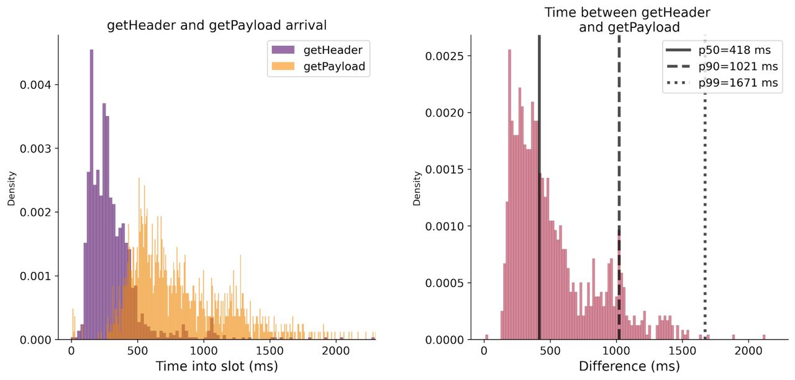

> *__Figure 5.__ (left) The distribution of timings for `getHeader` and `getPayload` from a sample of blocks from `ultra sound relay`. (right) The distribution of the difference between the call timestamps. This represents the time it takes for the proposer to sign and return the header.*

We collected this data by matching the IP address of the `getPayload` and `getHeader` calls, which limits the sample to proposers who make the call from the same IP address. The vast majority of `getHeader` calls arrive right after the slot begins (at `t=0`). However, with cancellations, rational validators are incentivized to call `getHeader` multiple times, and only sign the header of the highest bid that they received. This is demonstrated in the example below.

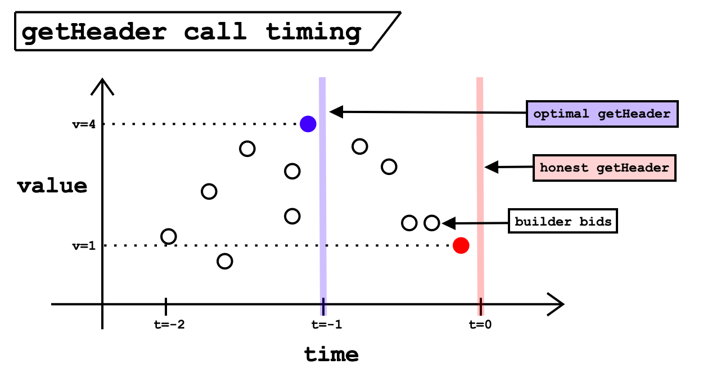

> *__Figure 6.__ Honest vs optimal validator behavior for calling `getHeader`. Each circle represents a builder bid, where the builder has cancellations enabled. If the validator behaves honestly and calls `getHeader` at `t=0`, the relay will return the latest builder bid, which has a value `v=1` (in red). However, if the proposer calls `getHeader` at `t=-1` (one second before their slot begins), they will receive a higher bid with a value `v=4` (in blue).* 

Validators can effectively remove cancellations by calling `getHeader` repeatedly, and only signing the highest response. Furthermore, there exists an incentive for them to do this because it can only increase the bid value of the header they end up signing.

### Cancellations increase the “gameability” of the auction 
By allowing builders to cancel bids, the action space in the auction increases dramatically. We focus on two strategies enabled through cancellations (though there are likely many more!):
1. *bid erosion* – where a winning builder reduces their bid near the end of the slot.
2. *bid shielding* – where a builder "hides" the true value of the highest bid with an artificially high bid that they know they will cancel.

#### Bid erosion
This strategy is quite simple: if the builder knows that they have the highest bid on the relay, they can simply reduce the value of the bid gradually so long as they maintain a lead over the other bids, thus increasing their profits as a direct consequence of paying less to the proposer. Another heuristic of bid erosion is the winning-builder bids decreasing in value as other builders bids continue increasing in value. Figure 7 shows this strategy playing out.

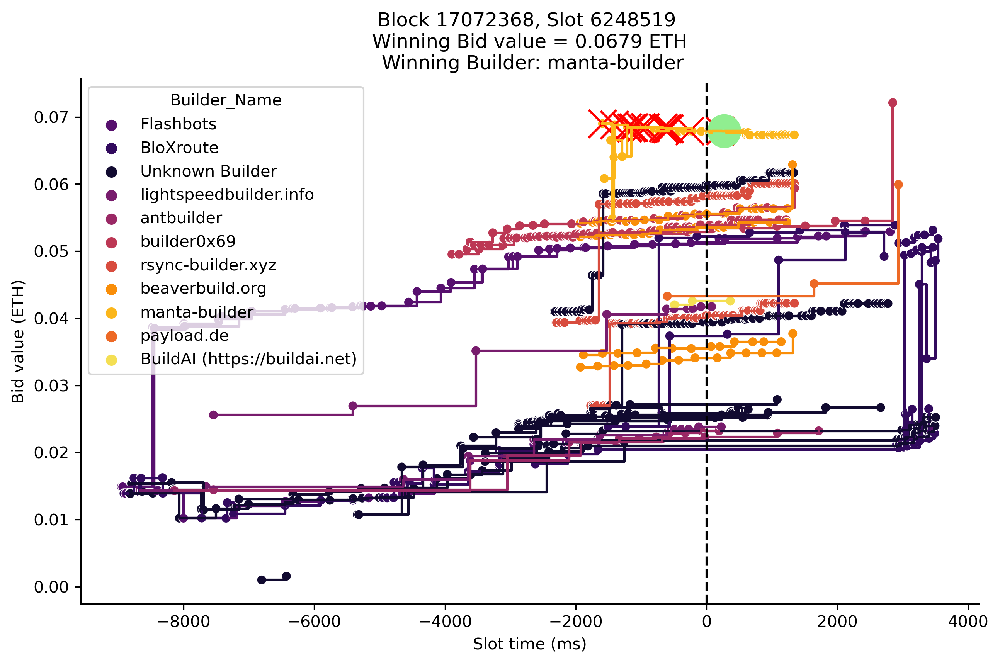 | 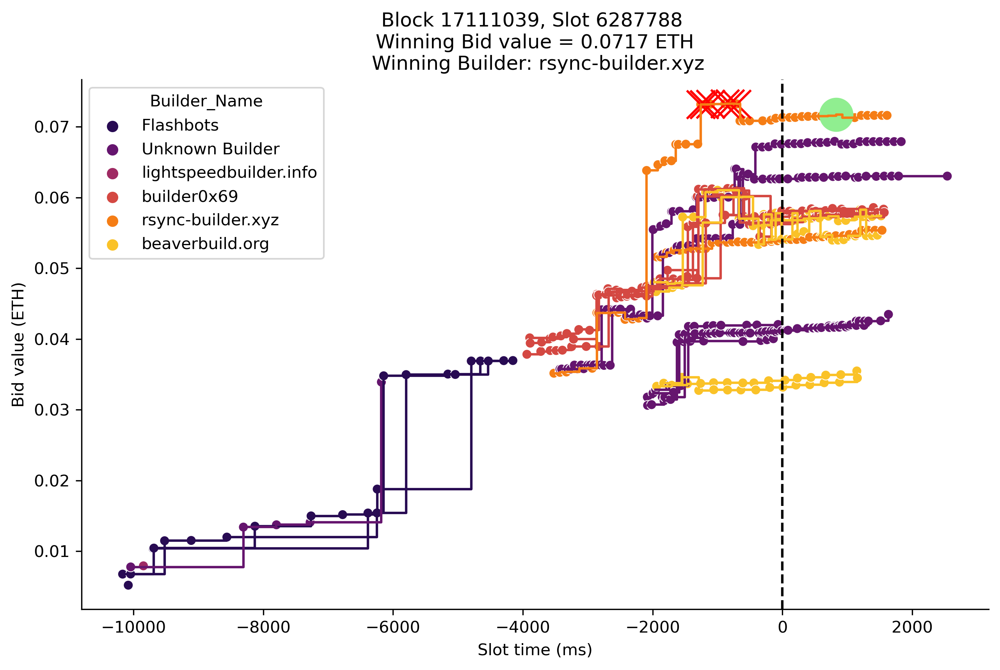

> *__Figure 7.__ In both plots, the green circle represents the winning bid and the red x’s are effective cancellations. (left) We see that the winning builder continually reduces their bid, but still wins the auction. (right) The builder submits a set of high bids and quickly erodes it down to a reduced value.*

#### Bid shielding
As described in [Undesirable and Fraudulent Behaviour in Online Auctions](https://citeseerx.ist.psu.edu/document?repid=rep1&type=pdf&doi=2edb2a1079546c18a12f2c3222d6b813c36235c7), a bid shielding strategy places an artificially high bid to obfuscate the true value of the auction, only to cancel the bid before the auction concludes. Applied to the block auction, a builder can hide the true value for a slot by posting a high bid and canceling it before the proposer calls `getHeader`. This strategy takes on some risk because it is possible that the builder must pay out the high bid if it wins the auction, but cancelling the bid a few seconds before the start of the slot makes the strategy quite safe. Additionally, this strategy could be used to grief other builders who have an advantage during a slot into bidding higher than they would have if the shielding bid was not present. 

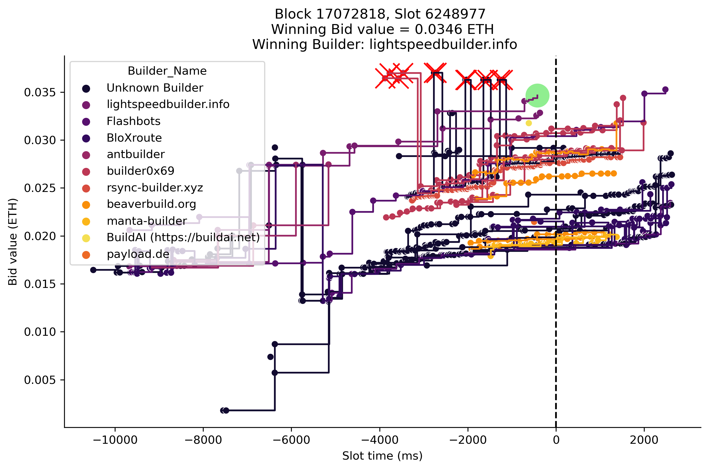 | 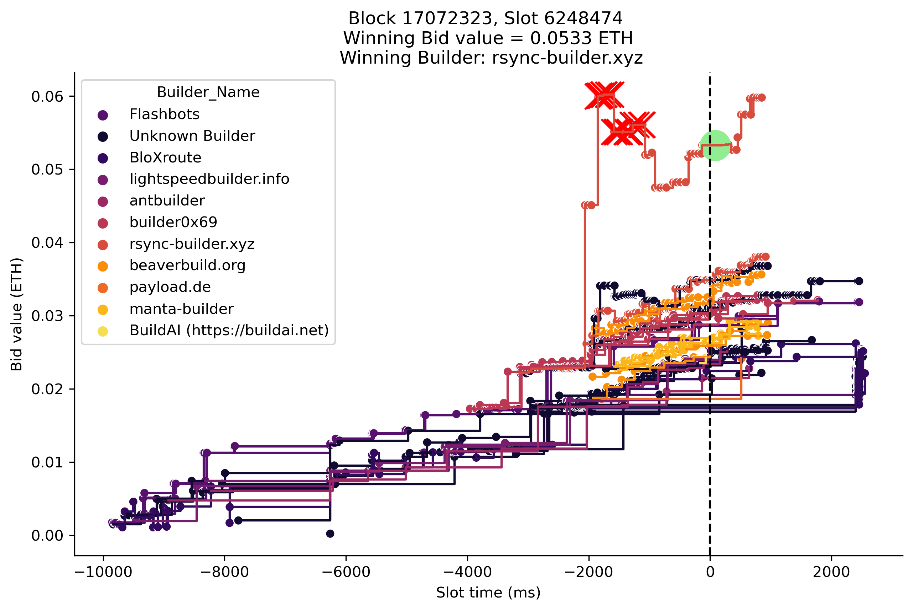

> *__Figure 8.__ Potential bid shielding examples. (left) We see multiple builders bidding high between `t=-4` and `t=-1.5`, which may be an attempt to cause other builders to bid higher than they would have otherwise. As the slot boundary approaches, the shielding bids are cancelled, leaving the winning bid to a different builder. (right) A builder setting a cluster of high bids at `t=-2` only to reduce their bid closer to `t=0`, while still winning the auction.*

### Cancellations are wasteful of relay resources
With cancellations, relays must process each incoming bid from the builders, regardless of the bid value. This results in the unnecessary simulation of many blocks that have a very low probability of winning the auction. Without cancellations, the relay would only need to accept bids that were greater than the current highest value. On a sample of `252` recent slots, `ultra sound relay` had an average of `400` submissions per slot. Of those `400`, on average only `60 (15%)` were greater than the top bid of the time. This implies an `85%` reduction in simulation load on the relay infrastructure by removing cancellations. To illustrate this, consider the example of slot 6249130 below; of the `1014` bids received, only `59 (6%)` incrementally improve the highest bid, and the remaining `955` bids could safely be ignored without cancellations.

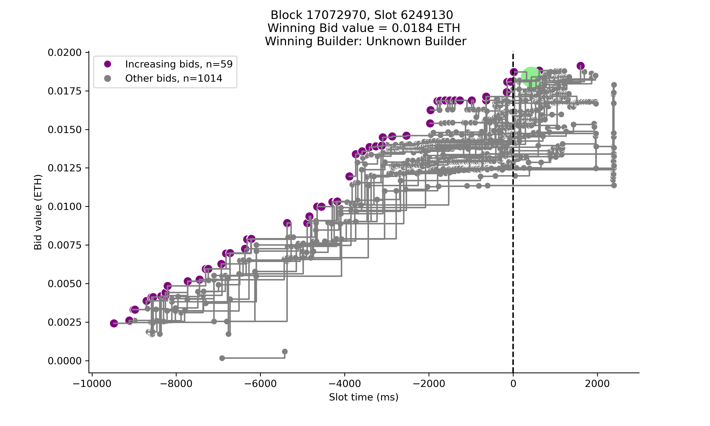

> *__Figure 9.__ The value of bids as time evolves over a single slot. With cancellations, every bid (in gray) must be processed by the relays. Without cancellations, only bids that incrementally increase the highest bid (in purple) would need to be processed.*

### Cancellations conflict with enshrined-PBS
Lastly, cancellations are not compatible with current designs of enshrined-PBS. For example, if we examine proposer behavior in the [two-slot](https://ethresear.ch/t/two-slot-proposer-builder-separation/10980) mechanism presented by Vitalik, we see that just like in `mev-boost`, there exists an incentive for the validator to ignore builder cancellations. 

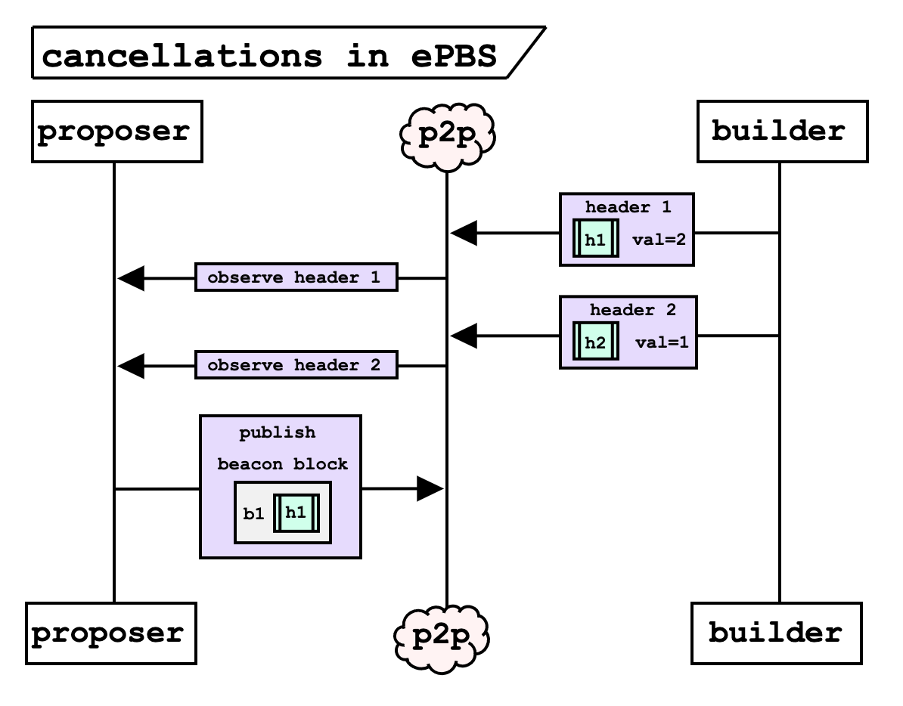

> *__Figure 10.__ A builder submits two headers as bids. The first has `val=2` and the second (a cancelling bid) `val=1`. The proposer observes the headers in the order that they were published. With cancellations, the proposer should include `h2` in their beacon block, because it was the later bid from the builder. However, this is not rational behavior and if they include `h1` instead, they earn a higher reward.* 

Without the relay serving as an intermediary, builder bids will be gossiped through the p2p network. Similar to the rational validator behavior of calling `getHeader` and only signing the highest-paying bid, any validator can listen to the gossip network and only sign the highest bid they observe. Without an additional mechanism to enforce ordering on builder bids, there is no way to prove that a validator observed the canceling bid on-time or in any specific order.

Additionally, if the final ePBS design implements [mev-burn](https://ethresear.ch/t/burning-mev-through-block-proposer-auctions/14029) or [mev-smoothing](https://ethresear.ch/t/committee-driven-mev-smoothing/10408), where consensus bids from the attesting committee enforce that the highest-paying bid is selected by the proposer, bid cancellations are again incompatible without significant design modifications (e.g., block validity conditions are modified to (i) the block captures the maximal MEV as seen by attesters listening to bids (ii) attesters have not seen a timely cancellation message for the bid). This would increase the complexity of the change and require extensive study to understand the new potential attack vectors it exposes.

## Future directions

Below are some short & medium-term changes we encourage the community to consider:

1. *Remove cancellations from the relays.*
    * This is the simplest approach, but would require a coordinated effort from the relays and generally is not favorable for builders. The relays would enter a prisoner's dilemma, where defecting is a competitive advantage (i.e., there exists an incentive to allow cancellations because it may grant the relay exclusive access to valuable builder blockflow).
2. *Implement SSE stream for top bids from relays.*
    * An [SSE](https://en.wikipedia.org/wiki/Server-sent_events) stream of top bids would eliminate the need for builders to continually poll `getHeader`; on `ultra sound relay`, around 1 million calls to `getHeader` are received every hour. The biggest challenge here is ensuring fair ordering of the message delivery from the SSE. Perhaps by using builder collateral or reputation as an anti-sybil mechanism, the relays can limit the number of connections and randomize the ordering. As implemented today, builders are already incentivized to colocate with relays and call `getHeader` as often as possible to get the value of the highest bid, so the SSE could also simplify the builder-side logic. 
3. *Require proposer signature for `getHeader`.*
    * With (2) above, we could limit `getHeader` to just the current proposer by using a signature to check the identity of the caller. We use the same mechanism to ensure that `getPayload` is only called by the proposer. This change would alter the [builder spec](https://ethereum.github.io/builder-specs/#/Builder/getHeader) because the request would need a signature. Note that this could further incentivize relay-builder or builder-proposer collusion, as builders will want to access bidding information. 
4. *Encourage proposer-side polling of `getHeader`.*
    * On the `mev-boost` (proposer side) software, we could implement the highest-bid logic. This is accomplished either by polling `getHeader` throughout the slot (e.g., one request every 100ms) or by listening to the SSE stream if we implement (2). This effectively removes cancellations using the validator, so would not require a coordinated relay effort. Validators could opt-in to the new software and would earn more rewards if they updated. This change could cause builders to decrease the value of their bids they cannot cancel, which could also incentivize proposer-builder trusted relationships where the proposer gets access to higher bids if they allow cancellations and ignore the relay all together. Before implementing this, more discussion is needed to avoid this scenario. 

5. *Research the role of cancellations in auctions.*
    * We hope this post can lead to more research into exploring the nuanced spectrum between simply enabling and disabling cancellations. While we argue cancellations are considered harmful, examining the motivations behind their use by auction participants (e.g., builders, searchers) and assessing their impact on auction revenue and MEV distribution between proposers and builders remain open questions.

Please reach out with any comments, suggestions, or critiques! Thanks for reading :-)