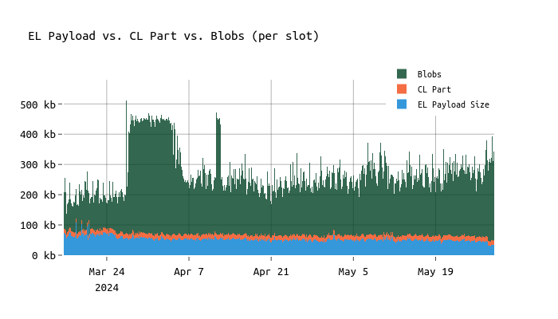
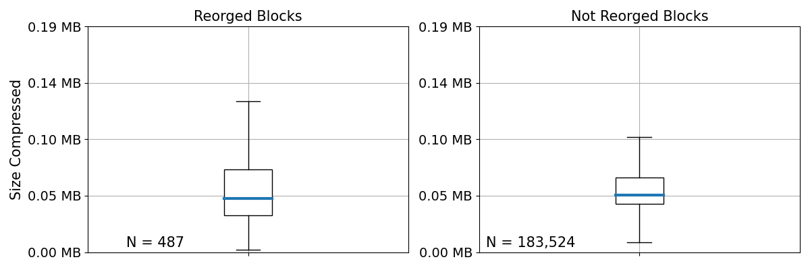
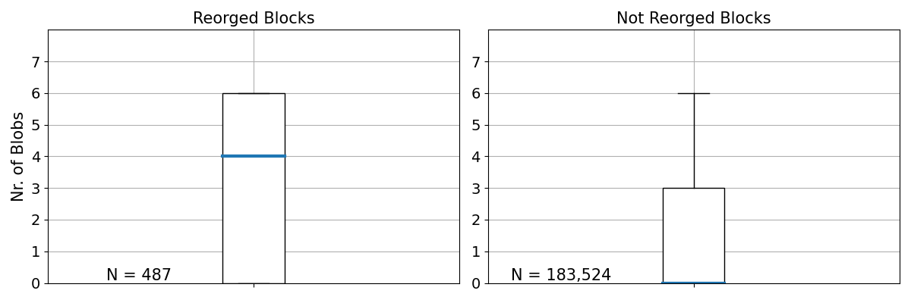
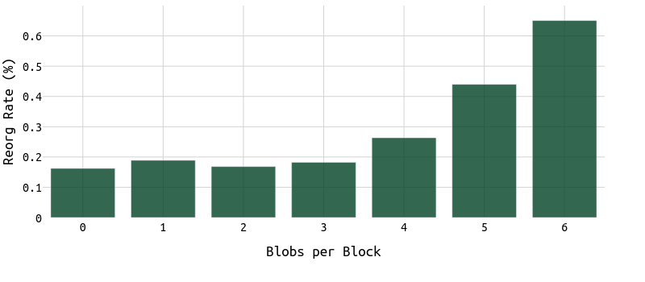
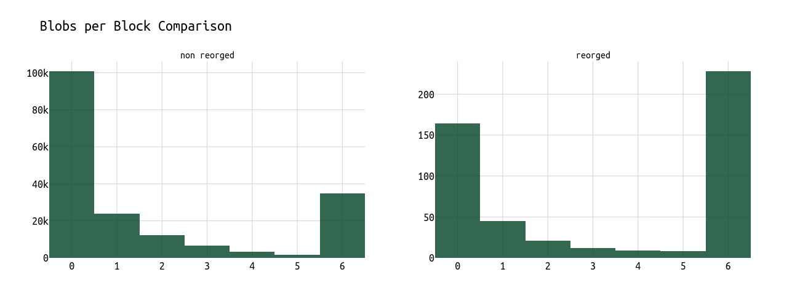
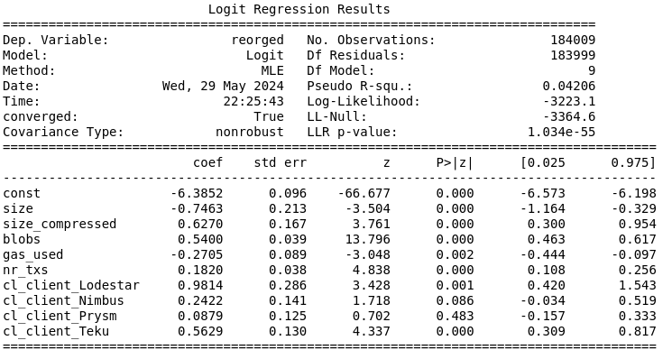

# Big blocks, blobs, and reorgs

With [EIP-4844](https://www.eip4844.com/) going live, Ethereum effectively increased its transaction throughput by providing dedicated space for rollups to post their data down to L1.

Blobs are now the main contributor to the block size, while the average beacon block size (excluding blobs) went down from ~$125$ KB to ~$90$ KB.

**In the chart below, one can see the impact of blobs on the data throughput of Ethereum:**

Such an increase in throughput is expected to push certain "weaker" validators to their limits. Thus, we want to answer the question "*Do blobs contribute to reorgs and if so, by how much?*"

For the following analysis, I'm relying on a node to parse data in real-time (head of chain) and check the contents of blocks that were eventually reorged.

**The earliest data point considered for the following analysis is slot $8,992,385$ (May 3, 2024), which gives us around 4 weeks of data.**
**In total, we observe $487$ reorgs and a total of ~$184,000$ slots in this time span.**

### Snappy compressed blocks

First, let's compare the **snappy compressed block size of blocks** that were reorged vs those that made it into the canonical chain.
In particular, we're interested in whether reorged blocks were on average larger than those that weren't reorged.

*In this context, we're referring to reorgs as valid blocks that the respective proposer proposed but that were eventually orphaned by consecutive proposers.*

Based on the above graph, we **cannot** see a significant difference in the median block size of reorged and not-reorged blocks. Focusing on the $75\%$ quantile and the upper whiskers which are defined as $Q_{75} \times 1.5\ IQR$, we do see reorged blocks being larger than not reorged ones. This was expected (bigger blocks lead to bigger struggles), however, as visible in this [earlier analysis](https://ethresear.ch/t/on-increasing-the-block-gas-limit/18567) on block sizes, the effects were reduced with 4844 going live.

### Blobs

Next, let's look into blobs. With the go-live of EIP-4844, most rollups switched from using calldata to blobs, shifting the majority of posted data from the EL payload to blobs.

Based on the above boxplots, we can see that most **reorged** blocks contained $6$ blobs. Seeing more reorgs for blocks with $6$ blobs is kind of expected as those blocks were approximately **7 times larger than the average block pre-4844**.

**The same pattern is evident when visualizing the percentage of reorged blocks over the number of blobs per block.**

Comparing the percentage of reorged blocks with $0$ and $6$ blobs, we can see that the probability of a reorg is more than **$3$ times larger.**

In this context, it's important to check what the distribution of blobs per block looks like. The "extreme" cases of $0$ or $6$ blobs per block might heavily impact the perceived impact of blobs on reorgs.

As visible in the above histogram, which shows the distribution of blobs per block in May 2024, most blocks contained either $0$ or $6$ blobs. 

### Regression Analysis

To quantify the impact of blobs on reorgs, we can apply a simple logistic regression.

In addition to the (1) uncompressed block size, (2) snappy compressed block size, (3) gas used per block and (4) number of transactions and (5) blobs per block, we also put different CL clients as dummy variables into the regression model. 
All dependent variables are z-score scaled and the Lighthouse client is part of the intercept.

Looking at the intercept (const), the baseline log-odds of a reorg when all other predictors are at their mean indicates a very low baseline probability of a reorg happening.
To put that in numbers, empirically around $0.27\%$ of all blocks in May 2024 were reorged.

Next, let's focus on the dependent variables, considering $p \le 0.01$ as a significant result.

**Blobs**, **size_compressed**, and **nr_txs** have significant impacts on the probability of a reorg.
  - Each additional blob and each additional byte in size_compressed increases the probability of a reorg.
  - `size`, `gas_used` and other client variables (Nimbus, Prysm) do not have significant impacts (compared to the Lighthouse client).
 
For each increase in blobs by the standard deviation of blobs ($=2.33$), the log-odds of a block being reorged increase by $1.2582$. 
The baseline probability of a reorg, with all dependent variables at their mean, is approximately $0.27\%$. This would mean that an increase in blobs by one standard deviation ($=2.33$) results in the probability of a reorg increasing from approximately $0.27\%$ to $0.93\%$, representing an increase of about $0.67$ percentage points.

### Clients
**Notably, the number of reorgs is in general very low and even lower for "minority" clients such as Lodestar and Teku. Thus a few Lodestar or Teku users that are playing timing games could already impact this result.**

**Thus, the following result must be taken with a grain of salt.**

**For the Lodestar client:**
- The log-odds of a reorg increase by $0.9814$ when using the Lodestar client.
- This corresponds to an odds ratio of approximately $2.667$, indicating that the odds of a reorg are about $166.7\%$ higher when using the Lodestar client.
- The baseline probability of a reorg is approximately $0.27\%$. When using the Lodestar client, this probability increases to approximately $0.45\%$, an increase of about $0.178$ percentage points.

**For the Teku client:**
- The log-odds of a reorg increase by $0.5629$ when using the Teku client.
- This corresponds to an odds ratio of approximately $1.756$, indicating that the odds of a reorg are about $75.6\%$ higher when using the Teku client.
- The baseline probability of a reorg is approximately $0.27\%$. When using the Teku client, this probability increases to approximately $0.3\%$, an increase of about $0.027$ percentage points.

For the **Nimbus** and **Prysm** clients, we do not see a significant impact on reorgs compared to **Lighthouse**.

## Next Steps

* **Call for reproduction**: Please reproduce my analysis. Working with a lot of data can be dirty. Working with data that disappears from the chain after a block was reorged is even dirtier. Thus, view this as an initial attempt to dive into the "blobs vs reorgs" topic.
* **More data**: 4844 is still very young and I plan to reproduce this analysis in a few months to verify the results using more data.
* **Filter for client bugs**: A small bug in a client can significantly impact the result. Same applies to validators playing **timing games, honest reorg strategies, and EL clients**.
* **What about relays and builders**: Check why we see either 0 or 6 blobs, the extreme cases, so often, and what the **builder** and **relay** behavior is in those scenarios.
* Check how **efficiently blobs are used** and if **sharing blob space** among multiple entities could increase efficiency.