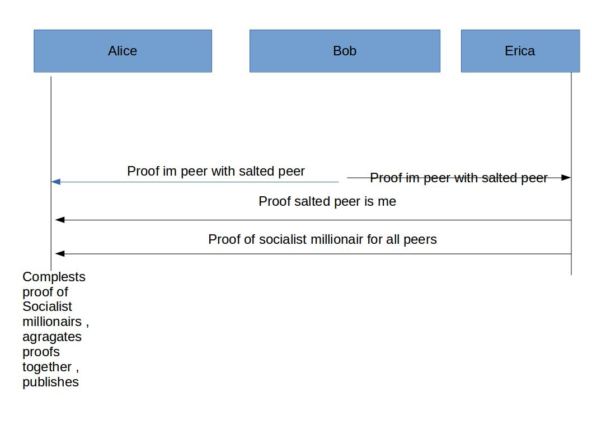

Barry Whitehat , Kobi Gurkan

## Intro

zkps are fun. They let us privately make statements about information that a single user holds. 

They cannot let us talk about information that is not held by a single party. We would like to be able to make proofs about the relationships between multiple people. For example in a social network. 

Here we use ZKP + MPC (socialist millionaire problem) to make proofs of connectivity in a social graph. 

These proofs can be valuable for 

1. Private routing in payment channels 
2. Trust graph based crypto currencies / reputation systems 
3. Decentralised social networks
4. p2p networks

Here we describe a network of nodes where a member of the network can 

Search for a peer without
1. Revealing who they are searching for 
2. Finding out who has them as a peer

The parties who were queried do not find out if
1. If the search was result was positive or negative. 
2. Where the request came from, only that it came from one of their peers or was forwarded from one of their peers. 

The searching party can construct a proof that will convince anyone that such a path exists. 

We describe how to make proofs of this that hide any information about the connection. 

## The Setup

We have a bunch of people who each have a private list of their "Peers"

This list is committed to on chain. 

Each party only knows their own peers. 

Each party commits to their peers on chain. The commitment also includes a zero knowledge proof that a connection was authorised by both peers. IE a proof of signature. 

The commitment on chain are blinded by salting so no one knows who's peers anyone has. 

Finally all the peer list are aggregated together into a single accumulator so that proofs can say they come from this set.

## The scenario

Alice wants to find a path to Bob. 

For ease of explanation here are the social graphs of Alice, Bob , Carroll.

Alice = {Bob, Frank}
Bob = {Alice, Erica, David}
David = {Carroll}
Carroll = {David}
Erica = {Bob, Carroll}
Frank = {Alice}
## Socialist millionaires protocol (SMP)

We use the protocol defined [here](https://en.wikipedia.org/wiki/Socialist_millionaires#Off-the-Record_Messaging_protocol) to find the peer. The search does not return any information other than true or false. 

## Full protocol 

Here we define the full protocol and then dig deeper into it later. 

1. Alice creates a zkp that she is bobs peer. She sends it to bob. She also sends it to her other peers who respond by running the same protocol. She does not know which of her peers is which when responding. She does not know she is talking to Bob. 
2. Bob performs the SMP to search for the peer Alice is looking for. 
3. Alice completes the protocol. 
4. The search fails, because Bob is not connected to Carroll.
5. Bob provides a proof he is connected to a hidden-peer (Erica) connects Alice with Erica to continue the search. Bob essentially acts as a proxy so that Alice doesn't doesn't discover she's connected to Erica.
6. Erica performs the search with Alice. 
7. The search works out, since Erica is connected to Carroll.
8. Alice now wants to construct a proof so she can convince someone else that she is connected to Carroll through some other peers. 
9. Bob proves he is connected to a salted peer (Erica). 
10. Erica proves that she is salted peer that Bob is connected to. 
11. Erica proves she ran the SMP correctly for each peer. 
12. Alice completes SMP correctly for the search term Carroll. 
13. Alice aggregates the proofs together to create a single proof of connection that hides the SMP which could allow Erica to identify the proof.  

## Who knows what

1. Alice knows that she is connected by two hops to Carroll. 
2. Bob knows that one of his peers was trying to search for someone
3. Erica knows that one of her peer was searching for someone

In order to prevent people from seeing if a search attempt succeeded its important to create proofs for every search attempt. 

We also need to continue the search to a certain depth in the social tree even if we have created the proof. 

This might be prohibitively expensive but we can make a trade off here. 

## Attacks 

1. An attacker can brute force the network looking for peers

We can use a ZKP in order to rate limit all requests. github.com/kobigurk/semaphore, https://ethresear.ch/t/semaphore-rln-rate-limiting-nullifier-for-spam-prevention-in-anonymous-p2p-setting/5009

2. Loop attack: An attacker creates a loop of peers and when someone is searching for a peer they end up follow this loop forever

Limit the depth to 6 degrees of separation.  

## Conclusion 

We can privately search peer networks without revealing who is being searched for and who is doing the searching.

This is really exciting for privately finding routes in lightning networks, private social networks and 

Adding the proofs allow us to expand this to trust networks, proofs of individuality and reputation systems.