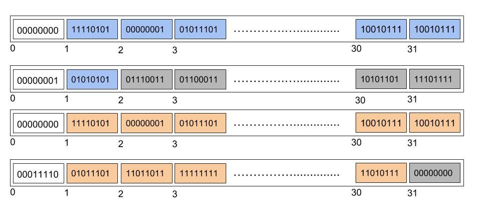

**TLDR**: We propose a serialisation scheme for blobs in collation bodies. Credits to @prestonvanloon for suggesting the main construction and for providing the great illustration.

**Construction**

Collation bodies (of size $2^n$ bytes for some $n \ge 5$) are partitioned into 32-byte chunks. The first byte of every chunk is the "indicator byte", and the other 31 bytes are "data bytes". We call the 5 least significant bits of indicator bytes "length bits" with value ranging from 0 to 31.

Blob data is partitioned across data bytes from left to right, with every chunk holding data for at most one blob. If the length bits are zero then the corresponding chunk is "non-terminal", with all 31 data bytes holding blob data. Otherwise the chunk is "terminal" marking the end of the current blob, with the data bytes holding as many blob bytes (packed to the left) as specified by the length bits.

The illustration below shows a 4-chunk collation body serialising two blobs. The first (in blue) has length 32 and the second (in orange) has length 61. The white bytes are the indicator bytes, and the grey bytes are ignored. 

For the purpose of blob delimitation the blob parser ignores:

* Data bytes of terminal chunks not holding blob data
* Chunks after the last terminal chunk
* The 3 most significant bits of indicator bytes

The 3 most significant bits of terminal chunks are 3 blob flags. The first blob flag is a `SKIP_EVM` flag to avoid execution of the blob by the default EVM. The other two flags are reserved for future use.

The default EVM charges gas for blob data proportionally to the number of chunks used.

**Remarks**

* The parser never throws.
* All blobs are terminated, and have 3 flags.
* Blobs are at least 1 byte and at most $31*2^{n-5}$ bytes long.
* Data ignored by the parser can set arbitrarily, e.g. to squeeze extra data.
* 32-byte hashes in blobs can be truncated to 31 bytes for packing into a single chunk, and witnessing with a single Merkle path.
* ~~The terminal chunk of blobs of length a multiple of 31 bytes can hold no blob data.~~