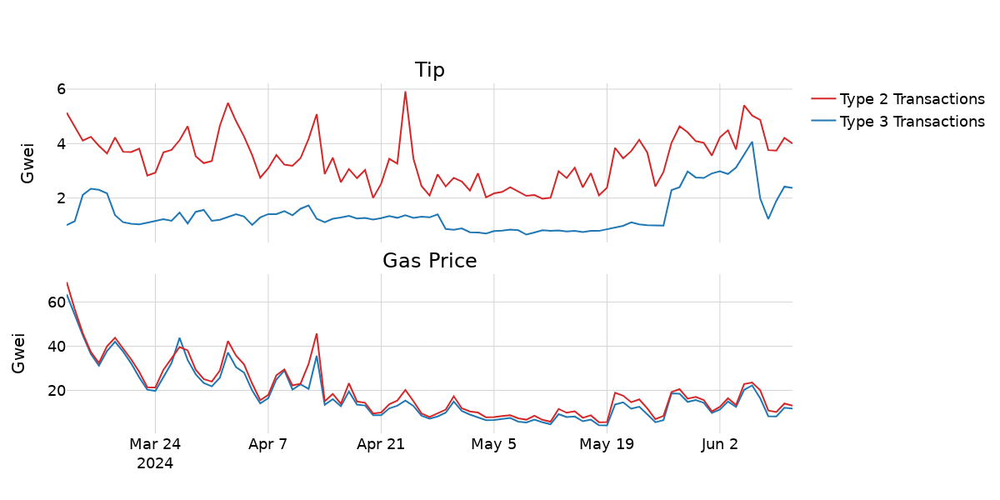
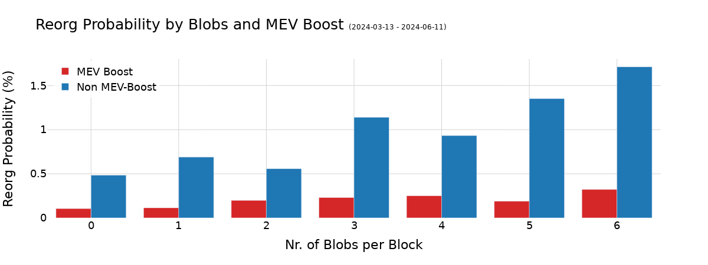
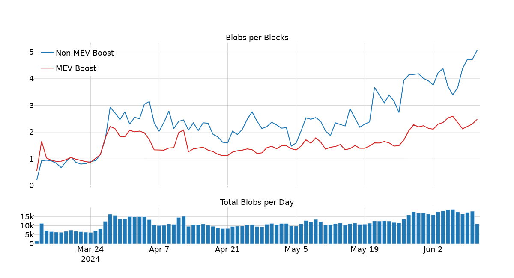
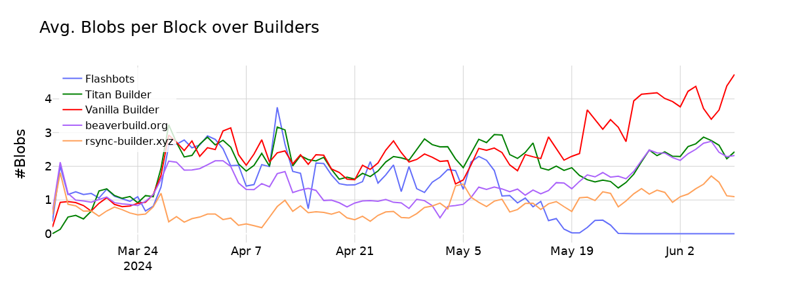
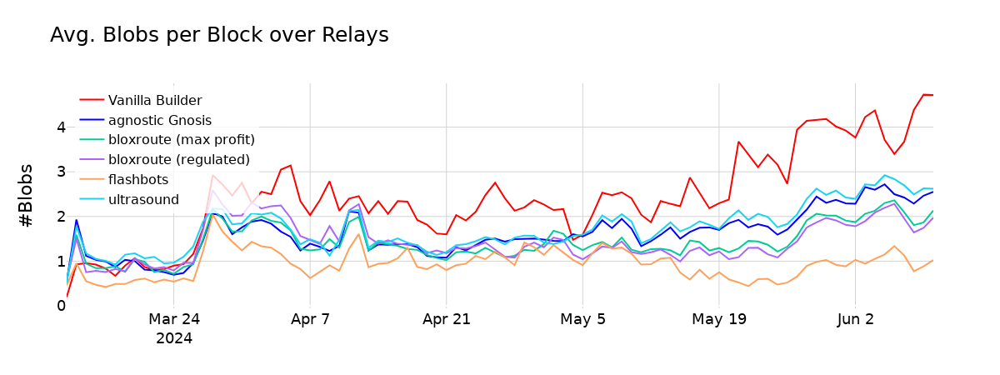

# Blobs, Reorgs, and the Role of MEV-Boost

**The TL;DR is:**
* **Builders** might have an incentive to not include blobs because of the higher latency they cause.
* **Non-MEV-Boost users** include, on average, more blobs in blocks than MEV-Boost builders.
* **MEV-Boost users** show a significantly lower probability of being reorged than *Non-MEV-Boost* users (see section *MEV-Boost and Reorgs* for details).
* **Rsync-Builder** and **Flashbots** have a lower average number of blobs per block than other builders.

---

In a [recent analysis on big blocks, blobs and reorgs](https://ethresear.ch/t/big-blocks-blobs-and-reorgs/19674), we could see the impact of blobs on the reorg probability.

**In the following, I want to expand on this by taking the MEV-Boost ecosystem into account.**

**The fundamental question is...**
\-\> **"*Does MEV-Boost impact reorgs, and if so, by how much?*"** 

Blobs are "*big*" and big objects cause higher latency. Thus, one might expect builders to not include blobs into their blocks in scenarios in which:
* The builder is submitting its block late in the slot to minimize latency (see timing games).
* The builder wants to capture a high MEV opportunity and doesn't want to risk unavailable blobs invalidating its block.
* The proposer is less well connected (because the gossiping starts later in the slot).

**Builders** might demand to be **compensated** through priority fees for including transactions which might cause blocks to be propagated with higher latency. Until 4844, such transactions have been those with a lot of calldata. As of 4844, blobs are the main drivers of latency.

**As visible in the above chart, blob transactions don't tip as much as regular Type-2 transactions.**
Based on that, blobs don't give builders a significant edge over other builders competing for the same slot.
Another explanation could be private deals between builders and rollups to secure timely inclusion of blob transactions for a fee paid through side channels.

## MEV-Boost and Reorgs

The MEV-Boost ecosystem consists of sophisticated parties, **builders** and **relays**, that are well connected and specialized in having low-latency connections to peers.
Thus, it is expected that proposers using MEV-Boost should be reorged less often than 'Vanilla Builders' (i.e., users not using MEV-Boost).

This expectation holds true when looking at the above chart. 
**We can see that the reorg probability increases with the number of blobs. However, the reorg probability for MEV-Boost users is much lower than the one for Non-MEV-Boost users (Vanilla Builders).**

**In this context it's important to not confuse correlation and causation:
\-\> *Non-MEV-Boost users are on average less sophisticated entities which also contributes to the effect we observe in the above chart.***

In this context it is interesting to compare the **average number of blobs per block** of MEV-Boost users vs. Non-MEV-Boost users.

**As visible in the above chart, proposers not using MEV-Boost included on average more blobs into their blocks than MEV-Boost users.**
This might point towards MEV-Boost ecosystem participants (relays and builders) applying strategies that go beyond the "*include it if there's space*" strategy.

**First, let's look at the builders more closely.**

Vanilla Builders (Non-MEV-Boost proposers) are the ones that have the highest blob inclusion rate, followed by Beaverbuild and Titan Builder.

Rsync-Builder seems to include way less blobs in their blocks.
The same applies to the Flashbots builder that seems to have changed its behavior in early May, with the average number of blobs per block approaching zero.

**"Is it fair to say 'Builder XY censors blobs!?"**
\> **No**

> *Different builders follow different strategies. For example a builder such as Rsync-Builder that is generally competitive in slots where low latency and speed matters might end up with winning those blocks where there are no blobs around (c.f. *selection bias*)*

 

**Next, let's shift the focus to the relays:**

As visible above, Vanilla Builders have on average the highest blob inclusion rate.
The Ultrasound and Agnostic Gnosis relays are second and third, followed by the relays of BloXroute.
The Flashbots relay seems to include the lowest number of blobs.

**Importantly, relays are dependent on builders and ultimately it's the builders that impact the above graph.**

## Next Steps
In the context of [PeerDAS](https://ethresear.ch/t/peerdas-a-simpler-das-approach-using-battle-tested-p2p-components/16541), the network will have to rely on nodes that are *stronger* than others and able to handle way more than 6 blobs per block. Therefore, it'd be super valuable to see more research on that topic happening.

* **Call for reproduction**: It'd be great if someone could verify my results by reproducing this analysis.
* **Investigate the reasons** why certain builders have a significantly lower blob inclusion rate than others.
* **Reduce reorg rate for Non-MEV-Boost users**: Relays could offer Non-MEV-Boost users their block propagation services to ensure that fewer of their blocks get reorged.

The blob market is still under development and a stable blob price is yet to be discovered. With increasing demand for blob space, tips from blob transaction will likely catch up to regular transactions.