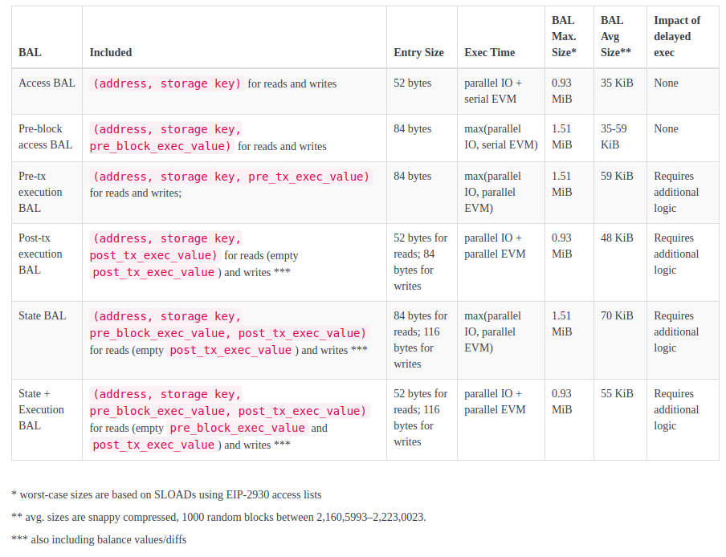

# Block-level Access Lists (BALs)

> Many thanks to [Francesco](https://x.com/fradamt), [Jochem](https://x.com/JochemBrouwer96), [Vitalik](https://x.com/VitalikButerin), [Ignacio](https://x.com/ignaciohagopian), [Gary](https://x.com/gary_rong), [Dankrad](https://x.com/dankrad), [Carl](https://x.com/CarlBeek), [Ansgar](https://x.com/adietrichs), and [Tim](https://x.com/TimBeiko) for feedback and review.


*TL;DR: Block builders include access lists and state diffs into blocks for validators to validate faster --> scale L1!*

One of the key topics in the renewed effort to scale Ethereum’s Layer 1—especially the execution layer—is **[block-level access lists (BALs) - EIP-7928](https://github.com/ethereum/EIPs/blob/master/EIPS/eip-7928.md)**.

**BALs** are structured lists that the block builder must include in each block, specifying which storage slots individual transactions will access. If these lists are inaccurate or incomplete, the block becomes invalid. As a result, **Ethereum’s consensus mechanism can enforce strict compliance**, requiring builders to provide correct BALs.

Validators benefit significantly from BALs by accelerating block verification. Knowing exactly which accounts and storage slots will be accessed enables validators to apply simple parallelization strategies for disk reads (IO) and execution (EVM). This can lead to **faster block validation** and open the door to **raising gas limits** in the future.

> Check out [this](https://ethresear.ch/t/execution-dependencies/22150) previous post on *execution dependencies* and Dankrad’s simulations on parallelizing storage reads [here](https://notes.ethereum.org/@dankrad/SJawZpx1yx).

A critical design goal for BALs is **maintaining compact size** in both average and worst-case scenarios. Bandwidth is already a constraint for nodes and validators, so it's vital that BALs don’t add unnecessary load to the network. BALs will be put into the block body, with a hash of the BAL stored in the header.

> Currently, Ethereum clients rely on their own **optimistic parallelization strategies**. These generally perform well on **average blocks**, but struggle with **worst-case scenarios**, leading to significant performance differences.

# The design space for BALs

* What to include?
    * In addition to storage locations `(address, storage key)`, we can also include:
        * storage values
        * balances
        * balance diffs
    * For storage values, we can distinguish between:
        * pre-block vs. pre-transaction execution values
        * pre- vs. post-transaction execution values
    * Are we aiming to be hardware-agnostic, or do we want to optimize for certain commonly used hardware specs?

**In the following, we’ll focus on three main variants of BALs: access, execution and state.**

# Access BALs

Access BALs map transactions to `(address, storage key)` tuples.

* Small in size.
* Enable parallel disk reads but are less effective for parallel transaction validation due to potential dependencies.
* Execution time is `parallel IO + serial EVM`.

For efficiency, a lightweight BAL structure could look like this using SSZ:

```python
# Type aliases
Address = ByteVector(20)
StorageKey = ByteVector(32)
TxIndex = uint16

# Constants; chosen to support a 630m block gas limit
MAX_TXS = 30_000 
MAX_SLOTS = 300_000
MAX_ACCOUNTS = 300_000

# Containers
class SlotAccess(Container):
    slot: StorageKey
    tx_indices: List[TxIndex, MAX_TXS]  # Transactions (by index) that access this slot (read or write)

class AccountAccess(Container):
    address: Address
    accesses: List[SlotAccess, MAX_SLOTS]

# Top-level block fields
BlockAccessWrites = List[AccountAccess, MAX_ACCOUNTS]
BlockAccessReads  = List[AccountAccess, MAX_ACCOUNTS]
```
The **outer list** is a deduplicated list of addresses accessed during the block. 
* For each address, there's a list of **storage keys** accessed. 
* For each storage key: 
    * `List[TxIndex]`: Ordered transaction indices that accessed this key. 
  
For example, the BAL for block number `21_935_797` would look like this:

```python
[
    ('0xc02aaa39b223fe8d0a0e5c4f27ead9083c756cc2',
        [
            ('0xa63b...c2', [0]),
            ('0x8b3e...a7', [0]),
            ('0xfb19...a8',
                [1, 2, 3, 4, 84, 85, 91]
            ),
            # ... additional entries
        ]
    ),
    # ... additional entries
]
```

# Execution BALs

Execution BALs map transactions to `(address, storage key, value)` tuples and include balance diffs.

* Slightly larger in size due to value inclusion. 
* Facilitate parallel disk reads and parallel execution.
* Execution time is `parallel IO + parallel EVM`.

An efficient structure using SSZ:
```python
# Type aliases
Address = ByteVector(20)
StorageKey = ByteVector(32)
StorageValue = ByteVector(32)
TxIndex = uint16
Nonce = uint64

# Constants; chosen to support a 630m block gas limit
MAX_TXS = 30_000
MAX_SLOTS = 300_000
MAX_ACCOUNTS = 300_000
MAX_CODE_SIZE = 24576  # Maximum contract bytecode size in bytes

# SSZ containers
class PerTxAccess(Container):
    tx_index: TxIndex
    value_after: StorageValue # value in state after the last access within the transaction

class SlotAccess(Container):
    slot: StorageKey
    accesses: List[PerTxAccess, MAX_TXS] # empty for reads

class AccountAccess(Container):
    address: Address
    accesses: List[SlotAccess, MAX_SLOTS]
    code: Union[ByteVector(MAX_CODE_SIZE), None]  # Optional field for contract bytecode

BlockAccessList = List[AccountAccess, MAX_ACCOUNTS]

# Pre-block nonce structures
class AccountNonce(Container):
    address: Address  # account address
    nonce_before: Nonce  # nonce value before block execution

NonceDiffs = List[AccountNonce, MAX_TXS]
```

**The structure is the same as in the access version, with `StorageValue` added to represent the value after the last access by each transaction.**

* Exclude `SlotAccess.accesses` for reads: empty `SlotAccess.accesses` indicates a *read*.
    * This means that only *write* operations consist of `(StorageKey, List[TxIndex], StorageValue)` tuples, significantly reducing the object's size.

* **Instead of post-execution values, we could include pre-execution values for reads and writes for each transaction. Thereby, EVM execution would not have to wait for disk reads. This is a completely separate design, coming with its own trade-offs, reducing execution time to `max(parallel IO, parallel EVM)`.**

> **For syncing** (c.f. *healing phase*), having state diffs (thus, the post-tx values) for writes is required for catching up with the chain while updating state. Instead of receiving new state values directly with their proofs, we can heal state using the state diffs inside blocks and verify the correctness of the process by comparing the final derived state root to the head block's state root received from a light node (h/t dankrad).

For contract deployments, the `code` must contain the runtime bytecode of the newly deployed contract.

The `NonceDiffs` structure MUST record the pre-transaction nonce values for all `CREATE` and `CREATE2` deployer accounts and the deployed contracts in the block.

An example BAL for block `21_935_797` might look like this:
```python
[('0xc02aaa39b223fe8d0a0e5c4f27ead9083c756cc2',
  [('0xa63b...c2',
    [0],
    '0x...'),
   ('0x8b3e...a7',
    [0],
    '0x...'),
   ('0xfb19...a8',
    [1, 2, 3, 4, 84, 85, 91],
    '0x...'),
   ...
  ]
 )
]
```

---

**Balance diffs** are needed to correctly handle execution that depends on an account's balance. These diffs include every address touched by a transaction involving value transfers, along with the balance deltas, transaction senders, recipients, and the block's coinbase. 

```python
# Type aliases
Address = ByteVector(20)
TxIndex = uint64
BalanceDelta = ByteVector(12)  # signed, two's complement encoding

# Constants
MAX_TXS = 30_000
MAX_ACCOUNTS = 70_000  # 630m / 9300 (cost call to non-empty acc with value)

# Containers
class BalanceChange(Container):
    tx_index: TxIndex
    delta: BalanceDelta  # signed integer, encoded as 12-byte vector

class AccountBalanceDiff(Container):
    address: Address
    changes: List[BalanceChange, MAX_TXS]

BalanceDiffs = List[AccountBalanceDiff, MAX_ACCOUNTS]
```

* Deduplicated per address.
* Each tuple lists the exact balance change for every relevant transaction.

Example:

```python 
[
  (
    '0xdead...beef',
    [
      (0, -1000000000000000000),  # tx 0: sent 1 ETH
      (2, +500000000000000000)    # tx 2: received 0.5 ETH
    ]
  ),
  # ... additional entries
]
```

# State BALs

This structure **fully decouples execution from state**, allowing validators to bypass any disk or trie lookups during execution, relying solely on the data provided in the block. The `pre_accesses` list provides the **initial values** of all accessed slots before the block starts, while `tx_accesses` traces the **per-transaction access** patterns and **post-access values**, enabling fine-grained parallel execution and verification.

* Larger in size
* Execution time is `max(parallel IO, parallel EVM)`.

An efficient SSZ object could look like the following:

```python 
# Type aliases
Address = ByteVector(20)
StorageKey = ByteVector(32)
StorageValue = ByteVector(32)
TxIndex = uint16

# Constants
MAX_TXS = 30_000
MAX_SLOTS = 300_000
MAX_ACCOUNTS = 300_000

# Sub-containers
class PerTxAccess(Container):
    tx_index: TxIndex
    value_after: StorageValue

class SlotAccess(Container):
    slot: StorageKey
    accesses: List[PerTxAccess, MAX_TXS]

class AccountAccess(Container):
    address: Address
    accesses: List[SlotAccess, MAX_SLOTS]

class SlotPreValue(Container):
    slot: StorageKey
    value_before: StorageValue

class AccountPreAccess(Container):
    address: Address
    slots: List[SlotPreValue, MAX_SLOTS]

# Unified top-level container
class BlockAccessList(Container):
    pre_accesses: List[AccountPreAccess, MAX_ACCOUNTS]
    tx_accesses: List[AccountAccess, MAX_ACCOUNTS]
```

> The balance and nonce diff remains the same.
...

### What about excluding the initial read values?

Another variant of State BAL **excludes read values**, and only includes pre- and post-values for writes. In this model, `pre_accesses` and `tx_accesses` only contain storage slots that were written to, along with their corresponding `value_before` (from state) and `value_after` (from the transaction result).

This reduces the size while still enabling full state reconstruction, as write slots define the only persistent changes. Read accesses are implicitly assumed to be resolved via traditional state lookups or cached on the client.

# Worst-Case Sizes

## Access BAL

**The worst-case transaction consumes the entire block gas limit (36 million, as of April 2025) to access as many storage slots inside different contracts as possible by including them in the EIP-2930 access list.**

Thus, `(36_000_000 - 21_000) // 1900` gives us the max number of addresses (20 bytes) + storage keys (32 bytes) reads we can do, resulting in `18_947` storage reads and approximately **0.93 MiB**.

> This is a **pessimistic** measure. It's practically infeasible to use the block's gas exclusively for SLOADs. With a custom contract (see [here](https://github.com/nerolation/ethereum-stresser-contracts/blob/main/contracts/sload_stresser.sol)), I was able to trigger 16,646 SLOADs, not more. See [this example transaction on sepolia](https://dashboard.tenderly.co/tx/0x85bbcc2690fbf0ae9af5af1b3d4c006fd9804644695f095cba9e00ff09eaae8b).

**This is less than the current (and post-Prectra) worst-case block size achievable through calldata.**

> Average BAL size sampled over 1,000 blocks between 21,605,993 and 2,223,0023 was around **57 KiB** SSZ-encoded. On average, blocks in that time frame contained around 1,181 storage keys and 202 contracts per block.

## Execution BALs

Including a 32-byte value per write entry doesn't increase the worst-case BAL size. For reading `18_947` storage loads, it **remains at 0.93 MiB**. 

**Worst-case balance diffs occur if a single transaction sends minimal value (1 wei) to multiple addresses:**
* With the `21,000` base cost and `9,300` gas for calls, we get a maximum of 3,868 called addresses in one transaction (`(36_000_000-21_000)/9_300`). Including the `tx.from` and `tx.to` of that transaction + the block's coinbase, we get `3,871` addresses. With 20-byte addresses and 12-byte balance deltas, we get a balance diff size of **0.12 MiB** (12 bytes are enough to represent the total ETH supply).
* Alternatively, using multiple transactions each sending 1 wei to a different account, we can theoretically pack 1,188 transactions into one block. With 3 addresses (`callee`, `tx.from` and `tx.to`) in the balance diff, and 12-byte deltas, we get **0.12 MiB** in size.

> A balance diff size sampled over 1,000 blocks (2,160,5993–2,223,0023) would have contained around 182 transactions and 250 addresses with balance deltas on average. This results in an average of 9.6 KiB, SSZ-encoded.

## State BALs

Including another 32 bytes for reads and writes increased the worst-case BAL size to around 1.51 MiB.

# Comparison of different designs


The current design specified in [EIP-7928](https://github.com/ethereum/EIPs/blob/master/EIPS/eip-7928.md) adopts the Execution BAL model with **post-tx values**. This variant offers a compelling trade-off: it enables both I/O and EVM parallelism and includes sufficient state diffs for syncing, without the additional bandwidth costs associated with pre-transaction state snapshots.

## References

* [Gajinder's post](https://ethresear.ch/t/block-access-list/9357) on block access lists
* [ESP Academic Grant 2023: EthStorage/Quarkchain Earlier BAL Submission](https://docs.google.com/document/d/1FoW_iuIPoYAjxy-AUGr_vRbIK_Zon3XDAb6heS_GWL0/edit?usp=sharing)
* [Initial tests and simulations by EthStorage/Quarkchain](https://hackmd.io/X4Z4h-EQRPSiQF38rpN9aQ?view)
* https://www.scs.stanford.edu/24sp-cs244b/projects/Concerto_Transaction_Parallel_EVM.pdf
* https://www.microsoft.com/en-us/research/wp-content/uploads/2021/09/3477132.3483564.pdf
* https://writings.flashbots.net/speeding-up-evm-part-1