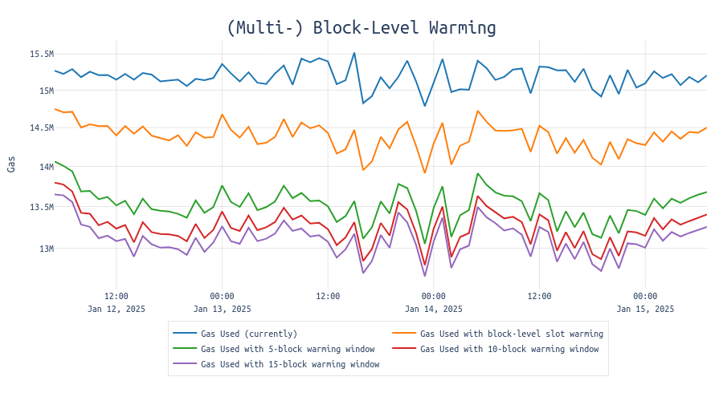
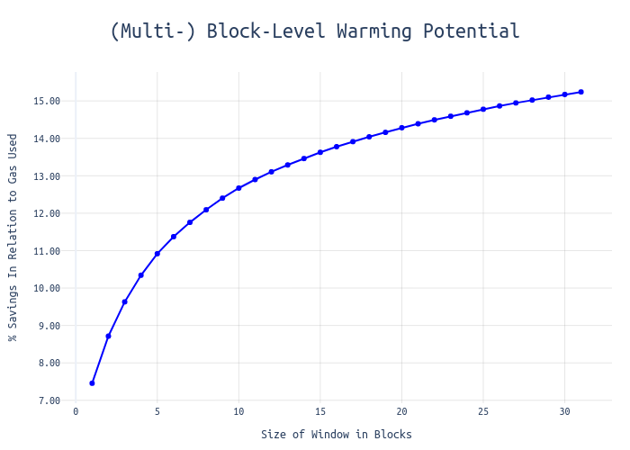
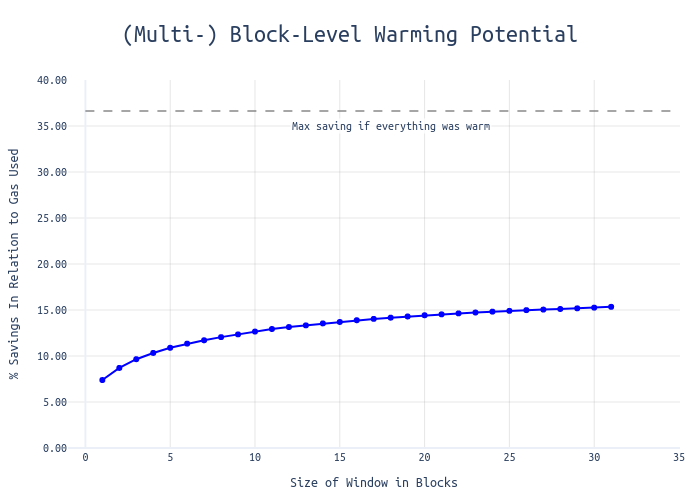

# Block-Level Warming


The proposal is to introduce block-level address and storage key warming, allowing accessed addresses and storage keys to maintain their "warm" status throughout an entire block's execution. Accessed slots can be effectively cached at the block level, allowing for this optimization.

Furthermore, a future transition to multi-block warming could unlock additional potential.

## Motivation
Currently, the EVM's storage slot warming mechanism operates at the transaction level, requiring each transaction to "warm up" slots independently, even when accessing the same storage locations within the same block. This design doesn't take advantage of the fact that modern node implementations can effectively cache storage access patterns at the block level. By extending the slot warming duration to the block level, we can:

1. Reduce redundant warming costs for frequently accessed slots
2. Better align gas costs with actual computational overhead
3. Improve overall network throughput without compromising security

## Impact Analysis

For the following, I analyze 22,272 blocks between 12 and 15 January 2025. The opcodes relevant for this analysis are those that distinguish between "warm" and "cold" access: These are SSTORE, SLOAD, BALANCE, EXTCODESIZE, EXTCODECOPY, EXTCODEHASH, CALL, CALLCODE, DELEGATECALL and STATICCALL.

The code used for conducting this analysis can be found [here](https://github.com/nerolation/blk-lvl-warming-analysis).

### Unlocking Potential

Block-level warming presents an immediate opportunity to achieve 5-6% efficiency gains in gas consumption. 

An initial analysis shows significant improvements in efficiency when comparing block-level warming to the current situation. In typical blocks consuming 15m gas, block-level warming could save approximately 0.5-1m gas per block - gas which would otherwise be spent on warming addresses and storage keys that were already accessed earlier in the block.

Even more promising results emerge when we extend the warming window. When accessed addresses and storage keys remain warm for 5 blocks, we can observe savings of up to 1.5m gas (~10%), as illustrated in the green line of the following chart:



The length of the warming window significantly impacts potential efficiency gains. This analysis shows that:
- A 5-block warming window yields approximately 10% gas savings
- Extending to 15 blocks increases savings to 15%

This relationship between window size and efficiency gains is demonstrated here:



To understand the maximum potential of this approach, we compared these results against a theoretical scenario where all addresses and storage keys remain permanently warm (eliminating all cold access costs):



This comparison highlights that over 35% of current gas consumption is attributed to the costs of warming addresses and storage keys. The efficiency curve shows a steep initial improvement before quickly plateauing, suggesting that even relatively short warming windows can capture a significant portion of the potential benefits.


Among the most popular addresses and storage slots we find candidates such as WETH, USDC and Uniswap. However, there are also less obvious contracts (e.g., `0x399121f5b1bab4432ff8dd2ac23e5f6641e6f309`) that primarily serve to burn gas (via warm SSTOREs). This tactic is used to circumvent on-chain priority gas limits, thereby increasing the total priority fees paid to the transaction’s fee recipient. For an example, see this [transaction](https://dashboard.tenderly.co/tx/mainnet/0x9eac0ada21d56e2e2adf8a36661baa5668b29e79424044b05447096b67d4c94d).


## Specification

### Mechanics
When a storage slot is accessed within a block:
1. The first access to a slot in a block incurs the cold access cost as of [EIP-2929](https://eips.ethereum.org/EIPS/eip-2929).
2. All subsequent accesses to the same slot within the same block incur only the warm access cost as of [EIP-2929](https://eips.ethereum.org/EIPS/eip-2929).
3. The warm/cold status resets at block boundaries

### Block Processing
1. At the start of each block:
   * Initialize two empty sets `block_level_accessed_addresses` and `block_level_accessed_storage_keys`
2. For each transaction in the block:
   * Before processing storage access:
     * Check if touched address is in `block_level_accessed_addresses`
     * If yes: charge `GAS_WARM_ACCESS`
     * If no:
       * Charge `GAS_COLD_ACCOUNT_ACCESS`
       * Add address to `block_level_accessed_addresses`
     * Check if storage key is in `block_level_accessed_storage_keys`
     * If yes: charge `GAS_WARM_ACCESS`
     * If no:
       * Charge `GAS_COLD_SLOAD`
       * Add storage key to `block_level_accessed_storage_keys`
    

### Implementation Details

> The following uses the [ethereum/execution-specs](https://github.com/ethereum/execution-specs). Find a first draft implementation [here](https://github.com/nerolation/execution-specs/tree/block-level-warming).

The proposal modifies the block execution process to maintain block-level sets of accessed addresses and storage slots. 

#### Block-Level Storage Management

```python
def apply_body(...):
    # Initialize block-level tracking sets
    block_level_accessed_addresses = set()
    block_level_accessed_storage_keys = set()
    
    for i, tx in enumerate(map(decode_transaction, transactions)):
        # Create environment with block-level context
        env = vm.Environment(
            # ... other parameters ...
            block_level_accessed_addresses=block_level_accessed_addresses,
            block_level_accessed_storage_keys=block_level_accessed_storage_keys
        )
        
        # Process transaction and update block-level sets
        gas_used, accessed_addresses, accessed_storage_keys, logs, error = process_transaction(env, tx)
        block_level_accessed_addresses += accessed_addresses
        block_level_accessed_storage_keys += accessed_storage_keys
```
This code illustrates the implementation of block-level slot warming at the execution layer. The `block_level_accessed_addresses` and `block_level_accessed_storage_keys` sets are maintained throughout the block's execution and passed to each transaction's environment.


#### Transaction Processing

```python
def process_transaction(env: vm.Environment, tx: Transaction) -> Tuple[Uint, Tuple[Log, ...], Optional[Exception]]:
    preaccessed_addresses = set()
    preaccessed_storage_keys = set()
    
    # Add block-level pre-accessed slots
    preaccessed_addresses.add(env.block_level_accessed_addresses)
    preaccessed_storage_keys.add(env.block_level_accessed_storage_keys)
    
    # Handle access lists from transaction
    ...
```
This adds the block-level accessed addresses and storage keys to the preaccessed addresses and storage keys.
As a result, from the perspective of a transaction, block-level accessed addresses and storage keys are treated the same as precompiles or the coinbase address.

```python
def process_message_call(message: Message, env: Environment) -> MessageCallOutput:
    return MessageCallOutput(
        # ... other fields ...
        accessed_addresses=evm.accessed_addresses,
        accessed_storage_keys=evm.accessed_storage_keys
    )
```
The message call processing tracks accessed addresses and storage keys during execution, which are then propagated back up to the transaction level and ultimately to the block level.

## Rationale
The proposal builds on several key observations:

1. **Caching Efficiency**: Today's Ethereum clients already implement sophisticated caching mechanisms at the block level. Extending address and storage key warming to match this caching behavior better aligns gas costs with actual computational costs.

2. **Backward Compatibility**: The worst-case scenario for any transaction remains unchanged - it will never pay more than the current cold access cost for its first access to a slot.

3. **First Access Warming System**
The proposed mechanism operates on a "first warms for all" principle: when a transaction first accesses and warms multiple addresses or storage slots in a block, it bears the entire warming cost. Subsequent transactions can then access these warmed slots without additional costs.
This approach aligns well with current dynamics, as early block positions are typically occupied by professional builders who specifically target top-of-block execution. Since the cost difference is relatively minor, this straightforward approach is preferred over more complex alternatives aimed at better fairness.
An alternative approach would distribute warming costs across all transactions within a block that access the same slots. Under this system:
    - Each transaction would initially pay the full cold access cost
    - After block execution completes, these costs would be evenly distributed among all transactions that accessed the slots
    - The excess payments would then be refunded to transaction originators

    While this alternative creates a more equitable cost distribution, it introduces significant additional complexity. The tradeoff between fairness and simplicity remains a key consideration. In particular, when combined with multi-block warming, refund redistribution might be even more challenging.
    
4. **Alternative Block Warming Windows**: Instead of applying warming at the block level, more advanced multi-block warming approaches can be considered. Potential options include:
    * Warming addresses and storage keys over the duration of an epoch
    * Using a ring buffer spanning `x` blocks

    Since the Execution Layer currently operates without regard to epoch boundaries, it may be preferable to maintain this design and not consider epochs. Therefore, the second option, involving a ring buffer of size `x`, might be more suitable.


## Reference Implementation

Find a first draft implementation of block-level warming here:
https://github.com/nerolation/execution-specs/tree/block-level-warming

## Related work:
* https://www.usenix.org/conference/fast25/presentation/he
* https://github.com/ethereum/EIPs/pull/7968/commits/d7dffe0e539154024156ed85126c8747617c1cf1
* https://ethresear.ch/t/block-access-list/9357
* https://ethresear.ch/t/proper-disk-i-o-gas-pricing-via-lru-cache/18146