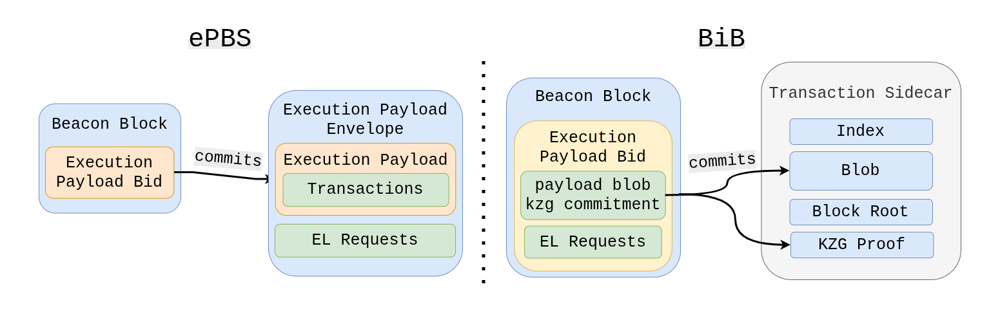
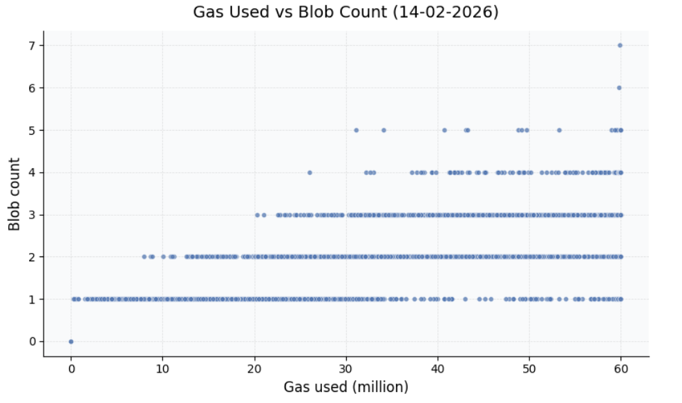
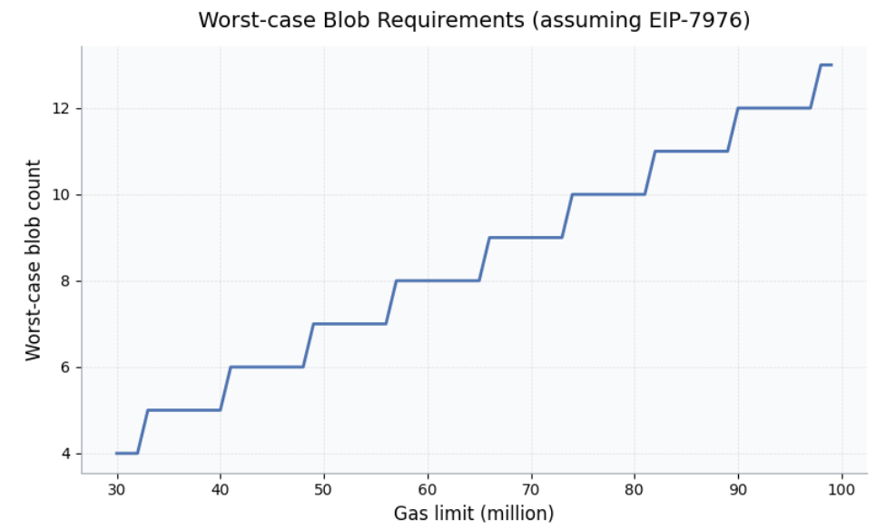

# Blocks Are Dead. Long Live Blobs.

Thanks to [Kev](https://x.com/kevaundray), [Francesco](https://x.com/TauLepton_), [soispoke](https://x.com/soispoke/), [Anders](https://x.com/weboftrees) and [Jihoon](https://x.com/jih2nn) for feedback and review.
> **TL;DR:** Block in Blobs (BiB) takes transactions in RLP format, and encodes it as a blob (similar to type-3-txs). This is beneficial in a zkEVM world as not everyone will need to download every transaction anymore - reducing bandwidth requirements.

[With zkEVM coming](https://zkevm.ethereum.foundation/), validators will no longer need to execute transactions to verify blocks: a succinct proof will be enough. But this changes how data availability works.

**Today, DA is enforced implicitly**: you can't verify a block without downloading and executing its transactions. Under zkEVM, validators verify proofs, not transactions directly. A builder could publish a valid block and proof while withholding the underlying transaction data. The block would pass consensus, but no one could re-execute it, index it, or reliably build on top of it.

**[Block-in-Blobs (BiB)](https://github.com/ethereum/EIPs/blob/8bb55846b3d4f3fe4efc542a818b8c17a472074d/EIPS/eip-8142.md)** addresses this by encoding transaction data into blobs, making DA a consensus-level requirement. Validators can then [sample](https://ethresear.ch/t/from-4844-to-danksharding-a-path-to-scaling-ethereum-da/18046) rather than download: same guarantees, less bandwidth, more scale.

In the following, I want to walk through the design space and things that helped me wrap my head around it.

---

## background: blocks, payloads, and transactions

To understand BiB, we first need to untangle some terminology. Ethereum is split into two layers: the **Consensus Layer (CL)** and the **Execution Layer (EL)**. This separation is intentional and powerful, but it introduces conceptual friction, especially around what exactly a *block* or *payload* is.

### blocks vs. execution payloads

From the consensus layer's point of view, the canonical object is the **beacon block**. A beacon block may include an **`ExecutionPayload`**, but it is not itself an execution block.

The **ExecutionPayload** is the object exchanged between CL and EL via the Engine API:

* During **block building**, the EL constructs an `ExecutionPayload` and hands it to the CL.
* During **validation and attestation**, the CL hands the payload back to the EL for execution.

The `ExecutionPayload` is *not* the EL's native block format. Instead, it contains exactly the information the EL needs to reconstruct and validate an execution block internally.

The `ExecutionPayload` size grows with the block gas limit, but also depends on the calldata pricing and other factors. With increasing block gas limits, block sizes increase too, and so do bandwidth requirements. Fortunately, there're two solution. 
First, following the example of [Flashblocks](https://docs.optimism.io/op-stack/features/flashblocks), we could split the payload into constant-size pieces, enabling them to be processed independently - effectively hiding latency. 
Second, we could think of ways that allow validators to not download all transaction while still having certainty about them being published - Block in Blobs (BiB). While [this post](https://ethresear.ch/t/payload-chunking/23008) described the first solution, I want to focus on the second one in the following.

[BiB](https://github.com/ethereum/EIPs/blob/8bb55846b3d4f3fe4efc542a818b8c17a472074d/EIPS/eip-8142.md) proposes to encode blocks (potentially also the [Block-level Access List (BAL)](https://eips.ethereum.org/EIPS/eip-7928)) into constant-size blobs. Similar to type-3-tx blobs, validators will then not need to download the full `ExecutionPayload` anymore but instead only the columns they have custody over. This unlocks scaling benefits because not every validator will need to download everything, reducing bandwidth requirements without weakening the security/availability guarantees.

So when people say "*put blocks into blobs*", what they really mean is putting the CL's **execution payload** into blobs... and even that isn't the full truth.

## what BiB actually encodes

Despite the name, BiB doesn't put entire blocks, or even entire execution payloads, into blobs. In its simplest form, the protocol only needs to ensure **transaction data availability**.

Transactions inside the `ExecutionPayload` are already in the right shape:

* Each transaction is already RLP-encoded bytes.
* The payload contains a list of these bytes.

**BiB takes the serialized RLP-encoded transactions, chunkifys them and packs them into blobs.**

Everything else execution-related (EL header fields, execution output roots, etc.) would either move into the beacon block or come in a separate sidecar with a commitment in beacon block. BiB guarantees that **the information needed for re-execution is available**.

> Block-level Access Lists (BALs) may share the same destiny as transaction. Since the users of BALs may be different from the users of transactions, it might make sense to put BALs into blobs too but separate from the transactions.

---

## how transactions become blobs

With the "what" and "why" established, let's look at the "how." Blob encoding follows the [EIP-4844](https://github.com/ethereum/EIPs/blob/8bb55846b3d4f3fe4efc542a818b8c17a472074d/EIPS/eip-4844.md) model:

1. **Serialize transaction bytes**
   * Take `payload.transactions` (each already RLP-encoded)
   * Canonically encode the list (typically RLP of the list of tx-bytes)
2. **Pack bytes into blobs**
   * Split the byte stream into **31-byte chunks**
   * Each chunk becomes the first 31 bytes of a 32-byte field element
   * The first byte is set to `0x00` so the element stays under the BLS modulus
   * 4096 field elements form one blob
3. **Commit**
   * Interpret the blob as a polynomial
   * Compute a **KZG commitment**
   * The beacon block references these commitments
4. **Sidecar**
   * Similar to type-3-tx sidecars, or the `ExecutionPayloadEnvelope` as of ePBS, the payload blob travels the network in a sidecar
   * In addition to the payload blob, each sidecar comes with an index, kzg proofs, the slot number and the beacon block root.
5. **Custody**
   * Initially, validators may store all payload blobs without leveraging DAS
   * Validators can download the payload blobs (which is almost the equivalent to downloading the `ExectutionPayloadEnvelope` under ePBS) and locally construct the `ExecutionPayload` from it. 
   * At a later stage, partial custody and DA sampling can be introduced, leveraging the newly introduced mechanism for scaling (not requiring everyone to download all transactions)
   * The same applies to erasure encoding and cell-level messaging


The key insight: under zkEVMs **validators don't need the transactions to verify commitments**. They only need commitments for consensus, while DA sampling ensures the blob contents are available on the network. 


## what the zkEVM proof must bind

For BiB to work for zk-attesters **who don't download all payload blobs**, the proof must guarantee three things:

1. **Execution correctness**
   The state transition from `pre_state` to `post_state` is valid.
2. **Correct transaction-to-blob encoding**
   The exact canonical transaction bytes were packed into the blobs.
3. **Commitment binding**
   The blob commitments referenced by the beacon block correspond to those payload blobs.

Together, these requirements transform data availability from "implicit via re-execution" into "explicit via blob commitments + DAS."

**Note**: **BiB and zkEVMs/mandatory-proofs are orthogonal:** 
BiB can be rolled out iteratively, starting with putting transactions (and potentially the BAL) into blobs without yet introducing mandatory zk-proofs for execution and blob-encoding. Furthermore, the partial data custody doesn't need to be done right from the beginning. BiB, in its minimal form, simply takes the RLP encoded transactions, and encodes them into blobs. From the EL perspective nothing changes - upon receipt, the CL constructs the `ExecutionPayload` from the received blobs and builds the EL block from it - just like today. At this point, those blobs can already be used by zk-attesters consuming optional proofs, which are slated to be rolled out pre-mandatory proofs for a limited set of attesters.


## where the rest of the payload goes

BiB doesn't move the entire execution payload into blobs: only the transaction data.

Building on top of ePBS, the beacon block carries the **execution header** (or commitments / metadata) while **the payload** is made available **separately via blobs**.

Blobs carry the heavy bytes; bids carry the compact commitments.



> This design would complicate moving to slot auctions in the future. If we want to keep that option, we may still need ePBS's `ExecutionPayloadEnvelope` alongside the sidecars or move EL requests into the payload blobs too.

---

## how many blobs will payloads need?

Finally, let's ground this in concrete numbers. Today's execution payloads at a 60M gas limit average ~150 KiB (=~1-2 payload blobs), with a maximum size of ~5.7 MiB (depending on EL data pricing). 

The maximum number of payload blobs depends on both the gas limit and calldata pricing. Looking at recent blocks, a 60M gas limit occasionally produces 3-4 blob blocks:



In the worst case, assuming [EIP-7976](https://eips.ethereum.org/EIPS/eip-7976) (64 gas per byte for calldata-heavy transactions), we'd need ~7 blobs filled with calldata. With today's calldata pricing (10/40 gas), that number jumps to 45 blobs, and generalizing it further, we get the following formula to determine the max blob count needed:

$$
N= \left\lceil \frac{L}{c \cdot B} \right\rceil
$$

where
$L$ = block gas limit
$c$ = calldata gas cost (gas/byte)
$B$ = blob size (bytes)




---

# appendix - unified data gas

BiB answers *how* to make transaction data available via blobs. But it surfaces a more fundamental question: **how do we account for all this data?**

Today, Ethereum has two separate resource dimensions for data:

1. **Execution gas**: used by calldata (4/16 gas per zero/non-zero byte, or 10/40 at the [EIP-7623](https://eips.ethereum.org/EIPS/eip-7623) floor)
2. **Blob gas**: used by type-3 transaction blobs (131,072 blob gas per blob)

These dimensions have **independent limits**. The block gas limit caps execution gas; `MAX_BLOB_GAS_PER_BLOCK` caps blob gas. A block can max out *both* simultaneously.

### the additive worst case

Under BiB, calldata becomes blobs. But type-3 transactions *also* carry blobs. Without changes to resource accounting, we face an additive worst case:

$$
N_{worst} = N_{calldata} + N_{type3} = \left\lceil \frac{L}{c \cdot B} \right\rceil + \frac{\text{MAX_BLOB_GAS}}{\text{GAS_PER_BLOB}}
$$

With a 60M gas limit, EIP-7976 pricing (64 gas/byte), and 21 type-3 blobs:

$$
N_{worst} = 7 + 21 = 28 \text{ blobs}
$$

With today's calldata pricing (10/40 gas), this equals **11 + 21 = 32 blobs**, all non-compressible.

## unified data gas: one dimension for all DA

The elegant solution is to collapse data from calldata and blob data into a single **data dimension**. The core principle:

**All data that needs to be made available should count against the same limit.**

The fragmentation exists only at the EL, where we have:

```python
# Current: TWO separate checks
assert tx.gas <= block_gas_limit - block.gas_used         # execution gas
assert tx.blob_gas <= MAX_BLOB_GAS - block.blob_gas_used  # blob gas
```

With BiB, both transactions and type-3 blobs become the same thing: blobs, and the accounting should reflect this.

### design: unified data gas

Replace the two-dimension model with a single **data bytes** dimension:

```python
BYTES_PER_BLOB = 131_072                      # 128 KiB
MAX_DATA_BYTES = max_blobs * BYTES_PER_BLOB   # e.g., 28 blobs ≈ 3.5 MiB

def data_bytes(tx):
    # Full encoded tx goes into payload blob
    tx_bytes = len(rlp_encode(tx))

    # Type-3 blob sidecars add more DA
    if tx.blob_versioned_hashes:
        tx_bytes += len(tx.blob_versioned_hashes) * BYTES_PER_BLOB

    return tx_bytes
```

> Note: The full RLP-encoded transaction (signature, nonce, gas fields, *and* calldata) is packed into payload blobs. The tx envelope overhead (~100-200 bytes per tx) is real DA.

Block-level enforcement becomes a single check:

```python
# One unified check (replaces separate gas + blob_gas checks)
if data_bytes(tx) > MAX_DATA_BYTES - block.data_bytes_used:
    invalid("data limit exceeded")
```

No more additive worst case. A block can have 28 blobs worth of data, whether that's 28 type-3 blobs, 28 blobs of encoded transactions, or any mix.

### separating execution from DA

Calldata currently pays execution gas that implicitly covers both computation *and* data availability. With unified data gas, we cleanly separate these concerns:

```python
def intrinsic_cost(tx):
    # Execution gas: pure compute (no calldata costs!)
    exec_gas = TX_BASE_COST + access_list_cost + create_cost + auth_cost

    # Data bytes: full tx + blob sidecars
    data = len(rlp_encode(tx))
    if tx.blob_versioned_hashes:
        data += len(tx.blob_versioned_hashes) * BYTES_PER_BLOB

    return exec_gas, data
```

Notice what's missing: **no calldata gas costs, no EIP-7623 floor**.

### why the calldata floor becomes unnecessary

[EIP-7623](https://eips.ethereum.org/EIPS/eip-7623) introduced a calldata floor to prevent large blocks from calldata that come with no execution, ensuring calldata-heavy transactions can't underpay for the bandwidth burden they impose, while not consuming any other resource. But in a unified data fee market, this protection comes *for free*:

| Concern | EIP-7623 Solution | Unified Data Gas Solution |
|---------|-------------------|---------------------------|
| Spam prevention | Floor gas cost (10/40 per byte) | Data fee market (rising `data_base_fee`) |
| Price signal | Implicit in execution gas | Explicit `data_base_fee` per byte |
| Adaptivity | Fixed floor | Dynamic (EIP-1559-style adjustments) |

If someone tries to fill blocks with calldata, `data_base_fee` rises, just like `base_fee_per_gas` rises when blocks are full. The market handles spam prevention automatically.

The cleaner model:

* **Execution gas** = pure compute (`TX_BASE_COST` + access lists + auth + create + opcodes during execution)
* **Data bytes** = all DA (full encoded transaction bytes + blob sidecar bytes)

No double-counting. No floor. One fee for compute, one fee for data.

### eip-1559, but for data

Just as blob gas has its own EIP-1559-style fee market, unified data bytes would too:

```python
# EIP-1559-style pricing for data (same mechanism as blob gas today)
data_base_fee = fake_exponential(MIN_DATA_PRICE, excess_data_bytes, UPDATE_FRACTION)

# Excess tracking (same as blob gas)
excess = max(0, parent.excess_data_bytes + parent.data_bytes_used - TARGET_DATA_BYTES)
```

A new transaction type introduces an explicit data fee cap, giving users finer-grained control over how much they are willing to pay for data:

```python
# New transaction type fields (similar to type-3 for blobs)
tx.max_fee_per_data_byte   # explicit data fee cap
tx.blob_versioned_hashes   # for blob sidecars
```

The full validation flow looks like the following:

```python
def validate(tx, block):
    exec_gas, data = intrinsic_cost(tx)

    if has_explicit_data_fee(tx):
      # New tx type: explicit per-dimension caps
      max_cost = tx.gas * tx.max_fee_per_gas + data * tx.max_fee_per_data_byte
      assert tx.max_fee_per_data_byte >= data_base_fee
    else:
      # Legacy: single aggregate budget (EIP-7999 style)
      max_cost = get_max_fee(tx)  # gas_price × gas_limit
      required = exec_gas * base_fee_per_gas + data * data_base_fee
      assert required <= max_cost

    assert exec_gas <= tx.gas
    assert data <= MAX_DATA_BYTES - block.data_bytes_used
    assert sender.balance >= max_cost + tx.value

```

### backwards compatibility

The `max_fee_per_data_byte` field is introduced in a new transaction type. But existing transactions remain fully compatible via **gas limit partitioning** (see [EIP-7999](https://eips.ethereum.org/EIPS/eip-7999) for details):

```python
def partition_gas_limit(tx):
    if has_explicit_data_fee(tx):  # new tx type
        return tx.gas, data_bytes(tx)
    else:  # legacy types
        calldata_tokens = zero_bytes + 4 * non_zero_bytes
        execution_gas = tx.gas - STANDARD_TOKEN_COST * calldata_tokens
        return execution_gas, data_bytes(tx)
```

The key insight: legacy transactions' `gas_price × gas_limit` already provides a total budget. This budget now covers both execution gas and data gas: the calldata cost simply moves from one dimension to another. No extra funds required.

### header changes

The block header tracks data usage instead of blob gas:

```python
# Replace these fields:
blob_gas_used       →  data_bytes_used      # total DA in this block
excess_blob_gas     →  excess_data_bytes    # for EIP-1559 pricing
```

A first draft of the Unified Data Gas specification is available [here](https://github.com/ethereum/execution-specs/compare/forks/amsterdam...nerolation:execution-specs:toni/unified-data-gas).


---

## two orthogonal proposals

Here's the key insight: **BiB** and **Unified Data Gas** *solve different problems.*

|  | BiB | Unified Data Gas |
|--------|-----|------------------|
| **Problem solved** | How to make calldata DA-sampleable | How to bound total DA requirements |
| **Mechanism** | Encoding (transactions → blobs) | Accounting (one limit for all data) |
| **Layer affected** | CL (blob sidecars, commitments) | EL (gas metering, intrinsic costs) |
| **Can exist alone?** | Yes | Yes |

BiB without unified data gas still works: you just accept the additive worst case or introduce ad-hoc limits. **This isn't different to how the protocol works today.**
Unified data gas without BiB also works: it bounds total data but doesn't enable DAS for transactions.

**Together, they're synergistic: BiB provides the *encoding*, unified data gas provides the *accounting*.**