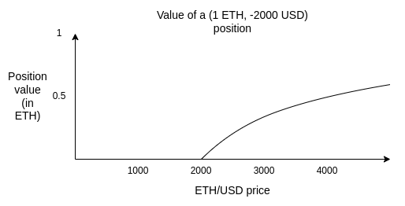
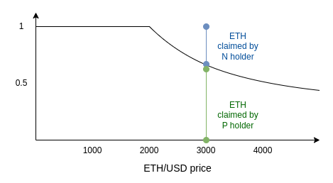
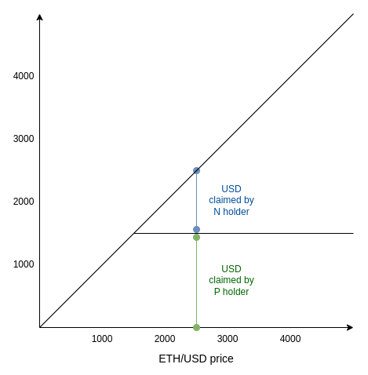
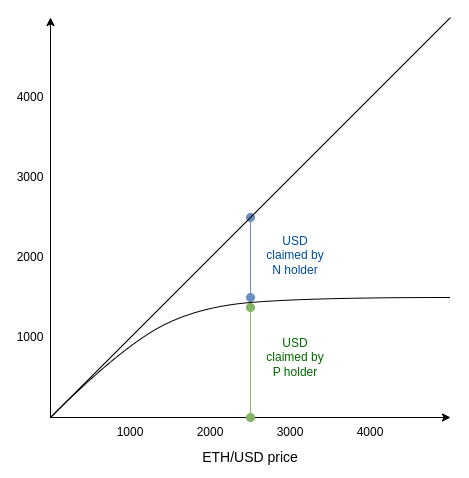
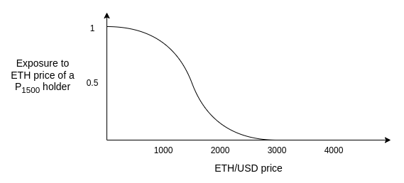

_Special thanks to Vladimir Novakovski, Curve developers, and others for feedback and review._

Suppose that you have some ticker `T`, which represents a price index denominated in ETH. For example, `T` could equal the USD/ETH price (ie. inverse of ETH/USD). Or CPI/ETH (aka CPI/USD * USD/ETH). Or the same for any other commodity. Or more exotic indices (eg. average rent prices in a city). You want to give users the ability to have exposure to `T`.

In simpler terms, your goal is to create something like a synthetic asset that tracks `T` , without relying on centralized issuers, on top of an ecosystem where the only “trustless” asset is ETH (or this could be applied to other trustless assets). The only trust dependency is an oracle, but oracles can be trust-minimized in a way that issuers cannot.

If you take `T` to be the USD/ETH price, this is basically the same problem as “algorithmic stablecoins”. But more generally, it’s perpetual futures.

All attempts at providing this functionality have to deal with a fundamental issue. The system as a whole can only hold ETH. Its assets and liabilities in T must add up to zero. So for every holder of positive-T, there must be a holder of the same quantity of negative-T. What happens if T rises so high that a holder of negative-T goes “bankrupt"?

In traditional algorithmic stablecoins, this is handled through forced liquidation.

For example, imagine that ETH is at $2500, and a user holds a position of (1 ETH, -2000 USD).

If the ETH price drops to 2000 (or realistically somewhat higher, to add a safety margin), the system must be able to “force-liquidate” the user: give anyone else the opportunity to send in 2000 USD, and collect the underlying 1 ETH, so that the system as a whole is not stuck hanging with an unbalanced debt of 2000 USD that is not sufficiently covered by collateral.

The problem with relying on liquidations is that liquidations depend on **real-time oracles**. You need a price oracle that is capable of giving a binding value for the ETH/USD price, and doing so in real time.

Real-time oracles are very hard to make safe. You can only rely on a limited number of actors, who are watching real-time signals in an automated way. You cannot use mechanisms that incorporate any notion of recourse. You cannot use what is by far the most effective technique to make a safe and cheap oracle: put a prediction market in front of a safe but expensive oracle, and only use that oracle in case of serious disagreement.

This post proposes to **make synthetics rely only on “slow” oracles** by flipping the problem on its head: we remove the entire concept of liquidations by making the “base building block” of the system **options rather than debt**. On top of that building block, you can then either build an index-tracking asset as a higher-level construct, or not bother with that at all, instead relying on users to re-balance on their own. Decoupling these two mechanics leads to much more stability and flexibility.

## Synthetic options

Let us define two assets: `P` and `N` .

The parameters are: (i) ticker `T` , (ii) strike price `S` , (iii) maturity date `M`

A `(P, N)` pair can be generated at any time by splitting 1 ETH. Similarly, at any time you can combine P and N to get back 1 ETH.

At time M, the oracle is called, to determine the value of T. Let that value be x. Whenever the oracle resolves:

* P receives `min(1, S / x)` ETH
* N receives `max(0, 1 - S / x)` ETH

Notice that `P + N = 1`. Hence, there is no possibility of liquidation.

Also, for convenience, this is the same chart but denominated in USD:

One interesting property of this design is that it literally is “just” a prediction market, of a type that already exists and has been traded for years. See: scalar markets https://seer-2.gitbook.io/seer/prediction-market-basics/scalar-markets

This means that this design will be able to share an oracle with prediction market systems, increasing its security.

## How to use synthetic options

Imagine that the current price is 2500, and you, as a user, want to have a portfolio that has some level of exposure to USD. You buy some quantity of P1500, a P-asset whose strike price is far below 2500 (in this case, 1500). Is that sufficient?

Not quite. Even though *today* the price is far above 1500, there is a possibility that by the time the maturity date hits, the price will fall below 1500. The greater that risk gets, the further the USD-denominated value of P1500 drops below its maximum. In fact, it starts to diverge quadratically from 1 USD.

The graph looks something like this:

Notice that this is “just” a smoothed-out version of the above curve. How *much* smoothing there is depends on both how far the current price is from 1500, and on expectations of how much the price will move.

To see how this works, imagine that M is two weeks from now, and the current price is 1499. What is P1500 worth? it’s worth the possibility that the ETH/USD price will be above 1500 in two weeks. ETH is sometimes volatile; this could be quite a lot, or it could be little. eg. it could be $50. What if the current price goes down to 1399? The price of P would go down, but still it would not quite be zero, because there’s still a chance that it would go back above 1500 by the time M hits.

As ETH/USD goes far below 1500, the value of N approaches zero. As ETH/USD goes far above 1500, it approaches `price - 1500` . And in the middle, it’s a smooth curve transitioning from one mode to the other.

The [Black-Scholes equation](https://en.wikipedia.org/wiki/Black%E2%80%93Scholes_model) is a formalization that attempts to estimate the correct price for P1500 (at least, in situations were the index `T` represents something that actually is some kind of price, and not something more exotic like, say, weather). However, since 2008, the Black-Scholes equation has become a byword for over-confidence in mathematical models leading to ruinous fragility, for good reason; so we should be careful to put too much faith in the details of the curve - at the very least because we don’t want to have *yet another oracle* that measures expected volatility, or [skewness](https://en.wikipedia.org/wiki/Skewness) or [kurtosis](https://en.wikipedia.org/wiki/Kurtosis).

Instead, we should remember the following graph, which is the *derivative* of the last graph above. This tells you: at current price levels, how much ETH *exposure* do you have per unit of P1500?

Remember, as a P1500 holder, your goal is to “hold” USD and have no exposure to ETH. What this graph tells you is: the safe bet is to hold deep “in-the-money” options, and then rotate them into options with a lower strike price as soon as the price gets anywhere remotely close to the the strike price.

For example, you might follow an algorithm: if the current price is X, buy PS with S < X/2 and M 1-2 months in the future. If the price drops to below S * 1.5, then rotate out into PS’ with `S’ < X/4` . Don’t hold anything to maturity, as that would give you exposure to ETH while the oracle resolves.

Rely on speculators and market makers to hold N and provide liquidity for you.

We can compare the properties of options-based synthetics and liquidation-based synthetics as follows:

 

||Liquidation-based synthetics|Options-based synthetics|
| --- | --- | --- |
|Normal-case behavior|Holding synthetic {asset}, no exposure to ETH|Holding synthetic {asset}, no exposure to ETH|
|Extreme-case behavior|Nothing, until you suddenly get liquidated|Slow quadratically-growing deviation from your preferred exposure|
|Oracle dependence|Real-time (greatly weakens achievable security)|Long delays are acceptable|
|Vulnerability to temporary price spikes / drops|Present by default, avoidable by being conservative on capital|Less severe by default; depends on your personal rebalancing strategy|

 

In both systems, there is some action that needs to happen in response to large price movements: in one case the protocol liquidating, in the other case users rebalancing. The key difference with options-based synthetics is that the user gets a choice of how do do this.

Rebalancing *could* be done via a fully-automated onchain DAO (note: fully-automated. All rules, no voting, no AI either). Such a DAO would be a “wrapper” around the options system, and that would provide the “stablecoin”. Alternatively, users could choose when to rebalance locally, using a daemon on their own device to do this.

By moving the decision point of “when to {liquidate / rebalance}” from an onchain gadget to the user, we get two advantages:

1. Reduce the user’s MEV risks, because the transaction is not visible ahead of time
2. Remove dependence on a global canonical oracle. Users would still have to depend on oracles that have faster response time than eg. two weeks, but the user could hide which oracle they use (eg. their locally running agent queries a dozen financial news sites, no one else knows which ones, and takes the median). This helps protect the system from oracle attack

The main choice that the user has is over timing and thresholds. If the user rebalances frequently, they become more vulnerable to adversarial short-term price movements. If a user rebalances conservatively, they get more quadratic drift.

I would argue that simply accepting a medium amount of quadratic drift (eg. standev ~1-4% per year) is underrated. The cost is definitely significant. It’s unintuitive, and it makes this design unusable as an “accounting stablecoin” (ie. being able to “pretend it’s USD” to people you send and receive it from, or capital gains tax authorities).

However, it makes much more sense, if you view it not in the context of “I want simulated USD”, but rather in the context of “I want price stability” (ie. ability to pay a known quantity of one’s own future expenses). Fiat currencies move much more than 1-4% per year against each other. Each individual person or business’s expected future expenditure has much more than 1-4% per year volatility denominated in their local fiat. Also, the equilibrium return rate of an algorithmic stablecoin (eg. RAI) also regularly moves by roughly as much.

An important decision to make is: even if you rebalance conservatively, what is the market mechanism by which rebalancing happens? It is very easy to lose 2% per year or more from multiple rounds of slippage, and this is the largest risk by which this whole scheme might become uncompetitive.

Fortunately, a user’s time preference will almost always be very low. Users do not care if they rebalance today or tomorrow or three days from now. We should take advantage of this to figure out an ideal market structure that minimizes slippage far more than traditional AMMs do. Rebalancing would be more like one-sided market making than like making an instant sell.