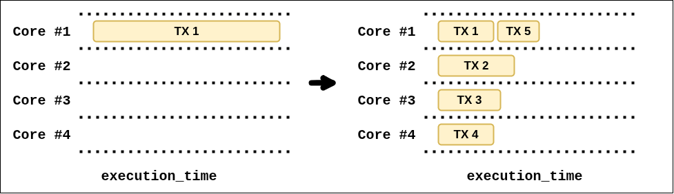
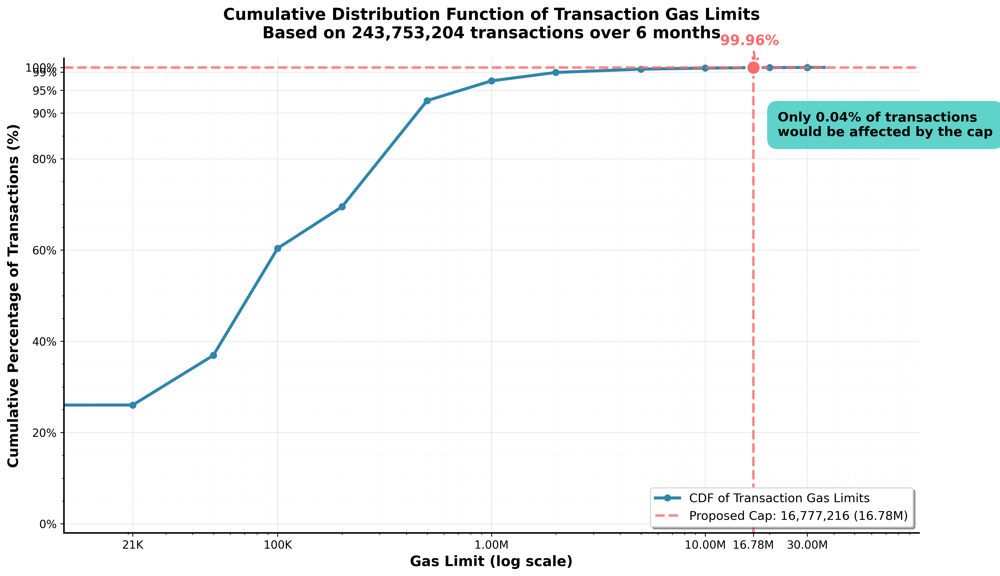
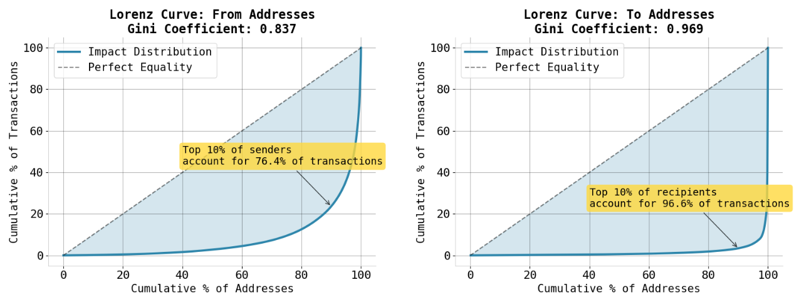

# Capping Transaction Gas: Data, Impact, and Rationale

Find the full analysis [here](https://github.com/nerolation/eth-16m-gas-cap-analysis/blob/main/eip_7983_comprehensive_analysis.ipynb).

TL;DR:
1. Impact of introducing a cap at ~16.7m is highly concentrated among a small number of sophisticated users/apps
2. Economic impact is minimal (max individual cost for user < 0.27 ETH over 6 months)
3. The gas cap would improve DoS resistance and parallelization potential without significant disruption

Ethereum currently permits a single transaction to consume the entire block gas limit. This flexibility, while useful, poses risks: it worsens DoS potential, strains client implementation, and constrains advances in parallelization.

[EIP-7987](https://github.com/ethereum/EIPs/pull/9984/files) proposes a simple fix: a hard cap of **16,777,216 gas (2²⁴)** per transaction. This post summarizes a six-month study of 252 million mainnet transactions to assess its impact.

The cap is now part of [EIP-7825](https://eips.ethereum.org/EIPS/eip-7825) and was merged in [this PR](https://github.com/ethereum/EIPs/pull/9986).

## The Case for a Cap

Nodes benefit from bounded transaction cost. Currently, a single transaction can consume 100% of block gas, constraining parallel block validation and distributed block proving. 
The introduction of a per-transaction cap removes these worst-case scenarios without changing block-level flexibility.

## Measuring Impact

To evaluate the effect of the proposed transaction size limit, we analyzed 1.3 million blocks, spanning more than 251 million transactions. This rather large-scale dataset allows us to assess how many transactions would be impacted, who is sending them, and what the cost implications would be under the new conditions.

> The [Xatu](https://ethpandaops.io/data/xatu/) dataset was used for this analysis.

You can find the code and data in [this GitHub repository](https://github.com/nerolation/eth-16m-gas-cap-analysis).

### Concentrated Impact

Over six months, only **96,577 of 251,922,669 transactions** (0.0383%) would have exceeded the proposed limit. These came from **4,601 addresses**, most of which sent only a small number of such large transactions, and went to 983 unique recipients. 1,846 senders (40.1%) only had a single transaction impacted. 

**Only 0.038% of transactions exceed 16,777,216 gas — 99.96% are unaffected.**

**There are five times more unique senders than unique recipients among transactions exceeding 16.77 million gas.**
--> This points towards some contracts being used by multiple accounts. 

Taking a closer look at the involved entities of the top 10 recipient addresses of >16.77m transactions, we stumble across many XEN contracts:

| To Address   | Entity Name            |   Transaction Count |   % of >16.77m Transactions |
|:-------------|:-----------------------|--------------------:|--------------------------:|
| 0x0de...628  | XEN Minter             |               31406 |                      32.6 |
| 0x0a2...a59  | XEN Crypto Token       |               26048 |                      27.0 |
| 0x000...20b  | XEN Batch Mint         |               10110 |                      10.5 |
| 0x2f8...479  | XEN Batch Minter #2    |                6688 |                       6.9 |
| 0x332...c49  | Banana Gun Router      |                1994 |                       2.1 |
| 0x0a9...eba  | XEN Custom Contract    |                1345 |                       1.4 |
| 0xc3c...26f  | XEN Minter             |                1302 |                       1.4 |
| 0x404...c73  | Batch Contract Creator |                1130 |                       1.2 |
| 0xbd8...3d5  | XEN Minter Contract    |                 924 |                       1.0 |
| 0x4f4...6a5  | Axelar Batch           |                 906 |                       0.9 |

> Find a longer list [here](https://github.com/nerolation/eth-16m-gas-cap-analysis/blob/main/outputs/6month_analysis/reports/gas_cap_6month_report_20250714_102429.md).

A small number of contracts dominate the affected set. The top 10 recipient addresses account for 84.9% of impacted transactions, with just two XEN-related contracts responsible for nearly 60%. This confirms the impact is highly concentrated in a few batching-heavy apps.

While sender concentration is also high, the Lorenz curve for recipients deviates even further from the dashed line of perfect equality, highlighting a sharper skew.

Looking at the potentially most affected transaction senders, we see XEN users being affected the most.

| From Address   | Entity Name            |   Transaction Count |   % of >16.77m Transactions |
|:---------------|:-----------------------|--------------------:|--------------------------:|
| 0x22d...3e1    | MCT: MXENFT Token User |                2555 |                       2.6 |
| 0xc87...e85    | wywy.eth               |                2205 |                       2.3 |
| 0x78e...ffe    | XEN User #1            |                1712 |                       1.8 |
| 0x2a8...41c    | XEN User #2            |                1559 |                       1.6 |
| 0xcde...6ff    | XEN User #3            |                1543 |                       1.6 |
| 0x61f...c6f    | aifi2025.eth           |                1345 |                       1.4 |
| 0x4ab...f32    | liudaoyyds.eth         |                1287 |                       1.3 |
| 0xd6a...e77    | XEN User #4            |                1189 |                       1.2 |
| 0x734...678    | XEN User #5            |                1100 |                       1.1 |
| 0xb5b...8d9    | XEN User #6            |                1089 |                       1.1 |

> Find a longer list [here](https://github.com/nerolation/eth-16m-gas-cap-analysis/blob/main/outputs/6month_analysis/reports/gas_cap_6month_report_20250714_102429.md).

For the XEN user `0x22d…3e1` this would mean paying at least 2,555 * 21,000 additional gas. Assuming an ETH price of $2500 and a base fee of 5 GWEI, this would result in $670 fees in addition.

### Economic Costs over 6 Months

Some transactions, especially those that batch many independent actions, will have to be split apart. This comes with additional gas costs in the form of 21,000 gas base costs and other costs such as state warming. 

> The latter can be solved through something like [block-level warming](https://ethresear.ch/t/block-level-warming/21452).

**Regarding the additional 21,000 gas, assuming a 5 GWEI base fee and 2,500 USD/ETH, over 6 months:**

* **Total additional gas required if capped**: \~2.1B gas
* **Total economic impact**: 10.5 ETH (~$26,250)
* **Median per-address cost**: 0.000017 ETH (\~\$0.04)
* **Maximum observed per-address cost**: 0.00105 ETH (\~\$2.63)

**The average impacted sender would have had to pay 21,000 more gas, equaling 0.10 USD at a base fee of 2 GWEI.**

### Efficiency Gaps

Some transactions could have stayed below the 2**24 limit but specified a too-high gas limit: **19.2% of transactions** that would have been affected by the cap did not actually need more than 2^24 gas. Average gas efficiency among those transactions was only **71.4%** (i.e., they used just 71.4% of the gas they specified), with the rest overprovisioned.

## What about unknown unknowns?

Some contracts expose functions whose gas usage scales with system growth: an anti-pattern. For example, a function that loops over $n$ accounts to empty them, while allowing anyone to increase $n$, can become a ticking time bomb. Even without a per-transaction gas cap, such designs are risky if not carefully constrained.

> Convex Finance illustrates this. Its `shutdownSystem` function iterates over all deployed pools and withdraws funds. [Initial simulations](https://github.com/mds1/convex-shutdown-simulation) by [Matt Solomon](https://github.com/mds1) showed gas usage exceeding 20 million. The more pools that are deployed, the more expensive the shutdown gets. Fortunately, each pool can also be closed by its `manager`, not just the contract `owner`.

This might not be an isolated case: potentially more contracts include rarely/never used “emergency” code paths that could fail or become unaffordable if ever triggered at scale.

You can find the full analysis and code [here](https://github.com/nerolation/eth-16m-gas-cap-analysis/tree/main).