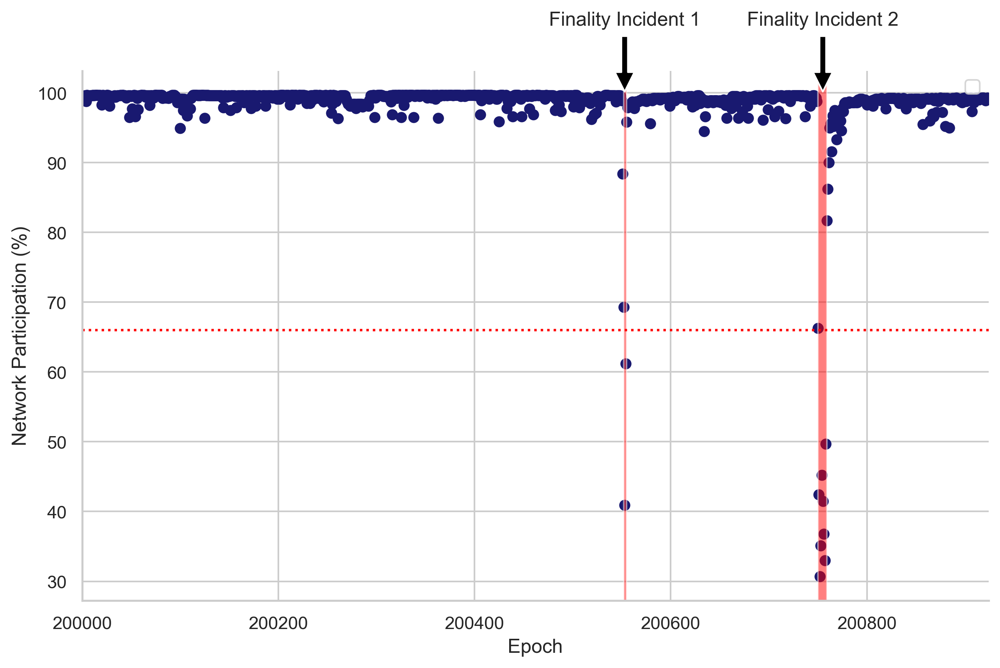
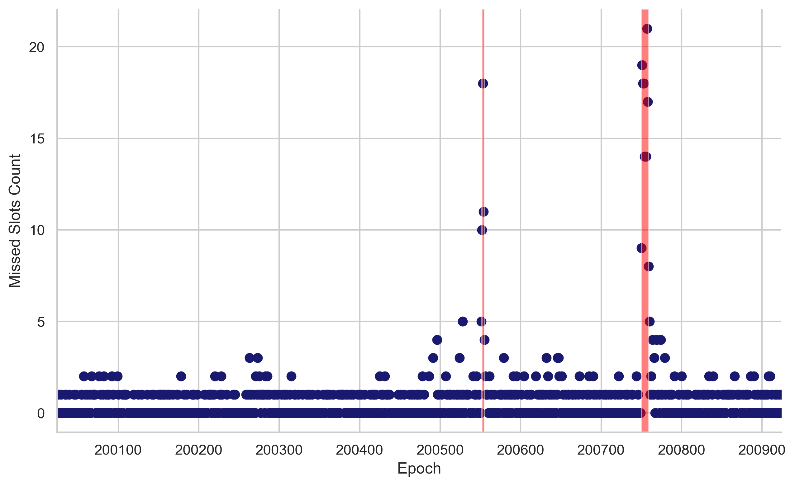
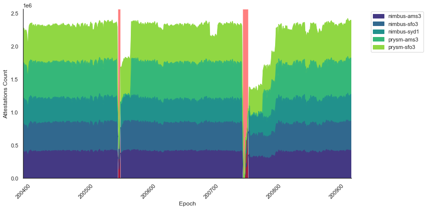
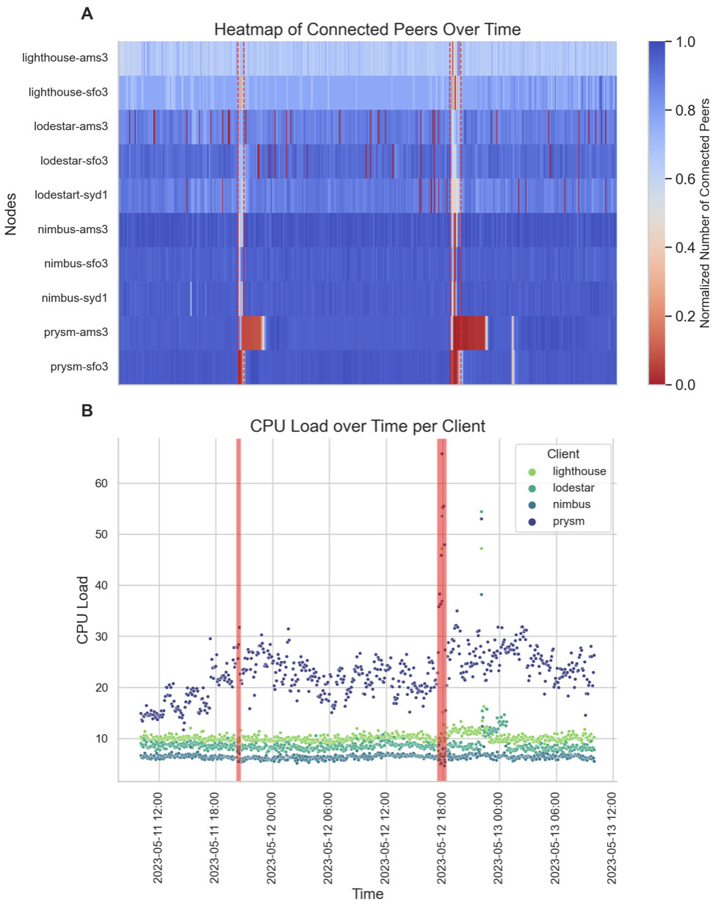
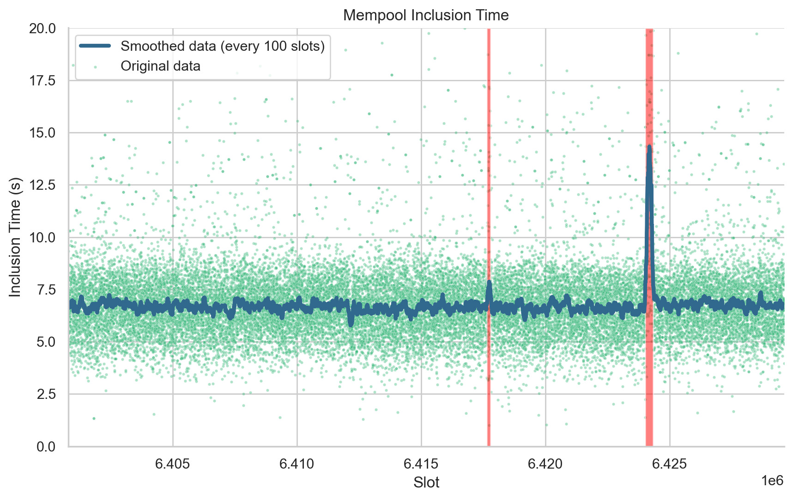
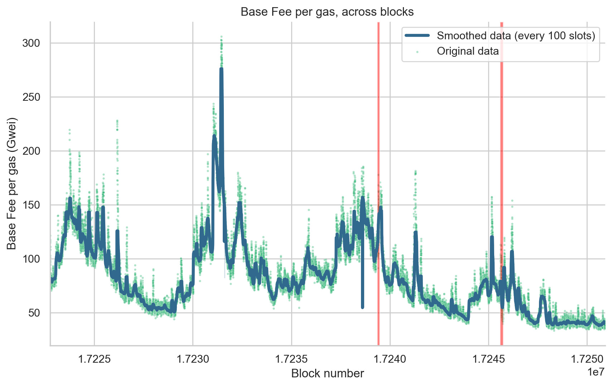
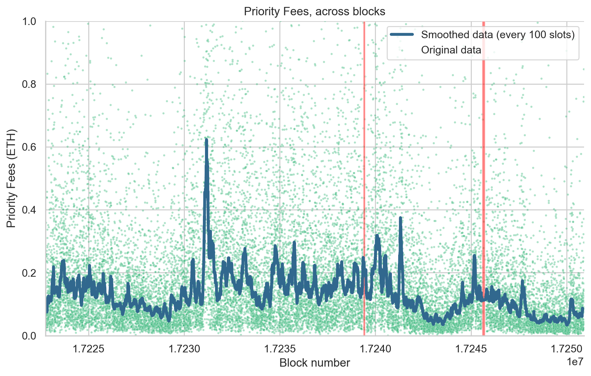
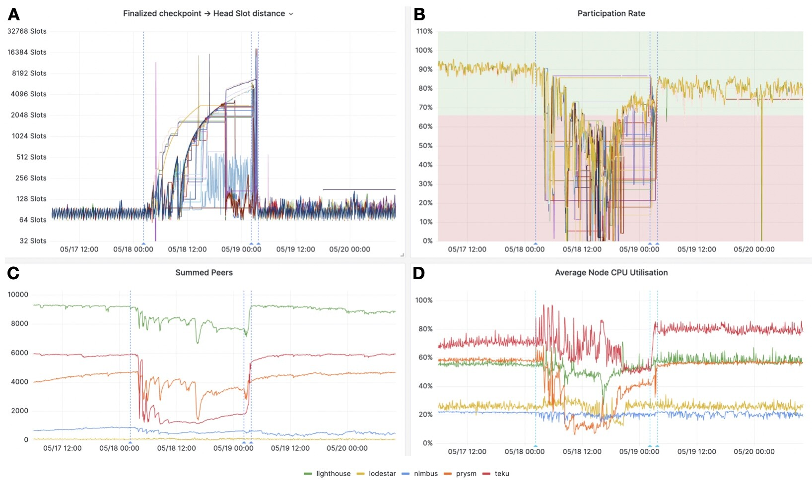

# Cascading Network Effects on Ethereum's Finality
*[Thomas Thiery](https://twitter.com/soispoke) – June 13th, 2023*

*Thanks to [Caspar](https://twitter.com/casparschwa), [Mike](https://twitter.com/mikeneuder), [Michael](https://twitter.com/sproulM_), [Dan](https://twitter.com/_danielmarzec), [Pari](https://twitter.com/parithosh_j) and [Barnabé](https://twitter.com/barnabemonnot) for helpful comments on the draft. A special mention to [Sam](https://twitter.com/samcmAU) and [Andrew](https://twitter.com/Savid) for helping me access the data from nodes set up by the EF!*

## Table of Contents
1. [Introduction](#introduction)
2. [Assessing Perturbations in the Peer-to-Peer Network](#assessing-perturbations)
3. [The Impact of Finality Incidents on User Experience](#user-experience)
4. [Conclusion](#conclusion)

## Introduction

On the evenings of Thursday, May 11th, and Friday, May 12th, 2023, the Ethereum mainnet experienced large-scale network perturbations, which resulted in delays in transaction finalization.

This disruption originated from the implementation logic of some consensus layer (CL) clients, such as Prysm and Teku (see the detailed [Post-Mortem Report](https://offchain.medium.com/post-mortem-report-ethereum-mainnet-finality-05-11-2023-95e271dfd8b2) from Prsym). These clients experienced issues when processing “valid-but-old” attestations (valid attestations with target checkpoints from previous epochs). As these attestations were broadcasted across the peer-to-peer network, clients were required to recompute beacon states to confirm that attestations were correctly associated with their respective validator committees. This computationally intense procedure led to a substantial depletion of CPU and cache resources, impairing validators' ability to perform their duties effectively.

Ethereum’s state is growing; The validator set has expanded significantly over recent months, with the count of active validators nearing 600k, and currently heading towards 700k with the current pending queue, which will be absorbed over two months. Since the introduction of the [Capella upgrade](https://github.com/ethereum/consensus-specs/blob/e9f1d56807d52aa7425f10160a45cb522345468b/specs/capella/beacon-chain.md), the consensus layer (CL) state size has grown substantially, increasing from 81mb just prior to Capella's activation to 96mb due to an influx of deposits after the upgrade. Consequently, state replays that involve deposits have become more resource-demanding compared to typical state replays, given the expansion of the validator set. It's important to note that while non-viable attestations have always been present on the network, state growth coupled with the increased computational requirements of deposit processing might have reached a tipping point, triggering cascading effects in nodes rather than the previously anticipated standard recovery.

Given these developments, this post aims to elucidate the implications of finality incidents, focusing on (1) the health of the [peer-to-peer network](https://ethresear.ch/t/removing-unnecessary-stress-from-ethereums-p2p-network/15547?), illustrated by relevant metric visualizations, and (2) the potential impact of such incidents on the end user experience.

## Assessing Perturbations in the Peer-to-Peer Network
We evaluate the state of the peer-to-peer network during the finality incidents, using data collected from custom nodes set up by the Ethereum Foundation, distributed across 3 different geographical locations (i.e., Amsterdam, San Francisco, Sydney) and running 4 clients (i.e. Prysm, Lighthouse, Nimbus, Lodestar), from May 09th to May 13th, 2023. This corresponds to epochs ranging from 200000 to 201700, slots ranging from 6400799 to 6429597 and block numbers ranging from 17222752 to 17250914. 

> Note: All nodes and clients will not be included in all analyses and figures due to known issues affecting results and their interpretations.

First, we approximate the time frames in which finality incidents began and concluded. As a reminder, to finalize, Ethereum’s consensus mechanism requires that a supermajority of the total ETH at stake — precisely two-thirds (≈ 66.6%) — must participate in the vote. We identify epochs in which network participation (i.e., the percentage of total staked ETH used to vote) dipped below 66% (see Figure 1). Given that block B is finalized if B is justified and more than 2/3 validators have made votes (B, C), where C is the direct child of B (i.e., *height\(C\) - height(B) <= 2*, height referring to checkpoints here, see [consensus specs](https://github.com/ethereum/consensus-specs/blob/e9f1d56807d52aa7425f10160a45cb522345468b/specs/phase0/beacon-chain.md#justification-and-finalization) and [Vitalik et al., 2020](https://arxiv.org/pdf/2003.03052.pdf) for more details), we add a buffer and incorporate the epoch immediately preceding and the epoch immediately succeeding those that didn't meet the 66% network participation threshold. This yields two epoch ranges for each finality incident:
>F1 (Finality Incident 1): Epoch 200552-200555, corresponding to slot 6417664-6417791 and block number 17239384-17239468. This period spans from May 11, 2023, 20:13:11 UTC to May 11, 2023, 20:38:35 UTC. The network participation reached a low of 40.9% during this period.

>F2 (Finality Incident 2): Epoch 200750-200759, corresponding to slot 6424000-6424319 and block number 17245574-17245741. This period spans from May 12, 2023, 17:20:23 UTC to May 12, 2023, 18:24:11 UTC. The network participation reached a low of 30.7% during this period.

We will reference these two finality incidents and their corresponding epoch, slot and time ranges as F1 and F2 when discussing the remaining findings in this blog post.

> __Figure 1.__ Network Participation Over Epochs. This scatter plot represents network participation percentages from epochs 200,000 to 200,924. The F1 and F2 periods are highlighted by red vertical bands, representing significant events in the network's performance. A dashed red horizontal line at the 66% level indicates the necessary network participation for an epoch to be finalized.

During both finality incidents, we noted a large surge in the number of missed slots per epoch, which includes missed and orphaned blocks. This indicates that validators had difficulties fulfilling their duties (e.g., proposing blocks and attesting on time). During the first finality incident, the median number of missed slots per epoch was 10.5 out of 32, which accounts for 33% of the total slots. The maximum number of missed slots reached was 18 out of 32, equivalent to 56% of total slots. During the second incident, the situation worsened and the median of missed slots increased to 15.5 out of 32, constituting 48% of total slots. The highest number of missed slots peaked at 21 out of 32, which represented 65% of the total slots.

> __Figure 2.__ Missed Slots per Epoch. This scatterplot represents the number of missed slots in each epoch. Each point on the plot corresponds to an epoch (x-axis) and the corresponding count of missed slots (y-axis) for that epoch. The intensity of the points' color corresponds to the count of missed slots, with darker points indicating more missed slots. Transparent red boxes highlight epochs that didn’t reach finality (F1: 200552-200555 and F2:200750-200759). 

We then looked at the number of attestations received by five nodes running two different clients (Nimbus and Prysm) across three different geographical locations (Amsterdam, Sydney, and San Francisco) over the span of several epochs (see Figure 3). Under normal conditions, the network participation is around 99% and the number of attestations each node should receive is equivalent to the count of active validators, which approximated 560k at the time. We observed a sharp drop in the number of attestations received for all nodes during F1 and F2. Interestingly, we see that nodes running clients that were most impacted by having to process old attestations (e.g., Prysm) take longer to recover their baseline number of attestations received per epoch.

> __Figure 3.__  Attestations count across epochs.This stacked area chart represents the sum of attestations per epoch for 9 nodes running Nimbus and Prysm clients. Transparent red boxes highlight epochs that didn’t reach finality for F1 and F2, respectively. 

In addition to these findings, we observed a sharp drop in the number of connected peers during F1 and F2 for nodes running Prysm clients (prysm-ams3 and prysm-sfo3), with different time periods to recover the baseline as well as an increase in CPU load, particularly evident during F2 (see Figure 4A and B, respectively).

> __Figure 4.__ __A.__ Temporal Heatmap of Connected Peers: This heatmap presents the normalized number of connected peers for 15 different nodes running Nimbus, Prysm, Lodestar, and Lighthouse clients. The y-axis lists the nodes while the x-axis represents time. Each cell's color intensity is indicative of the normalized number of peers a specific node is connected to at a particular time. __B.__ CPU Load Over Time by node client: This scatter plot tracks the CPU Load (%) for different node clients over time. Each point on the plot corresponds to a specific observation of CPU Load (%), with its x-coordinate denoting the timestamp of the observation and its y-coordinate showing the associated CPU Load. For both A and B, time periods when epochs did not reach finality are highlighted with transparent red boxes and dashed vertical red lines for F1 and F2, respectively.

Overall, our findings reveal the substantial effects that finality incidents exerted on the Ethereum peer-to-peer network. Nodes using Prysm clients were replaying states for valid-but-old attestations that were being broadcast, adding to their computational load and CPU usage. This, combined with the processing requirements associated with handling deposits, likely exceeded a critical threshold, triggering a cascading effect on the peer-to-peer network. As a consequence, validators were hindered in their ability to fulfill their duties and receive and broadcast attestations and blocks on time, causing  missed slots and impacting the nodes' connectivity with their peers in the network.

## The Impact of Finality Incidents on User Experience

In this section, we assess the potential impact of finality incidents on users transacting on the Ethereum network during these episodes. We first use mempool data recorded from our 15 custom nodes to evaluate whether transactions’ inclusion time increased during finality incidents. We compute inclusion time as the difference between the time at which one of the nodes first detected a transaction in the mempool, and the time at which that transaction appeared in a block published onchain. Figure 5 shows the median inclusion time over blocks 17222752 to 17250914, corresponding to epochs ranging from 200000 to 201700. Under normal circumstances, we show that the median inclusion time for transactions stands at 6.65 seconds. However, during the second finality incident, we observed a temporary surge in the inclusion time (median = 12.4 seconds), which promptly returned to the usual values once network participation was restored. 

> __Figure 5.__ Analysis of Mempool Inclusion Time per Slot. This plot represents the time taken for transactions to be included from the mempool into the blockchain across various slots. Each point on the scatter plot (colored in a shade of viridis palette) signifies the median inclusion time (y-axis) for the corresponding slot (x-axis). The blue line indicates a smoothed representation of the data, created using a rolling median with a window of 100 slots. Transparent red boxes represent slots at which epochs didn’t reach finality (F1: 6417664 to 6417791 and F2: slots 6424000 to 6424319). 

Lastly, we turned our attention to the variation in base fees per gas (Figure 6) and priority fees (Figure 7) across the blocks during the periods of finality incidents. Our analysis showed no significant increase in both parameters, suggesting that the duration of these incidents was insufficient to trigger a notable change in network congestion. This finding suggests that, while finality incidents of the duration observed in this study did affect the peer-to-peer network, causing a temporary increase in missed slots and network congestion, they did not significantly disrupt users' transaction experience in terms of inclusion time and transaction cost. However, it's important to note that if finality incidents occurred during already congested periods, or if they were longer or more frequent, they could potentially have a more substantial impact. Therefore, continued monitoring and analysis of these incidents are crucial to ensure the optimal user experience on the Ethereum network.

Our analysis revealed no significant increase in either parameter, suggesting that the duration of these incidents was insufficient to trigger a notable change in network congestion. It's also worth mentioning that despite the increased waiting time for inclusion, the chain continued producing blocks due to its [dynamic availability property](https://arxiv.org/pdf/2009.04987.pdf): the finalized ledger fell behind the full ledger during finality incidents, but was able to catch up when the network healed. This conclusion suggests that, while finality incidents of the duration observed in this study did cause a transient increase in missed slots, they did not significantly disrupt users' transaction experience in terms of inclusion time and transaction cost. However, it's important to note that finality incidents would have a more substantial impact (1) for high value/security applications or exchanges that  would want to wait for epochs to be finalized before processing or executing certain transactions, and (2) if they were to occur during periods of existing network congestion, or if they were to become longer or more frequent. Therefore, continued monitoring and analysis of these incidents are crucial to ensuring optimal user experience on the Ethereum network.

> __Figure 6.__ Variation of Base Fee per Gas across Blocks. This figure illustrates the changes in base fee per gas (in Gwei) for each block. Each point on the scatter plot (colored using a shade from the viridis palette) denotes the base fee per gas (y-axis) for the corresponding block (x-axis). The blue line demonstrates a smoothed rendition of the data, generated via a rolling median with a window of 100 blocks. Transparent red boxes represent block numbers in epochs that didn’t reach finality (F1: 17239357 to 17239468 and F2: 17245574 to 17245741). 

> __Figure 7.__ Variation of Priority Fees across Blocks. This figure illustrates the changes in the sum of priority fees for each block. Each point on the scatter plot (colored using a shade from the viridis palette) denotes the sum of priority fees (y-axis) for the corresponding block (x-axis). The blue line demonstrates a smoothed rendition of the data, generated via a rolling median with a window of 100 blocks. Transparent red boxes represent block numbers in epochs that didn’t reach finality (F1: 17239357 to 17239468 and F2: 17245574 to 17245741). 

## Conclusion

In this post, we investigated how finality incidents affect peer-to-peer networks and user experience. We discovered that clients reprocessing valid-but-old attestations and managing deposits caused excessive CPU usage. This consequently affected validators' ability to complete their tasks and to transmit and receive attestations and blocks in a timely manner. These issues led to missed duties (block proposals, attestations) and peers dropping off within the network. However, we showed that finality incidents had little to no impact on users' transaction experience in terms of inclusion time and transaction cost, likely due to the relatively short-lived duration of these incidents. We hope this analysis offers valuable insights into relevant metrics for monitoring the Ethereum network and helps in ensuring an optimal user experience in the future.

> __Fixes__
> - [Prysm's 4.0.4 release](https://github.com/prysmaticlabs/prysm/releases/tag/v4.0.4) includes fixes to use the head state when validating attestations for a recent canonical block as target root
> - [Teku's 23.5.0 release](https://github.com/ConsenSys/teku/releases) includes fixes that filter out attestations with old target checkpoint

>__Testnet simulations__
>
>A few days after F2, the Ethereum Foundation's DevOps team, in collaboration with client teams, were able to reproduce the conditions that led to finality incidents on a dedicated devnet. This was achieved by (1) replicating the quantity of active validators on the mainnet, (2) deploying Hydra nodes, that used malicious Lighthouse clients (developed by [Michael Sproul](https://twitter.com/sproulM_)) designed to purposefully send outdated attestations to the P2P network, and (3) replicating the processing of deposits.
>
> The operating method of the Hydra nodes was as follows: during the attesting process, a random block that hadn't yet been finalized was selected and attested to as if it were the head. To successfully do this required computing the committees in the current epoch with the randomly selected block serving as the head, which was achieved by advancing it through to the current epoch with a series of skipped slots. During periods of perfect finality, there were always at least 64 blocks to select from, specifically, all blocks from the current epoch - 2 and current epoch - 1. When finality was less than perfect, there were more blocks to select from, a factor that also held true when forks were created.
>
> - On May 18th, at 02:16:11 UTC, nodes running the malicious client began to emit outdated attestations and process deposits on the dedicated devnet. As shown in Figure 8, these actions successfully replicated the conditions that led to finality incidents on the mainnet. The increased distance between the last finalized checkpoint and the block being selected as the head (Figure 8A) caused a significant drop in the network participation rate (Figure 8B), a decrease in the number of connected peers (Figure 8C), and unstable CPU usage (Figure 8D) across clients.
>- On May 19th at 02:12:05 UTC, the rollout of patched versions of Prysm and Teku, which included fixes to process outdated attestations, began. Deployment was completed by 03:45:16 UTC. As demonstrated in Figure 8, these patches proved highly effective in rectifying the issues. All metrics quickly returned to their baseline (pre-Hydra activation) levels after the patches were implemented.
>
>

> __Figure 8.__ Monitoring metrics during the simulation of finality incidents on the devnet. __A.__ Plot of the temporal change in the distance between the finalized checkpoint and the head slot of the canonical head block (further elaboration on Hydra's operational method is available in the main text). Each line represents a node, operating Prysm, Teku, and Nimbus CL clients. __B.__ Graph illustrating the rate of network participation over time. Each line again represents a node, running Prysm, Teku, or Nimbus CL clients. A green background denotes a network participation rate greater than 2/3, while a red background signifies a participation rate less than 2/3 (refer to the [Assessing Perturbations in the Peer-to-Peer Network](#assessing-perturbations) section for more information). __C.__ Time-series chart of the number of connected peers, averaged across nodes for each CL client. Individual lines represent respective CL clients: Lighthouse (green), Lodestar (yellow), Nimbus (blue), Prysm (orange), and Teku (red). __D.__ Line graph of average CPU utilization (expressed as a percentage) over time, averaged across nodes for each CL client. Again, each line corresponds to a specific CL client: Lighthouse (green), Lodestar (yellow), Nimbus (blue), Prysm (orange), and Teku (red). On all panels, the first blue dotted vertical line denotes the point at which nodes running the malicious Lighthouse client began emitting outdated attestations. The second line indicates the initiation of the rollout of patched versions of Prysm and Teku, and the third line marks the completion of patch deployment.