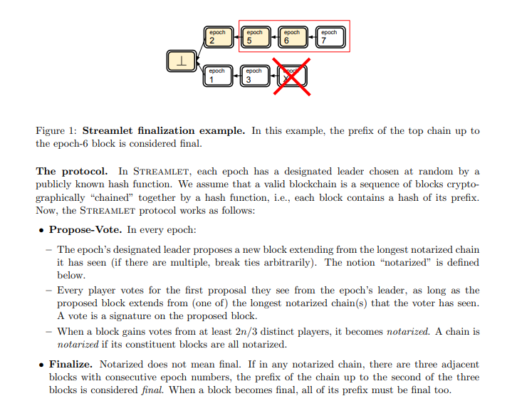
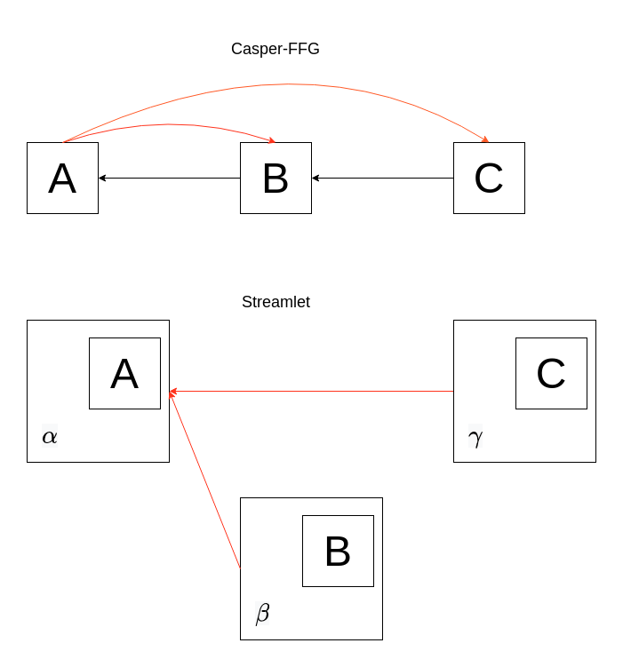
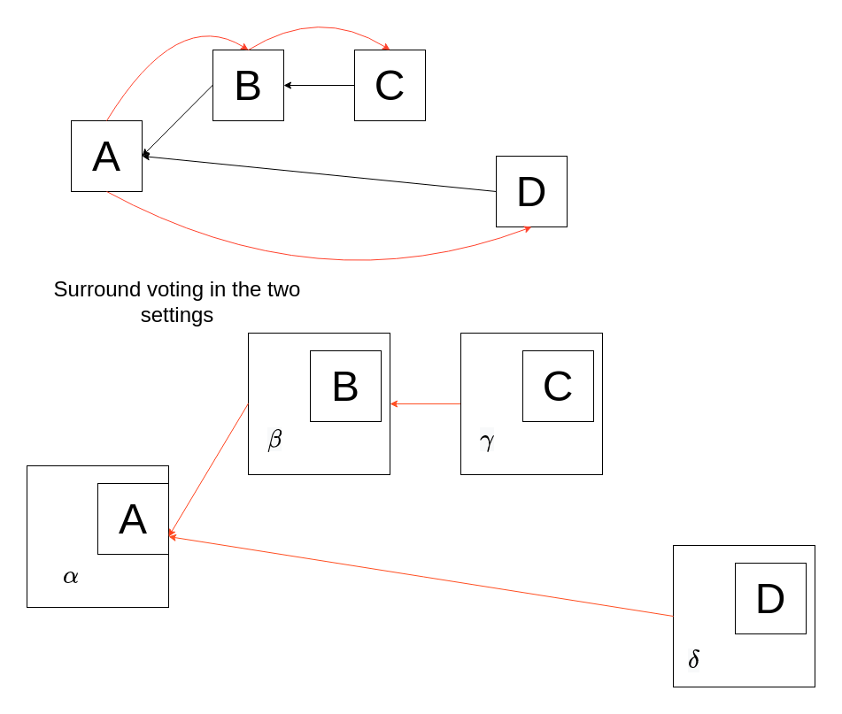

# Casper-FFG as a full protocol and its relationship with Streamlet

*Warning: this post does not really have "a point". I just started wondering about the similarities of Casper-FFG and Streamlet, and while trying to understand how/why they were different, and if there was anything to learn from their difference, I ended up realizing they're actually a lot more similar than it looks at first glance. Maybe someone which knows both protocols will find it interesting, others might find it interesting that along way Casper-FFG is specified as a complete protocol, everyone else should probably find something else to read.*

We consider a lightly modified version of Streamlet, and then change its voting rule, taking inspiration from Casper-FFG. One might consider the result to be a full specification (complete with round structure, leader selection and voting rules such that it is provably live) of Casper-FFG as an independent protocol (which can be used as a finality gadget or as a standalone consensus protocol). We then show that this protocol is in some sense equivalent to the modified Streamlet.

## Streamlet
Streamlet is an extremely simple protocol, with a barebone propose-vote structure. Given its simplicity, I'll avoid any recap other than the protocol description directly from the [paper](https://eprint.iacr.org/2020/088.pdf).

## Modified Streamlet 
The modifications are minimal. We slightly modify the voting rule, then just make some adjustements to preserve liveness and to take advantage of the new voting rule for faster finality.

**Voting rule**: we modify the Streamlet voting rule by adding a tie-breaking rule to pick between multiple longest notarized chains. The current voting rule is *"vote for a block if it extends one of the longest notarized chains".* We modify it to:

*Vote for a block if it extends the longest notarized chain, with ties broken by latest notarization epoch of the tip*. 

**View-merge**: To avoid breaking liveness (which we would, because the adversary can abuse the tie-breaking rule to split the votes of honest participants and keep collecting new private notarizations that win the tie-breaking rule, perpetuating the attack) we also introduce [view-merge](https://ethresear.ch/t/view-merge-as-a-replacement-for-proposer-boost/13739) to the protocol, so we add one round to each epoch and follow the usual view-merge construction, which I won't describe here since it's a generic technique (though its use here is *considerably* simpler, because all that needs to be synced is notarizations).

**Finality**: The new voting rule simplifies the finalization condition of Streamlet. In the original protocol, a block is finalized *if it is in the middle of three consecutive notarizations*. With tie-breaking by latest notarization epoch, the new finality condition is instead:

*A block is finalized if it is the first of two consecutive notarizations*.

### Slashing conditions
The voting rules imply these slashing conditions, the first two of which are exactly the slashing conditions of vanilla Streamlet:
- $E_1$: two votes for the same epoch (equivocation)
- $E_2$: two votes for conflicting blocks $A$, $B$ such that $|A| > |B|$ and $ep_A = epoch(A) < epoch(B) = ep_{B}$ (not voting to extend the longest chain)
- $E_3$: two votes for conflicting blocks $B$, $D$, with respective parents $A$, $C$,  such that $|A| = |C$| and $ep_C < ep_A < ep_B < ep_D$ (not respecting the tie-breaking rule. This should remind you of surround voting in Casper-FFG, except for the extra condition about equal length)

With a bit of notation, we can simplify the last two slashing conditions to one, which looks almost identical to $E_2$. We define the relation $>$ on notarized blocks as follows:

$A > B \iff |A| > |B| \lor (|A| = |B| \land e_A > e_B)$

This is meant to exactly mirror the voting rules of modified Streamlet, i.e. to capture when the chain with tip $A$ beats the chain with tip $B$ in the fork-choice. When $A > B$ holds, one should therefore not vote for a child of $B$ after having voted for a child of $A$, and in fact $E_2$ and $E_3$ are equivalent to the slashing rule which prohibits this:

$E_{23}$: two votes for conflicting blocks $C$, $D$ with $e_C < e_D$ and respective parents $A$, $B$ such that $A > B$

This is exactly $E_2$, with $|A| > |B|$ replaced by $A > B$, except $E_2$ does not mention parents because $|A| > |B|$ if and only if $|C| > |D|$, whereas that's not the case with our new relation.

### Safety
To show that this is safe (and accountably so), consider a double finalization which does not involve 1/3 of the participants equivocating (this would obviously be against the voting rules, and clearly accountable), and say block $A$ is the unique finalized block of minimal epoch which conflicts with another finalized block, and $A'$ be the finalized block of minimal epoch which conflicts with $A$. The assumption on the lack of 1/3 equivocations, which is also what allows us to define $A$ uniquely, implies that $ep_A = epoch(A) < epoch(A') = ep_{A'}$ . Finally, let $B$ be the child of $A$, which is also notarized and with $ep_B = ep_A + 1$, by assumption. The assumption of non-equivocation also implies $ep_B < ep_{A'}$, because $A'$ being conflicting with $A$ means $A' \neq B$.  There's now two cases:
- $|A| > |A'|$: Here the notarization of $A'$  and $A$ clearly break the voting rules (by which we mean, and will also later mean, that a vote to notarize $A'$ and a vote to notarize $A$ are slashable, so that both notarizations coexisting requires 1/3 slashable), in particular $E_2$. 
- $|A| \leq |A'|$: let $C$ be the descendant of $A'$ such that $|C| = |A|$ (possibly $A'$ itself). If $ep_C > ep_A$, and thus also $ep_C > ep_B$, then the notarization of $C$ and $B$ violate $E_2$, since $|B| > |C|$. If instead $ep_C < ep_A$, say $D$ is the child of $C$. If $ep_D < ep_A$ as well, then the notarization of $A$ and $D$ violates $E_2$, since $|D| > |A|$. If not, we have $ep_C < ep_A < ep_B < ep_D$, so the notarization of $B$ and $D$ violates $E_3$.

Here is also an alternative (perhaps more intuitive) argument, though of course ultimately relying on the same violations of voting rules:
We show that, unless the 1/3 is already slashable, a finalized block is always canonical in the views of those who voted to finalize it (i.e. which voted for the notarization of its child), *according to the fork-choice which is implicitly specified by the voting rules, i.e. longest notarized chain with ties broken by latest notarization epoch*. In other words, we show that there is never a conflicting notarized chain which is longer or equally long but with latest notarization epoch, unless 1/3 is slashable. This then means that none of those who voted to finalize $A$ can vote for any conflicting chain without breaking the voting rules, unless 1/3 is already slashable. 

Say $A$ is finalized by the notarization of its child $B$, and we have $|A| = n$. A conflicting chain which prevails in the implicit fork-choice has to have either length $n$ and higher latest notarization epoch, or length > $n$. In looking at all the possible cases, we always implicitly assume that there's no conflicting notarizations at the same epoch, since that trivially means 1/3 is slashable for equivocation.
- Case 1: the conflicting longest chain has length $n$ and latest notarization epoch > $ep_A$. Then the notarization of its tip violates $E_2$, because its parent is shorter than $A$.
- Case 2: height $n$ in the conflicting chain is at an epoch < $ep_A$. Then there must be a height $n+1$ in the conflicting chain. If it's at an epoch < $ep_A$ as well, then the notarization of A violates $E_2$. If instead it is at an epoch $> ep_B$, we have a surround vote situation: the notarization of height $n+1$ in the conflicting chain violates $E_3$, because its parent is tied with $A$ for length but $A$ has later epoch.

### Liveness
View-merge and the modified voting rules combine to give us **reorg resilience**, i.e. the property that a honest proposal always stays in the canonical chain (again, given by the fork-choice implicitly determined by the voting rules), if proposed under synchrony. Reorg-resilience trivially gives us liveness under synchrony, because it implies that we only require two honest slots in a row in order to finalize, since we now that the honest proposal from the first slot will be notarized and it will be extended by the honest proposal in the following slot, which will also be notarized. The contribution of view-merge is that, under synchrony, it implies that a honest proposal is voted by all honest voters, and thus immediately notarized. Synchrony then also ensures that all honest voters know of the notarization before the next slot (or more precisely before freezing their view). At this point, we don't need synchrony anymore. Crucially, all honest voters see the latest proposal as the tip of a longest notarization. This is because even a private notarization would have to have a parent who is publicly known to be notarized, so a honest proposal would always extend at least the penultimate block of any longest notarized chain, regardless of whether the tip of such a chain is publicly known to be notarized or not. The new honest notarization then wins the tie-breaking rule by being the latest notarization. While we don't have accountable safety yet, because votes for a child of the latest proposal have not yet been cast, we already have safety, by exactly the same arguments as before: none of the honest voters will ever see any conflicting chain as winning the fork-choice and thus will never vote for something conflicting.

Note that vanilla Streamlet instead requires 4 honest slots in a row to finalize. The first one is required because of the lack of reorg-resilience, as a private notarization revelead by the adversary might waste the slot. The next three are required because the lack of a tie-breaking rule means that three notarizations in a row are required to finalize.

## Casper-FFG as a full protocol
We take the modified Streamlet from the previous section, and simply change the voting rule (and accordingly also the slashing rules) to this one:

*Vote for a block if it extends the chain with latest notarization epoch*.

Alternatively, and maybe a useful way to think about it for those with knowledge of Ethereum, one could again speak of the implicit fork-choice instead of the voting rule, and say that the *canonical chain is the one with latest notarization epoch* (there cannot be ties unless 1/3 has equivocated, so this is a well-defined rule). The voting rule then is simply *"vote for a block if it extends the head of the chain"*. 

**Slashing rules**: The "usual" for Casper-FFG:
- $E_1$ (equivocation)
- $E'_2$: two votes for conflicting blocks $B$, $D$, with respective parents $A$, $C$,  such that $ep_C < ep_A < ep_B < ep_D$ (surround voting)

**Finality**: same as in modified Streamlet, the first of two consecutive notarizations is finalized.

**Security**: It's quite clear that accountable safety still follows from the same argument of Casper-FFG. Liveness follows essentially from the same argument made for modified Streamlet, using reorg-resilience. The argument is actually even simpler because there's no need to argue about a honest notarization being the tip of a longest chain: being the latest notarization is all that is needed here. Regardless, we won't need to make these arguments any more precise, because we are soon going to prove that modified Streamlet and this protocol are in some sense the same protocol.

Hopefully, the connection with Casper-FFG is clear to those with knowledge of it or Gasper. There's no (source, target) votes, but the slashing rules still look *very* familiar, and the fork-choice and finality condition even more so once "notarization" is replaced with "justification".  In fact, we implicitly do have (source, target) votes here and in modified Streamlet as well: the target is the block which is being voted, and the source is simply its notarized parent. The reason why this is implicit here, but explicit in Casper-FFG, is simply that Casper-FFG doesn't have its own block-tree structure, and rather just works with the underlying structure that it provides finality to. In the finality gadget setting, the links would already be provided by its block tree structure: a Streamlet block would contain a checkpoint which it proposes to notarize/justify, the target, and the source would be the checkpoint contained by the parent of this block. Therefore, voting for a Streamlet block implies a (source, target) vote on the underlying structure, whereas just voting for a single block in the underlying structure does not. For example, in the first diagram below, voting for $C$ does not imply a well-defined (source, target) vote (except if FFG information is also embedded in the chain, as is the case in Gasper), whereas voting for $\gamma$ implicitly carries a ($A$, $C$) vote. In the second diagram, you can see how surround voting works in the two settings. 

## Equivalence of the two protocols
We now argue that modified Streamlet is equivalent to the protocol from the previous section, which we'll just refer to as Casper-FFG, in the following sense: if voting rules of modified Streamlet are followed, then the canonical chain identified by its implicit fork-choice always corresponds to that which is identified by the implicit fork-choice of Casper-FFG, and the same is true is the voting rules of Casper-FFG are followed (in both cases, meaning that we don't have 1/3 slashable). In other words, using either set of voting rules is equivalent, because they identify the same canonical chain, and thus produce the same votes. Concretely, identifying the same canonical chain means that the longest chain with ties broken by latest notarization is always the latest notarized chain, or equivalently that the latest notarization is also the tip of a longest chain, unless 1/3 is slashable according to either set of slashing conditions. In fact, the slashing conditions are also equivalent, at least up to the first instance of conflicting finalized blocks.

### Fork-choice rules
Let's start by showing that following the modified Streamlet voting rules leads to a canonical chain which is the same under either fork-choice, i.e. such that the latest notarized is also the tip of a longest chain. We do by induction. In particular, we show the following statement $\forall n$:

*Consider a block tree consisting of notarizations with maximum epoch $\leq n$, and such that $< 1/3$ of the participants have violated slashing conditions $E_1$ and $E_2$ by voting for these notarizations. Then, the block of latest epoch is also the tip of a longest chain.*

*Proof:*
At Genesis, this is true. Now, assume it holds up to $n$, and fix a block tree of notarizations up to epoch $n$, satisfying the assumptions. We now want to extend this with notarizations of epoch $n+1$. We only need to consider the case where we have a single notarization from epoch $n+1$, because it's clear that the property still holds in the case where we don't have any, and multiple notarizations from the same epoch requires a violation of $E_1$. Say block $A$ is notarized at epoch $n+1$, and that $B$ is the tip of a longest chain in the original block tree, without $A$. If $|A| < |B|$, then $ep_B < ep_A$ means that the notarization of $A$ violates $E_2$. Therefore, $|A| \geq |B|$, and so $A$ is the tip of a longest chain in the new block tree. Moreover, it is the latest notarization in it, since it is the unique block of notarization epoch $n+1$, so the statement still holds. 

We also show this corollary, which will be useful later:

*Corollary 1: Consider two notarized blocks $A, B$ such that no notarizations of epoch $\leq \max(ep_A, ep_B)$ violate $E_1$ and $E_2$, then $A > B$ if and only if $ep_A > ep_B$*.

*Proof:*
Consider the block tree consisting of all notarizations of epoch $\leq \max(ep_A, ep_B)$. Say $ep_A > ep_B$, so $A$ is also the block of latest epoch in the tree. Applying the previous result, we know that $A$ is also the tip of a longest chain, so also $|A| \geq |B|$, and thus $A > B$. Since $A, B$ are symmetric, $ep_A < ep_B$ implies $B > A$, so $A > B$ if and only if $ep_A > ep_B$. 

It might seem odd that the arguments do not involve $E_3$, but there is a simple reason for that, namely that a violation of $E_3$ would not compromise the property we are considering here. In fact, given $A, B, C, D$ as in $E_3$, the notarization of $D$ still leaves the two fork-choice rules in agreement if they were before. Therefore, the voting rules of vanilla Streamlet also produce a block tree in which the latest notarization corresponds to a longest chain. On the other hand, the votes themselves might differ from those of Casper-FFG (and modified Streamlet, which always correspond to them), because of not breaking ties in favor of the latest notarization.

*Consider a block tree consisting of notarizations with maximum epoch $\leq n$, and such that $< 1/3$ of the participants have violated slashing conditions $E_1$ and $E'_2$ by voting for these notarizations. Then, the block of latest epoch is also the tip of a longest chain.*

At Genesis, this is true. Now, assume it holds up to $n$, and fix a block tree of notarizations up to epoch $n$, satisfying the assumptions. We now want to extend this with notarizations of epoch $n+1$. We only need to consider the case where we have a single notarization from epoch $n+1$, because it's clear that the property still holds in the case where we don't have any, and multiple notarizations from the same epoch requires a violation of $E_1$. Say block $A$ is notarized at epoch $n+1$, with parent $C$, and that $B$ is the latest notarization in the original block tree, and has parent $D$. $B$ being the latest notarization in the original block tree means that it is also the tip of a longest chain, by inductive assumption. If $ep_C < ep_D$, then $ep_C < ep_D < ep_B < ep_A$, so we have a surround vote violation. Therefore, $ep_C > ep_D$ (equality would violate $E_1$). Now, consider the block tree obtained by removing all notarizations with epoch $> ep_C$ from the current one. The inductive assumption applies to this block tree, so block $C$ being the block of latest epoch in it implies that is also the tip of a longest chain. $ep_C > ep_D$ implies $D$ is also in the tree, so $|D| \leq |C|$. Finally, that implies $|B| \leq |A|$ as well, so $A$ is the tip of a longest chain in the block tree we considered, and also the block of latest epoch. The property still holds.

We repeat the corollary from before, but for the Casper-FFG setting, i.e. a block tree in which $E'_2$ is not violated, rather than $E_2$. The proof is identical, but using this last result.

*Corollary 2: Consider two notarized blocks $A, B$ such that no notarizations of epoch $\leq \max(ep_A, ep_B)$ violate $E_1$ and $E'_2$, then $A > B$ if and only if $ep_A > ep_B$*.

### Slashing conditions
We now show that the slashing rules are also equivalent, also up to the first instance of a 1/3 violation. Since $E_1$ is shared by both protocols, we have to show that $E_{23}$ is equivalent to $E'_2$. Concretely, we show that the first instance of a violation of $E_{23}$ is also a violation of $E'_2$, and viceversa. 

By first violation of $E_{23}$, we mean that we have notarizations $C$, $D$, with parents $A, B$ such that $ep_C < ep_D$ and $A > B$ (therefore violating $E_{23}$), and moreover that $ep_D$ is minimal for such a violation of $E_{23}$, i.e that the maximum epoch of the notarizations involved in the violation is minimal. If we consider the set of notarizations with epoch $< ep_D$, there can therefore not be any such violation. If there's also no notarizations violating $E_1$, then, by Corollary 1, $A > B$ implies $e_A > e_B$, and thus we have $e_B < e_A < e_C < e_D$, i.e. surround voting, a violation of $E'_2$.

Similarly, by first violation of $E'_2$ we mean that we have notarizations $C,D$ with parents $A,B$ and $e_B < e_A < e_C < e_D$ (therefore violating $E'_2$), and moreover that $ep_D$ is minimal for such a violation of $E'_2$. Again, we consider the set of notarizations with epoch $< ep_D$, and then there can not be any such violation. If there's also no notarizations violating $E_1$, then, by Corollary 2, $e_A > e_B$ implies $A > B$, and thus we have a violation of $E_{23}$.