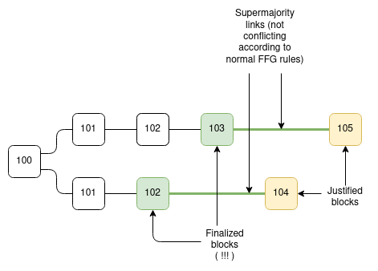

### Goal

Preserve the Casper FFG safety and liveness invariants, but allow the distance between consecutive epochs that we attempt to justify to increase to accommodate latency. For example, if epochs 100 and 101 fail to justify, the chain could attempt to justify epochs 102, 104, 108.... increasing the spacing so that two consecutive attempted epochs could still succeed and give us finality even under multi-epoch latency.

The challenge arises because different competing chains could have different attempted epochs, causing naive Casper FFG to fail:

### Rules

Each attestation has three epoch parameters:

* **`SOURCE`**: source (epoch and blockhash), same as in FFG
* **`TARGET`**: target (epoch and blockhash), same as in FFG
* **`PREV_TARGET_EPOCH`**: the eligible epoch before the target epoch in the chain

We have two slashing rules:

* **Surround slashing**: `A1.source_epoch < A2.source_epoch < A2.target_epoch < A1.target_epoch`
* **Intersection slashing**: `A1.prev_target_epoch < A2.target_epoch <= A1.target_epoch`

Intersection slashing is the extension of the naive Casper FFG double vote slashing rule, which checks `A1.target_epoch == A2.target_epoch`.

### Safety argument

First, let's recap the safety argument for naive Casper FFG.

Suppose there are two conflicting finalized blocks A and B, and suppose without loss of generality that `B.epoch > A.epoch`. A **supermajority link** from block `X` to block `Y` is defined as existing if >= 2/3 of the validator set have made attestations where `X` is the target and `Y` is the source. We'll use the notation `X -> Y` for such a link (note `Y` is an ancestor of `X`).

We know that for `B` to be finalized, there must be a chain of supermajority links going back from `B` to genesis. Let `M -> N` be the first supermajority link in this chain where `N.epoch <= A.epoch` (hence, `M.epoch > A.epoch`), and let `N -> P` be the supermajority link after it,

We know there must exist a supermajority link `A -> Z` where `Z.epoch = A.epoch - 1` because `A` is finalized, and there must exist a link `Z -> W`.

There are three cases:

* `N.epoch = A.epoch`: double vote slash between `N -> P` and `A -> Z`
* `N.epoch = A.epoch - 1`: double vote slash between `N -> P` and `Z -> W`
* `N.epoch < A.epoch - 1`: surround slash between `M -> N` and `A -> Z`

Now, let's extend this argument to this new version of Casper FFG. The new difference here is that `Z.epoch = A.epoch - 1` is not assured, which is why the counterexample in the diagram above becomes possible. But now we added a new rule: if a supermajority link `A -> Z` is possible, then a valid attestation for `A` must specify `Z.epoch` as its `prev_target_epoch`, and so the attester precludes themselves from using any epoch in `[Z.epoch + 1 ... A.epoch]` as the target in another attestation. Hence, the three cases become:

* `Z.epoch < N.epoch <= A.epoch`: intersection slash between `N -> P` and `A -> Z`
* `N.epoch = Z.epoch`: double vote slash between `N -> P` and `Z -> W`
* `N.epoch < Z.epoch`: surround slash between `M -> N` and `A -> Z`

### Liveness argument

The liveness argument is the same as the liveness argument for naive Casper FFG. Eventually the chain reaches an epoch `e` that exceeds all epoch numbers used by all previous attestations. Let `J` be the highest-epoch justified block. Let `M` be a descendant of `J` where `M.epoch = e`. There are no intersection or surround violations from attesting `M -> J`, and then no violations from attesting `N -> M` where `N` directly follows `M`, allowing finalization.