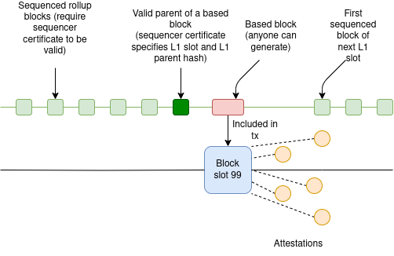

Currently, there are two major types of rollups:

* **Based rollups**, where the ordering of transactions on the rollup is determined by an L1: a rollup block *is* an L1 transaction, and the order of the blocks is the same as the order in which those transactions appear on L1.
* **Sequenced rollups**, where the ordering of transactions is determined by an offchain mechanism, eg. a centralized sequencer or BFT consensus. The rollup hibestory is regularly *committed* to L1, but *ordering* decisions are clearly made by the offchain mechanism.

Sequenced rollups have the major advantage that they can offer latency far lower than the Ethereum L1. Based rollups have the major advantage that they can offer *synchronous composability* with the Ethereum L1. A transaction will be able to perform actions that use both L1 and L2 liquidity, by *directly containing an entire L2 block, and taking actions before and after it, including post-assertions that revert everything (including the L2 block), if they fail*.

This post will demonstrate that it is possible to combine both, with some limits.

## The design

There are three types of L2 blocks:

* **Regular sequenced blocks**: these require a sequencer certificate (eg. central server signature, votes from 2/3 committee…) to be valid, and they come frequently
* **Slot-ending sequenced blocks**: these require a sequencer certificate, and come with a special message that it is valid to build a based block on top of them and include it in the L1, only during the current slot (and also if the L1 parent block matches)
* **Based blocks**: anyone can build them and include them, but only on top of a slot-ending sequenced block (or, potentially, on top of another based block)

The L2 sequencer’s job is to play a timing game. Normally, they release sequenced rollup blocks with very low latency. Then, close to the slot’s end, they release a slot-ending sequenced block - early enough that a builder can make a based block and include it, but late enough that the period of not having very low latency will be minimized. Finally, they start making sequenced blocks for the next slot as soon as they are confident that the L1 block is confirmed.

If, in a given slot, a based block is not included (either because no one shows up to build on time, or because the proposer is missing or defective), then the sequencer starts the next slot by building directly on top of the previous slot’s slot-ending block.

## Properties

* This design is only compatible with L2s that are willing to revert if the L1 reverts. This is because if a based block reverts, any sequenced blocks built on top will also revert. Waiting until the L1 block containing the based block *finalizes* will be an unreasonably long delay, even under theoretically ideal L1 finality mechanisms.
* Under normal circumstances, the delay around the L1 block-publishing time should be pretty short. The L2 publishes its slot-ending block, immediately builders build based blocks on top of it, very soon the proposer makes its L1 block including them, and then attesters make attestations immediately after the proposer proposes, clearing the way for new sequenced blocks to come in.
* Note that there is no security risk in publishing a slot-ending block too late: the worst that happens is simply that no one builds on it. However, there is a security risk in publishing the first sequenced block of the next slot too early, because if the sequencer builds on top of a block that gets reorged, their block will also get reorged.
* The longest delay comes in the case of a missing proposer, because attesters will wait to make sure no proposer is present, and only then publish attestations
* This design does *not* gain the permissionlessness benefits of based rollups, because building a based block requires the sequencer certificate from a slot-ending sequenced block. To achieve permissionlessness, the easiest path is to introduce a forced-inclusion channel on L1. The based block builders can be responsible for including all transactions in the forced-inclusion inbox.