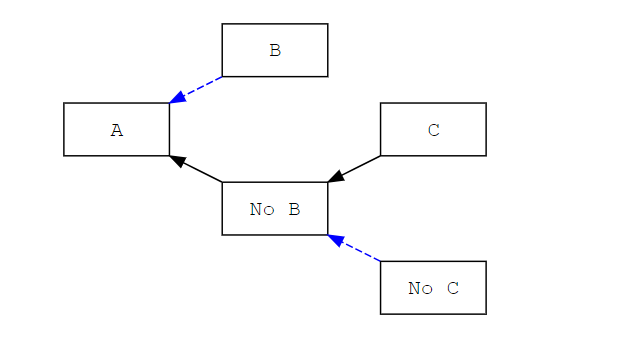
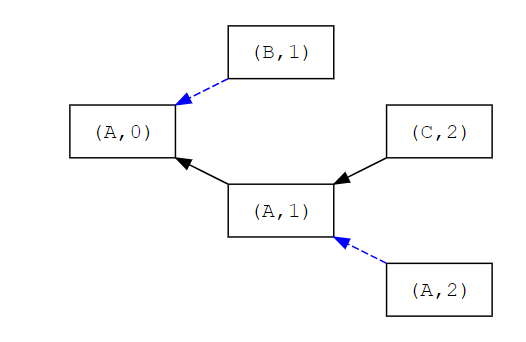

# Committee-driven MEV smoothing
---

*Many thanks to Justin Drake, Barnabè Monnot, [Caspar](https://twitter.com/casparschwa) and others from the EF research team for helpful comments and discussions. Caspar also directly contributed to parts of the main write-up*

Smoothing MEV means reducing the variance in the MEV that is captured by each validator, with the ultimate goal of getting the distribution of rewards for each validator to be as close as possible to uniform: a staker would then get a share of rewards proportional to their stake, just like with issuance. This is in my opinion the single most impactful consensus-level MEV mitigation that is potentially available to us, and strictly more powerful than democratization. Details about why and explorations of many more aspects of this proposal are in this [longer write-up](https://notes.ethereum.org/cA3EzpNvRBStk1JFLzW8qg), to which I'll refer interested readers a few times (if you want to start reading there directly go ahead, but keep in mind that I am still working on it). 

In the following, I am going to propose a mechanism which attempts to achieve MEV smoothing by equally sharing a block's MEV among the committe members and the proposer (meaning that the proposer is treated the same as any individual committee member, but this could of course be changed). Doing so requires two ingredients: a well-functioning block content market, as in [the builders/proposer separation proposal](https://ethresear.ch/t/proposer-block-builder-separation-friendly-fee-market-designs/9725), and some relatively mild consensus modifications.

### Attestations

Given the existence of a block content market, we assume that at attestation time each committee member has their own view of a block with maximal payment, received within the prescribed time window. In particular, consider committee member $v_i$, with validator index $i$, whose current view is that the payment-maximizing block is $b_i$, making a maximal payment $p_i$. $v_i$ would then attest as follows:

- Attest to a newly proposed block if these conditions are all satisfied:
    a) A block has been timely proposed, i.e. it has been received by $v_i$ before a specified deadline (currently 4 seconds after the beginning of the slot)
    b) The block extends what in $v_i$'s view is the previous head of the chain
    c) The block makes a payment $p$ such that $p \geq p_i$
- Otherwise, attest to the previous head of the chain.

Conditions a) and b) are the same as now, but we add the maximality condition c). Nonetheless, we still have essentially the two options block present vs block absent, except that a proposed block is considered absent if its payment is sub-maximal. The actual attestation rules can be more complicated than this, as we'll see shortly, but the main point is that we can always ensure maximality by adding condition c) and requiring that an absolute majority of published attestations deems it fulfilled. If the supporting attestations are outnumbered by attestations to the previous head of the chain, the slot should be skipped.

By attesting this way, the committee is essentially trying to coordinate the execution of a tit-for-tat strategy, punishing non-cooperating proposers to achieve a long-term cooperative equilibrium. 

### Fork choice rule

The way the fork-choice rule currently operates does not allow for such a strategy. It operates on blocks, not on (block, slot) pairs: attestations to the absence of a block are actually just attestations to the previous head of the chain. This implies that a block that correctly extends the previous head of the chain always becomes the new canonical head of the chain, regardless of how the committee attests. The attestations are immediately relevant only if the proposer has forked the chain.

What we need is instead that a block becomes the new head of the chain only if it receives a majority of the published attestations. Basically, we need a proposed block to be in competition with the empty block. In the diagram below, B is proposed at slot 1 with predecessor A, but it gets fewer attestations than the ones against it, and the canonical chain becomes the one with an empty slot 1.

More formally, we can think about it with (block, slot) pairs as the competing attestation targets:

[(block, slot) attestations have been frequently discussed](https://github.com/ethereum/consensus-specs/pull/2197) and ultimately it has always been decided against them, because they create a hard latency costraint for liveness. With current parameters, they would cause any block which does not make it to 50% of attesters within 4 seconds (the attestation deadline) to be skipped, and so under bad network conditions liveness can be threatened. We can maybe mitigate this issue with an alternative design which avoids conflating late blocks and non-maximal blocks, but some tradeoffs remain (among which increased complexity). I am discussing this in some detail at the very end of the full write-up, but keep in my mind that it's just ideas at this stage.
### A proposal's lifecycle

To give a full picture of the how a block makes its way to the canonical chain, let's focus on a specific version of the builders/proposer separation scheme, specifically Idea 1 from the post. The steps are almost the same, except we need to add a deadline for builders' block headers to be considered by attesters in their assessment of the maximal payment. Without one, one could always publish block headers with high payments that are too late to be seen and chosen by the proposer, but still cause attesters to update their view of the maximal payment. 

The process would look something like this, with some delay between each step and with attesters being asked to enforce the deadlines in their attestations:

- **Block headers deadline**: builders publish block headers before this time. Attesters accept block headers published after the deadline, but they don't consider them in their view of the maximal payment. This deadline can overlap with the previous slot.
- **Proposal deadline**: the proposer publishes its choice of a block header before this time.
- **Block body deadline**: the chosen builder publishes the body corresponding to the chosen block header before this time
- **Attestation deadline**: at the latest, attesters publish their attestations at this time 

Note that this specific version of builders/proposer separation requires its own consensus modifications, with three attestation options: 

- Block proposal absent
- Block proposal present but bundle body absent
- Block proposal present and bundle body present

Nonetheless, as already anticipated, the changes we need for our smoothing scheme can be simply applied on top, by again equating "block proposal present" with the three conditions a,b,c we identified previously (i.e. by adding c to the second and third attestation options) and skipping the block if "block proposal absent" has an absolute majority over all published attestations.

## Security 

One immediate worry when introducing another aspect to the attestation process is whether or not an adversary can attempt to manipulate attesters' views to produce undesirable outcomes. In particular, let's consider how a committee member's view of the maximal payment can differ from the real one:

- **View > Reality**: without the block headers deadline it is definitely possible to execute an attack using ideas from [this post](https://ethresear.ch/t/attacking-gasper-without-adversarial-network-delay/10187), by releasing a block header with a high payment at a time such that more than 50% of the committee is going to see it in time but the proposer won't, which would cause the block to be rejected.

    With a deadline for block headers which is sufficiently in advance of the proposal time, this attack vector is no longer feasible and the ability to delay messages to the proposer is required. There's also a high cost of failure, because the proposer seeing the header in time would lead to having to make the very high promised payment.
    
    Finally, even an adversary that is able to target specific proposers and cause their incoming messages to be delayed would be unable to execute such an attack if the proposer were to be chosen through a [single secret leader election](https://www.reddit.com/r/ethereum/comments/m9j5cy/single_secret_leader_election_protocols/)
- **View < Reality**: attesters whose view of the maximal payment is lower than what it should be will anyway always attest correctly when the proposer is honest. The only mistake they can make is attesting to a sub-optimal block. For a block to be sub-optimal, by definition there has to be a block header which offers a higher payment, because we define optimality through the block content market. That also means that there is a builder who made this maximal block and wants to see it published, and is therefore interested in having as many committee members as possible receiving it in time, thereby preventing competing sub-optimal blocks from being viable choices. We rely on the self-interest of such builders to make sure that committee members don't have a sub-optimal view of the payment, at least as long as the adversary does not have too much control over network delays.

### Incentive compatibility 

The main concern we have is not about potential manipulations of the views of committee members, but about whether or not the mechanism is incentive-compatible. Crucially, is it incentive-compatible for committee members to vote against sub-optimal blocks, preventing malicious proposers from getting more than their fair share of MEV?

Here are some reasons why I think this scheme is indeed long-term incentive-compatible:

- The long-term result of correctly participating in this scheme is that MEV is more or less evenly distributed, much more so than currently. For sufficiently large staking pools, this is no different than the status quo, because in a short period of time they already achieve the mean of the distribution of rewards, because of how often they propose. For everyone else, this is better than the status quo, because they are likely to earn more than before, though they sacrifice some low-proability higher upside (check the full write-up for details about what a smoothed vs non-smoothed distribution of rewards looks like, and how it impacts various participants).
- Consider the single-block game between the proposer and the commitee, where the latter is seen as a single player and the proposer moves first. Defecting means not following the protocol. For the proposer, that is proposing a block which does not make a maximal payment, and instead gives them an undue portion of the MEV. For the committee, that is accepting such a non-maximal block, or failing to accept a maximal one. Here's the payoff matrix for this game:

     
    |                         | Proposer is honest| Proposer defects |
    |-------------------------|:-----------------:|-----------------:|
    |**Committee is honest**  |  (1,1)            |    (0, 0)        |
    |**Committee defects**    |  (0,0)            |    (0.5,2)       |
    
    In this single-block game, the dominant strategy for the proposer is to always defect, because the committee always prefers to get something rather than nothing, i.e. to cooperate. On the other hand, in the repeated form of the game the committee can employ a tit for tat strategy, which corresponds to voting honestly and punishing non-complying proposers. In the long term, this should ensure a cooperative equilibrium. Moreover, as you can read in a section "Short-term considerations" in the full write-up, committee members from large pools have a very different payoff matrix in which the payoff for defecting with the proposer is very low or even negative.
- This game is of course very simplified. In reality, the committee is not one entity, and actually some of its validators will often share interests with the proposer (at least anytime in which the proposer belongs to a sufficiently large staking pool, which happens proportionally to the stake that's held in such pools). Moreover, a validator that's a committee member for one block will later be a proposer for a different block, so players really play both sides.

    Nonetheless, playing a proposer-friendly long-term strategy is just an attempt to keep the status quo, which as already mentioned does not particularly benefit anyone in terms of rewards. Large pools do benefit from the status quo in that their ability to achieve average rewards gives them an edge in attracting stake, but on the other end fostering staking decentralization can be a net-positive for the whole Ethereum ecosystem and increase the total value of the stake that pools compete for. Moreover, there's a clear reputational cost that comes from subverting the protocol in an easily attributable way, especially for large pools and especially when it comes to a mechanism that's common good-oriented.

## Consensus stability

Both the current fork-choice rule and the one proposed for this scheme are vulnerable to 51% attacks, with the only difference being that in this scheme a 51% coalition can immediately vote down any minority block, whereas currently it takes some time to convince the minority to join the majority chain (which is necessary to eventually achieve finality). Therefore, we should only worry about consensus instability created by adaptive adversaries which do not have control of 51% of the stake but can try to achieve such control over specific committees.

Currently, a committee does not get value from the content of a block, but just from coordinating the consensus process. Thus, no one outside of the proposer (and whatever amount of stake they represent) has a reason to do anything to steal MEV by forking. Stealing MEV from the previous block requires the proposer’s coalition to bribe other attesters, and without network attacks the total adversarial percentage in the two committees (including bribed members) has to add up to 2/3 of them (so that votes are 1/3 + 1/3 by the honest attesters and 0 + 2/3 by the adversarially controlled ones). On the other end, in this scheme controlling 51% of both committees is enough, because the first block can now directly be skipped, and committee members can have their own incentives to try to fork to steal MEV, because they share the benefits. Nonetheless, the situation is still arguably much better:

- Crucially, proposers from large staking pools have no incentive to fork to steal MEV, because they control about the same percentage of every committee, and thus get about the same percentage of each block's rewards (within fairly tight bounds, even for proposers controlling only a single-digit percentage of the stake). Since large pools are the most powerful actors, and are potentially able to coordinate, disincentivizing them from attacks is arguably the single most important defense.
- If the proposer is a solo validator or anyway a small staker, they might want to capture a share of the previous block’s rewards, because they didn't receive any of it. On the other end, a staker that’s small enough to not have participated in the rewards meaningfully is very ill-equipped to successfully fork. They essentially have no committee power of their own, and would need to convince everyone else. Pools are especially hard to convince, for the same reason why they don't have a reason to fork, and it's hard to imagine forking without the support of any large concentration of stake. Lots of other solo validators might have incentives to fork, but it’s hard to imagine adaptively bribing such a large coalition of small stakers
    

## Censorship resistance

The block content market could be very centralized, and it seems likely it will be. Either way, we have no control over whether that is the case. Censorship resistance would then heavily rely on the assumption that altruistic proposers would step up and utilize their discretion in choosing block headers to combat censorship when needed, for example by making their own blocks. This is not possible with MEV smoothing, because MEV maximization is enforced, and we therefore need to explore other solutions. I have started doing so in the full write-up, in the section "Censorship resistance by decoupling transaction inclusion and ordering". I decided to not add any details about that here to keep the post contained and because there might be issues with the idea, but the tldr is that we could have the proposer of slot n-1 select a set of transactions for inclusion at slot n, without this interfering with the smoothing mechanism.