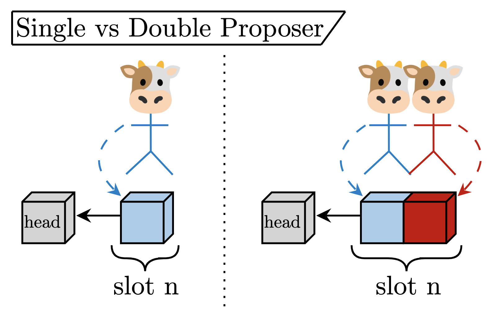
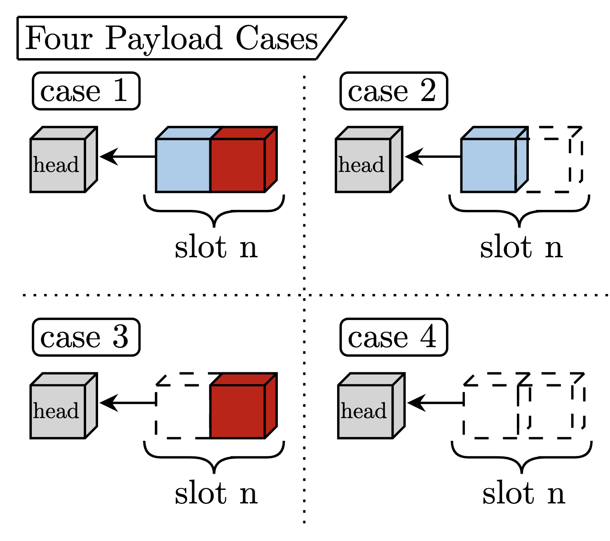
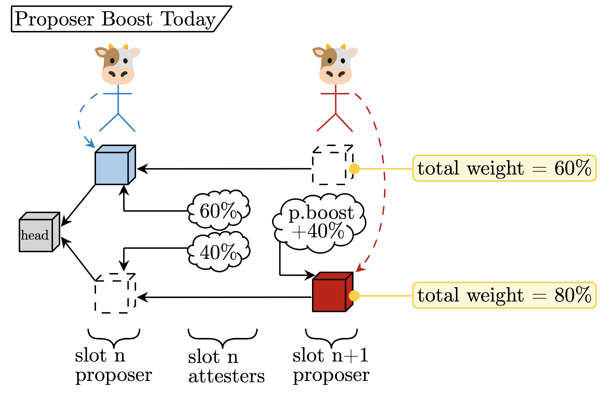
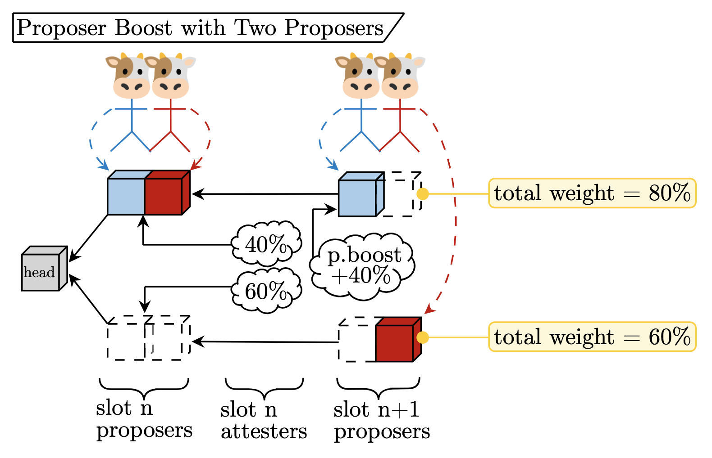
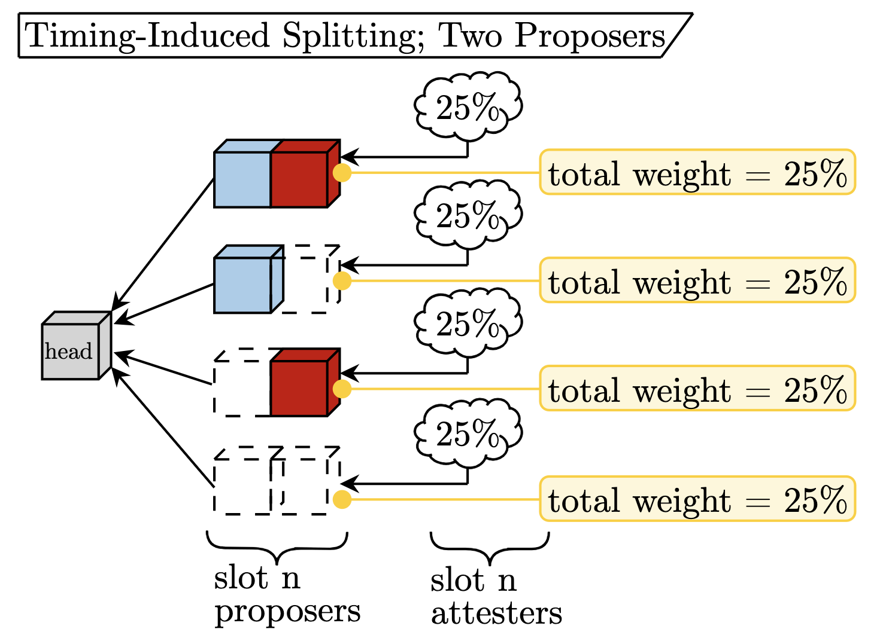
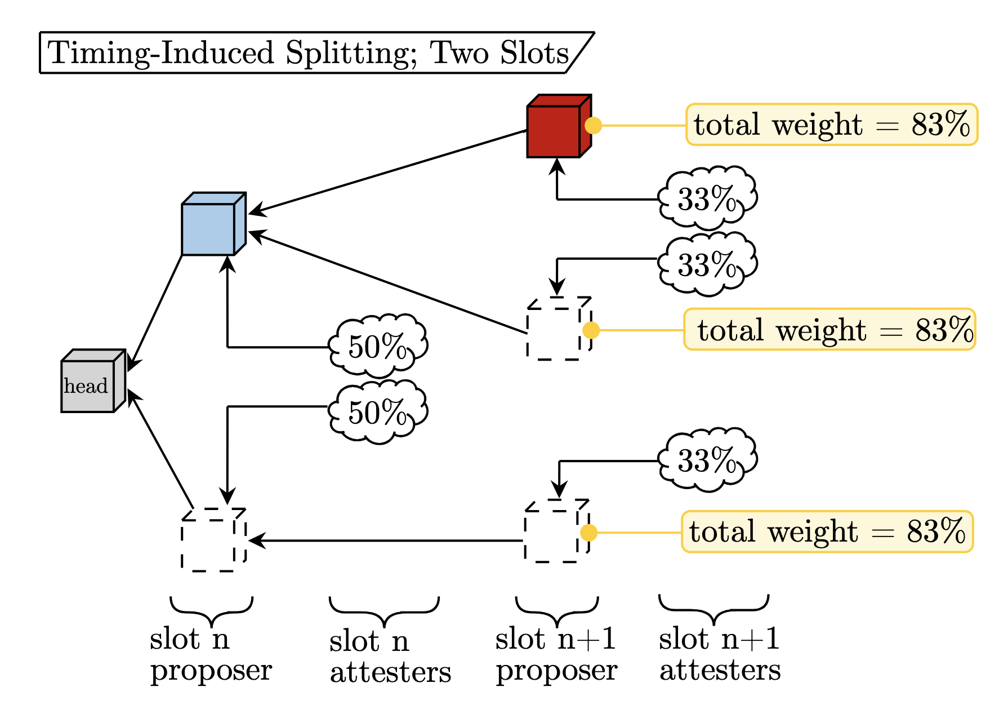

# Concurrent Block Proposers in Ethereum

***^look ma, we are trying to end the proposer monopoly***
$\cdot$
*by [mike](https://twitter.com/mikeneuder) & [max](https://twitter.com/MaxResnick1) – friday; february 23, 2024.*
$\cdot$
**Abstract:** *The Ethereum protocol elects a single proposer to produce a block during each 12-second slot. That proposer has unilateral authority over the set of transactions included. As a result, time-sensitive transactions can be censored by a single party. We present an initial analysis of increasing the number of proposers in a single slot. Section 1 outlines the difference between economic and probabilistic models of censorship resistance and provides the theoretical motivation for concurrent proposers. Section 2 discusses the simplest version of the "double-proposer construction," where each slot elects two validators as eligible for proposing blocks. We explore different payload outcomes, modifications needed for proposer boost, and how splitting changes under the double proposer regime. Section 3 generalizes these results to more than two proposers and outlines open questions for further research.*
$\cdot$
**Related work**
| Article | Description| 
|---|---|
|[*Censorship Resistance in On-Chain Auctions*](https://arxiv.org/pdf/2301.13321.pdf) | Elijah, Max, Mallesh paper |
|[*Introducing multiplicity*](https://blog.duality.xyz/introducing-multiplicity/) | Duality blog |
|[*ROP-9: Multiplicity gadgets for censorship-resistance*](https://efdn.notion.site/ROP-9-Multiplicity-gadgets-for-censorship-resistance-7def9d354f8a4ed5a0722f4eb04ca73b) | RIG Open Problem def'n |

$\cdot$
## Section 1 – Preliminaries 

Much of the discussion around censorship has focused on situations where the adversary is a state actor, e.g., U.S. censorship of tornado cash transactions. While this is important, economic gain presents another potential motivation to censor. In 2015, before state actors knew Ethereum existed, Vitalik discussed the need for sufficient censorship resistance to enable financial systems to operate on chain:

> *"Censorship-resistance in decentralized cryptoeconomic systems is not just a matter of making sure Wikileaks donations or Silk Road 5.0 cannot be shut down; it is in fact a necessary property in order to secure the effective operation of a number of different financial protocols."  -[The Problem Of Censorship, Vitalik Buterin, 2015](https://blog.ethereum.org/2015/06/06/the-problem-of-censorship)*
 
We start with a simple example. Consider a [European call option](https://www.investopedia.com/terms/e/europeanoption.asp) that must be exercised with an Ethereum transaction. Suppose the call option is [in the money](https://www.investopedia.com/terms/i/inthemoney.asp); whoever holds the option can make \$10 by exercising the option at expiry. Conversely, whoever *sold* the call option stands to lose \$10 if the option is executed. The option seller is therefore a motivated adversary who wishes to censor the transaction to avoid losing \$10. If the transaction can only be processed in a single block, the buyer and seller are both willing to pay the proposer to include or censor the transaction respectively, resulting in the proposer receiving \$10  and leaving both the buyer and seller with a payoff of \$0. 

Even if the option may be exercised in any of the $K$ blocks before expiry (called an ["American Option"](https://www.investopedia.com/terms/a/americanoption.asp)), the buyer attempting early transaction inclusion reduces their expected profit. This motivates the economic definition of censorship resistance, which is extended below. Some of the following definitions and examples are taken verbatim from [*"Censorship Resistance in On-Chain Auctions."*](https://arxiv.org/pdf/2301.13321.pdf)

### §1.1 – Probabilistic vs Economic Censorship Resistance

Historically, we have considered censorship through the probabilistic lens. For example, [censorship.pics](https://censorship.pics) shows the percentage of censoring participants at various layers of the transaction supply chain. With this data, we can calculate the inclusion probability for a transaction in a randomly sampled block. This simplification ignores the influence of tips on inclusion; the probabilistic model assigns the same average wait time for inclusion to a transaction with a `MaxPriorityFee = 1 Gwei` as a transaction with `MaxPriorityFee = 100 Gwei` (because it assumes inclusion as a constant probability).

To show how this could be reductionist, consider that proposers are profit-maximizing and signing the highest value bid from `mev-boost` regardless of whether that bid contains censored transactions. Further, allow some builders to censor, while at least one does not. If the non-censoring builder wins 1% of blocks, but the potentially censored transaction has a high tip, the uncompetitive, non-censoring builder who includes the transaction may win the `mev-boost` auction because of the high tip. In other words, the censored transaction can make up the difference between the non-censoring builder's bid and the censoring builders' bids.

With this example as motivation, we turn to an economic definition of censorship resistance, starting with a public bulletin board. 

**Definition 1 (Public Bulletin Board).** *A Public Bulletin Board has two public functions:*
1. `write(m,t)` *takes as input a message `m` and an inclusion tip `t` and returns `1` if the message is written to the bulletin board and `0` otherwise.*
2. `read()` *returns a list of all messages written to the bulletin board over the period.*

Because the `write` operation succeeds or fails, this definition captures writing to a blockchain within a specific window of time (e.g., the inclusion of the transaction in the next $K$ blocks):

**Example 1 (Single Block, $K=1$).** *With a single block, the `write(m,t)` operation consists of submitting a transaction `m` with associated tip `t`. `write(m,t)` succeeds if the transaction is included in the next block of the canonical chain.*

**Example 2 (Multiple Blocks, $K=n>1$).** *In the case of multiple blocks, the `write(m,t)` operation consists of submitting a transaction `m` with associated tip `t`. `write(m,t)` succeeds if the transaction is included in any of the next $n$ blocks of the canonical chain.*

We can formally define economic censorship resistance.

**Definition 2 (Censorship Resistance of a Public Bulletin Board).** *The censorship resistance of a public bulletin board $\mathcal{D}$ is a mapping $\phi: \mathbb{R}_+ \mapsto \mathbb{R}_+$ that takes as input the tip `t` corresponding to the tip in the write operation `write(⋅,t)` and outputs the minimum cost that a motivated adversary would have to pay to make the `write` fail.*

In other words, the censorship resistance of a public bulletin board is a function describing the cost for the adversary to censor the transaction. The mapping models the relationship between priority fees and censorship resistance and is typically a monotone-increasing function (higher tips $\implies$ higher cost to censor). 

Ethereum, a single proposer chain, has the following economic censorship resistance:

**Example 1 (continued).** *The cost to censor the transaction is `t` in the uncongested case; the adversary must bribe the proposer at least `t` to compensate for the forgone tip on the transaction the proposer had the opportunity to include: $\phi(t)=t$.*

Extending the $K=n>1$ example from above, we present the cost to censor a transaction for $K$ blocks in a row.

**Example 2 (continued).** *In the case of $K$ blocks with rotating proposers, the cost to censor is `Kt` since the adversary must bribe each proposer at least `t` to compensate for the forgone tip on the transaction each proposer had the opportunity to include: $\phi(t)=Kt$.*

The cost of censorship increases linearly in the tip *and* the number of blocks. 

### §1.2 – Multiple Proposers

So far, we have only considered a single proposer per slot. With this grounding, we highlight that the cost of censorship increases linearly with the number of validators who have the option to include the transaction; more inclusion opportunities require more bribes from the adversary to exclude the transaction. A mechanism with multiple proposers shoehorns this property into the single slot case. 

A single slot with $K$ proposers achieves the cost of censorship that requires $K$ slots on a single proposer chain. This property applies both in the simple probabilistic model, where proposers are either censoring or not censoring and in the economic model described above.

## Section 2 – Double proposer; $K=2$

Starting with the minimal multi-proposer construction, consider the double proposer. Instead of selecting a single proposer (leader) per slot, we elect two concurrent proposers. Both of them produce a block concurrently, collaboratively building the final payload by concatenating the constituent blocks. A few simplifying abstractions:
1. We focus on the `ExecutionPayload` (the list of transactions) part of the block.
2. Both `ExecutionPayloads` can include identical transactions. We assume that the spec & clients deterministically de-duplicate the second payload and divide the transaction priority fees between both proposers for each doubly included transaction.

The figure below captures the single and double proposer cases.

Attesters for `slot n` vote for the pair of blocks together, giving fork-choice weight to the block pair as the canonical head of the chain. 

### §2.1 – Payload cases

With two proposers, there are four cases for what the attesting committee could see when it is time to vote for the head of the chain. The figure describes each case. 

#### Case 1 – Both payloads present (happy path)

As demonstrated in the 'Single vs. Double Proposer' figure, if both proposers correctly share a block during `slot n`, the attesters can vote for the block-pair, which will become canonical. This  "happy path" embodies the protocol fully functioning as expected.

#### Cases 2 & 3 – One payload present (neutral path)

If one of the two proposers fails to produce a block on time, we are on the "neutral path". We call it neutral because at least one block will end up canonized, meaning some transaction inclusion, but with one proposer inactive, the proposers only partially fulfill their protocol duty. Let <u>Case 2</u> be the situation where `Proposer 1` produces their block but `Proposer 2` does not; let <u>Case 3</u> be the converse where `Proposer 1` does not produce their block but `Proposer 2` does.

#### Case 4 – No payloads present (sad path)

In the worst case, neither proposer produces a block, which is equivalent to a ["missed slot"](https://beaconscan.com/slots-skipped) today, where no transaction inclusion occurs – this represents the "sad path" for obvious reasons.

### §2.2 – Proposer boost

The cases above highlight an observation from multiple proposers – **at each slot, four potential heads of the chain exist.** With a single proposer, the payload is either present or missing (only 2 cases). Due to network latency or malicious behavior, honest attesters could have different views of the head of the chain or may see multiple forks in their local view, causing issues when considering what an honest attester should vote for. 

#### Proposer boost today

In the current specification, this potential difference of perspective (one honest attester sees the payload on time while a different honest attester does not) resolves using "proposer boost" (see [[1](https://ethresear.ch/t/change-fork-choice-rule-to-mitigate-balancing-and-reorging-attacks/11127),[2](https://notes.ethereum.org/@casparschwa/H1T0k7b85),[3](https://www.paradigm.xyz/2023/04/mev-boost-ethereum-consensus)] for more details). Proposer boost gives the proposer extra fork-choice weight (accounting for $40\%$ of a full attesting committee) for the duration of their slot, a mechanism empowering the proposer to "force their view" of the head of the chain to mitigate the duration of the honest attester view disparity. The figure below shows an example of a proposer boost being used to resolve a chain split.

**Description:**
1. The `slot n` proposer publishes a block, but only $60\%$ of the `slot n` attesting committee sees it on time, while the remaining $40\%$ votes for a missing slot.
2. The `slot n+1` proposer publishes a block with the missing slot as the parent rather than the `slot n` block. During `slot n+1`, this block has proposer boost $+40\%$.
3. The `slot n+1` attesting committee will see that the total weight of the `slot n+1` block (bottom fork) of $80\%$ is higher than the `slot n` block with a weight of $60\%$, causing them to vote for the bottom fork.

Because there is only one proposer per slot, it is obvious which fork to grant the proposer boost. With multiple proposers, the story gets more involved.

#### Proposer boost with two proposers

Returning to the discussion of the two proposers, consider the assignment of the proposer boost to the potential split views. We suggest the simple rule:

> ***Proposer boost with two proposers*** – When considering the split view, honest validators give a proposer boost to a fork based on the total order: 
>
> $\text{Case} \;1 > \text{Case} \;2 > \text{Case} \;3 > \text{Case} \;4.$

In other words, if deciding between Case 1 and Case 2, the Case 1 fork receives a proposer boost. This deterministic ranking grants a single fork a proposer boost, resolving the split. The figure below extends the single proposer boost example to two proposers.

**Description:**
1. The `slot n` proposers both publish a block, but only $40\%$ of the `slot n` attesting committee see them time, causing the remaining $60\%$ vote for both payloads missing (this is W.L.O.G., the bottom fork could alternatively be Case 2 or 3 without changing the analysis).
2. The `slot n+1` proposers publish blocks with different parents. `Proposer 1` uses the `slot n` payloads as the parent, while `Proposer 2` uses the missing slot. During `slot n+1`, the fork with the `Proposer 1` block has proposer boost $+40\%$ because $\text{Case} \;2 > \text{Case} \;3$.
3. The `slot n+1` attesting committee will see that the total weight of the top fork ($80\%$) is higher than the bottom fork ($60\%$), voting for it as the head of the chain.

### §2.3 Splitting implications

Consider how a malicious participant, who may control both proposers for a slot, could try to split the chain. We use "splitting" to describe the process of intentionally causing the honest majority of validators to vote for different blocks, thus temporarily weakening the consensus guarantees of the protocol.

#### Equivocation-induced splitting
An equivocating validator may split the attesting committee into <u>arbitarily many forks</u>, regardless of the single or double proposer construction. They create the split by signing and distributing conflicting blocks of the same height. By this simple reasoning, it is clear that the two-proposer construction *does not weaken* the protocol to "equivocation-induced splitting." 

#### Timing-induced splitting
Timing-induced splitting defines an adversary using network latency to intentionally split the honest validators' view of the head of the chain \~without\~ signing conflicting blocks. With the singular proposer of today, an adversary may intentionally deliver a payload such that only half of the honest attesters see it by `t=4` ([the attestation deadline](https://www.paradigm.xyz/2023/04/mev-boost-ethereum-consensus)). Thus, the malicious validator today can split the honest attesting committee in two for each slot in which they are the proposer. The subsequent honest proposer forces their view through a proposer boost (see above). In the two-proposer situation, the adversary can split the honest validators' view four ways if the malicious party controls both proposers. The malicious party simply[^1] times their payload releases such that 1/4 of the honest validators see each of Cases 1-4. The figure below demonstrates this.

**Description:**
1. The adversary controls both of the `slot n` proposers.
2. The adversary times the release of the two blocks such that all four Cases receive $25\%$ of honest attestations.

While this split seems problematic, it is only possible with probability $p^2$, where $p$ is the amount of stake controlled by the malicious entity (because they must be both proposers for the slot). To compare apples-to-apples with the single-proposer setup, we should explore the event that a malicious party controls two slots in a row, which also occurs with probability $p^2$. The figure below shows the "timing-induced splitting" possible under that premise.

**Description:**
1. The adversary publishes the `slot n` block such that the attesting committee splits in half on the timeliness of the payload.
2. The adversary selectively publishes the `slot n+1` block such that the honest attesting committee for that slot splits three ways.

In this scenario, the malicious party only achieves a three-way split because they cannot build a block on the missing slot in `slot n` without equivocating, which leads us to the main point of this exercise: **With probability $p^2$ an adversary can cause a four-way split with two proposers and a three-way split with one proposer.** We [halt](https://en.wikipedia.org/wiki/Halting_problem) the analysis here because it is unclear to us the implications of this distinction; the next honest proposer will resolve the fork with a proposer boost either way.

[^1]: It's unclear how feasible this is in practice, but using the byzantine threat model (worst-case analysis) the protocol should be resistant to it.

## Section 3 – Generalizing and pondering

While the double proposer case is the simplest, we can extend much of the above analysis to more proposers. With $K$ proposers:
1. the cost of censorship (presented in §1.1) is $K$ times higher for a given transaction,
2. there exist $2^K$ payload cases (defined in §2.1) because each proposer could publish or not,
3. proposer boost (outlined in §2.2) is given to the "highest value fork" (e.g., convert the indices of available blocks to a bitstring interpreted as an integer; choose the highest integer), and
4. a malicious party can split the honest attesting committee (summarized in §2.3) such that each fork has weight $1/2^K$ with probability $p^K$.

Further questioning (e.g., *"How many timing-induced forks can an attacker create with $\ell$ of $K$ proposers for a slot?"*) is deferred to future work (the solution is going to be a Binomial Mess™). For the sake of brevity, we conclude here with open questions.

### §3.1 – Open questions
1. *How much risk does the "timing-induced splitting" above create? How different is it from today, where the next honest proposer resolves the split with a boost?*
2. *What are the engineering considerations when considering multiple proposers? The number of blocks per slot will scale linearly, but the number of attestations remains constant. Is that ok? Are there other engineering difficulties that make multiple proposers infeasible?*
3. *Are we missing something obvious from the fork-choice perspective?*
4. *How important is this economic improvement of censorship resistance? Does it enable a new class of applications (e.g., running an onchain auction)? If current censored transactions are fine paying a low priority fee and waiting several blocks before inclusion, would this mechanism benefit them meaningfully?*