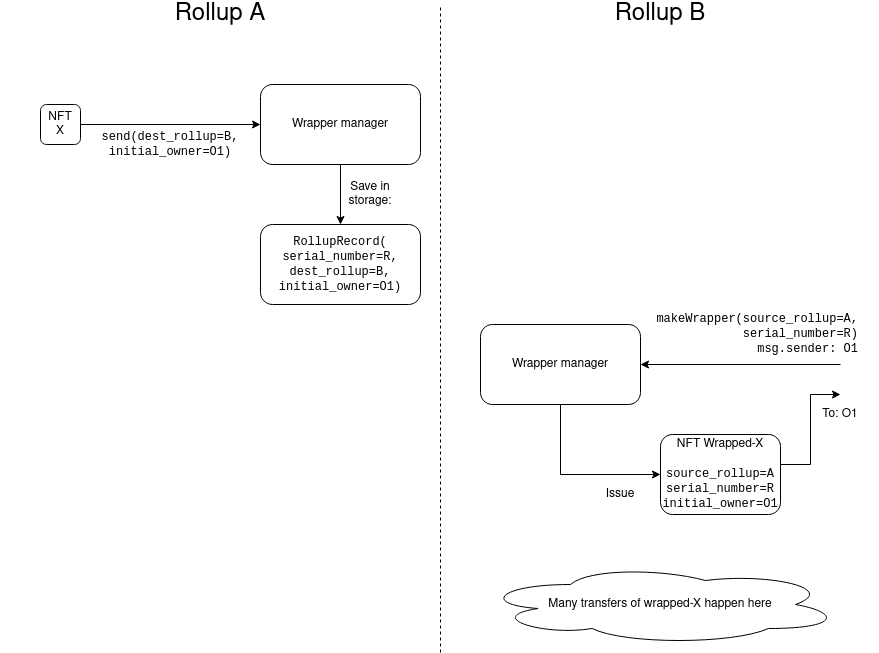
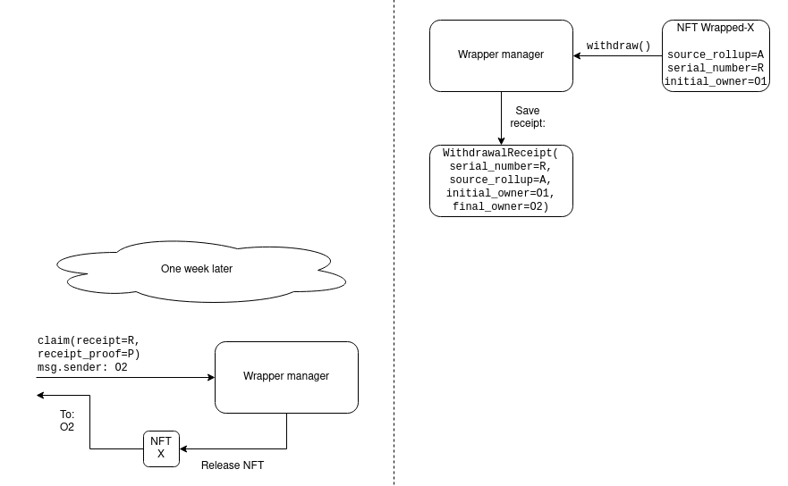
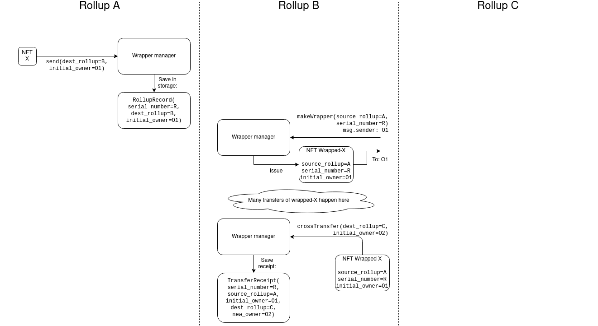
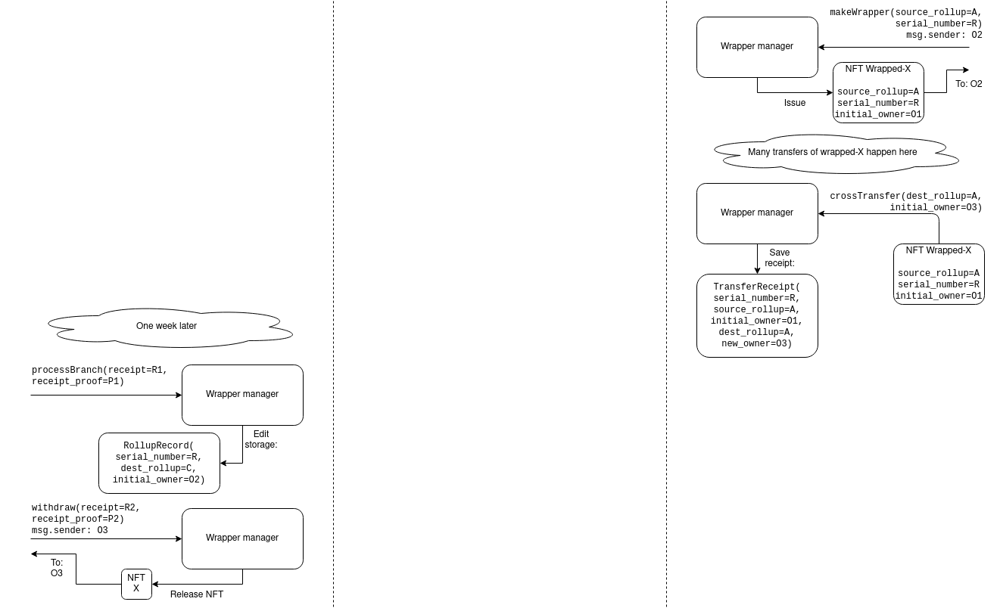

The NFT ecosystem is growing rapidly, and it's a significant part of the Ethereum chain's gas consumption. The youth and relative lack of entrenchment of the ecosystem, as well as the greater need to avoid high fees due to the non-financial nature of a large part of the NFT sector, makes it a prime target for moving to layer 2. However, this opens the question of _how_ a move to layer 2 could happen.

One simple proposal is to socially coordinate a move to a single rollup platform (eg. Arbitrum, as it's available for general contract deployment today), but this has some important downsides:

* All existing major EVM-capable rollup platforms have backdoors, centralized sequencing or other training wheels, and it's risky to commit an entire ecosystem to a single rollup while there is uncertainty about how the rollup will graduate beyond such features
* The NFT ecosystem may well grow too big for one single rollup to handle safely
* No part of the NFT ecosystem, or even the entire NFT ecosystem, is a closed-off world; they will need to interoperate with other parts of the Ethereum ecosystem

This document is a proposal for how to make NFTs cross-rollup friendly, allowing NFTs to move to the entire _layer 2 ecosystem_.

## Proposed solution 1

NFTs would begin by being registered in one rollup (or the base chain). An NFT could hop between other rollups (or the base chain) by creating a **wrapper NFT**.

The process for wrapping is as follows:

1. On rollup `A`, send the NFT (we'll call it `X`) to a **wrapper manager contract**, specifying (i) a destination rollup and (ii) an initial owner. The lockbox contract saves a record in storage, assigning `X` a new serial number `R`, and saving the destination rollup (we'll call it `B`) and the initial owner on the destination rollup (we'll call this account `O1`)
2. On rollup `B`, anyone can create a wrapper NFT using the **wrapper manager contract** on rollup `B`. Creating a wrapper NFT requires specifying the source rollup and the serial number. Creating a "valid" wrapper NFT of X can only be done by the specified owner and by claiming `(R, A)` as the serial number and source rollup. Note that it is possible to create an invalid wrapper NFT that points to nothing; rollup `B` does not know what is valid and invalid. The wrapper manager contract stores (serial number, source rollup, initial owner) tuples and prevents multiple NFTs from being created with the same tuple.
3. To withdraw the NFT from the lockbox, the current owner of wrapped-`X` on rollup `B` must send it back to the wrapper manager, which issues a receipt saying "the NFT with serial number `R`, source rollup `A`, and initial owner `O1`, was just unwrapped, with desired new owner `O2`". 
4. The lockbox contract can hand `X` to `O2` when it receives a proof that such a receipt on rollup `B` was made, and checks the serial number, source rollup and initial owner against its own stored information and verifies that it passes.

Note that the withdrawal will have a time delay, because a time delay of ~1 week is required for optimistic rollup state roots to finalize so that receipts can be verified. The only way to do multiple hops more quickly, so far, would be to do multiple layers of wrapping.

For a user to verify that a wrapped X is legitimate, they would need to verify the state on rollup B _and_ the receipt on rollup A themselves.

## Extension: add cross-rollup transfers

On rollup B, the owner of wrapped-X can send it to the wrapper manager with an instruction to issue a different receipt: "the NFT with serial number R, source rollup A, and initial owner O1, was just moved to rollup C, with desired new owner O2".

On rollup C, once again anyone can make a wrapped-X object by specifying the original source rollup (this is rollup A in this example), serial number and initial owner, and this wrapped-X on rollup C can be freely traded. However, once this happens, actually withdrawing X would now require publishing the entire chain of receipts (in this case just two) of cross-rollup transfers.

Note for the simplicity, "withdrawal" is no longer a cross-rollup operation; instead, withdrawal is done by doing a cross-rollup operation to create wrapped-X _on rollup A_ (the same rollup as X), and then finally unwrapping X in a separate single-step operation.

What is effectively happening is that when the NFT is moved from rollup to rollup, the chain of transfers leaves behind a chain of receipts, and every single receipt in that chain of receipts is mirrored to rollup A and processed in order at some point in the future when the state roots on the other rollups finalize (this can be space-optimized in the short term via Kate commitments, and in the long term an entire chain of receipts can be proven via ZK-SNARKs).

For a user to verify that a wrapped X is genuine, they would need to verify the entire chain of receipts on all rollups reflecting the cross-rollup transfers (or at least, the chain of receipts since the last receipt that was already mirrored onto rollup A).

## Extension 2: gas-optimized issuing on base chain

All NFTs can be issued in such a way that they are "owned" by the lockbox contract on the Ethereum base chain. To make this gas-efficient, the lockbox contract would get the functionality to generate a whole set of serial numbers and transfer them to a rollup. Effectively, all NFTs are pre-created, but with no "meaning" yet assigned to any of them (think: there are 2**256 not-yet-differentiated "stem cell" NFTs), and they are transferred to rollups in batches.

The process of "issuance" now becomes a process of assigning meaning. This can be done simply by passing along a "meaning hash" through receipts in the same way that owners are passed through: if an NFT has no meaning (it's a "stem cell"), the owner can assign a meaning to it, turning it into a "differentiated" NFT. The base chain only learns the meaning of an NFT once it verifies the chain of receipts up until the point where the meaning was assigned (realistically, receipt verification would have to be ZK-SNARKed to make this viable).

This allows all NFTs to be "rooted" in the base chain, instead of a rollup. This is useful to deal with the scenario where a rollup breaks or otherwise becomes non-viable, and applications need to permanently migrate to other domains.

**Reminder: ethresear.ch is a special-purpose scientific forum, and is not a general discussion venue for (especially non-technical) issues about crypto projects, *even if* those issues are important. Please stay on topic.**