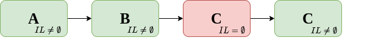
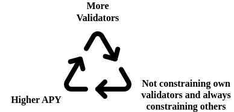
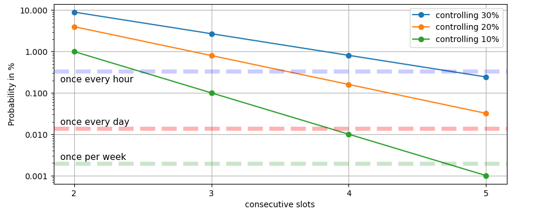

# Cumulative, Non-Expiring Inclusion Lists

The following starts with a quick analysis of the [current inclusion list (IL) design by Vitalik and Mike](https://ethresear.ch/t/no-free-lunch-a-new-inclusion-list-design/16389) and is followed by a suggestion to better align it with the economic incentives of big staking pool operators such as Lido, Coinbase, Kraken or Rocketpool.

Get familiar with the current design [here](https://ethresear.ch/t/no-free-lunch-a-new-inclusion-list-design/16389).

Special thanks to [Matt](https://twitter.com/lightclients) for the great input.

## Background
**ILs are constraining.**

ILs force a certain transaction to be included if there is still enough space in the block.
This means that builders are constrained by not being able to freely decide upon the content of their blocks but must align with the IL in order to produce a valid block.

Furthermore, by having an IL, the amount of value that can be extracted from a block can only become less as the set of possibilities a non-censoring builder has when constructing blocks shrinks.

A second effect that proposers using ILs (and their successors) could initially face is that certain builders might stop building for certain slots if the ILs force them to include, e.g., an OFACed transaction. This is cool as it provides non-censoring parties strong competitive advantages.

> As a thought experiment: we should revive [Martin's](https://twitter.com/koeppelmann) [Censorship-Detection](https://etherscan.io/address/0xbb5450ae41e786bcce1bfd11948cc2a6c74d3f57) contract. The contract allows the builder to claim some free MEV while sending 1 wei to the Tornado Cash Gitcoin Grants Donation contract. We can use/fund it to make sure that every single block contains a sanctioned interaction. Eventually, we may force censoring parties to entirely leave the block building market.

Notably, as pointed out by [Barnabé](https://twitter.com/barnabemonnot), censoring builders wouldn't be forced to exit if they can otherwise ensure that their block is full. Thus they would have an incentive to sponsor certain transactions for users just to fill up their blocks.

## Same slot, next-slot, cumulative...
As a recap. Having proposers set ILs for their own blocks doesn't make much sense and it relies purely on altruism to include censored transactions into one's own blocks.

Having forward-ILs makes sense, allowing the current proposer to constrain the next proposer. This means that the current proposer could create an IL that either the current proposer itself or the next proposer must satisfy.

The problem with one-slot-forward ILs is that **parties with multiple validators have an economic incentive to not constrain the next proposer in the case the next proposer is controlled by the same entity.** 

Party C has two consecutive slots and therefore leaves the IL empty in the third slot

This means, if I have two slots in a row, I would probably leave my ILs empty for my first proposer. Thereby I'd make sure to not constrain the builders in the next slot and thus act profit-maximizing. Centralization.

Assuming there is an OFACed transaction in every block then the number of consecutive slots a certain entity determines how often it can allow builders to work without constraints (=IL). Importantly, having no constraints doesn't only mean being able to include some negligible TC transaction. It's more about having access to the most profitable block builders in the ecosystem.

> In the past month, censoring builders such as beaver, builder69 or rsync offered proposer payments of around 0.061 ETH. Titan Builder, the largest non-censoring builder had 0.05 ETH.

## Potential Impact

Lido currently proposes blocks in around 30% of the slots. The chances of Lido having two consecutive slots are 9% (0.3**2). This can be confirmed by looking at the slots of the past month (2023-08-01 - 2023-08-28):

Lido had around 31% market share and the observed likelihood of consecutive slots of 9.5%.Assuming we have censored txs in every block and every honest validator puts them on their IL then 9.5% of the slots could have an empty ILs, potentially opening up the market for censoring builders.

#### How many slots would have empty ILs assuming that it's economically rational for an entity to not constrain itself in consecutive slots?
Looking at data from the past month, it's 10.5%, assuming the Lido Node Operators collude in order to maximize the profits for Lido as a whole.
Having the Lido Node Operators act independently and constrain each other with ILs, then only 1.9% of the slots would have empty ILs.

10% is very likely too high and an excessively large centralizing force.
2% is better but still not great as even every little advantage can have cascading effects and eventually harm decentralization.

#### The crux is, how to make sure that even those entities with consecutive slots are constrained and constrain others.

So, we need a way to have 100% filled ILs in the case that there is an e.g. OFAC sanctioned transaction paying enough to be included in the next block(s) (... and has not been included for xy seconds).

This can be achieved by having a cumulative Summary. The Summary, as described in the [IL post by Mike and Vitalik](https://ethresear.ch/t/no-free-lunch-a-new-inclusion-list-design/16389), consists of pairs of addresses and gas amounts that tell the proposer which transaction they'd have to include in their block.

By removing the one-slot expiry and allowing summaries to merge, a more aggressive design can be achieved.

## Forward-cumulative ILs
The construction of the cumulative IL would then also contain a third value which is the block number deadline. Transactions on the IL would be validated in the same way as in the original IL design post, but the gas must satisfy the block number deadline specified such that it is still paying enough to be included in a block at the specified deadline. 
The base fee can increase by 12.5% per block. Thus, a transaction that should still be valid in, let's say, 2 blocks.

**As an example:**

Increase per block $d = 1.125$.
Set of valid transactions $tx \in txs$.
Gas paid per transaction $gas(tx_i)$.
Blocknumber deadline to include a tx $k$.
The basefee $base(t_0)$.

So, in order to include a block $k$ slots in the future, the block must at least pay $base_{t+k}$ where $base_{t+k} = base_{t0}*d^k$, assuming the basefee increases in every block.

Thus, the maximum deadline $k$ specified for each entry as a block number by the creator of the IL must satisfy the following:
$gas(tx) \geq  base_{t_0+k}$ for every transaction.

This ensures that the transaction can still cover the base fee even if it is included $k$ slots in the future.

Of course, there's a conflict between including a txs sometime in the future and strong inclusion guarantees. Wouldn't you still feel censored if your tx gets included even though someone put it on their IL 32 slots earlier?
That's why $k$ must be kept small (thinking of something between 2 and 5).

|Share|2 consecutive slots|3 consecutive slots|4 consecutive slots| 5 consecutive slots| 
|--|--|--|--|--|
|**30%**|9%|2.7%|0.81%|0.24%|
|**25%**|6.3%|1.6%|0.39%|0.097%|

The probability that an entity with 30% validator share has 3 consecutve blocks is 2.7%, so may occur around 194 times a day. 4 consecutive slots occur 58 times a day and 5 consecutive slots occur 17 times a day.

Having forward-cumulative ILs with a $k$ of 3 slots - thus the creator of the IL can have txs in its IL that must be included in slot $n+k$ at the latest - would then bring the following adavantages:
* The IL doesn't expire until the specified deadline of the entry is reached or the tx has been included
* More ILs because entities with consecutive slots can also constrain others further in the future if there's a censored tx that pays enough.

This idea comes with one quite radical aspect. In the case that the Summary doesn't expire but cumulates and aggregates over time, censoring validators with consecutive would be forced to miss their slot/get reored for their slots. 

Let's go through a quick example:

In this example, we deal with 5 different validators that are controlled by 4 different entities.  The validators in slot $n+2$ and $n+3$ are controlled by the same entity. 

* Validators can specify a deadline for a `fromAddress` (and a gas value) to be included.
* Entries in the IL do not expire until the tx is included or until it reached the specified deadline.
* Validators accumulate and merge ILs from previous validators with their own. The merging works by grouping the extended list of summaries and grouping it by `fromAddress` while taking the min deadline.

By doing so validators can be precisely targeted to include a certain tx and only in very exceptional cases, when validators have more than $k$ slots where $k$ is the number of slots in the future the validator is allowed to specify in its IL.

## Conclusion
By spamming the mempool with censored transactions while having some kind of default client behavior that puts tx into an IL if they weren't picked up by the previous validator (...or satisfy some other condition such as not being picked up for 5 blocks in a row), censoring validators would be completely kicked out of the ecosystem. For builders that stick to not building blocks that contain tx put on ILs, the landscape would change drastically because they would not be able to compete for most of the slots anymore. The same applies to relays that only allow blocks without certain txs.