*Written by [Francesco](https://twitter.com/fradamt), [Luca](https://twitter.com/luca_zanolini) and [Roberto](https://twitter.com/robsaltini)*

The goal of this document is to deepen our understanding of the interactions between the fork-choice and the data availability layer after introduction of data availability sampling (DAS), with the aim of mitigating potential attacks that arise. To achieve this, we first identify potential attacks under the current fork-choice specification and suggest strategies to counter them. This analysis assumes familiarity with [the current fork-choice](https://github.com/ethereum/consensus-specs/blob/d29581315579d37064abf21b174750f9d5c099c0/specs/phase0/fork-choice.md) and [known attacks](https://notes.ethereum.org/@luca-zanolini/Skf98kZ_i), and with [PeerDAS](https://github.com/ethereum/consensus-specs/blob/d29581315579d37064abf21b174750f9d5c099c0/specs/_features/eip7594/das-core.md).

## Distribution phase and sampling phase

Recall that in [PeerDas](https://ethresear.ch/t/peerdas-a-simpler-das-approach-using-battle-tested-p2p-components/16541), each blob is individually extended horizontally, stacked vertically and subdivided in `NUM_COLUMNS` columns, which are used as the sampling unit. PeerDas comprises two phases: a distribution phase and a sampling phase. In the distribution phase, columns are allocated among subsets of validators, with each subset tasked with the custody of one or more columns (`CUSTODY_REQUIREMENT`). Subsequently, in the sampling phase, validators request samples to verify data availability. These samples, or columns, are acquired from peers through a request/response mechanism. The distribution phase can also serve as a kind of preliminary sampling phase, enabling a validator to consider data available if all the columns it's required to custody are available, even before completing the actual sampling phase. This proves especially valuable when employing a *trailing fork-choice* function, a concept explaned further below.

## Tight fork-choice

Ideally, *almost* all honest validators would ever only vote for blocks that are fully available, without needing to download all of the data. To achieve this, we can require a sufficiently high amount of sampling to be completed before ever voting for a block. We refer to this as the *tight fork-choice*. In PeerDAS, this would mean that validators are required to perform peer sampling immediately upon receiving a block, and cannot vote for it without completing it. This gives us a useful property, which we call *$\delta$-safety of sampling*, for some $\delta \in [0,1/2]$ dependent on the amount of sampling ($\delta \to 0$ as number of samples increases)
> $\delta$-safety of sampling: If some data is less than half-available, at most a fraction $\delta$ of the honest validators will perceive it as available. As a consequence, no more than a fraction $\delta$ of the honest validators would vote for an unavailable block. 

## Trailing fork-choice

However, to avoid additional steps between the distribution of blocks and columns and voting, one might consider relaxing this requirement, with the goal of taking peer sampling out of the critical path. Specifically, [it has been proposed](https://ethresear.ch/t/peerdas-a-simpler-das-approach-using-battle-tested-p2p-components/16541#a-note-on-fork-choice-14), and [is still being discussed](https://github.com/ethereum/consensus-specs/issues/3652), that validators could forego completing the peer sampling process before casting a vote for the currently proposed block, and postpone it until the next slot (or even further in the future). Instead, they would base their vote on the outcome of the column distribution; if all the data within its assigned subnets is available, a validator deems the entire block available and votes accordingly. Peer sampling for this block would then only be required to be completed before the next slot. We refer to this as *the trailing fork-choice*. 

Using the trailing fork-choice does not necessarily mean entirely giving up on $\delta$-safety of sampling, even during the "trailing period". In fact, incorporating a sufficient amount of [*subnet sampling*](https://ethresear.ch/t/subnetdas-an-intermediate-das-approach/17169) in the column distribution phase allows us to preserve some level of $\delta$-safety. In practice, we will do less subnet sampling than we would peer sampling, because subnet sampling is more bandwidth intensive due to the gossip amplification factor it incurs. Therefore, the $\delta$-safety from subnet sampling will be for a higher $\delta$ than for peer sampling, meaning that a higher percentage of honest validators can be tricked into voting incorrectly.


When discussing the trailing fork-choice in the rest of the document, we are going to use $\delta_p$ to refer to the $\delta$-safety of peer sampling, and $\delta_s$ to refer to that of subnet sampling. We also going to assume that $\delta_s \gg \delta_p$, i.e., that the safety loss from peer sampling is negligible compared to the safety loss from subnet sampling.


<!--- Let's abstract away the details of when and how sampling is performed, and just assume that some form of sampling is always performed immediately, before ever voting for a block. This way, we have the following useful global property, for some $\delta \in [0,1]$ depending on the amount of sampling:

*If some data is less than 1/2-available, only at most a fraction $\delta$ of the honest validators ever see it as available.*

As a consequence, at most a fraction $\delta$ of the honest validators can vote for an unavailable block. In practice, we would achieve this property by specifying a sufficiently high `CUSTODY_REQUIREMENT`, so that the needed security guarantees are not dependent on the immediate completion of peer sampling. Now, taking this property for granted, let's look at the impact of availability considerations on the fork-choice, and in particular at some new attack vectors that are enabled.-->

## Attacks 

### Refresher: Ex-ante reorgs

Ex-ante reorg attacks are a [well-known](https://arxiv.org/pdf/2302.11326) threat to the current Ethereum consensus protocol. An adversary controlling a significant fraction of validators can influence the blockchain's canonical chain through strategic block withholding. In this attack, the adversary privately constructs blocks and orchestrates votes among its validators across multiple slots, ultimately outvoting honest blocks upon their release. This can happen either by overcoming proposer boost with a well-timed release of the withheld blocks and attestations, or by directly overcoming the votes of honest validators. 

We now show an instance of the former strategy, where adversarial blocks $B$ and $C$ are withheld together with adversarial attestations comprising 21% of each committee. An honest proposer extends block $A$ with block $D$, and the adversary then reveals the withheld objects before the attestation deadline. Since the adversarial votes outweigh proposer boost, the honest block does not get voted and is orphaned.

<!--- The Balancing Attack manipulates voting outcomes by exploiting differences in validators' local views. By equivocating and revealing two conflicting blocks to separate subsets of honest validators, an adversarial proposer can create persistent *indecision* between these blocks over consecutive slots. This strategy jeopardizes the protocol’s liveness and safety by preventing consensus. -->


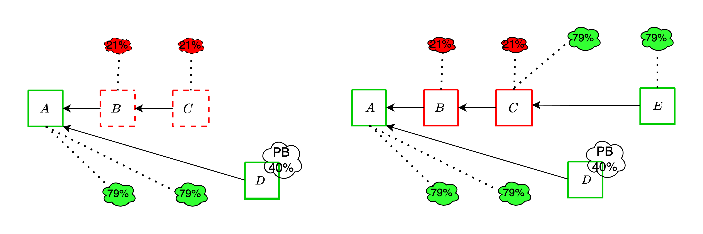


These attacks remain viable even with the addition of DAS, and in fact can become more effective because of it, as we discuss in the upcoming sections.

### Proposer sees *unavailable*, attesters see *available*: enhanced ex-ante reorgs

#### With the tight fork-choice

The adversary is able to somewhat strengthen the ex-ante reorg attack from the previous section, by leveraging the fraction $\delta$ of honest validators which it can trick into thinking that an unavailable block is available. It proceeds as following:
1. Instead of completely withholding block $B$, the adversary publishes it but does not fully publish the associated data. It does so in such a way that it maximizes the amount of honest validators whose subnet sampling is successful, and thus who think that B is available. 
2. Therefore, $\delta$ such validators vote for $B$, joining the $\beta$ adversarial validators.
3. The adversary then extends $B$ with another block $C$, itself fully available. Again, $\delta$ honest validators and $\beta$ adversarial validators vote for $C$
4. This continues until an honest slot, whose proposer attempts to fork $B$ out (unless they happen to be in the $\delta$ which see it as available). At this point, the adversary makes $B$ available, and the honest proposal does not get voted if the votes on the adversarial chain overcome the proposer boost. 

Compared to the previous attack, the adversary gains an extra $\delta$ per slot. It is therefore important to do enough sampling to keep $\delta$ low.

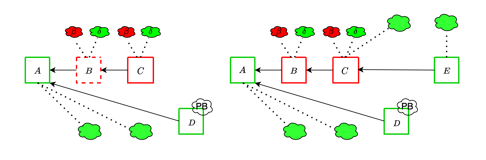


#### With the trailing fork-choice

As already mentioned, here we are going to assume that $\delta_p \ll \delta_s$ and only worry about the effect of $\delta_s$. The adversary is only able to exploit $\delta_s$ *during the trailing period*. With a trailing period of one slot, it can at most add a single $\delta_s$ to its attack budget.

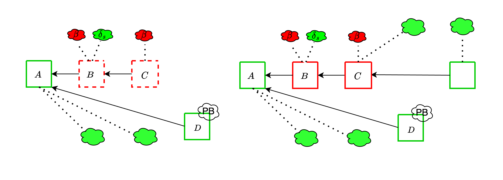


This attack informs the need to do enough subnet sampling that ex ante reorgs attack do not become significantly easier. For example, if $\delta_s$ is 20%, a 10% attacker could do such a reorg about 100 times a day, instead of only about once a day. Even worse, [with the current parameters of the PeerDAS spec](https://github.com/ethereum/consensus-specs/blob/d29581315579d37064abf21b174750f9d5c099c0/specs/_features/eip7594/das-core.md#custody-setting), an attacker controlling a single proposer can perform a reorg! This is because `CUSTODY_REQUIREMENT`, the minimum number of subnets that a validator participates in, is set to 1, which makes $\delta_s$ nearly 50%. For example, the attacker can make the data available in 15 out of the 32 subnets, and convince all validators in those subnets to vote for their unavailable block, overcoming proposer boost. 

##### Mitigation

As already discussed [here](https://ethresear.ch/t/from-4844-to-danksharding-a-path-to-scaling-ethereum-da/18046#possible-fork-choice-attack-vectors-9), this attack vector can be mitigated by attesters of slot $n+1$ complete peer sampling 10s into slot $n$, while the proposer can keep trying to sample until they propose. If the proposer extends a block which an attester sees as unavailable, they try to sample again. This is in spirit much like [view-merge](https://ethresear.ch/t/view-merge-as-a-replacement-for-proposer-boost/13739), but does not require any extra message in the proposal. In the previously described attacks, this mitigation would make it so that the attesters of slot 4 do not see $B$ as available *unless the proposer of $D$ does as well*: either the proposer sees $B$ as available and $D$ extends $C$, or the proposer sees $B$ as unavailable *and so do attesters*. In either case, they vote for $D$.

This mitigation has the downside of worsening the timing assumptions around peer sampling, reducing the benefits of the trailing fork-choice. Still, if this was the only fork-choice problem caused by DAS, we might be ok with solving it this way and otherwise keeping things as is. The next attack does not seem to have such a simple mitigation, and motivates our desire to move to the *(block, slot)* fork-choice to more effectively address the attack vectors related to (un)availability.

### Proposer sees *available*, attesters see *unavailable*

#### Targeted data release

The attack is going to rely on being able to convince an honest proposer that an unavailable block is available, *even after it performs peer sampling for it*. How realistic this assumption is depends on how exactly peer sampling is performed. For example, suppose that nodes whose sampling queries fail just try again with other peers. Then, if the adversary wants to target a specific proposer, it has to:
1. Link the proposer's validator identity to a node
1. Ensure that it controls at least one peer of the node, and advertise that it custodies all of the columns
2. Make all of the data unavailable
3. Wait for the node to send sampling query to the peer it controls, after having failed with other peers, and respond to all of them.

#### Tricking an honest proposer into extending an unavailable chain

Given this capability, the adversary can manipulate an honest proposer into extending an unavailable chain, leading to their block being reorged. *In this scenario, we only assume that the adversary controls two successive proposers*, in this case for slots 2 and 3, respectively. The sequence of events unfolds as follows:

1. The adversary only publishes a single unavailable block $B$ during slot 2 and does not publish any block in slot 3.
2. Importantly, the adversary convinces the proposer for slot 4 that $B$ is available. As a result, the proposer for slot 4 does not attempt to reorg $B$ through a [proposer boost reorging](https://github.com/ethereum/consensus-specs/pull/3034) for the following reasons:
    - The proposer perceives $B$ as available.
    - Even if $B$ does not receive any votes, the proposer boost reorging mechanism does not currently attempt reorgs that span more than one slot (as a liveness protection).
3. As a result:
    - Since all other validators see $B$ as unavailable, they continue to vote for $A$.
    - The proposer for slot 5 extends $A$ with $D$, effectively reorging the honest and available block $C$.

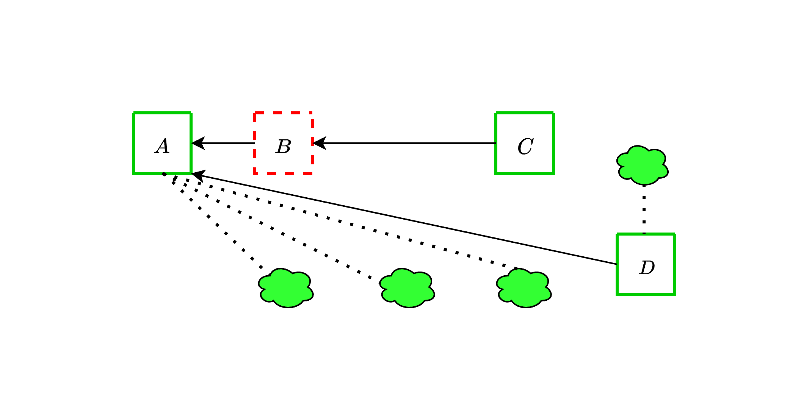


The attack could even target multiple honest proposers in a row, leading to all of their blocks being orphaned! This is particularly serious given that the attacker does not need to control a significant amount of stake to pull this off.

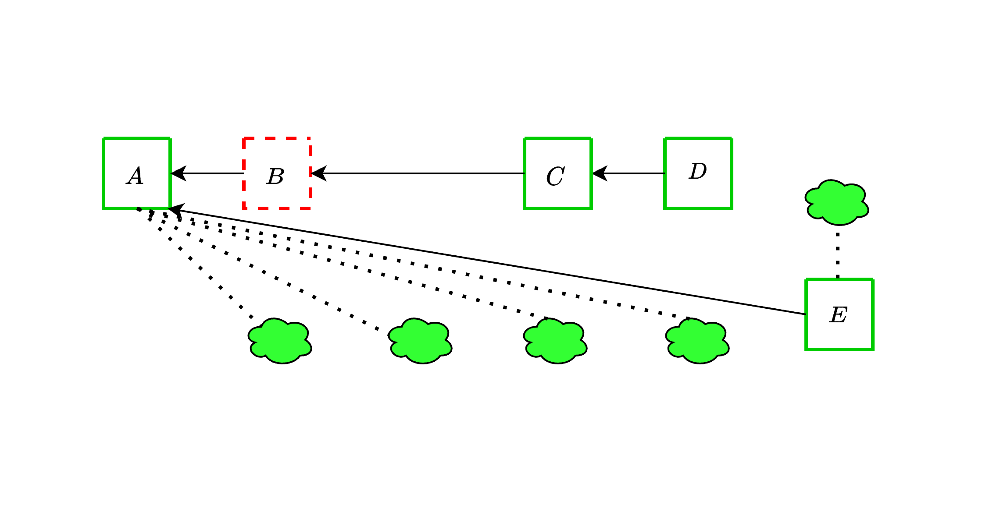


## (block-slot) fork-choice

The attacks discussed above can be effectively addressed by employing a variation of the fork-choice rule known as the (block, slot) fork-choice function. This modification, proposed [a few years ago](https://github.com/ethereum/consensus-specs/pull/2197), is specifically designed to account for attestations associated with *empty slots*. At any given slot $t$, considering a proposal $B$ extending the head of the canonical chain $A$, we also take into account the empty slot identified by $A$. To clarify, with this modification, we consider votes for a block $A$ as votes for pairs (block, slot) (rather than just votes for block $A$).


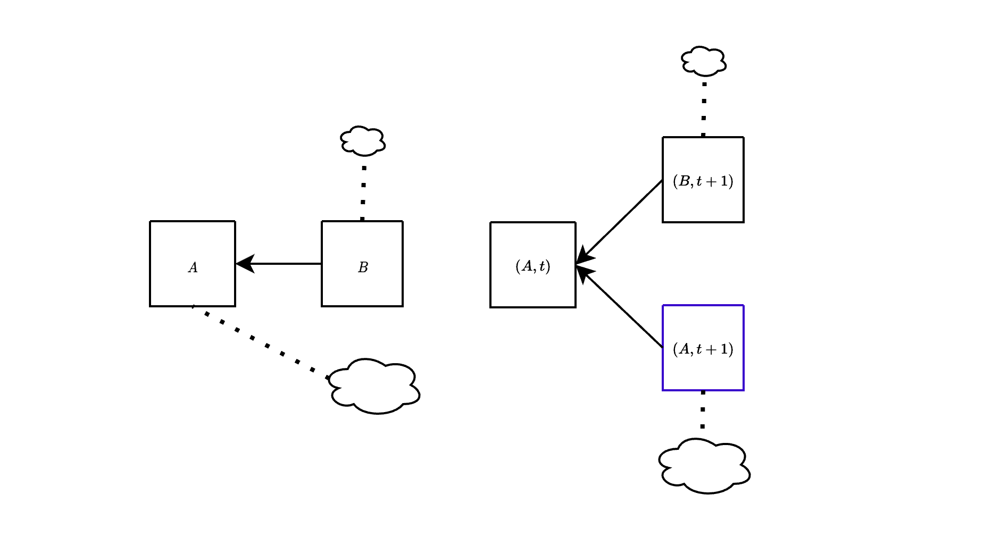


In the figure above, we show the difference between the current fork-choice (left) and the (block, slot) fork-choice (right), in the case when a block $B$ is proposed a bit late. Essentially, this approach enables us to concurrently consider both $(B,t+1)$ and $(A,t+1)$ at slot $t+1$. This effectively mitigates the attacks discussed earlier, as we show below.

### Revisiting the last attack

Consider the following scenario (which is the starting point of the attack **Proposer sees available, attesters see unavailable**):

1. Block $A$ is a fully available block assigned to slot $t$.
2. Block $B$, on the other hand, is unavailable but appears available to a few validators due to adversary manipulation.

Following the current fork-choice function, during slot $t+1$:

1. The majority of validators recognize $B$ as unavailable and consequently vote for $A$.
2. A minority of validators cast their votes for $B$.

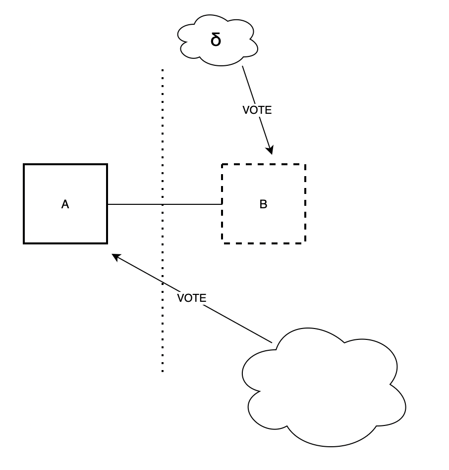


By introducing the (block,slot) fork-choice function, the majority of validators would then effectively vote for the pair $(A,t+1)$.

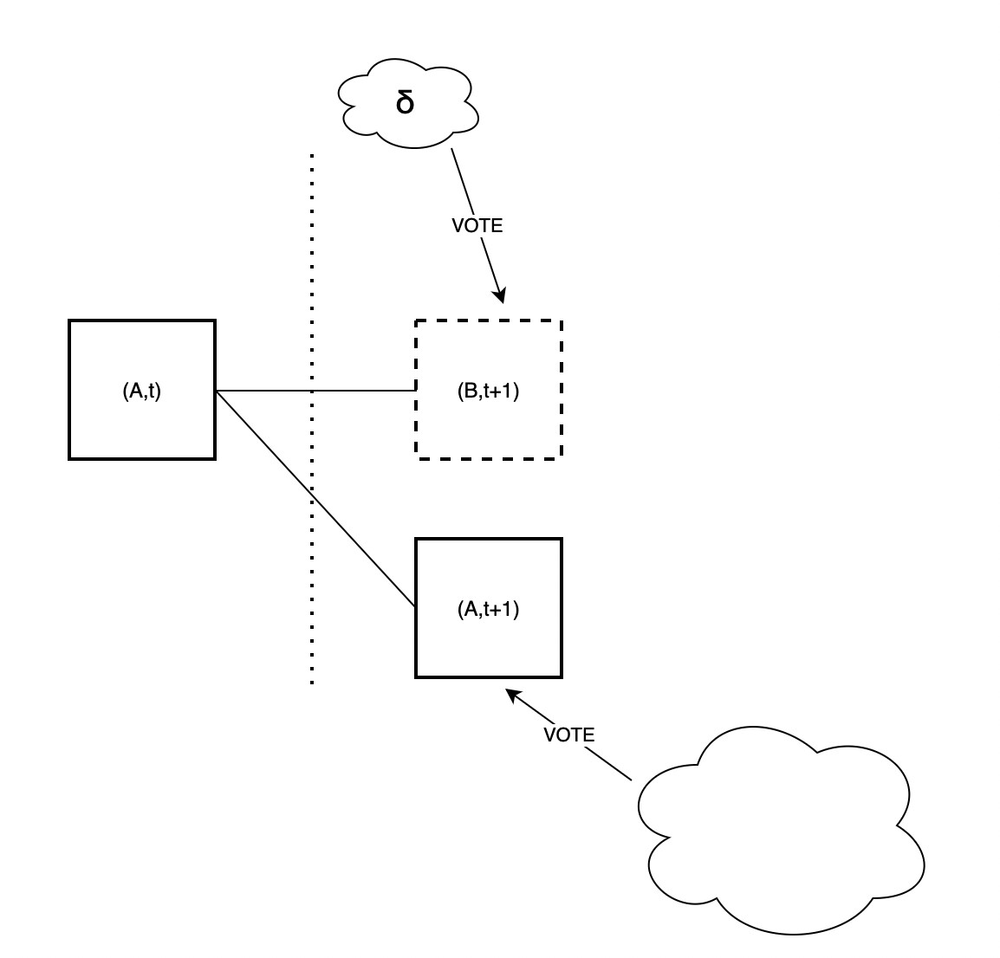

Continuing the sequence of events in the attack, at slot $t+2$, the adversary abstains from proposing any block. Consequently, the majority of validators will opt to vote for $A$ which effectively means voting for the pair $(A, t+2)$.


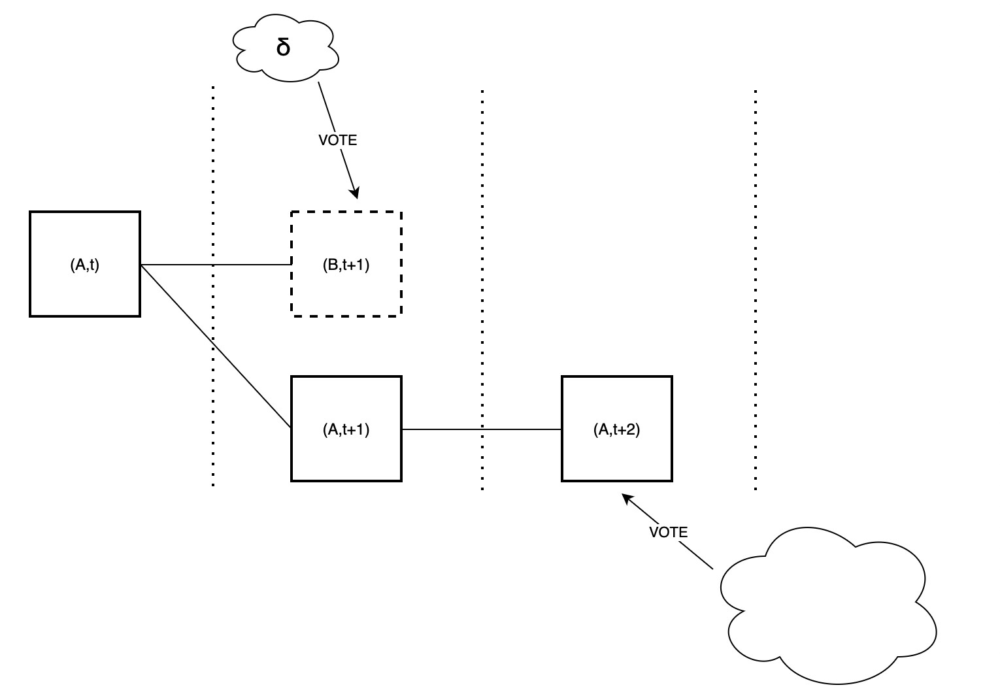

At this point, although the adversary makes the honest proposer for slot $t+3$ believes that $B$ is available, such proposer would still extend $A$ since the chain $(A,t+2)$ is heavier compared to the chain with head $(B,t+1)$.

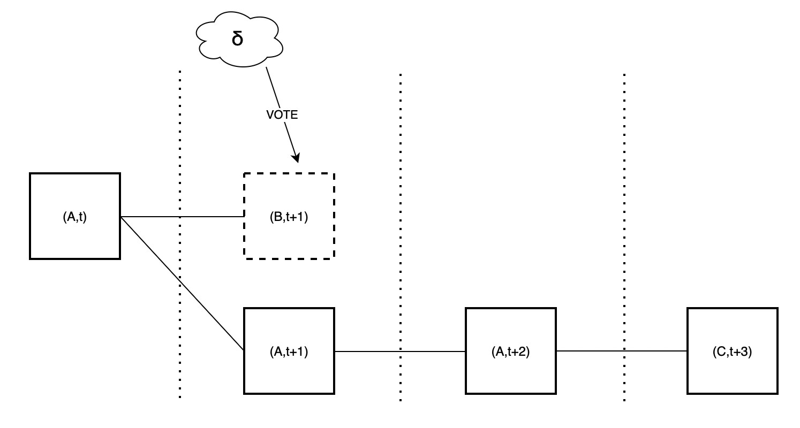

### (block, slot) spec

Take a block $A$ proposed by the block proposer for slot $t$ and a vote $v$ for block $A$ cast in slot $t+d$. Then, $v$ is considered as a vote for any of the tuples $\{(A,t),(A,t+1),\cdots,(A,t+d)\}$, because $v$ states that the head of the canonical chain is $A$ in all of those slots.

Consequently, the fork-choice function also proceeds by (block, slot) rather than just by blocks.
Specifically, the children of $(A,t)$ are all those (block, slot) pairs $(B,t+1)$ where $B$ is either $A$ or a child of $A$. This means that in this context, $(A,t+1)$ is considered a child of $(A,t)$. Therefore, votes cast in support of any child of $A$ are now weighed against votes cast in support of the *empty slot* $(A, t+1)$. The fork-choice proceeds in this way until it reaches the current slot, at which point, it outputs the block of the head (block, slot) pair. Note that by the way we have defined things, the support of the pair $(A,t+d)$ includes all votes cast for any block $C$ that is both descendant of $A$ and proposed in a slot higher than $t+d$, but such that its chain does not include any block proposed in slot $t+d$. 


We illustrate this in the following figure. On the left it's the actual block tree with attestations. On the right it's the block tree as it is interpreted when running the fork-choice. At slot $t+1$, the choice is between $(B,t+1)$ and $(A,t+1)$, and the weight of the latter is made up of attestations to $A$ in slots $\ge t+1$ (the green and orange ones) and attestations to $C$ at slot $t+2$ (the yellow ones), since these also indicate that $A$ is the head at slot $t+1$.

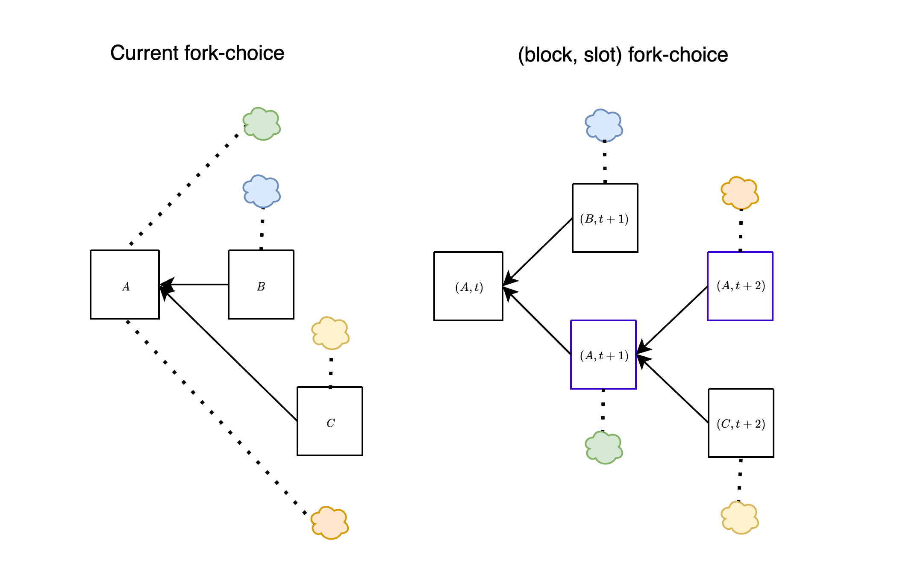


[Here](https://github.com/ethereum/consensus-specs/compare/dev...fradamt:consensus-specs:block-slot) is an early attempt at a simple specification of the (block, slot) fork-choice. The loop in `get_head` is modified to proceed slot by slot. At each slot the heaviest child of the current `head`, `best_child`, is compared against `empty_slot_weight`, the weight of "the subtree rooted at the empty slot", which is computed by `get_empty_slot_weight` by interpreting votes as explained above. We include here the modified `get_head` and the important part of `get_empty_slot_weight` (in both cases, other than for removing the parts related to the backoff logic, which we discuss later). 

```python
def get_head(store: Store) -> Root:
    # Get filtered block tree that only includes viable branches
    blocks = get_filtered_block_tree(store)
    # Execute the LMD-GHOST fork choice
    head = store.justified_checkpoint.root
    slot = Slot(blocks[head].slot + 1)
    while slot <= get_current_slot(store):
        children = [
            root for root in blocks.keys()
            if (blocks[root].parent_root == head
                and blocks[root].slot == slot)
        ]
        if len(children) > 0:
            best_child = max(children, key=lambda root: (get_weight(store, root), root))
            best_child_weight = get_weight(store, best_child)
            empty_slot_weight = get_empty_slot_weight(store, head, slot)
            if best_child_weight >= empty_slot_weight:
                head = best_child
        slot = Slot(slot + 1)
    return head

def get_empty_slot_weight(store: Store, 
                          root: Root, 
                          slot: Slot) -> Gwei:
    ...
    attestation_score = Gwei(sum(
        state.validators[i].effective_balance for i in unslashed_and_active_indices
        if (i in store.latest_messages
            and i not in store.equivocating_indices
            and (
                (store.latest_messages[i].root == root
                 and store.latest_messages[i].slot >= slot
                or (store.latest_messages[i].slot > slot
                    and not store.latest_messages[i].root == root
                    and get_ancestor(store, store.latest_messages[i].root, slot) == root
                    )
            ))))
    ...
    return attestation_score + proposer_score
```


### Backoff scheme

One of the disadvantages of the current proposal is that the performance under bad network conditions becomes worse. Chain growth stops completely if block latency is > `SECONDS_PER_SLOT / 3` (= 4 seconds in the current config). 

Therefore, a *backoff* scheme is necessary to facilitate chain progression during periods of extended latency. Without such a mechanism, the chain would continuously build on the same (empty) block, resulting in a sequence of empty blocks and an inability to extend the chain with non-empty ones.

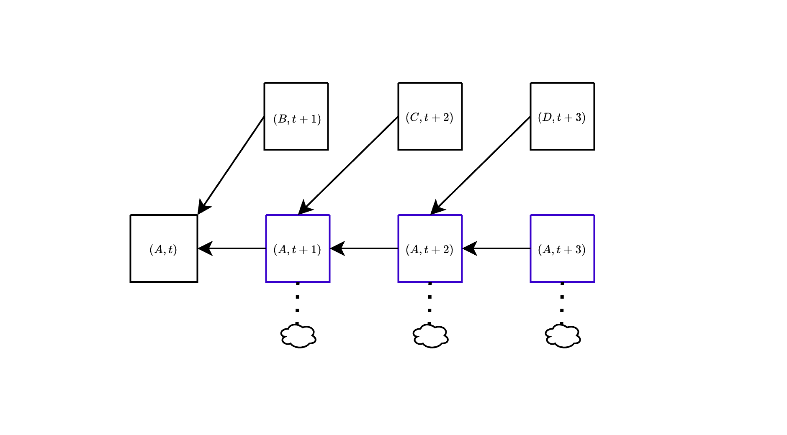


The backoff scheme is devised to alleviate prolonged periods of empty blocks within the chain. When such instances occur, the scheme intervenes by aiding potential non-empty blocks in accumulating the necessary attestations. As these supported blocks successfully advance the chain, the backoff mechanism is gradually deactivated. This gradual deactivation process continues until the system reaches a state where the backoff mechanism is no longer necessary.

The activation and deactivation of the backoff mechanism are represented by the `backoff_status`, which is created and updated within `get_head`. Crucially, if two honest validators are on the same path while executing `get_head`, they will share identical backoff statuses. This means that, under synchrony, for honest validators selecting the same branch of the block tree, the backoff mechanism is synchronized, activating and deactivating simultaneously. In the spec linked above, *an active backoff has the effect of delaying by one slot the counting of votes for the empty slot*: votes for $A$ only count for the empty slot $(A,s)$ if they are *at least from slot $s+1$*. In other words, we take all votes *directly* for empty slots and move them back by one slot: votes to $(A,t+1)$ count for $(A,t)$, votes for $(A,t+2)$ count for $(A,t+1)$ etc... For example, look at the green attestations, which vote for $A$ at slot $t+1$. When the backoff is not active, these contribute weight to $(A,t+1)$ (more precisely, are counted by `get_empty_slot_weight` when run at slot $t+1$ with $A$ being `head`), but when the backoff is active they go back to only contributing to $(A,t)$. Same goes for the orange attestations to $(A,t+2)$, which only contribute to $(A,t+1)$ when the backoff is active.

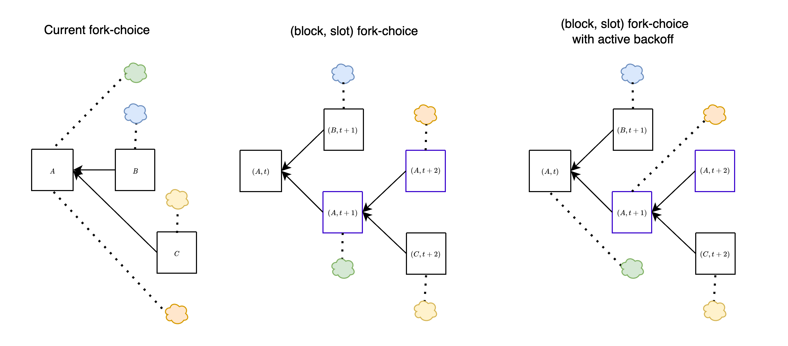


In the next figure, network latency is high, and all block proposals are late by a few seconds, so they never get any votes. At first, this leads to $B$ being orphaned, because all votes go to $(A,t+1)$. For simplicity, we assume that the backoff immediately activates on that branch. In slot $t+2$, $C$ is also late, and all votes again go to $A$. Due to the backoff being active, these votes do not count for $(A,t+2)$ but only for $(A,t+1)$, so $C$ is still the head of the chain, and is voted in the next slot. Again, because the backoff is active, those votes only count for $(C,t+2)$ and not for $(C,t+3)$, i.e., they do not count "against" $D$, the block proposed at slot $t+3$. In order for a block to get orphaned, it now needs to be *one whole slot late*: votes for $A$ at slot $t+3$ would count for $(A,t+2)$ and thus against $C$, but there will be no such votes as long as $C$ arrives before slot $t+3$.

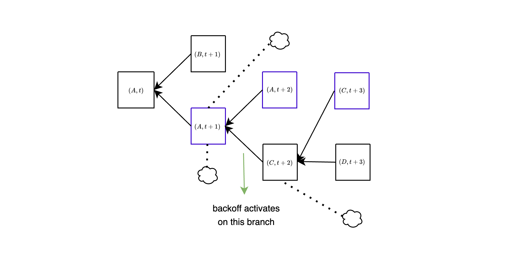

The specific mechanism to activate the backoff scheme are still a work in progress, and the spec modification has been written so that all of the relevant logic is confined to `update_backoff_status`, called at the end of each iteration of the loop in `get_head`. 


### Attacks to the DAS fork-choice with (block, slot)

By adopting the (block,slot) fork-choice function, if a block is unavailable by its attestation deadline, most honest validators will not vote for it. Instead, they will vote for the empty block. With this, we would hope to achieve a stronger property than $\delta$-safety of sampling:

> If the validator set is $> \frac{1}{2(1-\delta)}$ honest and the network is synchronous, no unavailable block is ever in the canonical chain of any honest validator 

The reasoning seems simple: if a block $B$ is unavailable at a given time when the fork-choice is being run, than $\delta$-safety of sampling ensures that at most a fraction $\delta$ of the honest validators in the committee of any previous slot could have voted for it. In particular, at least $1-\delta$ of the honest validators of $B$'s proposal slot would have voted for the empty slot. If $> \frac{1}{2(1-\delta)}$ of the validators are honest, then this is $> \frac{1}{2}$ of the validators, and the empty slot would have a majority and win.

*Things are unfortunately not actually so simple.* In the above, we have made the assumption that validators that do not vote for $B$ will instead vote "for the empty slot". In fact, there could be multiple "empty slots" to vote for, if there is already a chain split, for example caused by a balancing attack, as in the left figure below. The honest votes then get split among multiple branches, and an unavailable block can still "look" canonical to validators that have been tricked into seeing it as available. Another way to achieve the same thing is by equivocating with available blocks and an unavailable block, to split most of the honest votes between the available ones, instead of having them go to the empty block, as in the right figure below.

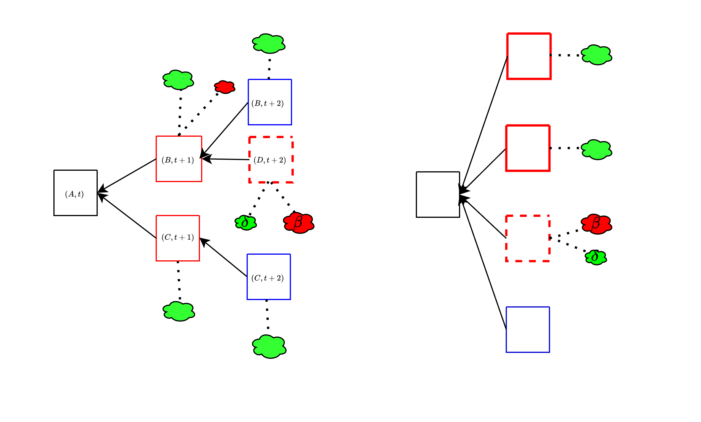


### A direction for further improvement: the majority fork-choice

It is not at the moment clear whether it is possible to completely eliminate this attack vector with "known tools" (we consider the (block, slot) fork-choice such, since it has been discussed for years, though not implemented). One potentially promising direction is to do something akin to (block, slot) but even a bit more extreme: at slot $t$ in the `get_head` loop, we could find the `best_child` and then pit it against *all of the voting weight from slots $\ge t$ which did not vote on the `best_child`'s subtree*. In other words, we require a block from slot $t$ to have a majority of all attesting weight from slots $\ge t$. This way, it wouldn't matter if the adversary finds ways to split honest votes: *a vote is against a block whenever it could have been for it but isn't*. 

This would very clearly gives us the stronger property we previously wished for, because an unavailable block would need to get a majority of each committee's weight in order to win out against the empty slot. The challenge is making sure that such a change does not break anything else in subtle ways, worsen known attacks, or make it much easier to stall liveness.


You can find the preliminary spec changes from the previous (block, slot) spec to the majority fork-choice [here](https://github.com/ethereum/consensus-specs/commit/baece58837fcfc745443a7144f2558463d6ff5b9). The important bit is that now `get_empty_slot_weight` counts weight from all attestations which could be on the subtree of `best_child_root` but are not.

```python
attestation_score = Gwei(sum(
    state.validators[i].effective_balance for i in unslashed_and_active_indices
    if (i in store.latest_messages
        and i not in store.equivocating_indices
        and store.latest_messages[i].slot >= slot + 1 if is_backoff_active else 0
        and not get_ancestor(store, store.latest_messages[i].root, slot) != best_child_root)
))
```