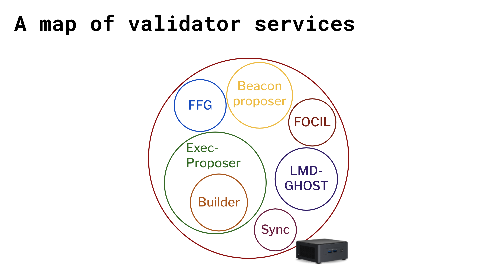
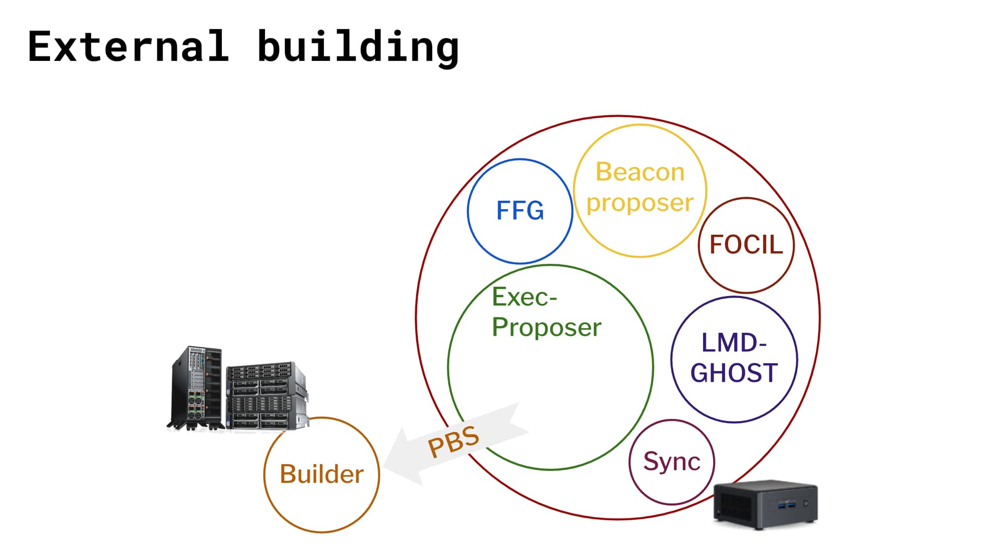
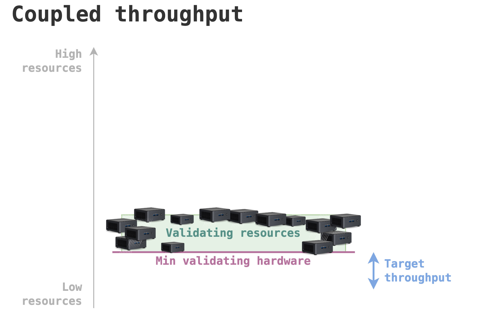
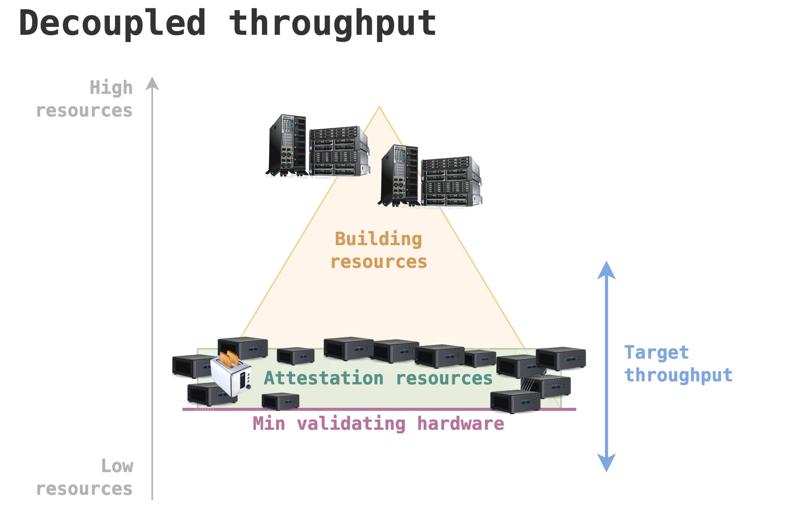
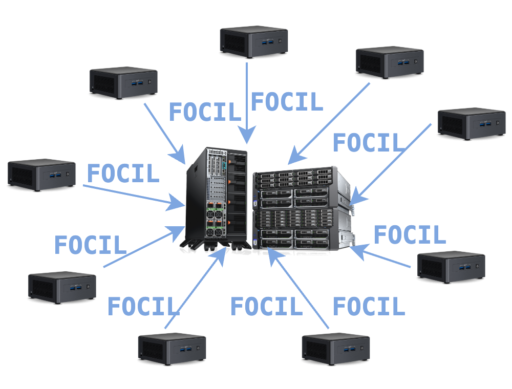

*Many thanks to Alex Stokes, Ansgar Dietrichs, Carl Beekhuizen, Caspar Schwarz-Schilling, Dankrad Feist, Data Always, Drew van der Werff, Eric Siu, Francesco d’Amato, Jihoon Song, Julian Ma, Justin Drake, Ladislaus von Daniels, Mike Neuder, Nixo, Oisín Kyne, Parithosh Jayanthi, Potuz, Sacha Saint-Leger, Terence Tsao, Thomas Thiery, Tim Beiko, Toni Wahrstätter for their comments and reviews (these are not endorsements). I bothered a lot of people lol.*

---

There are important conversations the Ethereum community should have in the next months: What to make of *local building*? What is the future of the *validator set*? How to *scale the L1*? How to *scale the blobs* so the L2s can scale?

To make these decisions, we need to clarify what the goals of Ethereum are, and what are means for us to achieve goals such as censorship-resistance, security (e.g., safety \+ liveness), scale or verifiability. Given recent advances in protocol R\&D, we want to engage in efforts to explore how these features further the goals of our users and builders.

This note discusses **local building** and asks:

*To scale the L1 and provide more blobs for rollups, should we decouple network throughput from what local builders with minimal hardware achieve, and if so, can we still preserve the good properties that local builders guarantee?*

We propose to curate a wider discussion through writings and open discussions in a new “Protocol research call”. See the [announcement](https://ethereum-magicians.org/t/protocol-research-call/23261?u=barnabe) over at ethereum-magicians! See also "[Paths to SSF revisited](https://ethresear.ch/t/paths-to-ssf-revisited/22052)", a second post discussing the role of home operators in the consensus layer, also discussed during the Protocol research call #1.

## Protocol roles and service providers

In this note and following, we will be concerned with *protocol roles*, such as *attester* or *builder*, which are functions expected by the protocol to be fulfilled. The party responsible for fulfilling a role is a *service provider*, ultimately represented by a **node** on the Ethereum network. Assigning the right node to the right role is derived from understanding what the system needs to optimise for, and how much various nodes contribute to these objectives given their resources.

  
*A staking node is expected to fulfil the roles above, or may be expected to (the FOCIL role does not currently exist, and is discussed below).* 

We want every node on the network meeting certain [hardware requirements](https://github.com/ethereum/EIPs/pull/9270) to always be able to *verify* the availability and validity of Ethereum. [This is a non-negotiable constraint.](https://dankradfeist.de/ethereum/2021/05/20/what-everyone-gets-wrong-about-51percent-attacks.html) A node with *the most basic* resources meeting the hardware requirements may be called a **minimal node**. A node controlling a *validator*—a protocol role bundling the functions of *attester*, *proposer*, *sync committee* and others—is called a **staking node**.

In this note, we discuss how to tap into the [asymmetry](https://vitalik.eth.limo/general/2021/12/06/endgame.html) between verifying and building. *Building* is the act of appending data to the ledger, whether transactions or blobs. *Verifying* is the act of receiving this data and convincing oneself that the data is available (“I know that all of the data published by the builder can be recovered somewhere on the network”) and valid (“The data follows protocol rules, e.g., transactions included in blocks must be valid”). *Building* supplies **throughput** to the network, i.e., supplies the gas and blobs delivered per unit of time. *Verifying* limits this throughput, to the quantity that can be verified by nodes before they must perform other tasks such as attesting.

 
*The builder role was mostly externalised by staking nodes to* **external building nodes**.

## The asymmetry of verifying and building

Today, the hardware requirements are set such that minimal nodes are always able to verify the chain fully, and perform validating duties including producing FFG attestations for finalizing the chain, and LMD-GHOST attestations for updating the fork-choice rule. The target throughput of the chain is set such that minimal nodes are able to supply this throughput entirely, i.e., make blocks delivering up to the target throughput (and its corresponding limit).

  
*Minimal nodes satisfying precisely the minimum validating requirements are able to run a validator.*

Yet in more and more places, we have a strict asymmetry between *verifying* and *building*. There is a potential future, where a node that has the most basic resources and still meets hardware requirements stops focusing on anything related to building and just verifies. The builder in this model would handle requirements around significant throughput potentially required to scale blocks and blobs.

With PeerDAS for instance, a builder with 8x resources could create an [8x larger block](https://hackmd.io/@manunalepa/peerDAS/https%3A%2F%2Fhackmd.io%2Fe3UGeZ7cS92uk8b1SeVSyw#WithPeerDAS) that a 1x attesting node fully verifies with a fraction of the builder’s resources. While the builder must upload the blobs themselves, 8x more data in the worst case, (if minimal attesting nodes have not received the blobs in their own mempools previously), a minimal attesting node must only download 1x the amount to verify availability and perform its duties properly. We could then allow building nodes with strictly higher upload bandwidth to disseminate this data, while attesting nodes require only a fraction of this bandwidth to verify that the data is available and gossip it to their peers.

Another example of where we expect a large asymmetry will occur when the L1 EVM is snarkified. Then, the major cost of building a block will consist in generating a proof of its validity, while every other node on the network needs only ensure that the block data is available (you can think of dumping the block in a blob, with availability checks becoming even lighter as we move [towards full DAS](https://ethresear.ch/t/fulldas-towards-massive-scalability-with-32mb-blocks-and-beyond/19529)) and making a constant-time computation to verify the proof of validity. This future [may be much closer than we think](https://ethproofs.org/), and as a thought experiment, should we make nothing of the massive resource asymmetry between building a zkEVM-proven block and verifying it? This should clue us in to the fact that asymmetries are scaling opportunities, and lead us to ask whether they are to be acted upon in more immediate places, such as scaling blob throughput.

  
*While we have a broad base of many staking nodes performing the attestation service, there are fewer, better-resourced (in compute, bandwidth, or order flow) building nodes in the network. Could the target throughput be increased given the existence of these building nodes?*

## Three network properties to achieve

So far, we have kept network throughput to a level that *all* staking nodes could achieve while performing the building role. We spell out three network properties that we wish to satisfy, guiding our hand in designing network architecture:

1. *Censorship-resistance of the network:* We want any fee-paying transaction to be included given that throughput is available for this transaction to be included.  
2. *Target throughput achievement:* Suppose the Ethereum network sets some target throughput, by setting the EIP-1559 gas and EIP-4844 blob targets. We may ignore the reasons why this amount of throughput was set, we just take as given that there is some target that is now given to us. Can we be satisfied with high probability that the network will achieve this throughput, without leading to bad outcomes such as an implicit increase in minimal hardware requirements?  
3. *Block production liveness:* No single party or colluding group of parties should be able to halt the progression of the chain, e.g., by being the only parties able to deliver a valid block to the network.

When a staking node does not delegate its building function to a separate external builder, we call the node a *local builder*. The presence of local builders buys us a lot in terms of the three network properties:

1. *Censorship-resistance of the network:* Local builders are part of the validator set, which is assumed to be decentralised enough to provide good censorship-resistance. When external builders censor, assuming that some local builders keep producing blocks, the chain preserves some (possibly lower) censorship-resistance.  
2. *Target throughput achievement:* Today, throughput is set such that local builders are always able to achieve it, so we have a pretty good guarantee that it will be achieved, given that every external builder has at least equal capabilities.  
3. *Block production liveness:* A local builder can always make a valid block, so we are also confident that there will always be a builder (either local or external) who is able to progress the chain.

## Effects of decoupling throughput from local builders

What would happen if network throughput was now set to a level higher than minimal local builders could achieve? The first property may be the most hurt, as local builders could not be able to provide throughput at the target quantity. Yet this throughput may be recovered by external builders, as EIP-1559 targets and achieves some fixed amount. It is notable that already today, local builders are on average unable to provide throughput at the current target, given the depletion of the public mempool in favour of private pools (see [analysis by Data\_Always](https://x.com/Data_Always/status/1882873599637467562)). The two remaining properties would not be more hurt under this hypothetical scenario than today, as local builders under a higher network throughput could still propose blocks at today’s throughput, guaranteeing minimal liveness, and include potentially censored transactions at a lower throughput.

We may still find this situation uncomfortable: If we wish for local builders to remain economically competitive with externally-building nodes, we should ask them to delegate their building function. But if we ask them to do so, we may not feel comfortable with the quality of any of the three properties above. So if we want to decouple network throughput from what can be provided by local builders, we must ensure that we still achieve these three properties. We discuss each of them in the following sections.

### Censorship-resistance of the network

With [EIP-7805: Fork-choice enforced Inclusion Lists (FOCIL)](https://eips.ethereum.org/EIPS/eip-7805), we believe that the censorship-resistance property is essentially guaranteed at network level, in the sense that formerly-locally-building validators can achieve the provision of at least as much (but in practice much more) censorship-resistance through FOCIL than with local building.

The FOCIL mechanism selects 16 new *includers* from the validator set every slot, and each includer is able to propose a list of transactions which must conditionally be included in the block proposed for this slot. These inclusion lists constrain the proposer of the current slot, or their chosen builder, preventing them from arbitrarily excluding transactions from the network.

  
*FOCIL chooses 16 includers every slot to impose constraints on the block-building process.*

FOCIL allows staking nodes who decide not to be local builders anymore, delegating their building function to the external builder market, to still participate in the provision of censorship-resistance. Local builders do not need to pick between locally building to provide censorship-resistance or using external builders to maximise their rewards, they can do both.

FOCIL is not currently deployed, and we are still required to choose a design that extends FOCIL to blobs.

### Target throughput achievement

The target network throughput must still be carefully chosen by the network in order to prevent builders from delivering blocks that become increasingly hard to verify by minimal nodes. As a thought experiment, could we simply remove the gas limit and let the builder (either local or external) decide the size of the block they want to produce? We would have two issues:

1. The builder may output blocks that can barely be verified by minimal nodes. As long as the block receives sufficient attestations, it may be enough for it to be part of the canonical chain. But it could lead to an arms race where the requirements made on minimal nodes become no longer enough to attest properly, increasing the expectations on minimal nodes to beef up their hardware beyond the minimal specs. Note that zkEVMs for instance could alleviate this, in that any gas supplied by the builder, as long as it also comes with a proof, incurs a constant verification cost on the verifying nodes. This may not hold for blobs and data availability, for which throughput increases must always be matched with increasing verification resources in the aggregate.  
2. There is a tragedy of the commons where some externalities of a large block are only felt over time, e.g., state growth or node syncing time.  
   1. I may be able to deliver a very large block now, that gets enough attestations, but my doing so increases the state size for everyone in the future, and makes it harder to achieve a consistent throughput over time. Note that stateless architectures may partially alleviate this issue.  
   2. By delivering bigger blocks, I would also increase the sync time necessary for new nodes to catch up to the head of the chain. Again, a combination of validity proofs and statelessness can alleviate this issue.

### Block production liveness

Relying on an external network means that its failures become the system’s failures. Inherent to the nature of delegation, we can never entirely control the actions of the building “agents” chosen by our staking node “[principals](https://en.wikipedia.org/wiki/Principal%E2%80%93agent_problem)”, or prevent them from failing. But ultimately, [staking nodes themselves are agents to the protocol](https://barnabe.substack.com/p/seeing-like-a-protocol), and could fail themselves, or miss the mark in providing what the protocol seeks to supply. So the question we should ask is how far can we go and how far are we willing to go to mitigate these risks?

There are two broad approaches to obtain these mitigations: *Improving out-of-protocol infrastructure* or *adding new features in-protocol*. [Proposer-Builder Separation](https://barnabe.substack.com/p/pbs) (PBS) is instantiated today by out-of-protocol [MEV-Boost](https://boost.flashbots.net/) and [Commit-Boost](https://github.com/Commit-Boost), with relays taking on the role of trust anchors to access the market. PBS would be strengthened with in-protocol [EIP-7732: Enshrined Proposer-Builder Separation](https://eips.ethereum.org/EIPS/eip-7732) (ePBS). Using ePBS, we can provide better guarantees for the market participants, i.e., the staking nodes on one side and the external builders on the other side, as the protocol guarantees the fair exchange between the two.

To understand what is needed, we must understand the risks and failures of delegating the building role. We can never completely rule out the bad case of a “timeout” liveness failure, where the builder does not deliver the block even after a contract is struck between a staking node and the builder. We may have more systemic risks, where the interface to the external market fails. And we may have a cartel of builders refusing to build any block for anyone, unless the staking nodes paid them some sort of extortion rent.

We now give some arguments to guide our hand in choosing the required arsenal of defences:

* Staking nodes can adapt their behaviour to repeated failures of the external market, e.g., by a falling back on local building via a circuit breaker.  
* We can ensure that if a deal is struck and the builder fails to deliver, the payment still proceeds. There are multiple ways to guarantee this with in-protocol solutions. If the relay itself doesn’t fail, some optimistic relays also require an escrow payment from the builder, to compensate for failures of the builder to deliver as promised.  
* We could take the view that liveness of the block construction process assumes a particular realisation of the user demand, and strictly ask whether given a particular set of transactions available to be built, some building party will take up the job. In other words, we may care about the existence of any one single builder who can do at least as well as the staking node itself, and if the staking node does not receive most user transactions (who may prefer to transit via private pools), decide that it is not an issue with the block production liveness. Still, order flow [remains a determinant factor](https://arxiv.org/abs/2405.01329) in the success of builders. A market dominated by few entrenched entities could potentially discourage the entry of more participants, even as temporary fallbacks when liveness of the few dominant entities is in doubt. The presence of [neutral relays](https://collective.flashbots.net/t/aestus-a-neutral-relay/786) increases the entry points into the market, favouring such fallbacks. Additionally, with the emergence of new protocols such as [BuilderNet](https://buildernet.org/), we observe more innovation in the builder market towards neutral infrastructure, at least in its idealised form.  
* There are ways to harden the current out-of-protocol infrastructure, e.g., ensuring sufficient diversity with both MEV-Boost and Commit-Boost, which are both neutral pieces of software, or improving our circuit-breaker and fallback routines to minimise liveness risk should failures occur somewhere along the chain.  
* There is a true worst case where only a few nodes in the world can build the block required by the network. This is somewhat theoretical, as there are not many cases where a staking node could be forced into a position where only a few parties could satisfy the building requirements imposed on the node. A strawman is imagining FOCIL outputting a very large set of transactions and blobs to include, perhaps under a zkEVM regime where the block must additionally receive a validity proof. If the staking node itself cannot build this block themselves (and this is entirely possible if network throughput is decoupled from local builder capabilities), the staking node will be required to rely on an external builder. We should ensure that this reliance is as wide as possible, i.e., that there always exists a builder ready to deliver this block. This is not the case if we can find ourselves in a situation where only super computer-sized nodes are able to deliver, for some reason, but this can be easily mitigated by setting a network throughput limit to a level that guarantees a wide enough market, even if this limit exceeds the capabilities of local builders.  
* Going in-protocol is costly, in added complexity to the protocol mainly, especially on the path to reducing slot times and changing the consensus mechanism towards SSF. There are also questions regarding the future-proofness of any single mechanism given alternative proposals such as [Attester-Proposer Separation](https://mirror.xyz/barnabe.eth/QJ6W0mmyOwjec-2zuH6lZb0iEI2aYFB9gE-LHWIMzjQ). We typically want to have in protocol the features that require [honest majority](https://vitalik.eth.limo/general/2020/08/20/trust.html), e.g., the consensus mechanism, getting the full force of a large set of participants to bear on the safekeeping of this property. Meanwhile, obtaining a valid block from a builder requires a 1-out-of-N honesty assumption, as a single builder needs to be live to perform the service at the moment it is required. Given the 1-of-N honesty assumption, relying only on out-of-protocol solutions for delegating block building could be reasonable.

There is no easy answer on which combination of solutions to deploy here, especially as the argument for ePBS is not solely about hardening the exchange between staking nodes and builders, but also about scaling by providing better pipelining (note that for the scaling argument, it should be [considered in the context](https://ethresear.ch/t/delayed-execution-design-tradeoffs/21877) of alternative and/or complementary approaches such as [delayed execution](https://ethresear.ch/t/delayed-execution-and-skipped-transactions/21677), a topic for a future note/call).

### What we should talk about

Overall, there are two independent discussions to have:

1. Deciding whether to decouple network throughput from what local builders can achieve. Arguments were made above, discussing how the three properties fare in this context, and how they could be improved with new mechanisms such as FOCIL.  
2. Deciding how to ensure block production liveness. While this is a wide spectrum, we see broadly two ways to move forward, which are not mutually exclusive:  
   1. *Doing more in-protocol:* By deploying protocol infrastructure such as ePBS, we strengthen access to the external builder market.  
   2. *Improving out-of-protocol options:* Perhaps we are happy enough with keeping this builder interface out of the protocol, and letting staking nodes decide on their approach.

Local building is a means of obtaining liveness of the block production service, as well as censorship-resistance. Local building is also a constraint on throughput, if we decide to couple our throughput to the highest level that can be provided by the worst nodes on the network. This is a reasonable choice if local building is our *only* tool to get liveness of blocks as well as censorship-resistance. But if it is not the only tool, or the best one, we should ask ourselves: Could we move the network throughput beyond what local builders are able to provide, *as long as all nodes remain able to sustainably verify the chain at this throughput*? What changes or improvements would we need to make in order to feel comfortable with that demand?

---

*See also [a recent talk](https://youtu.be/595CmPyzFJ0?si=1eaG-6fO7A9_pW9L&t=3958) on this topic.*