# Deep Diving Attestations

*I want to provide some quantitative stats on...*
* *Head*-, *target*-, and *source* votes,
* The individual node operators' attestation performance, including the best and worst validators, 
* Attestation *timing* and *inclusion delay*, and
* The impact of *MEV-Boost, CL clients, Proposer Timing Games* and *Big Blocks with Blobs* on attestation accuracy.

*Many thanks to [Caspar](https://x.com/casparschwa), [DappLion](https://x.com/dapplion), [Barnabé](https://x.com/barnabemonnot) and [Potuz](https://x.com/potuz_eth) for their feedback and review!*

## Data
I use data ranging from slot 9,169,184 to slot 9,392,415, amounting to 6,975 epochs, 31 days of data.
The goal is to provide some initial results from analyzing attestations, as a warm-up for analyzing correlated attestation penalties ([EIP-7716](https://eips.ethereum.org/EIPS/eip-7716)).
Some of the data is collected by myself using custom parsing scripts. Other data was provided by [EthPandaOps](https://ethpandaops.io/). This includes timing data collected from running nodes of **every client** in the regions **Sydney**, **Helsinki**, and **San Francisco**, with all nodes being **subscribed to all subnets**. For classifying CL clients, the [blockprint](https://github.com/sigp/blockprint) tool was used.

> Importantly, my solo staker categorization is done very conservatively to avoid confusing professional entities with solo stakers. In total, my dataset contains 8,488 validators classified as solo stakers.

The code for creating the charts is published in [this repo.](https://github.com/nerolation/eth-deep-diving-attestations)

## Attestations

### The Basics
[Attestations](https://eth2book.info/capella/part2/consensus/) are at the core of Ethereum. Through attesting to past checkpoints, Ethereum's validators agree on a state to become irreversible ([Casper FFG](https://eth2book.info/capella/part2/consensus/casper_ffg/)). Furthermore, validators use attestations to agree upon the tip of the chain, deciding which transactions get confirmed and which don't ([LMD GHOST](https://eth2book.info/capella/part2/consensus/lmd_ghost/)). 
Every validator, backed by its stake, participates in every epoch and is randomly assigned a slot, during which it is expected to broadcast its view of the chain through attesting.

**An attestation contains three things:**
* A *source* vote: The block (and all predecessors) to be finalized
* A *target* vote: The block (and all predecessors) to be justified (=pre-finalized)
* A *head* vote: The block seen as the head of the chain.

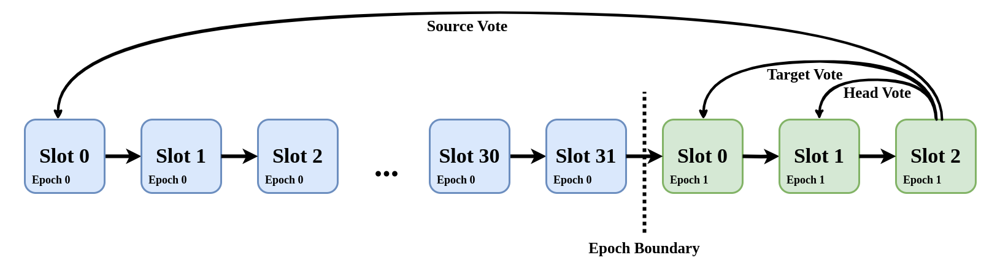

Since the [Deneb hardfork](https://ethereum.org/en/history/) that included [EIP-7045](https://eips.ethereum.org/EIPS/eip-7045), attestations for a slot in epoch N can be included up until the end of epoch N+1. However, [inclusion doesn't guarantee a reward](https://eth2book.info/capella/part2/incentives/rewards/):
To be rewarded, a validator must ensure its source vote is included within 5 slots. The target vote has to be included within 32 slots to be rewarded. Head votes must be included in the following slot to be eligible for a reward.

As of today, Ethereum counts [~1.03](https://beaconcha.in/charts/validators) million validators. This means we have 1.03 million votes every epoch, ~32,000 every slot. In one day, with 225 epochs, there are approximately 225 million attestations. This data grows quite fast.

If the **source vote** is **invalid**, then the **target** and **head vote** **MUST** be **invalid** too.

A slot can be broken down into 3 phases:
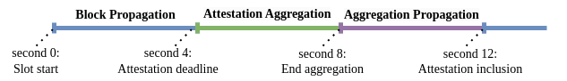

1. Validators attest when they have seen a block for the current slot or at second 4 in the slot - the attestation deadline. A block broadcasted at second 0 in the slot has 4 seconds to be seen by all relevant validators and collect votes. Late blocks risk not receiving enough attestations and being reorged by a subsequent block.
1. Between second 4 and 8 in the slot, attestations are [aggregated](https://eth2book.info/capella/part2/building_blocks/aggregator/) and broadcasted by selected validators.
2. Eventually, the subsequent block proposer includes them into its block.

> For more in-depth explanations check out this post by Georgios and Mike on "[Time, slots, and the ordering of events in Ethereum Proof-of-Stake](https://www.paradigm.xyz/2023/04/mev-boost-ethereum-consensus)".

### Definitions
**Missed vs. Failed:**

* A validator can either **miss** its attestation (*missed*) or attest to a **wrong** checkpoint (*failed*).
* **Missed attestations** can happen if the node running the validator is out of sync or offline.
* **Voting for a wrong checkpoint**, e.g. a wrong head, can have various reasons like receiving a block too late, being out of sync or even having a bug, etc. 
* **Regardless of the reason, a *failed* vote tells us one important fact about a validator—it is online.**

In the following, we'll also need the term ***"high-performing validator"*** which is a validator that hasn't failed to cast a correct and timely head vote over the complete time frame analyzed.

### Attestation Inclusion Delay

In the best case, attestations are included in the block of the **next slot**, causing a **delay of 1**. Sometimes, especially when the next proposer is offline or gets reorged, attestations are not included in the next slot. Then, the validator misses out on the rewards from the correct head vote, even though the attestation can still be included in a later block.

The following chart shows the distribution of the inclusion delay over seconds 1-63 and the **clients the attesters were using**.

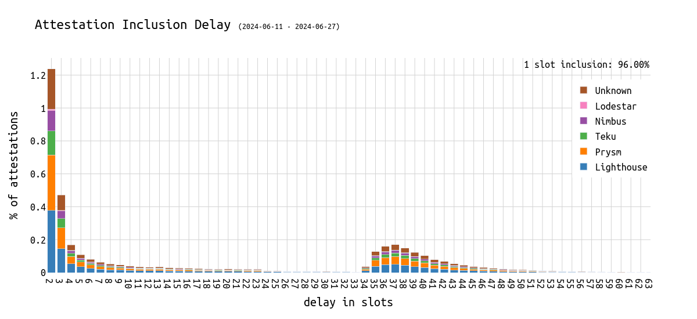

* 95.85% of attestations are included in the next slot.
* ~1.2% of attestations are included in the slot after the next.
* When a new epoch begins, old attestations are again picked up and finally included.
    * This is weird (*but there'll be an explanation little down below*).
    * Attestations of validators of all clients are affected.

**This raises the question, "*what are clients doing?*"**

Examples include slots **[9267438](https://beaconcha.in/slot/9267438#attestations)** with a delay of 35 (5250 validators), **[9267425](https://beaconcha.in/slot/9267425#attestations)** with a delay of 52 (1813 validators), or slot **[9267427](https://beaconcha.in/slot/9267427#attestations)** with a delay of 36 slots (1305 validators).

What if those late attestations were already included earlier and were later just included again (h/t [dapplion](https://github.com/dapplion))? To analyze that, we reproduce the above chart but separate by ***first inclusion*** and ***every following inclusion***:

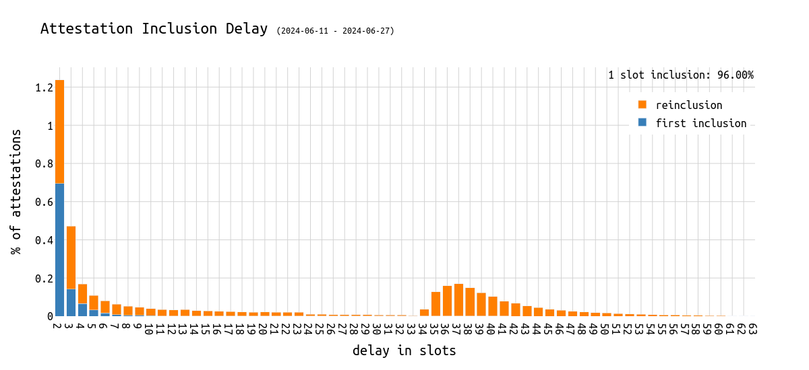

First, it is interesting that almost **half of the attestations included with a delay of 2 slots** (note: best is 1) **have already been included in an earlier slot**. This is possible because proposers are free to pick attestations that have already been included in the past 63 slots and include them again. Additionally, a block can contain the same attestations multiple times, aggregated differently.

We can see that the majority of the attestations included in the second hump with a delay of around 35 slots are **reincluded** attestations.

This raises the question, "*why does this occur with a delay of more than 32 slots?*"

In **percentage** terms, we can see the *first inclusion* share reducing over an increasing delay:

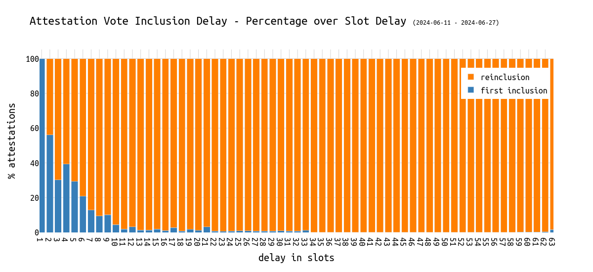

To dig deeper into this reinclusion finding, let's check the **CL clients that built the blocks** that included attestations with >32 slots delay:

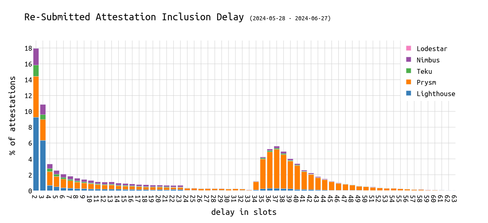

We can see quite clearly that it's mainly Prysm proposers who include attestations that have already been included earlier, which is very likely a bug. 
> The fact that the plot also shows other clients affected might stem from inaccuracies in classifying clients probabilisticly.

*The Prysm team was notified.*

**Edit**: *The Prysm team was faster in fixing the bug than I was in finishing this post.*

**Fix**: https://github.com/prysmaticlabs/prysm/pull/14156#event-13323121631

## Missed/Failed Attestations

### Missed/Failed Head Votes

**Head votes** are the **most difficult** part of an attestation. They need to be cast correctly and timely. Per [honest validator spec](https://github.com/ethereum/consensus-specs/blob/1642610bd5994d344fb1b6a9f44ec0e14a527580/specs/phase0/validator.md#attesting), **validators have 4 seconds** to receive and validate a block for the current slot. If no block is received until second 4, validators attest to the block in the previous slot. **Timeliness in the context of head votes means 1 slot.** Although older head votes can be included, there is no reward for the respective validator.

> The legend is ordered in descending order by the sum of missed votes.
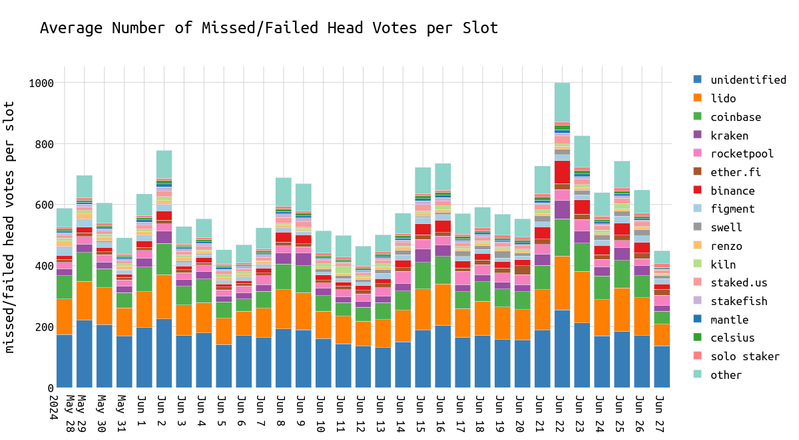

**On average, we observe around ~500 missed or wrong head votes out of ~32k validators per slot and ~16k, out of ~1m, per epoch. This represents around 1.56%.**

> The entity labeled as *unidentified* may consist of multiple independent parties, including solo stakers and entities that haven't been identified yet, and it has a total market share of 20% of all validators.

Assuming every node operator performs equally, the market share of each entity should reflect its share of missed head votes. However, this is not the case and we see certain node operators being superior compared to others.

**The following chart visualizes the delta in the expected number of missed head votes based on market share and the actual number of missed attestations.**
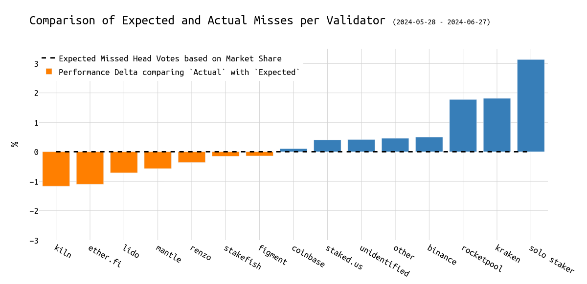

While entities such as *Kiln*, *Ether_fi*, *Lido*, *Renzo*, *Figment*, and *Stakefish* perform better than the average, we observe that Rocketpool validators, Kraken validators, and solo stakers miss up to 3% more head votes than their market share.

**Focusing on the slot indices in epochs, we distinguish between missing a head vote due to being offline and voting for the wrong head.**

The following chart shows the average number of missed/wrong head votes over the slots of an epoch:
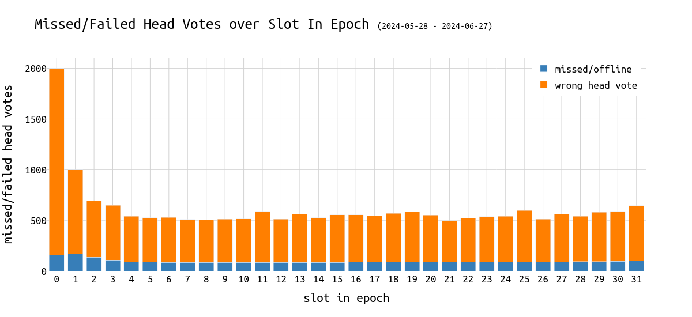

From the above chart, we can infer:
* There is a fairly **constant number of *missed* head votes**.
    * **This is expected** as *lost-key validators* contribute a constant portion to that category.
* The beginning of an epoch, particularly the first slot, has significantly more wrong head votes than the rest.
    * **This is expected** because the proposer in the first slot has to carry out the **epoch transition**. It must then broadcast that block to reach all attesters. T
* The average amount of missed/wrong head votes is **3 times larger** in the first slot of an epoch than in the epochs 2-32.

Focusing on missed head votes and CL clients, we cannot see anything suspicious in the following chart:

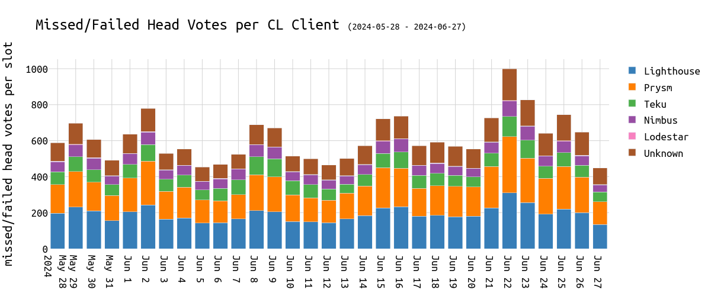

In general, it looks like all CL clients are affected by early-in-epoch misses the same:

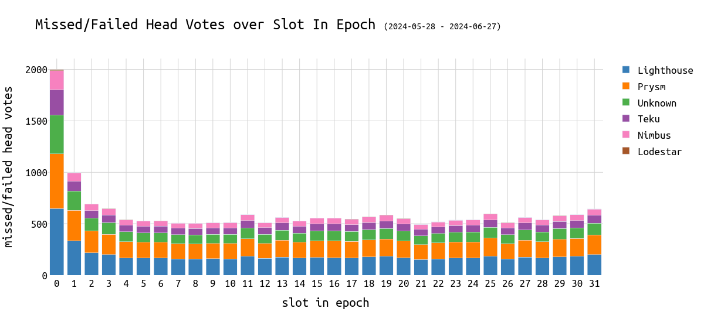

### Missed/Failed Target Votes
Target votes are already easier to get right. The only exception is the first slot of an epoch that follows the **epoch boundary**: In such cases, the head vote equals the target vote and validators having their target vote wrong tend to vote for the parent block (=the block in the last slot of the previous epoch) instead.

On average, we observe around 150 missed target votes per slot and 4,800 per epoch. This represents around **0.48%** of all validators.

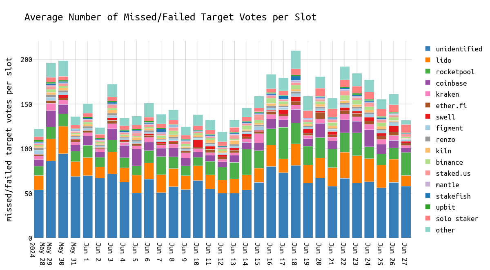

Visualizing the same over the different CL clients, we see all clients affected to extents close to their market share.

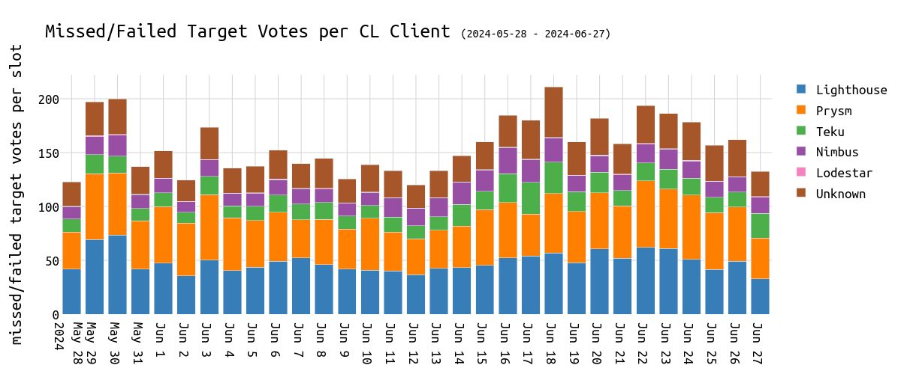

Looking at the entities that perform better than others, we again see operators such as Lido, Renzo, Mantle, Coinbase, etc. outperforming the average.

> Notably, Lido isn't a single NO but consists of multiple operators that I combined for simplicity.

On the other hand, Rocketpool validators and solo stakers perform worse and miss up to 3% more target votes than expected.

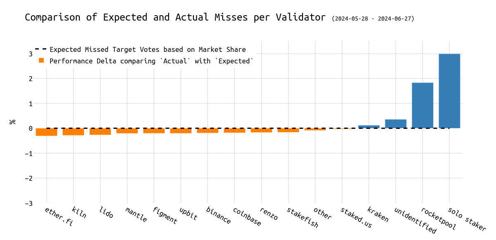

As seen in [previous analysis](https://ethresear.ch/t/the-second-slot-itch-statistical-analysis-of-reorgs/16333) on reorgs, epoch boundaries can cause troubles for certain validators when it comes to proposing a block. 
**Blocks are more frequently reorged if they are proposed in the first or second slot of an epoch.** Thus, we would expect those blocks to be responsible for the largest split-views among validators, causing some to attest to the current block, and others to the parent block. 

Even though expected, we can see that the slot index in an epoch has a major impact on failed target votes:

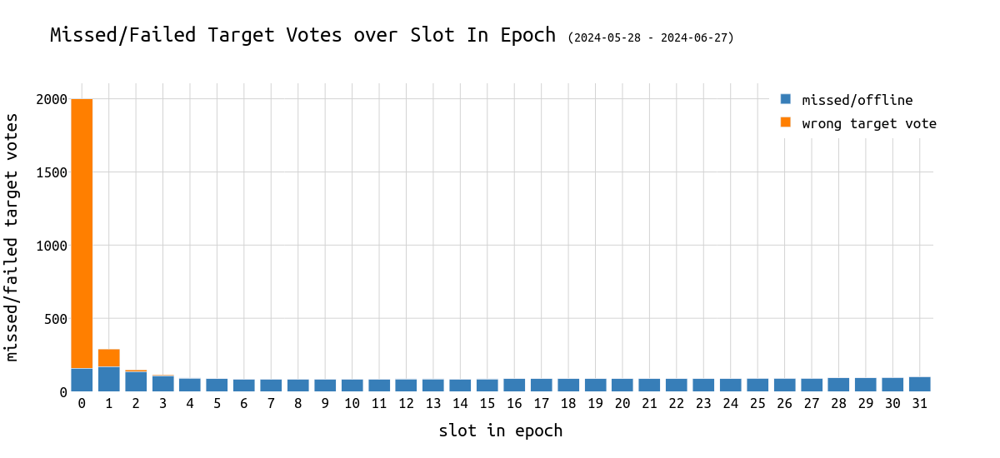

**Target votes are the hardest to get right at the beginning of an epoch.** This is visible in the above diagram showing the **first slot of an epoch with 18x more wrong target votes** than other slots. The thing is, timely and correct target votes bring twice as many rewards than head or source votes.

Although looking problematic, I'd argue this isn't a big issue. A target vote at the beginning of an epoch is essentially just a head vote, and the relative share of failures in the first slot at 6.4% is still relatively low. Furthermore, it is a known fact that epoch boundaries come with many different cascading effects including missed slots, which also contributes to the above finding.

> 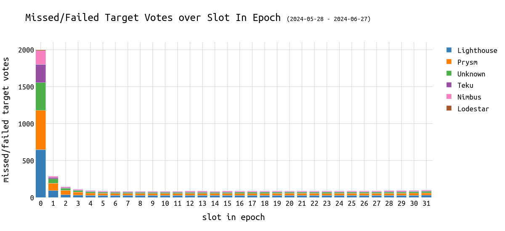
This phenomenon seems to be agnostic to CL clients.

### Missed/Failed Source Votes

Source votes are easy to get correct and even validators that are slightly out of sync have a good chance to vote for the right source checkpoint. This is because the to-be-voted-for checkpoint is at least 6.4 minutes (*=1 epoch*) in the past. Wrong source votes indicate that the validator is either out of sync or on a completely different chain. Thus, target and head votes must be incorrect if the source vote is wrong.

> For source votes one cannot differentiate between *missed* and *failed* because wrong source votes never make it onchain and are ignored by proposers/validators.

On average, we observe around 100 missed source votes per slot, 3,200 per epoch.

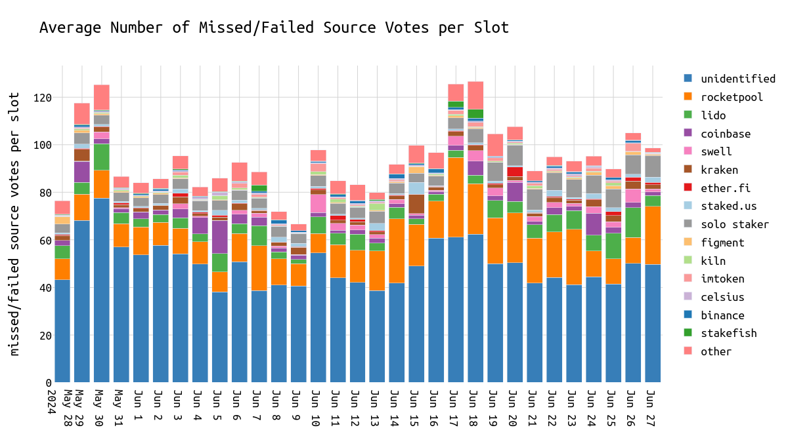

Similar to head and target votes, we observe an increased number of missed source votes at the beginning of an epoch. This MIGHT be related to the increased reorg probability at the beginning of an epoch but more analysis would be needed to confirm that.
In general, validators usually have ample time (at least 32 slots) to cast their source vote. However, if their head vote is incorrect, it might result in the entire attestation being ignored by an aggregator and, consequently, not being recorded onchain.

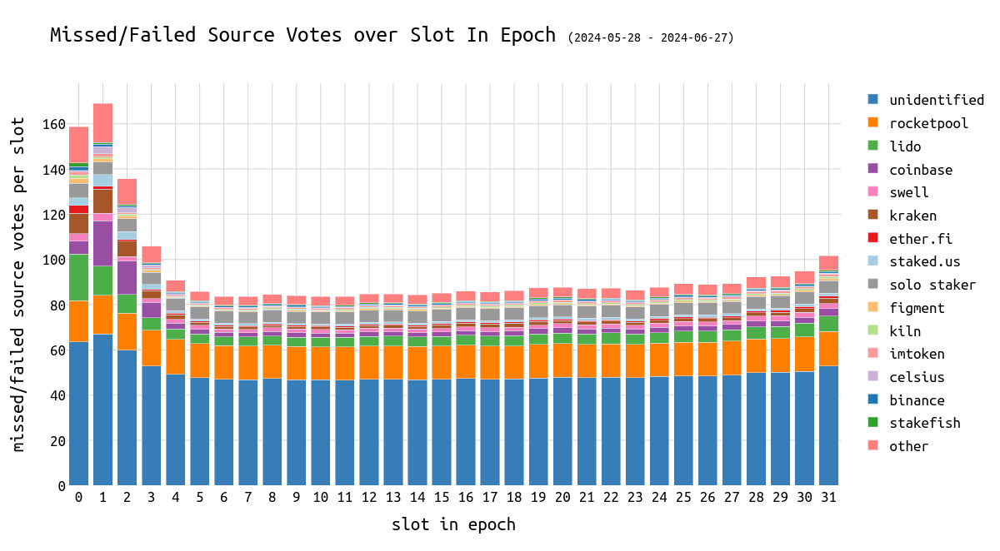

## Best and Worst Validators

Validators cast a vote in every epoch and quickly checking [beaconcha.in](https://beaconcha.in/), more than 99.9% of validators are active in every epoch.

By summing up correct head votes, we can determine the best and worst-performing validators.

**The following chart visualizes the average missed/failed head votes per slot over the validator IDs:**
> Withdrawn validators are excluded.
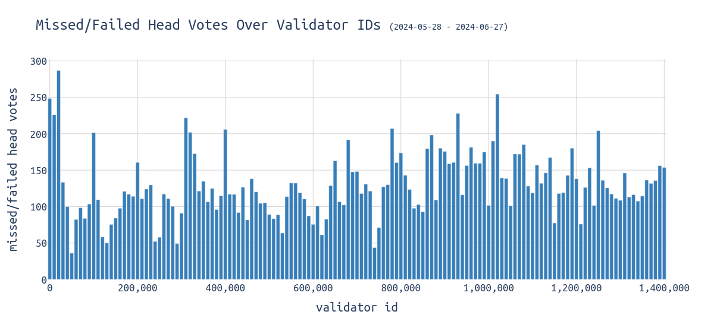

We can see that the missed slot rate is slightly **increasing with increasing validator IDs,** with outliers for the validators with IDs 0-30k, 300k-330k, and 780k-790k.
The best validators are the group with IDs from 50k-60k.

**Over four weeks, most validators miss around 20-30 head votes:**

The following chart has a **logarithmic y-axis** to make sure we can also see the last bar on the very right that consists of validators that have never attested in the 4 weeks analyzed.
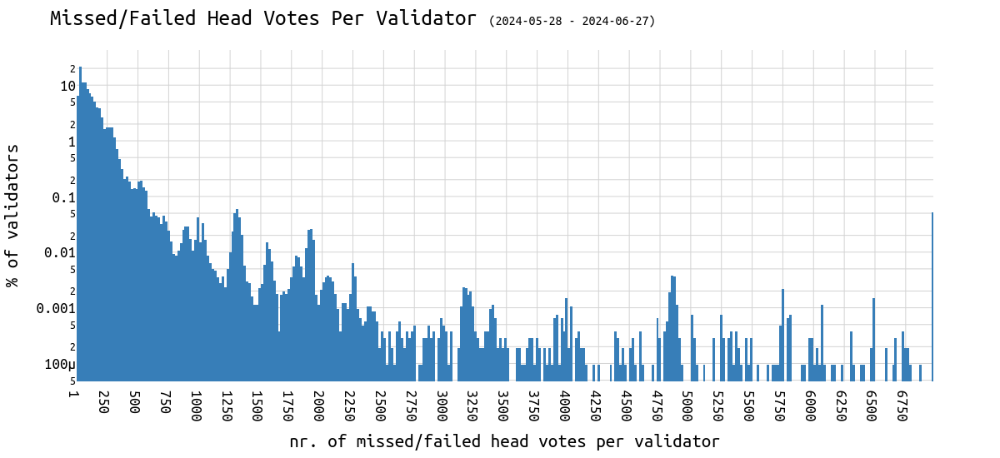

### The peak of performance (best validators)

For the following, I use data ranging from epoch 292,655 to epoch 293,105, not the entire time frame analyzed, due to the sheer amount of data involved.

***High-performers*** are defined as validators who haven't missed voting for the correct head during a time frame of 3 days, starting from the last slot analyzed and going backward.

The following table shows the largest node operators (sorted in descending order by market share) and the percentage of high-performing validators within 3 days compared to the total number of validators for each entity:

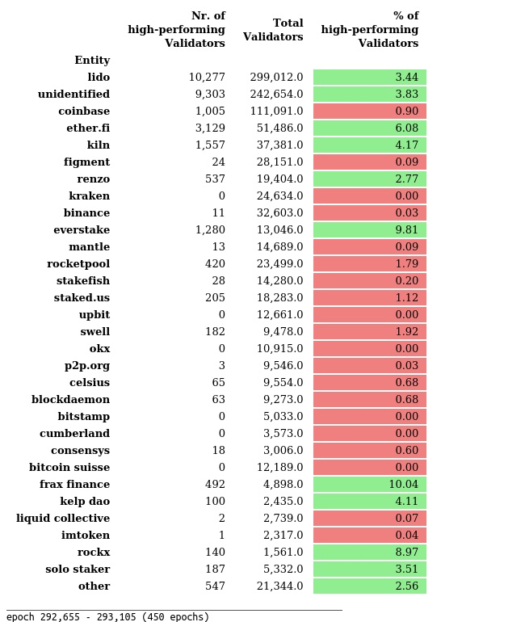

^ The entities in ***green*** have ***more*** high-performing validators than the average.

**The shares visualized using a bar chart look like the following:**

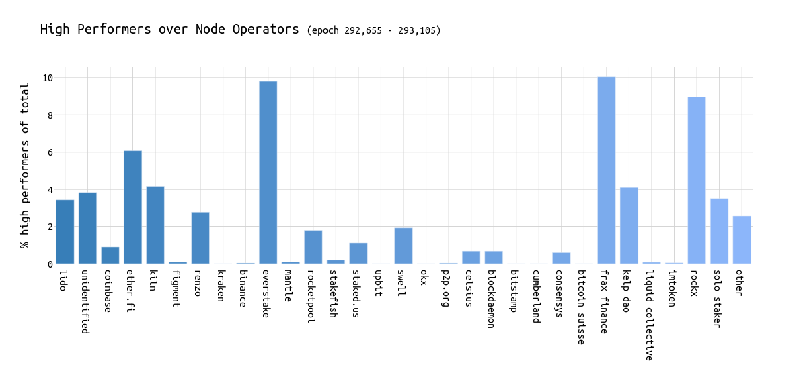

We can see that the average high-performer rate is around 0-5% for the shown entities. 
**The outliers are *Everstake*, *Frax Finance* and *Rockx*.**

*So, what are those 3 parties doing differently than others?*

**There are two strategies an entity might apply:**
1. *Attest early* to ensure their vote has enough time to travel through the network and reach the next proposer for inclusion.
3. *Attest late* to ensure they vote for the correct head of the chain. The longer a validator waits, the easier it is to determine the head of the chain as other validators have already voted \-\> *the risk is that the vote might not reach the next proposer in time*.

The latter strategy may be referred to as ***[attester timing games](https://ethresear.ch/t/timing-games-implications-and-possible-mitigations/17612#attester-timing-games-9)***.

*But what is better?*

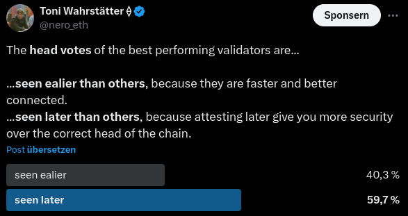

I asked my Twitter friends, and the majority voted for 'seen later,' indicating validators are playing timing games for increased attestation accuracy.

In truth, both are right.

The following chart shows the distributions of attestation-seen timestamps of high-performing validators vs. the rest (non-high-performing validators):

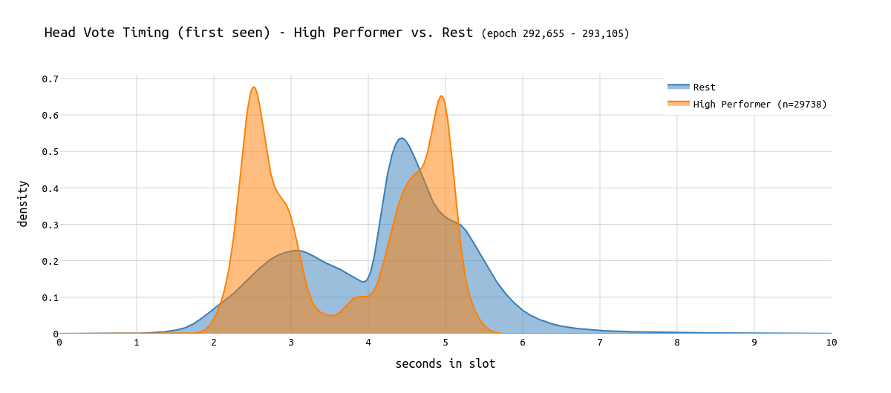

We can see that the largest share of head votes from **high-performers** is seen between **second 2 and 3** in the slot. We observe another spike right **after second 5** in the slot. For all other validators (cf. *rest*), the majority of head votes arrive between **second 4 and 5**.

**This points towards:**
* Most attesters are exceptionally good because they are **faster** than others.
* Some attesters are exceptionally good because they might **wait longer** for more accuracy.

**\> Early attestations by high-performing validators are seen some milliseconds earlier than the rest.
\> Late attestations by high-performing validators are seen about 0.5 seconds later than the rest.**

It is worth noting that every high-performing validator can be part of both groups, e.g., attesting late to 'weak' blocks (cf. epoch boundaries) and early for 'strong' blocks.
Validators with great network connectivity can afford to wait slightly longer. Furthermore, at any second in the slot, validators with great connectivity have more information available than other validators.

> A simple example is Coinbase: Technically, every Coinbase validator can be made aware of the votes of other Coinbase validators before voting. With a 10% market share, this provides significant additional security when voting on the correct head.

By examining the head votes received/seen timings among the largest entities, we can clearly observe the differences. The best performers—Everstake, Frax Finance, and Rockx—typically attest between 4 and 6 seconds into the slot. While these entities outperform others, the following chart does not necessarily indicate a specific strategy being applied.

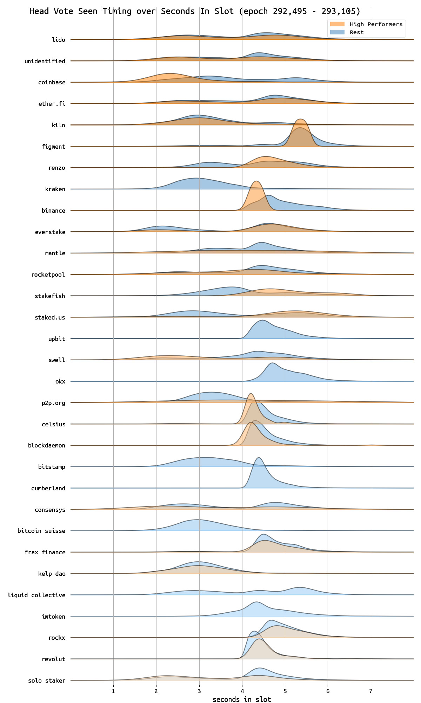

> And for a deeper dive into this topic check out [this simulation](https://ethereum.github.io/beaconrunner/notebooks/thunderdome/thunderdome.html) by Barnabé that goes into the depth of strategic attesting behavior.

**Finally, we get the following timings for the attestations over different CL clients:**
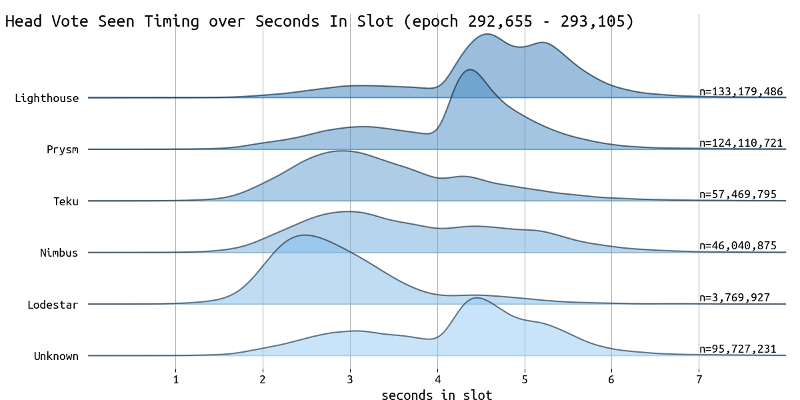

### We like them for what they are... (worst validators)

Other validators are *less performant* than others. This becomes obvious by looking at the number of missed attestations over time.

First, let's consider the validators who are offline. There are various reasons for validators to go offline, and occasionally, random validators might experience brief outages. However, there is a small subset of validators that are very likely to remain permanently offline.

We observed 139 validators, representing 0.014% of all validators, who were permanently offline in the 4 weeks analyzed.
Now, one can argue that being offline for over 4 weeks doesn't mean the validator is permanently offline. While this is fair, validators who have never cast any vote provide a good upper-bound estimate for the number of permanently offline validators who might have lost their keys.

Within those offline validators, we identify 12 solo stakers, 37 rocketpool validators, and 90 belonging to the category unidentified (=*20% market share, including many many actual solo stakers*).

**Most offline validators have low validator IDs:**
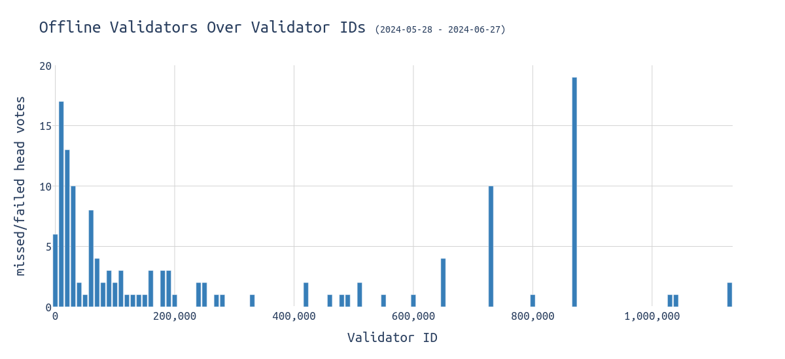

We can see spikes around 730k and 870k, but the **largest portion comes from OG validators** with low IDs, those activated before the Merge. This is both expected and unexpected:
* OG stakers are generally crypto-native individuals who can securely manage private keys.
* OG stakers are generally solo stakers who are less sophisticated.

Based on the above, it seems the latter is more likely to hold true.

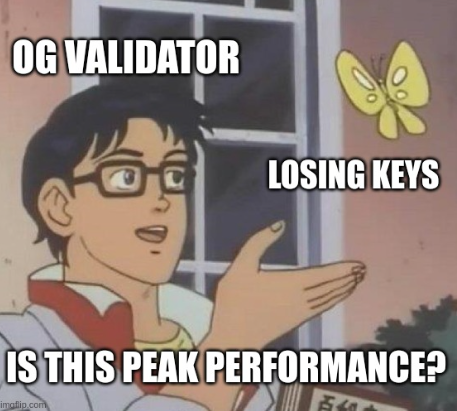

 

Moving the focus to the bad validators that miss more than the mean but not all slots in the analyzed time frame, the bar chart looks like the following:

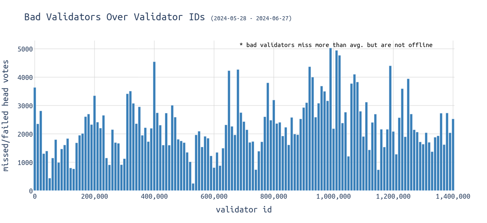

**If low-id validators aren't offline they perform quite well.** Looking at the above graph, the largest share of "bad" validators can be found at the IDs 900k-1m.

## Attestations, Big Blocks, and Blobs

**Big blocks and blocks with many blocks are expected to receive fewer attestations.** This is because certain validators might struggle to download and validate the block fast enough and therefore vote for another block.

With [EIP-4844](https://www.eip4844.com/) going live, the [block size](https://ethresear.ch/t/on-block-sizes-gas-limits-and-scalability/18444) consists of 3 parts:
* EL Payload (~85 KB)
* Beacon Block (excl. EL payload) / CL Part (~5 KB)
* Blobs (~384 KB)

Previous analysis showed that the average beacon block size excl. blobs is around 90 KiB. One blob has a size of 128 KiB. As a result, on average, we get blocks (incl. blobs) of size `nr_blobs * 128 + 90`, with the blob being the main contributor to the size of a block. 

**More blobs mean more data that needs to be transmitted across the globe. Thus, we can expect more failed head votes for blocks with 6 blobs than those with one blob.**

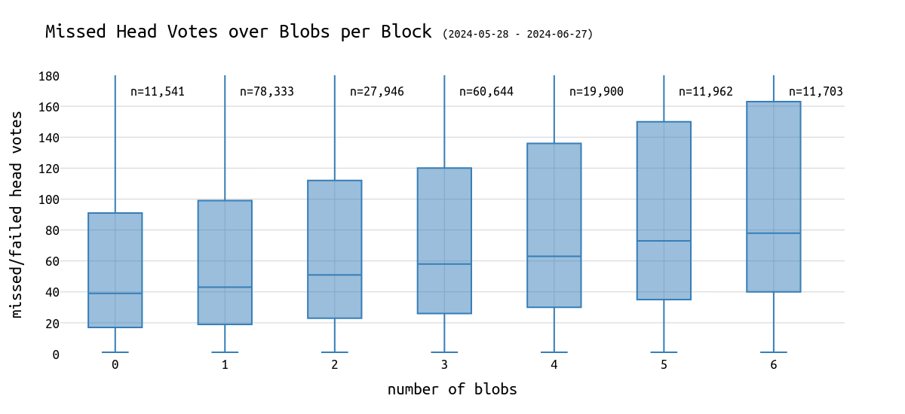

This expectation holds when looking at the above boxplot diagram:
--> **The median missed head votes doubles going from 0 to 6 blobs.**

***Let's get more granular...***

The following visualizes the block size incl. blobs in MiB over the failed head votes per slot.

> This chart shows only wrong/failed head votes and excludes offline validators.
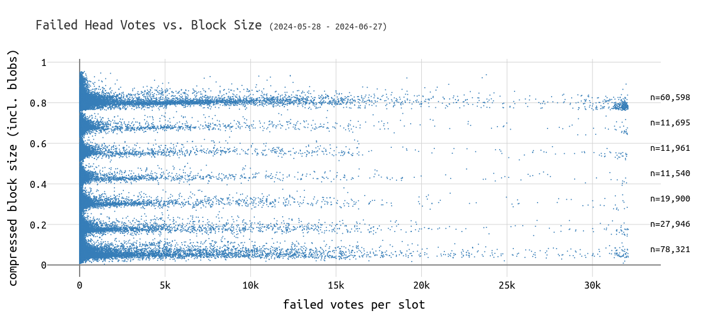

**For the sizes above 0.8 MiB, which are most likely blocks with 6 blobs, we can see more weak blocks than for 0 blob blocks. "Weak" because up to 32k attesters of that slot, up to 99%, voted for a different block.**
The only way that block still made it into the canonical chain is the next validator building on top of it instead of reorging that block out.

In the analyzed month, we observe 401 blocks with >31k attesters voting for different blocks that still made it into the canonical chain. 233 of them carried 6 blobs. Assuming most validators attest at the latest at second 4 of a slot, those blocks must have been propagated very late such that validators already attested to a different block before seeing it.
This can be confirmed by plotting the "first seen" time of those weak blocks over the seconds in a slot, comparing it to all other blocks:

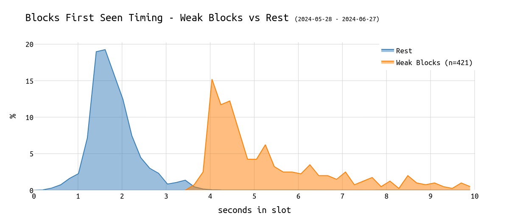

The chart shows that most blocks are seen between second 1 and 2 in the slot. For those weak blocks, it's between second 4 and 5, right after the attestation deadline.

We can confirm this by looking at the attestation timing over the seconds in a slot. We can see that 80% of the attestations are seen 5 seconds into the slot. A block propagated at second 4 in the slot will likely miss out on at least ~40% of all possible attestations, no matter how fast it propagates through the network.

***Are blobs the problem?***

The following chart shows the first seen time of 1-blob blocks vs 6-blob blocks:

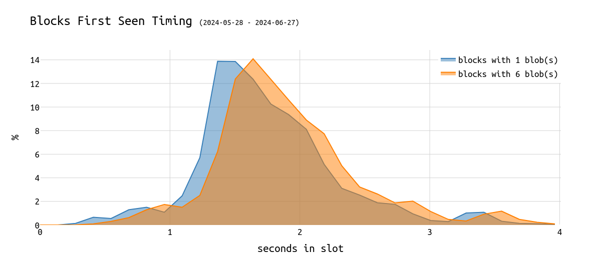

We can see that despite 6-blobs blocks being seen later in the slot, the delta is rather small, not to say negligible. At the time of the block arriving, the blobs should have already been seen.

In the past, the fact that a user was (not) using **[MEV-Boost](https://github.com/flashbots/mev-boost)** impacted different performance metrics. Thus, let's plot MEV-Boost users vs. local builders for completeness:

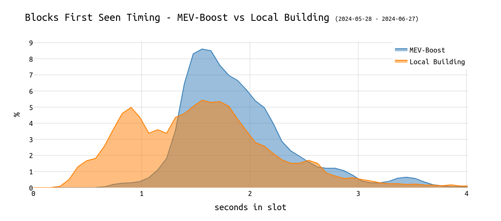

Finally, comparing three of the largest relays, we get the following image:

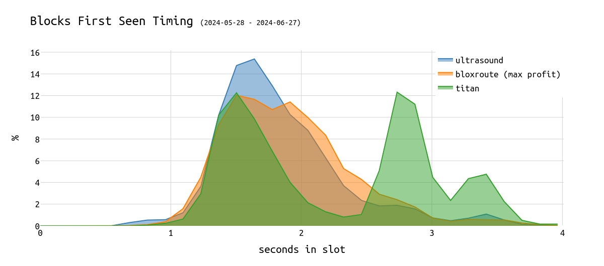

While most relays such as Ultra Sound, BloXroute, Agnostic Gnosis, or Flashbots show a very similar curve, we can see the Titan relay having two peaks instead of just one.
This means that some blocks going through the Titan relay are first seen in the p2p network between 2.5-3 seconds into the slot, which is very late.

Notable, those late blocks of Titan still became canonical, pointing towards proposer timing games.

## Attestations and Proposer Timing Games

Next, let's look at the impact of Proposer Timing Games on attestations.
We refer to Proposer Timing Games (see [[1]](https://eprint.iacr.org/2023/760), [[2]](https://arxiv.org/abs/2305.09032)) if block proposers delay their block proposal to give the builders more time for MEV extraction.
Instead of asking the relay for a block in second 0 in the block, a proposer can delay this, e.g. until second 2 in the slot, and maximize profits. This comes with the risk of not getting enough attestations and being reorged out.

*Find some real-time visuals on timing games at [timing.pics](https://timing.pics/).*

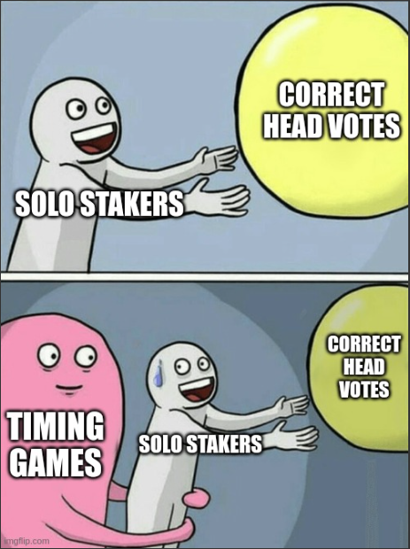

**Proposer timing games are expected to negatively impact validators' attestation performance**, although this hasn't been thoroughly analyzed yet. The concern is that **proposer timing games could have cascading effects**: attesters might slightly **delay their attestations** to ensure they vote for the correct head of the chain. Knowing proposers are playing timing games, it might be rational to delay the attestation too. **Such strategies can be harmful to the network's overall health.**

> For more info on the impact of proposer timing games on attestations, check out [Caspar's post](https://ethresear.ch/t/timing-games-implications-and-possible-mitigations/17612) on it.

The following graph shows the average number of missed head votes over the seconds in a slot. The [relays' Data API](https://github.com/flashbots/relay-specs) (*bidsReceived* endpoint) was used for the in-slot timestamps. 

> Multiple prior analyses showed that using the bidsReceived timestamps provides a *good enough* approximation of actual propagation timings. Notably, bidReceived **must come earlier** than the block's propagation timing.

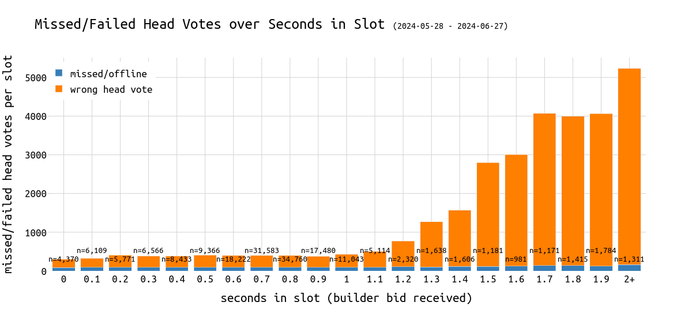

The above chart shows that the number of missed head votes increases rapidly with being 1 - 1.2 seconds into the slot. The longer a proposer waits the fewer attestations its block is expected to receive. 

**We can see that the number of missed head votes per slot increases to an average of >4k (12.5% of the committee) for late blocks published more than 1.7 seconds into the slot.**
This sounds bad although the numbers are still relatively low compared to the 32k validators that attest in each slot.

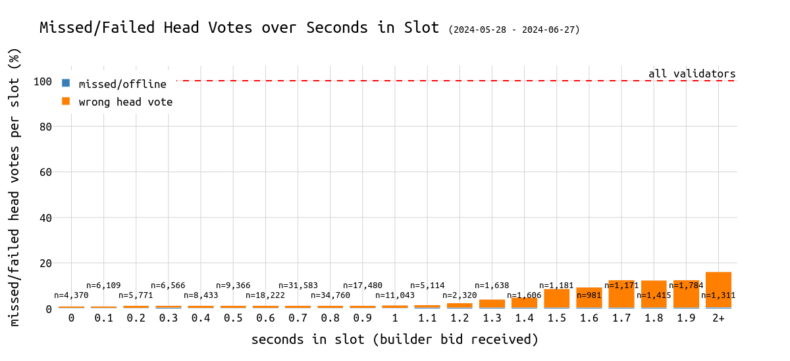

Proposing a block with a *bid received* timestamp of over 2 seconds causes an average of 5k attestations to be missed. This represents about 15% of the committee.