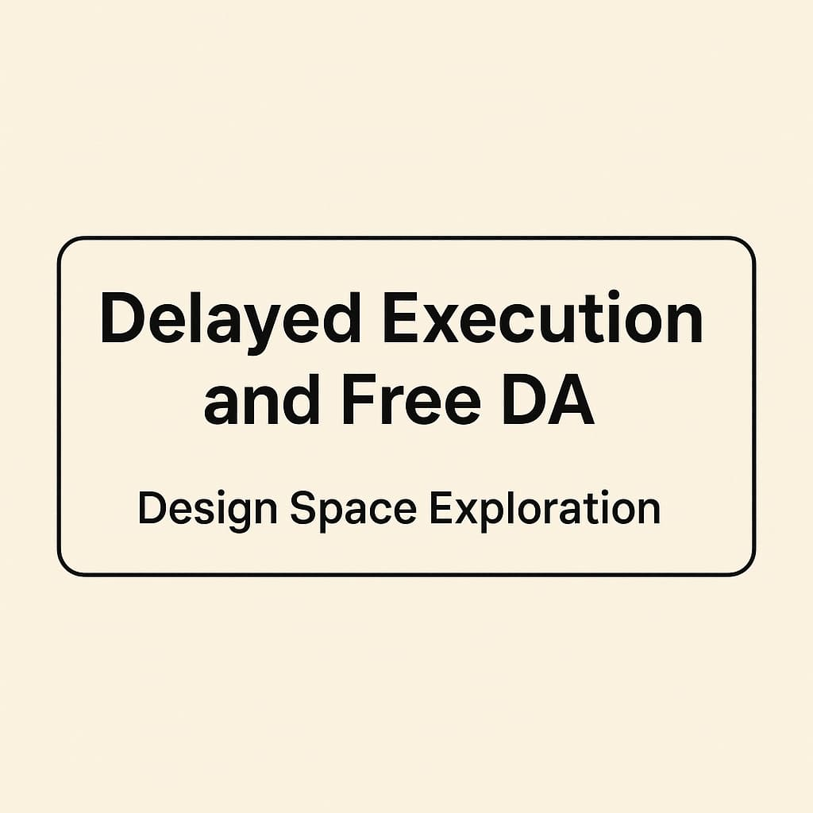

# Delayed Execution and Free DA

by [Toni](https://x.com/nero_eth) and [Francesco](https://x.com/fradamt)
> Thanks to [Łukasz](https://x.com/URozmej), [Ansgar](https://x.com/adietrichs), [Dankrad](https://x.com/dankrad) and [Terence](https://x.com/terencechain) for feedback!

Today, *free DA* (Data Availability) is not a problem. Every transaction sender must pay for all resources consumed during transaction execution. Data placed on-chain, including data in [calldata](https://eips.ethereum.org/EIPS/eip-7623) or entries listed in an [EIP-2930](https://eips.ethereum.org/EIPS/eip-2930) access list, incurs a gas cost, making it impossible to publish data without paying a fee.

Ethereum currently guarantees the validity of each block by requiring that validators fully execute and validate every transaction within a block before attesting to that block. If a transaction does not have sufficient balance to pay for the gas needed at execution time, the entire block containing it becomes invalid.

However, the introduction of **[Delayed Execution (EIP-7886)](https://eips.ethereum.org/EIPS/eip-7886)** modifies this process. Under delayed execution:

- Validators attest to a block’s validity prior to full transaction execution, relying on upfront checks instead.
- As a consequence, blocks must be able to stay valid even if transactions that initially appeared capable of covering their costs lack sufficient funds at the actual time of execution.

For example, imagine two accounts, $A$ and $B$, each submitting transactions ($a$ and $b$, respectively). Transaction '$a$' is ordered before '$b$' in a block. If transaction '$a$' drains account $B$'s balance, then transaction '$b$', despite initially seeming funded, becomes unpayable at execution time, invalidating the block.

> See post with initial design [here](https://ethresear.ch/t/delayed-execution-and-skipped-transactions/21677).

# Delayed Execution Design Space

The introduction of delayed execution opens several design possibilities. 
The different variants come with their own *pros* and *cons* and in the following, we mainly focus on the following categories:
* Sender UX
* Builder Complexity
* Fork-Choice Complexity
* Static Validation
* FOCIL Compatibility
* Block-packing inefficiency

## 1. Optimistic Attesting

Optimistic attesting is the practice of validators voting for a block without full certainty of its validity. After minimal checks, attesters at slot $N$ vote for the head block proposed in that same slot. If the block later turns out to be invalid upon execution, it's up to the next proposer in slot $N{+}1$ to reorg it out of the chain.

This approach addresses *free DA* under delayed execution, as it ensures that transactions which don’t pay for the data they write won’t be included on-chain.

The tricky part lies in the fork-choice rule: attesters at slot $N$ legitimately cast their votes, and those attestations represent support not just for the block itself, but also for its entire chain of ancestors. As a result, we may need to retain attestations for blocks with invalid heads and allow certain artifacts from these blocks to persist in the `Store`.

### Pros

* **Sender UX** stays the same as today.
* **Builder Complexity** also stays the same.
* **Block-packing** stays the same as it is today.

### Cons
* **Fork-choice** must handle invalid blocks and attestations to them.
* In terms of **static validation**, we wouldn't really get anything. Transactions can still be invalidated during execution.
* The **interaction with FOCIL** is suboptimal, as FOCIL relies on post-execution checks to ensure that the block respects the IL.

> See [this post](https://hackmd.io/jCOk8mH3RxaLcJcqswuxkA#Approach-2-optimistic-attesting) by Francesco for more details on optimistic attesting.

## 2. Upfront Validation And Pre-Charging

With **upfront transaction validation**, we introduce a new step between static validation and execution.

After statically validating the block and its transactions, we perform the following **stateful checks** on all transactions and **directly charge senders**:

- Verify the **nonce** matches the sender’s current account nonce and when there are multiple txs from the same sender, ensure the nonces are sequential.
- Ensure the **account balance** is sufficient, checked for the sender of each transaction at the respective index in the block.  
- **Charge the full gas amount upfront** (i.e., `tx.gas * gas_price`)
    - This includes gas for blobs and the transaction value in ETH
- Enforce that block `block_gas_limit > block_gas_used`. 
With `block_gas_used = sum(tx.gas for tx in block.transactions)`.
- Start executing the first tx after all transaction senders have been pre-charged

>  Patterns involving **funding an account and immediately transacting from it** within the same block could become **impossible** due to strict prepayment validation. This can be countered by introducing basefee sponsoring by the block's coinbase.

This means transactions are not just statically validated, but also checked against the current state—ensuring that nonces match and that enough funds are available. The fee is reserved immediately.

Transactions can **no longer** interfere with each other during execution, unlike today. As a result:

- Accounts can’t be funded and then execute transactions within the same block  
- Transactions can’t drain another account’s balance and thus invalidate subsequent transactions

This approach helps mitigate *free DA* issues, since blocks can be rejected earlier—*before* execution starts. Once upfront validation is complete and fees are reserved, validators can confidently attest to the block, knowing that its transactions will execute successfully in order.

This design comes with trade-offs in terms of [FOCIL](https://eips.ethereum.org/EIPS/eip-7805) compatibility.

> FOCIL requires full execution to verify IL compliance. It's not enough to simply have access to the block and its transactions—you can't determine whether the IL was respected just from that information alone. Instead, FOCIL demands checking whether any transaction that wasn't included in the block but was on the IL could have been included, given the final post-execution state.

One essential point when factoring in FOCIL with pre-execution checks into the equation is "how to deal with `gas_left` refunds?":

### 2.1 With `gas_left` Refunds
Allowing senders to get back their `gas_left` doesn’t change anything compared to today—transactions still cost the same overall.

The real issue arises with FOCIL. A transaction can appear to consume the entire block gas limit without actually doing so. For example, a simple 21,000-gas ETH transfer could be submitted with a gas limit equal to the full block limit (e.g., 36 million gas). Under FOCIL, a block builder could include this "apparently large" transaction and ignore the ILs.

The problem is that attesters—before executing the block—can’t tell whether the block is truly full or not. FOCIL permits transactions on the IL to be skipped if the block is considered full. But because we don't know how much gas the included transactions will actually use until after execution, we can't determine whether an excluded IL transaction could have fit in the block or not.

> There are two potential solutions to this issue. The first is to eliminate gas refunds. The second option is to **make FOCIL unconditional**—that is, enforce the inclusion list regardless of whether the block appears full. This removes the ambiguity around gas usage entirely, ensuring that inclusion list entries cannot be skipped under the pretext of insufficient block space.

### 2.2. With Capped `gas_left` Refunds

Instead of the approach in 2.1 where the entire gas_left is refunded to the sender, we could simply cap the refund. For example, limiting the gas_left refund to 50% of the gas actually used by the transaction would make censoring attacks (where high gas limits are specified but only a small amount is consumed) economically unfeasible. At a 36 million gas block, a censoring builder choosing to skip ILs would need a transaction that uses at least 24 million gas in order to receive the maximum refund of 50%, i.e., 12 million gas.

The downside of this approach is that it makes block packing less efficient. Compared to the current model, where cumulative gas used is tracked, we could end up in a situation where each transaction includes a larger buffer, effectively limiting throughput. To mitigate this, a lower cap could be used - for instance, limiting refunds to 10% of `gas_used`, which would significantly reduce the buffer overhead.

### 2.3 Without `gas_left` Refunds

Eliminating the `gas_left` refund would make it **economically unviable** to fake large gas usage, as users would have to fully pay for their declared gas limit, regardless of actual consumption.

This addresses the attack on FOCIL where a builder includes seemingly large transactions—declaring high gas limits—that end up being very cheap to execute, effectively faking a full block to bypass the inclusion list.

Obviously, this option is a rather radical UX change.

### 2.4 With `gas_left` Refunds and Optimistic `gas_used`

Another way to address FOCIL incompatibilities is by **combining upfront validation with optimistic attesting**. In this approach, we introduce a new header field, `block_gas_used`, which the builder must set. After execution, we verify that `block_gas_used` matches the actual gas used. If it doesn't, the block is considered invalid and must be reorged out.

This would benefit FOCIL, as validators could reliably check whether a transaction from the ILs *could* have been added to the block, based on the declared gas usage.

However, the **fork-choice complexities** associated with **optimistic attesting** still apply. A block with an incorrect `block_gas_used` wouldn't become canonical, but we may still want to allow attestations to such blocks to impact fork choice.

## 3. Pre-charging \<entity\>

Pre-charging an entity before execution and issuing refunds afterward is an effective way to address *free DA*. Whenever data is written on-chain without someone paying, the protocol can simply withhold the refund from the pre-charged party. This ensures that the protocol is always compensated, even in cases where no one explicitly pays for the data.

## 3.1 Coinbase fronts inclusion cost

The [initial version of delayed execution](https://ethresear.ch/t/delayed-execution-and-skipped-transactions/21677) pre-charged the `COINBASE` account with the inclusion cost of all transactions. The inclusion costs consist of gas for calldata, blobs and EIP-2930 access lists. The coinbase fronts the costs, and transactions that become invalid during execution are skipped, with their data footprint already being paid for.

### Pros
* Nothing changes for users, which is great.
* No fork-choice changes around invalid blocks still carrying weight. 
* No block packing inefficiencies from using `tx.gas`. Instead we can use the actual gas used.
    
### Cons
* Block building becomes more complex because we require the coinbase account to maintain a sufficient ETH balance to front inclusion costs. Execution clients would only build blocks that are valid based on the coinbase balance—empty blocks in the worst case.
* FOCIL incompatibilities
* Management of coinbase keys becomes a thing—particularly if validators need separate keys for signing blocks and withdrawing rewards. ERC-1271 contracts might be necessary, introducing complexity, especially when local building is required as a fallback.

> The incompatibilities with FOCIL stem from the inability to enforce ILs before execution. Even if a block is statically validated, the coinbase is pre-charged for inclusion costs, and skipping transactions is allowed, a block can still become invalid under FOCIL if it didn't include a transaction that was on an IL, even though there would have been space in the block.

### 3.2 Upfront Validation with Refunds + Coinbase fronts `gas_claimed`

To address the FOCIL incompatibility, one potential solution is to move toward upfront validation of transactions, with the coinbase fronting the entire `gas_used * base_fee` for all transactions in the block. A new header field, `gas_claimed`, would allow the block builder to declare how much gas the block consumes. This enables validation checks to determine whether a transaction from the IL should have fit into the block.

Under this model, the builder pays the base fees for all claimed gas upfront. During execution, the full transaction fees—including the priority fee—for executed transactions are refunded to the builder. If the gas_claimed value accurately reflects actual gas usage, the builder is simply reimbursed, plus they receive the priority fees. However, if the claimed gas exceeds what was actually used—for instance, to avoid including IL transactions—the builder ends up paying for it.
    
### 3.3 Proposer penalty

Similar to general-purpose requests on the EL, we could introduce a new field in the execution payload called `proposer_penalty`, representing the total gas fees from all skipped transactions. When processing the payload on the CL, this `proposer_penalty` would be deducted from the proposer. The request needs to be deferred for one block such that we handle the penalty from slot $n$ in slot $n{+}1$.

The advantage of this approach is that it eliminates the need for a funded account on the EL. Instead, it leverages the existing stake on the CL.

However, the downside is that it increases the financial risk for proposers. In the worst-case scenario, they wouldn't just miss out on rewards—they could actually lose money. For MEV-Boost users, this means signing off on a block that might cost them, relying on the relay to perform proper validation ahead of time.
 
### Pros
* No EL balance required. Proposers already stake ETH and maintain sufficient balances to manage these penalties.

    
### Cons
* Introduces a new paradigm: Validators are now penalized at the consensus layer for constructing "bad" blocks.
* For MEV-Boost users, relay misbehavior increases financial risk. Previously, malicious relays could only cause proposers to miss slots; now, proposers could incur direct financial losses.

> The inclusion costs are usually very low (~0.55 ETH assuming a very high 100 gwei basefee). Thus, also the penalty should be low on average. Worst-case is simply `gas_limit * base_fee`.

> Having the proposer pay with stake can also be used as a backup for having the coinbase fronting the costs.

## 4. Payload No-op

A related idea to optimistic attesting works as follows:

1. Perform only static validation of the block.
2. Ensure there are no skipped transactions.
3. If any transaction is found to be invalid during execution, **treat the entire EL payload as a no-op**. This means, reverting the state to the pre-state and continuing from there. Clients would still need to retain the payload to verify the correctness of the reversion during sync.

The key benefit of this approach is that attesters can still attest to the block early. Unlike optimistic attesting, however, the block would remain canonical even if its payload is invalid. This avoids the complexity of dealing with honest attestations to a block that later gets reorged. Instead, attesters would be attesting to a block whose execution payload simply becomes a no-op.
From a proposer's perspective, in order to exploit this mechanism for free DA, you'd want at least what you'd get as a MEV-Boost payment or, for local builders, the block's priority fees, in compensation. So, there's no sustainable profit to be made from exploiting the mechanism for "free DA" - which is NOT free at all. Reverting the state means reverting all transactions and their priority fees. It also means reverting the builder's payment to the proposer, thus it’s highly unlikely that proposers would engage in such strategies.

### Pros
* Fork-choice wouldn't need to care about invalid blocks since the `BeaconBlock` remains as "valid" as before.

### Cons
* Doesn't really solve free DA. Transactions would need to be kept for validating that the payload was actually a no-op and for syncing.
* We'd only be able to turn the payload into a no-op during/after execution. Thus, blob transactions might still be perceived as "available".

### 4.1 Pre-charging senders and Payload No-op for `gas_used`

In this design, senders still pay for their transactions' gas limits upfront before execution and receive the `gas_left` back after execution. To enforce the gas limit, builders must write the amount of gas that the block uses into the header. The EL payload turns into a no-op if it turns out that the `gas_used` was different than specified in the block. Turning into a no-op means reverting to the state before the block.

> Check out [Francesco's implementation](https://github.com/ethereum/execution-specs/compare/forks/prague...fradamt:execution-specs:delayed-execution-noop-for-gas-used) using the Ethereum [execution-specs](https://github.com/ethereum/execution-specs).

### Pros 
* no complex fork-choice changes, attesters may attest to a `BeaconBlock` whose payload turns into a no-op,
* `gas_left` refunds can stay, thus UX remains unchanged,
* builder- and IL-friendly,
* "*free DA*" isn't really solved, but practically it's unsustainable to execute strategies that exploit it. 

### Cons

* funding an account and transacting from it in one block becomes impossible, except if basefee sponsoring by the COINBASE would be introduced in addition.

# Overview of the options
1. Optimistic attesting
2. Senders charged upfront for full tx.gas
3. Coinbase charged upfront
4. EL Payload no-op

^ track attestations to an invalid block
^^ static validation requires inclusion_gas <= claimed_gas_used, so inclusion costs are covered upfront and we can skip txs that go over the gas limit

| Approach | Sender UX | Builder Complexity | Fork-choice Complexity | Static Validation | FOCIL Compatibility | Requires sum(tx.gas) < block_gas_limit |
|:---|:---|:---|:---|:---|:---|:---|
| (1) | 🟩 Same | 🟩 Same | 🟥 Higher^ | 🟥 No | 🟥 Low (two phase enforcement) | 🟩 No |
| (2) without gas_left refunded | 🟥 Always pay for full tx.gas | 🟩 Same | 🟩 None | 🟩 Yes | 🟩 Yes | 🟥 Yes |
| (2) with gas_left refunded | 🟩 Same | 🟩 Same | 🟩 None | 🟩 Yes | 🟥 Low (two phase enforcement) | 🟥 Yes |
| (2) with gas_left refunded + (1) (optimistic gas_used) | 🟩 Same | 🟩 Same | 🟥 Higher^ | 🟥 No | 🟩 Yes | 🟩 No |
| (2) with gas_left refunded + (3) for claimed gas_used | 🟩 Same | 🟥 Funded coinbase | 🟩 None | 🟩 Yes^^ | 🟩 Yes | 🟩 No |
| (3) for inclusion costs | 🟩 Same | 🟥 Funded coinbase | 🟩 None | 🟩 Yes | 🟥 Low (two phase enforcement) | 🟩 No |
| (4) | 🟩 Same |  🟩 Same | 🟩 None | 🟩 Yes | 🟥 Low (two phase enforcement) | 🟩 No |
| (2)  with gas_left refunded + (4) for gas_used | 🟩 Same |  🟩 Same | 🟩 None  | 🟩 Yes | 🟩 Yes | 🟩 No |

