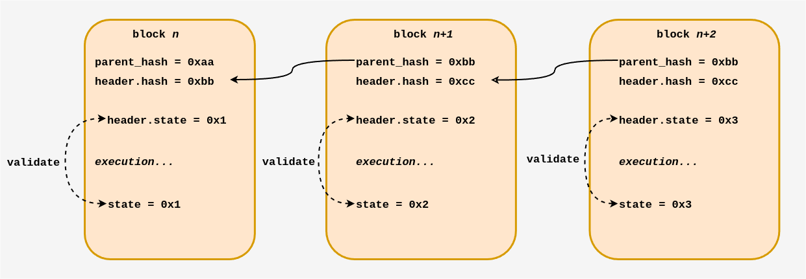
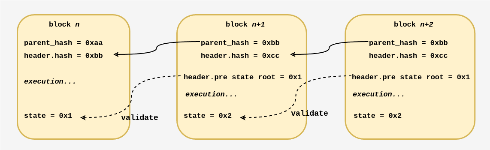
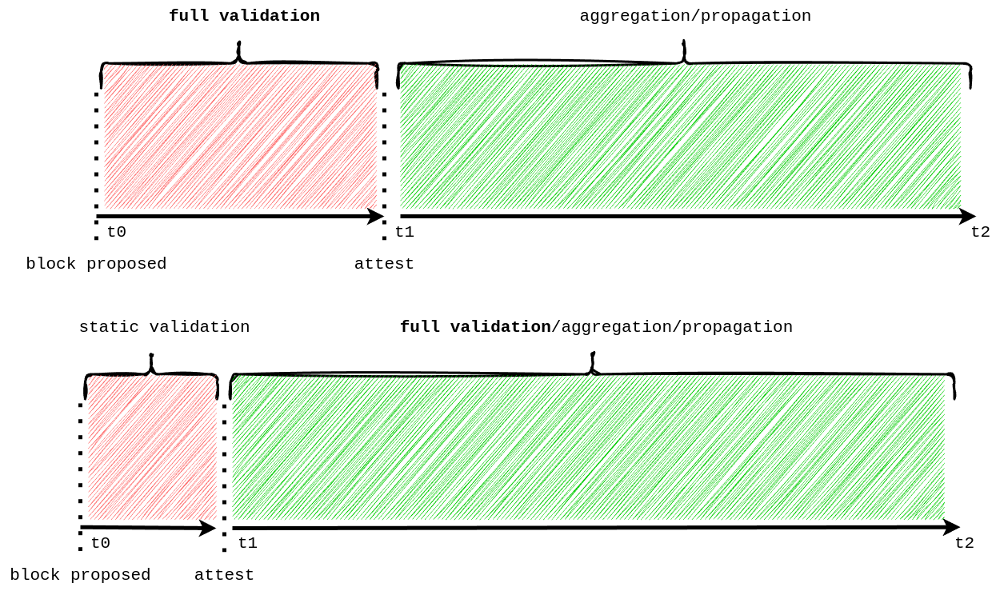
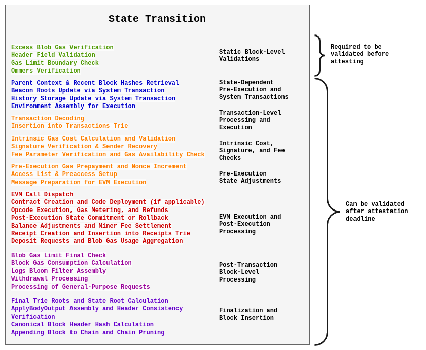
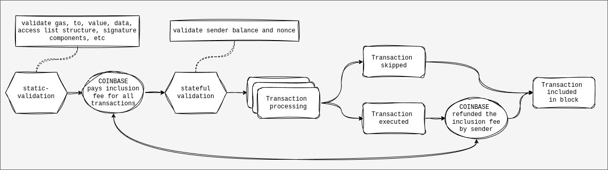
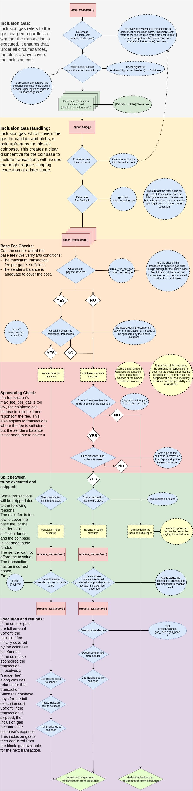

# Delayed Execution And Skipped Transactions

***Many thanks to [Francesco](https://x.com/fradamt) for feedback, review an collaboration on this!***

Ethereum requires **every block to be fully executed before it’s considered valid**. Each block header commits to a set of execution outputs—like the new state root, receipts, and logs—that result from processing every transaction within that block. This tight coupling means that **validators must run every transaction as soon as they see a new block, making execution an inherent part of the critical path.**

A proposed solution, known as ***Delayed Execution*** (spec'ed by [Francesco](https://x.com/fradamt), [here](https://github.com/fradamt/execution-specs/tree/delayed-execution-simple)), offers an elegant approach by **decoupling block validation from immediate transaction execution**. In this post, I'll go through how this mechanism works and what it could mean for scaling.

> Also, check out Francesco's [post](https://hackmd.io/@fradamt/delayed-execution) on delayed execution that explores another potential approach besides the one described in this post.

## Blockchain 1x1

In Ethereum, each block links to its predecessor by including a cryptographic commitment not only to the previous block’s header **but also to the state resulting from all transactions in that block**. 

**Here’s what happens:**
* **Execution-Dependent Headers:** The block header contains fields such as `state_root`, `receipt_root`, and logs `bloom`. These fields are generated only after the transactions have been executed.
* **Full Execution:** Every validator, upon receiving a new block, must execute all transactions to verify that the header’s commitments are correct. This ensures the block is consistent with the current state but forces nodes to do potentially heavy computation immediately.

## The Concept of Delayed Execution
Delayed Execution challenges this paradigm by splitting the block processing into two distinct stages:

1. **Static Validation (Pre-Execution):** Validators perform minimal checks using only the previous state. Instead of committing to a freshly computed state_root and related fields, the block header defers these execution outputs by referencing values from the parent block.
2. **Post-Attestation Execution:** The actual execution of transactions is delayed until after the block is initially validated and attested to by the network.

This decoupling means that validators can quickly agree on the block’s validity without having to execute every transaction upfront. In essence, the block is “chained” to its predecessor using minimal data that does not require full execution.

Instead of fully executing the block before attesting, **we can already attest to the block as soon as minimal static validation is done**. This relieves stress from the critical path. The following is a simplified illustration of the efficiency gains. It compares the current situation (*top*) with delayed execution (*bottom*):

The following graph has a (incomplete) list of things we do during a state transition. Only the initial, **static validation phase** (**which relies solely on the previous state**) needs to be executed immediately, while the more complex, **state-changing operations can be safely deferred until after attestation**. 

In theory, this change could boost efficiency by as much as **8x**, assuming blocks arrive at second 3 of the slot, the attestation deadline stays at second 4, and the worst-case execution time is 1 second (based on the 99.9999th percentile). Special thanks to [Marek](https://x.com/M25Marek), [Ben](https://x.com/ben_a_adams), and [Łukasz](https://x.com/URozmej) for providing this figure. 

That said, take this estimate with a grain of salt—you might more realistically expect around a **5x** improvement.

## The Role of Skipped Transactions

A novel concept in the delayed execution mechanism is the allowance for ***skipped transactions***. Under the current protocol, a single invalid or underfunded transaction can invalidate an entire block. Delayed execution introduces a more resilient approach:

* **Inclusion Without Execution:** Transactions are still included in the block’s transaction list but might be marked as “skipped” during execution if they fail certain conditions (e.g., insufficient funds, underpricing, incorrect nonce, or other execution-dependent checks).
* **Upfront Fee Payment by `Coinbase`:** To protect the network against the cost of including these transactions, the block proposer’s account (known as the `COINBASE`) pays an upfront “inclusion cost.” This cost covers basic expenses like the base transaction cost and calldata fees.
* **Network Compensation:** Even if a transaction is skipped, the network is compensated because the inclusion cost has been pre-paid by the `COINBASE`. This mechanism eliminates the risk of having transactions that consume resources without paying.

By allowing invalid transactions to be skipped without invalidating the whole block, the proposal shifts the burden of heavy execution away from the immediate validation process. Similar to [EIP-7732](https://eips.ethereum.org/EIPS/eip-7732) (ePBS), we relieve the critical path from the heavy load of execution and state root validation.

## The Role of `COINBASE` and Direct Sponsorship (optional)

Delayed execution could create new opportunities for direct sponsorship. Since the coinbase already covers the inclusion cost upfront, it might be reasonable to extend this responsibility to the base fee as well.

**Here’s how it works:**
* **`COINBASE`’s Signature Commitment:** The block header comes with a signature from the `COINBASE` address. This signature is a commitment that the `COINBASE` is responsible for paying all inclusion costs upfront. In effect, the `COINBASE` sponsors the execution of transactions that might otherwise be underfunded (=not able to pay for the basefee).
* **Flexible Fee Models:** With the `COINBASE` on the hook for initial fees, the protocol can allow transactions that don’t strictly meet the minimum fee requirements. This opens the door to new possibilities such as gasless or sponsored transactions, where the sender might not have enough ETH to pay upfront but is later reimbursed—or the `COINBASE` recoups the cost—once execution is successful.

Delayed execution and block-level base fee mechanisms are separate topics that should be addressed independently. However, the COINBASE's commitment to covering the inclusion cost could be extended to also committing to sponsoring the base fee.

For additional details on why block-level markets have the potential to contribute to more efficient resource allocation, check out Barnabé's post on [Block-level Markets](https://ethresear.ch/t/block-level-fee-markets-four-easy-pieces/21448).

## Under The Hood

Under delayed execution, the way blocks are chained together undergoes a small transformation:

* **Deferred Execution Outputs:** Header fields such as the `state_root`, `receipt_root`, and logs `bloom` are deferred. Instead of reflecting the immediate execution of the block, these fields hold values from the parent block. This means that the block’s validity can be confirmed without performing all of its computational work. Invalid transactions can be included in blocks.
* **Inclusion Cost Calculation:** For every transaction, an inclusion cost is computed that typically includes a base cost (e.g., 21,000 gas), calldata fees, and any blob gas fees. This cost is deducted from the `COINBASE`’s balance before the transactions are executed. If the transaction is skipped, the `COINBASE` loses the inclusion cost fronted for the transaction. If the transaction executes successfully, the inclusion cost fronted by the `COINBASE` is refunded by the sender of the transaction.
* **Two-Phase Validation:** The validation process is split into an initial static check—ensuring that the block is structurally sound and that the `COINBASE` can cover inclusion costs—and a later execution phase, where transactions are processed or skipped as appropriate.

This design relieves the critical path of execution, allowing blocks to be validated and attested more quickly. It ultimately results in a more scalable and flexible protocol, as the heavy lifting of transaction execution can be handled asynchronously relative to block attestation.

## Advantages and Trade-Offs

**Advantages:**

* **Increased Throughput:** By taking transaction execution out of the immediate validation path, blocks can be attested to more rapidly.
* **Enhanced Flexibility:** The model simplifies introducing new fee mechanisms, such as sponsored and gasless transactions, which can make Ethereum more accessible to users.

**Trade-Offs:**

* **Liquidity Requirements for Proposer/Builder:** The `COINBASE` address must be sufficiently funded to cover the maximum possible inclusion costs for a block, which may introduce liquidity constraints, especially during periods of high base fee conditions. The maximum inclusion fee equals `gas_limit * base_fee`, so, with a `base_fee` of 100 GWEI, we're at 3 ETH.
* **Protocol Complexity:** Introducing delayed execution involves substantial changes to Ethereum’s execution layer. However, unlike other delayed execution proposals, this approach avoids modifying the fork-choice function, which keeps the complexity lower. For a closer look at what these changes entail—especially if you’re interested in adding base fee sponsoring—check out the flow chart in the appendix and the EELS specs [here](https://github.com/fradamt/execution-specs/tree/delayed_execution).

## Appendix

For flowchart enthusiasts, here is how the described mechanism is currently spec'ed; **this includes the block-basefee feature and skipped transactions**, going through the EELS implementation [here](https://github.com/ethereum/execution-specs/compare/devnets/prague/6...nerolation:execution-specs:delayed-execution-prague):

^find the uncompressed version of this diagram [here](https://github.com/nerolation/delayed-execution-diagram/blob/5eb1d946e065e796b77f2020c5b04c65010f7257/delayed_exec.pdf).