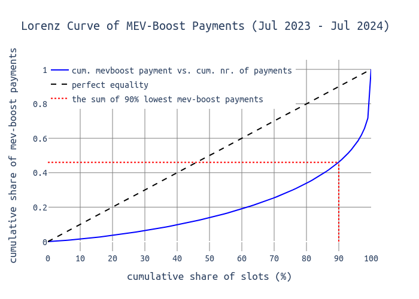
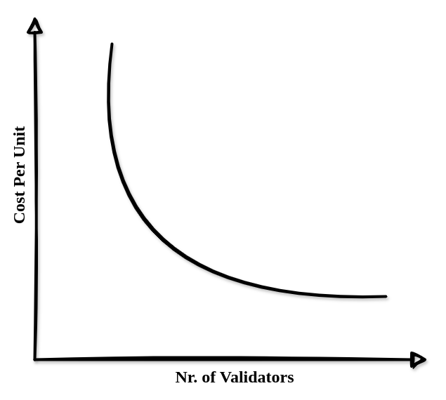
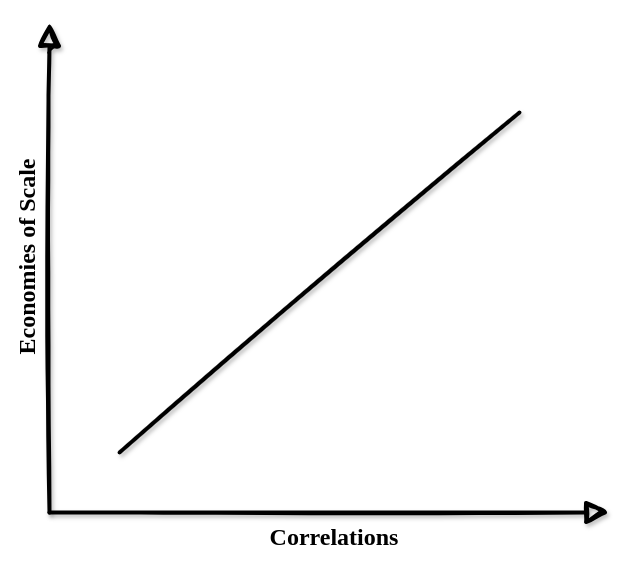
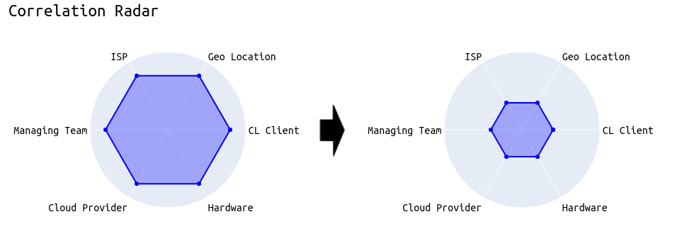
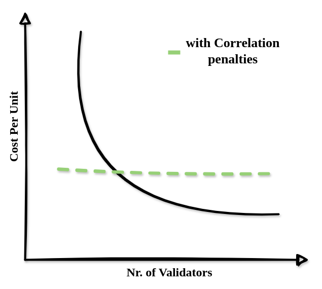
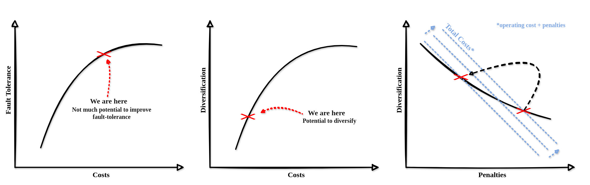
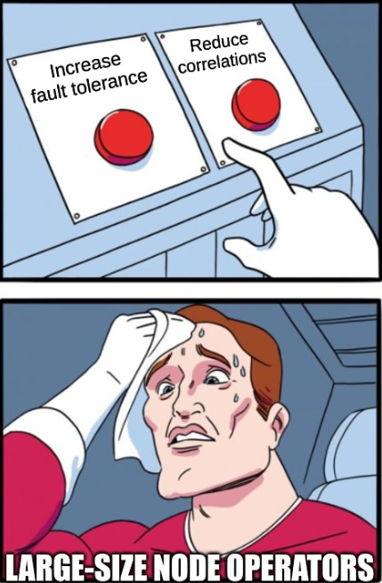

# Diseconomies of Scale: Anti-Correlation Penalties (EIP-7716)

> Special thanks to [DappLion](https://x.com/dapplion) and [Vitalik](https://x.com/VitalikButerin) for their collaborative effort on the overall concept, and [Anders](https://x.com/weboftrees) and [Julian](https://x.com/_julianma) for their valuable feedback on this post!

Ethereum relies on a decentralized set of validators to ensure properties like credible neutrality and censorship resistance. Validators [stake](https://ethereum.org/en/staking/) a certain amount of ETH to participate in Ethereum's consensus and secure the network. In return, validators receive rewards directly from the protocol ([#issuance](https://ethresear.ch/t/faq-ethereum-issuance-reduction/19675)) as well as execution layer rewards when proposing a block, which include transaction fees and [MEV](https://ethereum.org/en/developers/docs/mev/) from the blocks they propose ([#mevboost](https://boost.flashbots.net/)). As of today, thousands, if not tens of thousands, of small-sized entities run validators from their homes despite several disadvantages. These include the risk and responsibility of operating and maintaining a node, the technical burden associated with setup and upkeep, potential downtime, and the lack of a liquid staking token that would otherwise provide flexibility and liquidity. 

With the ongoing maturation of Ethereum's PoS, we've encountered various **centralizing forces** inherent to the current protocol:
* **EL Reward Variance**: While attestation rewards are distributed fairly evenly, the rewards for proposing a block can vary significantly. This variation arises because [MEV](https://ethereum.org/en/developers/docs/mev/) is extremely spiky, resulting in a few outlier blocks with proposer profits exceeding 10 ETH. Large operators running many validators have better chances of capturing these "juicy" blocks. Although over many years the earnings of individual validators should average out, the future remains uncertain. Assuming 1 million validators and 2,628,000 slots per year, the probability of being selected as a proposer is ~0.0001%. On average, a validator can expect to propose $\frac{1,000,000}{365.25 \times 7200} = 2.628$ blocks per year (there are 7200 slots per day). From April 2023 to April 2024, the percentage of blocks with more than 10 ETH was 0.004041%. Statistically, a single validator will eventually propose a block with more than 10 ETH of MEV, but it's unknown whether this will happen this year or in ten years, and by then, MEV issues might be resolved. While solo stakers literally participate in a lottery, large operators can average their profits and plan for the future with greater certainty.
Over 1 year, the probability of a random validator getting at least one block with >10 ETH profits is 0.1%:
$$
P(\text{at least one 10} \, \text{ETH} \, \text{block}) = 1 - (1 - 0.0004041)^n = 1 - (1 - 0.0004041)^{2.628}
$$
If you control 1% of all validators (~10k validators), the probability of getting at least one block with more than 10 ETH of MEV climbs to approximately 99.99% over one year.

The following chart shows the **cumulative sum of MEV-Boost payments** on the y-axis and the **cumulative number of MEV-Boost payments** on the x-axis. We can see that 90% of all blocks distribute around 44% of the total value, leaving 56% to be distributed to the lucky 10% of proposers.

<div align="center">
<p align="center" width="100%">
  
</p>
</div>


* **Reorgs**: "*[Honest reorgs](https://ethresear.ch/t/change-fork-choice-rule-to-mitigate-balancing-and-reorging-attacks/11127)*" occur when the proposer of slot $n_{1}$ orphans the block of the proposer of slot $n_{0}$ because that block hasn't received at least 40% of the slot's committee members' votes. By using [proposer boost](https://notes.ethereum.org/@casparschwa/H1T0k7b85), these "*weak*" blocks (those with less than 40% attestations) can be reorged by the next proposer to penalize the previous proposer for poor performance, such as being late and therefore rugging some attesters for their correct head votes. Reorgs can have centralizing forces and the more stake an entity holds, the more strategically it can decide whether to reorg a particular block. Large-scale operators have more safety because they can ensure their own validators never vote to reorg their own blocks. Essentially, all nodes of an entity can coordinate to always vote for the current slot's block rather than its parent if the current block comes from that entity. This coordination potentially allows large entities to risk broadcasting their block later in the slot while still having a high probability of the block becoming canonical. [Analysis has shown](https://ethresear.ch/t/deep-diving-attestations-a-quantitative-analysis/20020) that **by second 4** of the slot, **40% of all attestations** for that slot **have been seen**. A large operator, who controls many validators and knows that these validators will never vote to reorganize its blocks, can slightly delay block propagation without significantly increasing its risk. The same principle applies when a single entity owns consecutive slots. In theory, this entity could wait until the end of the slot (or even longer) before publishing its block. Then, it could use the next slot to solidify that weak block into the chain by leveraging proposer boost.

* **Proposer Timing Games**: [Proposer timing games](https://timing.pics/) (also see [[1]](https://eprint.iacr.org/2023/760), [[2]](https://arxiv.org/abs/2305.09032)) is a term that summarizes a strategy applied by some block proposers in which they delay their proposal to give the builder more time for extracting MEV. This leads to increased profits for the proposer but [evidently](https://ethresear.ch/t/deep-diving-attestations-a-quantitative-analysis/20020) comes with a negative impact on other proposers and especially attesters. Proposer timing games are risky because late blocks have an increased chance of being reorged. In general, large-size operators face lower risks when playing timing games than small-size entities. This stems from the fact that larger operators are on average more sophisticated and have better connectivity in the P2P network: What might be a late block for an Australian validator (go [sassal](https://x.com/sassal0x) 👑) might be just in time for a US-based Coinbase validator. Thus, the lower the latency, the more a validator can risk delaying.


$$
\textbf{The above symptoms are all exacerbated by one thing, namely...}
$$

$$
\underline{\mathbf{economies\ of\ scale.}}
$$

[Economies of scale](https://en.wikipedia.org/wiki/Economies_of_scale) are nothing new and the crypto landscape isn't immune either. Looking at Wikipedia, it is defined as "*the cost advantages that enterprises obtain due to their scale of operation [...]*", and the same applies to Ethereum staking:

<div  align="center">
  
</div>

Large operators like Coinbase, Kraken, or Kiln can leverage economies of scale to make staking even more profitable. This allows them to offer rewards competitive with those of solo stakers, even after taking their cut. To illustrate this, consider a simple example (the exact numbers are not important here):

| Entity      | Validators on one Node | Hardware Costs    | Other Costs | Total Cost ($)       |
|-------------|-------------------------|-----------------|-----------------|-----------------|
| Solo Staker | 1 validator             | 1 Intel NUC ($ 1,200)  | $ 5,000 | $ 6,200       |
| Coinbase    | 1,000 validators       | 1 Intel NUC ($ 1,200) | $ 50,000 | $ 51,200  |

> For more realistic numbers, refer to the latest EthStaker survey published [here](https://paragraph.xyz/@ethstaker/staking-survey-2024). By allocating 10x as much in *Other Costs* for large operators, we account for the increased complexity of setting up multiple validators on one machine. This is realistic enough for the point we're making here.


We can see the effects of economies of scale: the machine used by Coinbase will generate 1,000 times the profits compared to solo stakers, while the costs are only eight times higher. As a result, the ROI for large-scale operators is significantly better.


Using one hardware device for multiple validators is just one piece of the puzzle. Others include:

* Cloud service provider
* ISPs
* Geographical locations
* Maintenance responsibilities
* Client software
* And many more...


In all these categories, the goal is maximum diversity to minimize the risk of external factors degrading or damaging the network. Despite this goal, economically rational players might prefer a one-stop-shop solution, such as running a Lighthouse + Geth node on a Google/AWS/Hetzner instance located in central Europe, maintained by a dedicated team of specialists. While this setup may perform well in terms of efficiency, Ethereum should not create incentives that further exacerbate centralization.


<div align="center">
<p align="center" width="100%">
  
</p>
</div>


**But who is large-scale and whose not?**

The protocol itself does not know which validator is operated by which entity. From the protocol's perspective, a Coinbase validator looks the same as a solo staker. Therefore, to prevent correlations from emerging, we cannot simply scale rewards and penalties based on the market share of the entity behind a validator. For more on this topic, I recommend Barnabé's post, *["Seeing Like a Protocol"](https://barnabe.substack.com/p/seeing-like-a-protocol)*.


Fortunately, **economies of scale inherently come with correlations**, which is something the protocol can be made aware of. Leveraging economies of scale may linearly scale with correlations, thus we can implement rules to dynamically scale economic incentives and steer the validator set toward diversification.

<div align="center">
<p align="center" width="100%">
  
</p>
</div>

Penalizing correlated faults isn't something new to Ethereum. In the current [slashing](https://eth2book.info/capella/part2/incentives/slashing/) mechanism, a "malicious" validator is initially penalized by a reduction of 1/32 of their effective balance when they are slashed. After being halfway through the withdrawal period, they are subject to an additional penalty (the *[correlation penalty](https://eth2book.info/capella/part2/incentives/slashing/)*) that scales with the number of validators (specifically their stake) who were slashed around the same time (+/- 18 days). Therefore, a solo staker accidentally voting for two different head blocks, which is a slashable offense, would lose significantly less than a party with a 20% market share (assuming all 20% collectively fail).

In the end, the goal must be to incentivize validators to diversify their setup. As shown in the following example, we want validators to reduce their correlation with other validators, making the whole network more robust against external influences.

<div align="center">
<p align="center" width="100%">
  
</p>
</div>


## EIP-7716

The goal of "[EIP-7716: Anti-Correlation Attestation Penalties](https://eips.ethereum.org/EIPS/eip-7716)" is to get us closer to diseconomies of scale. The more homogeneous an entity's staking setup, the more it should be penalized while non-correlated setups profit from the proposed changes.

With anti-correlation penalties, the previous "*economies of scale vs number of validators*" might be more like the following:

<div align="center">
<p align="center" width="100%">
  
</p>
</div>

Anti-correlation penalties were first described by Vitalik in an [ethresearch post](https://ethresear.ch/t/supporting-decentralized-staking-through-more-anti-correlation-incentives/19116). After some [initial analyses](https://ethresear.ch/t/analysis-on-correlated-attestation-penalties/19244) and a more [concrete proposal](https://ethresear.ch/t/a-concrete-proposal-for-correlated-attester-penalties/19341) available, the [EIP](https://eips.ethereum.org/EIPS/eip-7716) is now at the point where everyone is invited to look into the inner workings of correlated penalties and leave feedback.

In short, the EIP proposes to multiply the missed (source) vote penalty by a penalty factor that ranges from 0 to 4 but equals 1 on average *(notably, this is important to not touch the issuance policy)*.


#### How does 7716 work?

| Variable     | Symbol  | Description                          | Value
|----------------|----------------|----------------------------------|----|
| `penalty_factor`        | $p$      | Penalty scaling factor| dynamic                  |
| `net_excess_penalties` | $p_{exc}$           | Net excess penalties             | dynamic
| `non_participating_balance` | $balance_{non\_attesting}$   | Sum balance of not/wrong attesting validators   | dynamic        |
| `PENALTY_ADJUSTMENT_FACTOR`   | $p_{adjustment}$       | Penalty adjustment factor | 2**12       |
| `MAX_PENALTY_FACTOR`     | $p_{max}$      | Maximum penalty factor       | 4
| `EXCESS_PENALTY_RECOVERY_RATE`  | $p_{recovery}$      |  Rate by which the excess penalty decreases | 1

> The final values for the constants are still to be decided.

The penalty factor $p$ scales the slot penalties to a maximum of `MAX_PENALTY_FACTOR`, or down. It's determined the following:

$$
p = \min\left(\frac{balance_{non\_attesting}\ \times\ p_{adjustment}}{\max(p_{excess},\ 0.5)\times\ balance_{total}\ +\ 1},\ p_{max} \right)
$$


and from the [pyspec implementation](https://github.com/ethereum/consensus-specs/blob/816d338bd09ffc8e83097c4db1764ba834f3adca/specs/_features/correlated_penalties/beacon_chain.md); h/t [dapplion](https://x.com/dapplion):

```python
penalty_factor = min(
    ((total_balance - participating_balance) * PENALTY_ADJUSTMENT_FACTOR) // 
    (max(self.net_excess_penalties, 0.5) * total_balance + 1),
    MAX_PENALTY_FACTOR
)
```


The formula calculates the penalty factor as a ratio of the "penalty weight" of non-attesting validators to the net excess penalty scaled by the balance of all validators. A higher penalty adjustment factor increases the sensitivity of the penalty factor. Conversely, a higher net excess penalty leads to a lower penalty factor.

Finally, this is how the `penalty_factor` variable would be used:

```python=
def get_flag_index_deltas(state: BeaconState, flag_index: int) -> Tuple[Sequence[Gwei], Sequence[Gwei]]:
    """
    Return the deltas for a given ``flag_index`` by scanning through the participation flags.
    """
    ...
    for index in get_eligible_validator_indices(state):
        base_reward = get_base_reward(state, index)
        if index in unslashed_participating_indices:
            if not is_in_inactivity_leak(state):
                reward_numerator = base_reward * weight * unslashed_participating_increments
                rewards[index] += Gwei(reward_numerator // (active_increments * WEIGHT_DENOMINATOR))
        elif flag_index != TIMELY_SOURCE_FLAG_INDEX:
            # [New in correlated_penalties]
            slot = committee_slot_of_validator(state, index, previous_epoch)
            penalty_factor = compute_penalty_factor(state, slot) 
            penalties[index] += Gwei(penalty_factor * base_reward * weight // WEIGHT_DENOMINATOR)
    return rewards, penalties
```

We check if we are dealing with source votes (line 12), derive the slot in which the validator was supposed to vote (line 14), compute the penalty factor (line 15), and multiply it by the base reward (line 16).

> Although source votes might be a good starting point, the concept can be equally appied to head and target votes. 


The $p_{exc}$ is updated at the end of each slot using:

$$
p_{exc} = \max(p_{recovery},\ p_{exc} + p) - p_{recovery}
$$

Which equals to:
```python
net_excess_penalties = max(
        EXCESS_PENALTY_RECOVERY_RATE, 
        net_excess_penalties + penalty_factor
    ) - EXCESS_PENALTY_RECOVERY_RATE
```

We can observe the following dynamics:
* If the balance of non-attesting validators increases, the penalty factor also increases.
* If the balance of non-attesting validators remains the same, the penalty factor approaches 1.
* If the balance of non-attesting validators decreases, the penalty factor can go below 1 for a while and then approach 1 afterward.


When the `non_participating_balance` continuously increases for several rounds, the `penalty_factor` and the `net_excess_penalties` also increase. This continues until the `non_participating_balance` stops increasing. Then, the `net_excess_penalties` and the `penalty_factor` start decreasing together.

With the `net_excess_penalties` keeping track of the excess penalties of past epochs, the formula can self-regulate what constitutes a "large" number of misses and what does not.

This mechanism ensures that the sum of penalties doesn't change with this EIP—only the distribution does.

## Some FAQs

### 1. Wouldn't that be even worse for solo stakers?

No. Solo stakers, commonly referred to as small-scale operators or individuals running 1-10 validators from home, are expected to behave in a very uncorrelated manner compared to larger operators. Although factors like geographical location and client software can impact correlations, solo stakers are likely to be offline at different times than large-scale operators such as Coinbase or Kraken. As a result, the penalties solo stakers receive are smaller than those in the current system. In contrast, if a large-scale operator's staking setup has a bug causing all their validators to fail to attest, the correlation is clear and the penalties are higher.

This expectation was first confirmed in an [initial analysis](https://ethresear.ch/t/analysis-on-correlated-attestation-penalties/19244) on anti-correlation penalties, which showed that solo stakers and Rocketpool operators would have been better off, while large-scale operators would have received higher penalties on average.

### 2. Wouldn't that discourage people from using minority clients?

No. In fact, it encourages using minority clients. Using the majority clients leads to higher correlations. For example, if the Lighthouse client has a bug causing attesters to vote for the wrong source, the correlation is high and the penalty increases. Conversely, if all Lodestar attesters fail, it is considered a much smaller collective fault. The correlation penalty is more forgiving to a small minority than to a majority client. So, even if minority clients are expected to have more bugs, correlation penalties can steer validators toward using them.

### 3. Why would it benefit decentralization?

Anti-correlation penalties effectively differentiate between small and large operators without relying on validators that have consolidated their stake or other out-of-protocol solutions. By introducing economic incentives for diversified behavior, we benefit small players who are already "anti-correlated" while encouraging large players to reduce the impact of external factors such as one-node setups, or cloud providers on their staking operations.

### 4. Wouldn't that just lead to big parties investing in increased fault tolerance while even increasing the correlations?

If big parties invest in increased fault tolerance, it’s still beneficial. Enhancing fault tolerance is difficult and expensive. At some point, it becomes cheaper to invest in anti-correlation than in further fault tolerance improvements. While large operators might have to move validators from popular cloud platforms to different environments, solo stakers running their nodes from home can continue as they are. Anything that costs large operators money but is free for solo stakers (=diseconomies of scale) fosters decentralization.

<div align="center">
<p align="center" width="100%">
  
</p>
</div>


The main argument is, that no matter how big operators react, either going for anti-correlation or, doing the opposite, putting all validators on a single extremely robust node, both cost money and reduce their APY. As fault tolerance has its limits, there is no escape from harsher penalties other than diversifying.

<div align="center">
<p align="center" width="100%">
  
</p>
</div>


### 5. This sounds super dangerous, as I could be penalized for 32 ETH just by missing a single source vote.

This is incorrect since the penalty_factor variable is capped at 4 (to be analyzed). Capping ensures that the correlation penalties never get out of hand.


### 6. Why only focus on source votes and not do the same for head and target votes?

This is a good question and since research on that topic is still at the very beginning this isn't decided yet. An argument against head and target votes is the fact that they depend on external factors: as shown in [previous analysis](https://ethresear.ch/t/analysis-on-correlated-attestation-penalties/19244), head votes are sensitive to proposer timing games. So, if those timing games become more and more the standard, less well-connected validators (oftentimes solo stakers) could potentially be worse off. However, [this](https://ethresear.ch/t/analysis-on-correlated-attestation-penalties/19244) analysis showed that it would be the opposite and in the long run, small-size stakers would profit from anti-correlation penalties. The same applies to target votes that are harder to get right in the first slot of an epoch compared to every other slot. Nevertheless, in the long run, this should smooth out across validators, allowing us to do anti-correlation penalties for all parts of an attestation, source-, target-, and head votes.


## Useful links:
| Url | Description | 
|----|----|
| https://eips.ethereum.org/EIPS/eip-7716 | EIP-7716 (draft) |
| https://ethresear.ch/t/a-concrete-proposal-for-correlated-attester-penalties/19341 | Original Proposal |
| https://ethereum-magicians.org/t/eip-7716-anti-correlation-attestation-penalties/20137 | EthMagicians Post |
| https://github.com/dapplion/anti-correlation-penalties-faq | EthBerlin Project |
| https://github.com/igorline/lighthouse/pull/1 | Lighthouse Implementation |
| https://ethresear.ch/t/analysis-on-correlated-attestation-penalties/19244 | Quantitative Analysis |