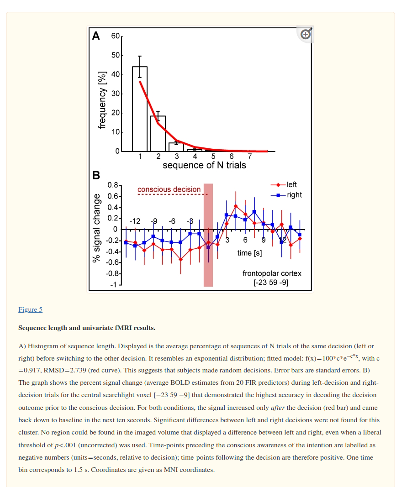

Scientists have been doing MRI studies on how the brain makes decisions. 

In the experiment, the participants had to make a free choice to click either left or right button on a keyboard.

https://pubmed.ncbi.nlm.nih.gov/21760881/

What is interesting that fMRI shows how the neurons evolve from an initially undecided phase into the phase, where one of the two choices becomes dominant.

I think an intriguing question is, whether the neural network could run something like a binary consensus algorithm, where neurons start with conflicting selections and ultimately arrive at  consensus. The brain waves could then be interpreted as rounds in the consensus algorithm

