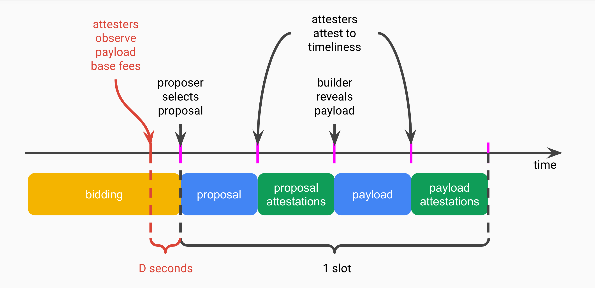
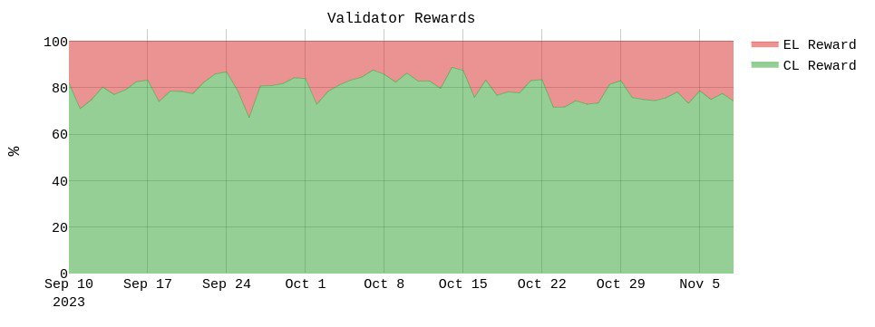
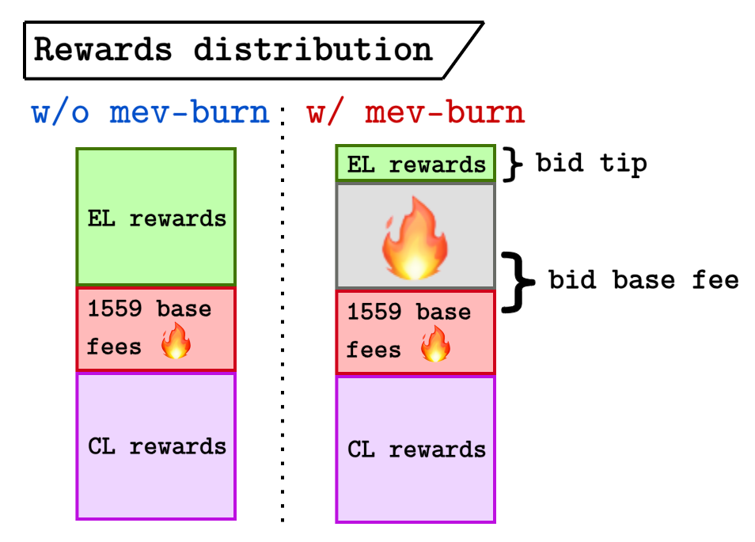
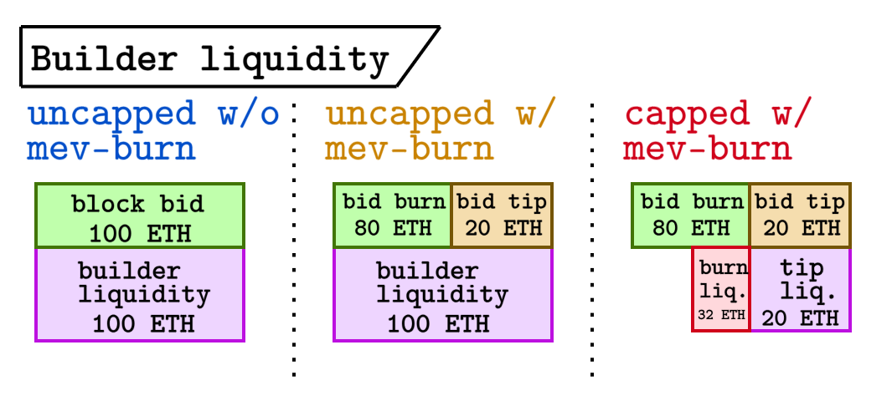
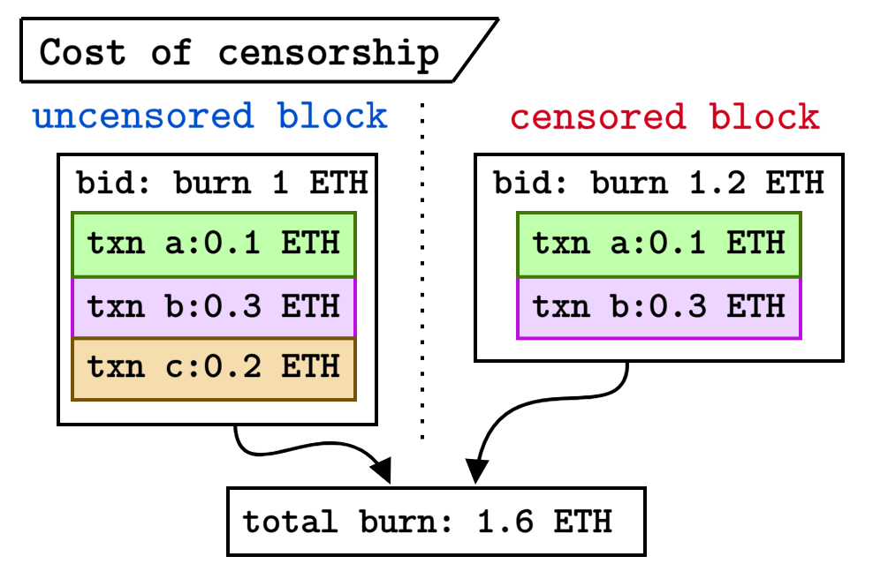
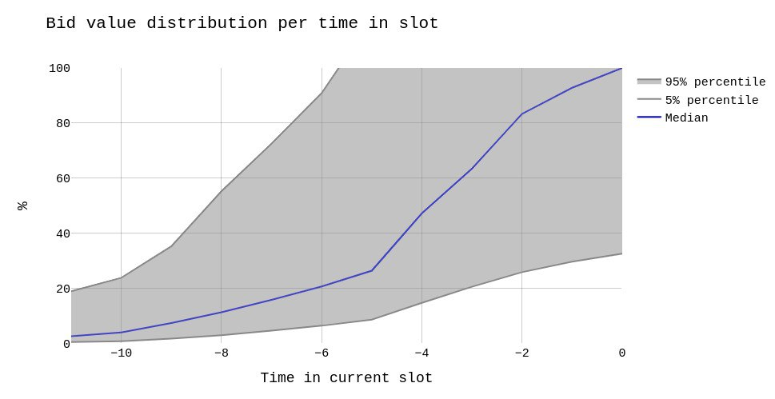

# dr. changestuff or: how i learned to stop worrying and love mev-burn

^^^ any Kubrick fans?!?
$\cdot$
*by [mike](https://twitter.com/mikeneuder), [toni](https://twitter.com/nero_eth), & [justin](https://twitter.com/drakefjustin)*
*friday – november 10, 2023* 
$\cdot$
***tl;dr;*** *mev-burn is misunderstood. While critics poke fun at [ultra sound money](https://ultrasound.money/) and craft [vignettes](https://twitter.com/GwartyGwart/status/1714744651373035605) about Vitalik, Hayden, and Justin, the benefits of mev-burn extend far beyond the meme. We present four protocol benefits of mev-burn: (1) improving validator economics, (2) lessening the ePBS builder liquidity requirements, (3) increasing the cost of censorship, and (4) improving the protocol resilience under exposure to a "mass MEV" event. Additionally, we address two of the biggest misconceptions about mev-burn: (1) proposer-builder collusion, and (2) late-in-slot MEV.*
$\cdot$
***Related work***
| Article | Description| 
|---|---|
|[*MEV burn – a simple design*](https://ethresear.ch/t/mev-burn-a-simple-design/15590) | Justin's design |
|[*In a post MEV-Burn world - Some simulations and stats*](https://ethresear.ch/t/in-a-post-mev-burn-world-some-simulations-and-stats/17092)| Toni's analysis | 
|[*Relays in a post-ePBS world*](https://ethresear.ch/t/relays-in-a-post-epbs-world/16278) | High-level ePBS discussion |

***Acronyms***
| source | expansion |
|--- | ---|
|`ePBS` |enshrined proposer-builder separation |
|`ToB` | top of block |
|`EL` | execution layer |
|`CL` | consensus layer |

$\cdot$
> mike's editorial note: Justin's [post](https://ethresear.ch/t/mev-burn-a-simple-design/15590) uses the "MEV burn" (all caps) notation. I find the capitalized letters \~unaesthetic\~ and more likely to be read as "EM-EE-VEE" (three syllables) instead of "mĕv"/"m(eh)v" (one syllable). I suggest we adopt the "mev-burn" notation for ease of reading and speaking. Justin hates the hyphen and suggested the following alternatives (i) mevburn, (ii) mev burn, (iii) mèvburn, \& (iv) mev'burn, all of which are ngmi in my opinion. Please DM me your preference – ymmv. (and yes ... we did indeed spend more time debating this than any other part of the article)

### mev-burn summary

To set the stage, we present a high-level description of the mechanism; for the latest on the mev-burn design, see Justin's [*"MEV burn – a simple design"*](https://ethresear.ch/t/mev-burn-a-simple-design/15590). The figure below encapsulates the key elements.

We assume an ePBS instantiation, which is a prerequisite for mev-burn. 
- Before the slot starts, the bids are circulated in the "bidding" phase. 
- A builder bid is composed of (1) the base fee (the amount of `ETH` that a block will burn) and (2) a tip (the amount of `ETH` paid to the proposer). 
- $D$ seconds before the beginning of the slot (we usually use $D=2$), the attesting committee locally sets a "base fee floor" according to the bid with the highest base fee that they have observed.
- At the beginning of the slot, the proposer selects and signs a bid, publishing it to the network.
- When the attestation deadline arrives, the attesting committee votes for the proposer block if (1) it arrives on time, and (2) the base fee of the bid exceeds their local floor.
- As the attestations for the proposer's block arrive, the builder gains confidence that their bid is the unique winner of the auction, and they publish the payload (the actual list of transactions in the block). 
- The payload receives attestations if it was revealed on time and accurately honors the base fee by burning an appropriate amount of `ETH`.

### Benefits beyond "ultra sound money"

[Gwart](https://twitter.com/GwartyGwart/status/1719368168693526549), [0xBalloonLover](https://twitter.com/0xBalloonLover/status/1719893928751599694), [BeckyFromHR](https://twitter.com/BeckyFromHR/status/1720233347010703790), and other "orthogonal thinkers" poke fun at the meme of "burning more `ETH`". Though funny, these jokes miss the reality that the benefits from mev-burn extend far beyond making `ETH` "more" ultra sound (hyper-ultra sound?!?). mev-burn improves validator economics, lessens the builder liquidity requirements in ePBS, increases the cost of censorship, and improves the protocol resilience under exposure to a "mass MEV" event. Let's go through each of these individually.

#### Validator economics
The amount of `ETH` staked is a key metric in the consensus layer. Currently, this has stabilized around [$23\%$](https://www.validatorqueue.com/) of the `ETH` supply. In return for their participation, validators are compensated with rewards from the consensus layer (abbr. CL rewards) and through the transaction fees and MEV extracted during their slot (abbr. EL rewards). In low volatility periods, the EL rewards may constitute a relatively minor fraction of the overall allocation. The figure below shows that EL rewards account for about $25\%$ of the total validator rewards over the past few months.

When trading volumes and volatility increase, this proportion can change significantly; on March 11, 2023, when `USDC` traded at a discount, EL rewards accounted for $75\%$ of validator rewards. During a bull market, we should expect EL rewards to remain significantly higher than today, incentivizing the deployment of more `ETH` into the consensus layer. By burning some of the EL rewards through mev-burn, we reduce the value and the variance of validator rewards. While it's not clear exactly "how much" is the right amount of stake, $23\%$ of the supply ($\approx 56$ billion `USD` at today's price) feels like plenty, and entering a situation where massive staking demand leads to sharp growth in the validator set is an undesirable outcome. If the protocol "overpays for security" with unnecessary issuance, the amount of `ETH` staked exceeds what is deemed necessary. The figure below shows the distribution of rewards before and after mev-burn.

**tl;dr;** *mev-burn reduces validator rewards without changing the protocol issuance.*

#### Builder liquidity requirements
    
["*Relays in a post-ePBS world*"](https://ethresear.ch/t/relays-in-a-post-epbs-world/16278) distills an ePBS mechanism into, 
1. a commit-reveal scheme to protect the builder from the proposer, and
2. a payment enforcement mechanism to protect the proposer from the builder.
    
Another way to think about (2) is that each bid must be accompanied by some "builder liquidity" to guarantee that the proposer is paid even if the builder doesn't produce a valid block. The figure below shows three different cases for builder liquidity in ePBS.

1. ***uncapped w/o mev-burn*** – In the vanilla ePBS design without mev-burn, the entire value of a block bid goes to the validator. Accordingly, the builder's liquidity must match the size of the bid to avoid a griefing attack on the proposer. A builder who promises to pay 100 `ETH` for a block must be able to make that payment at the top of the block (ToB). It doesn't make sense to cap the bid value of a block, because that encourages side-channel payments from the builder to the proposer.
2. ***uncapped w /mev-burn*** – With mev-burn, part of the bid is burned and the remainder is used to tip the proposer. Here, if we don't cap the builder liquidity, it accounts for the entire bid value. A builder who promises to burn 80 `ETH` and tip 20 `ETH` must be able to make that full 100 `ETH` payment at the top of the block (ToB). 
2. ***capped w /mev-burn*** – With mev-burn, we can take advantage of the fact that only the tip needs to be fully collateralized. By capping the liquidity of the burn, we can reduce the capital requirements of running a builder that competes for large blocks. A builder who promises to burn 80 `ETH` and tip 20 `ETH` must be able to fully collateralize the 20 `ETH` tip at the ToB, but can be bonded for a capped amount in the burn liquidity (e.g., 32 `ETH`). If they fail to build a valid block that burns the full 80 `ETH`, then their 32 `ETH` is slashed and the remaining 48 `ETH` that was supposed to be burned is ignored (by not burning that `ETH`, the value is socialized across all `ETH` holders and/or likely burned during the next slot). 
    
With mev-burn we should take advantage of case (3) above to limit the capital requirements of running a builder.

> Aside: by capping the liquidity requirements, we also cap the amount that a builder would have to pay for an empty slot. Under extreme circumstances, `builder A` could execute the following strategy:
>    1. `builder A` observes `builder B` is willing to burn 1000 `ETH` and tip 1 `ETH` for a given slot, implying the existence of a huge opportunity to capture some MEV. 
>    2. `builder A` makes a bid of 1000 `ETH` burned and a 1.1 `ETH` tip and wins the slot with no plans of actually making a block.
>    3. `builder A` is slashed 32 `ETH` for missing the slot, but bought 12 seconds to find the opportunity that `builder B` is bidding based on.
>
> Essentially, the price of a missed slot becomes 32 `ETH`. While this strategy is feasible, it seems likely that this wouldn't occur frequently enough to pose a significant risk to the liveness of the chain. Even if it does occur, `builder A` would still need to compete with `builder B` for the MEV in the subsequent slot. Additionally, raising the cap of builder liquidity further increases the cost of a missed slot.
    
**tl;dr;** *mev-burn lowers capital requirements for builders in ePBS.*
    
#### Cost of censorship

One feature of PBS with EIP-1559 is the reduced cost of censoring a transaction. SMG pointed [this out](https://twitter.com/specialmech/status/1674482046826328065) by censoring a block in June 2023, but Vitalik [discussed this](https://notes.ethereum.org/@vbuterin/pbs_censorship_resistance#What-are-the-censorship-resistance-challenges-in-PBS-vs-status-quo) in the beginning of 2022 (many such cases lol). The key takeaway point:
> "*Note that in both cases, the attacker loses P per slot for censoring*",
    
where $P$ is the priority fee of the victim transaction. Thus blocks built in a PBS regime have worse censorship resistance than in a self-building regime (see [censorship.pics](https://www.censorship.pics/)). mev-burn can help alleviate this. If we include `ETH` burned through the base fee of EIP-1559 transactions in the overall burn associated with a block bid, then the cost of censorship is the full fee that the victim transaction pays. The figure below captures this. 

On the left, the uncensored block includes transactions `a, b, & c`, which together burn a total of 0.6 `ETH`. The builder bids an additional 1 `ETH` for a total of 1.6. On the right, the builder is censoring `txn c`, which burns 0.2 `ETH`. To burn the same amount as the uncensored block, the builder needs to subsidize that burn through their bid of 1.2 `ETH`. Now the cost of censorship is no longer just the priority fee of the censored transaction, but also includes the base fee. If a builder attempts to censor many transactions, the margin of their burn floor compared to non-censoring builders is reduced, making it harder for them to compete in the auction.

**tl;dr;** *mev-burn increases the cost of censorship by including the base fee of the victim transaction.*
    
#### Resilience in the presence of mass MEV events

We should expect that DeFi, bridge, or rollup hacks may lead to mass MEV events (on the order of hundreds of millions of dollars) – we have [seen it](https://rekt.news/leaderboard/) before (e.g., the [nomad hack](https://rekt.news/nomad-rekt/) during which hundreds of copy-cat transactions continued to exploit the bridge for several hours). mev-burn improves the protocol's ability to withstand such turbulence in several ways, all of which derive from the fact that in a mass MEV event, most of the `ETH` will be burned instead of paid to the proposer of the slot.
1. *mev-burn reduces the incentive for a "rugpool".* With large node operators running significant portions of the validators in Ethereum, there is a risk that the node operators steal MEV if the value exceeds their reputational and legal cost from doing so.
2. *mev-burn reduces the incentive to reorg for profit.* Some staking pools might have logic built into their consensus clients to reorg for profit during a mass MEV event. This affects Ethereum's short-term consensus security.
3. *mev-burn reduces the incentive to DoS attack.* Beyond trying to reorg the chain, network-level DoS attacks might also be feasible and profitable during a mass MEV event.

We should expect chaotic amounts of activity during these periods, so improving the stability of the protocol in the face of such disruption is a huge benefit.

**tl;dr;** *mev-burn decreases the scale of a mass MEV event, improving the protocol resilience.*
    
### Common misconceptions

You might now be thinking, "OK OK, we get it. mev-burn has some nice features, but what about all the problems it causes." Well, dear reader, we think some of these problems you mention are misconceptions. In particular, the two most common critiques of mev-burn are
1. "*If we burn validator rewards, won't they collude with the builders to avoid the burn and kickback some of the rewards to the builder?*"
2. "*With the two-second delay between when the attesters set their bid floor and the end of the slot, mev-burn will miss out on all the late-in-slot bids. Isn't most of the CEX-DEX arbitrage value captured during that period?*"

Great questions, let's think through each. 

#### Proposer-Builder Collusion (PBC?!)

The idea here is simple. Without mev-burn, a builder bid of 1 `ETH` is paid in full to the proposer; with mev-burn, the same bid may burn 0.9 `ETH` and tip the proposer 0.1 `ETH`. A rational proposer will want to minimize the burn to maximize their rewards, thus having an incentive to try to get builders to side-channel bids to them to avoid the burn mechanism. Notice that the builder is paying the full 1 `ETH` either way (i.e., burning vs. paying looks the same from the builder's perspective), so they only care about interacting with the proposer if the proposer rebates them some of the bid. Consider the game with 3 players: `proposer, builder A, & builder B`. Let's play out a few situations.

***Without mev-burn***
- `builder A` bids 0.9 `ETH`.
- `builder B` bids 1 `ETH`.
- `proposer` selects `builder B`'s  bid.
- `builder B` pays the 1 `ETH`.

This is our base case.
    
***With mev-burn and no collusion***
- `builder A` bids 0.9 `ETH` with 0.8 `ETH` burned and a 0.1 `ETH` tip.
- `builder B` bids 1 `ETH` with 0.8 `ETH` burned and a 0.2 `ETH` tip.
- `proposer` selects `builder B`'s bid.
- `builder B` pays 0.2 `ETH` to the proposer and burns 0.8 `ETH`.

With no collusion, it's all the same from the builders' view, while the proposer only makes 0.2 `ETH` instead of the full 1 `ETH`.
    
***With mev-burn and `proposer <-> builder A` collusion***
- `builder A` bids 0.9 `ETH` with 0 `ETH` burned and a 0.9 `ETH` tip (the collusion has them set the burn to zero to get rebated by the proposer).
- `builder B` bids 1 `ETH` with 0.8 `ETH` burned and a 0.2 `ETH` tip.
- The `proposer` is forced to select `builder B`'s bid, because it is the only one that the attesting committee will consider valid (it sets the floor to 0.8 `ETH`).
- `builder B` pays 0.2 `ETH` to the proposer and burns 0.8 `ETH`.

With `proposer <-> builder A` collusion, `builder B` sets the floor and thus nullifies the benefits.
    
***With mev-burn and `proposer <-> builder A, builder B` collusion***
- `builder A` bids 0.9 `ETH` with 0 `ETH` burned and a 0.9 `ETH` tip.
- `builder B` bids 1 `ETH` with 0 `ETH` burned and a 1 `ETH` tip.
- `proposer` happily selects `builder B`'s bid, because the burn floor is 0, and rebates `builder B` for colluding.

With `proposer <-> builder A, builder B` collusion, we finally have a benefit for all parties involved.

This doesn't feel like a stable equilibrium for two reasons:
1. *Each builder is incentivized to defect to set the bid floor at the last moment and be the only valid bid.* If the builder successfully gets the bid to the attesting committee right before the floor is set, their bid will be the only valid bid and thus the winner by default.
2. *To combat the issue above, the builders would explicitly need to cooperate to ensure the floor never gets set above 0.* With the builders directly colluding, there is no need to pay rent to the proposer in the first place (not to mention the higher coordination effort, latency costs, and legal risks incurred from expanding the collusion set). They could collude and avoid paying the proposer while sharing their revenues.

The key here is that (2) above is already possible today. Thus mev-burn doesn't *increase* the probability of collusion (adding the validator to the colluding set strictly decreases the rewards of the builders). 

#### Late-in-slot MEV is not captured

Many have [pointed out](https://twitter.com/specialmech/status/1714748986492699115) that a significant portion of the MEV derived from the CEX-DEX arbitrageurs comes at the end of a slot. The reason for this is quite simple: as the end of the slot approaches, there is more certainty about the delta between the CEX vs. DEX price. Arbitrageurs can reflect this reduction in risk by bidding more aggressively without worrying about the price moving against them. Since the mev-burn design sets the bid floor at`t=10`, any MEV that arrives after the cutoff time won't be burned. **This is the most compelling critique of mev-burn.** The natural questions that follow are, 

1. "What percentage of the MEV do we think mev-burn will capture?"
2. "What percentage is 'enough' to make this mechanism worth enshrining?" 
    
(1) we can try to estimate by looking at historical data. The figure below shows the $90\%$ confidence interval of the bid value as a function of time in the slot under `mev-boost`.

This data represents the bid value (as a percentage of the winning bid value) across `mev-boost` relays during the previous 30 days (Oct. 8 - Nov. 8, 2023). The key value of $t=-2$ shows that the median slot would burn around $80\%$ of the total bid, whereas the lowest $5\%$ of slots would only burn around $25\%$ of the total bid.

(2) is more of a philosophical question. In a perfect world, we would burn exactly $10/12 = 83.\overline{3}\%$ of the MEV of the slot. The builders would stop bidding up the base fee at $t=10$ because they know that most of the attesters will have fixed their view of the bid floor by then. Since the bid values scale super-linearly in time, we shouldn't expect a perfect burn, but despite this, it still seems worthwhile considering the above benefits.

With the advent of OFAs, it is also possible that a large percentage of MEV-producing transactions move off-chain. If that is the case, then the CEX-DEX arbitrage would constitute a smaller portion of the overall MEV of a slot, diminishing the late-in-slot value.

### How do we get there?
    
By now, you may be thinking, "OK I am sold, let's do mev-burn". Great, we are glad you think so :-) . One incredible thing about mev-burn is it directly follows from ePBS. While ePBS has been a topic du jour, there are still many [open questions](https://notes.ethereum.org/@mikeneuder/infinite-buffet). With the benefits of mev-burn, solving these questions and design considerations should be a high priority. Interestingly, mev-burn might be the most compelling reason to do ePBS after all!

tyvm for reading <3