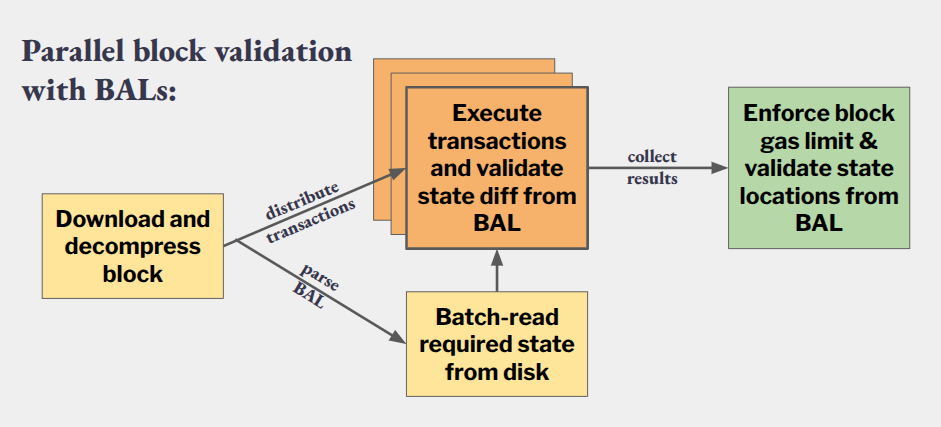
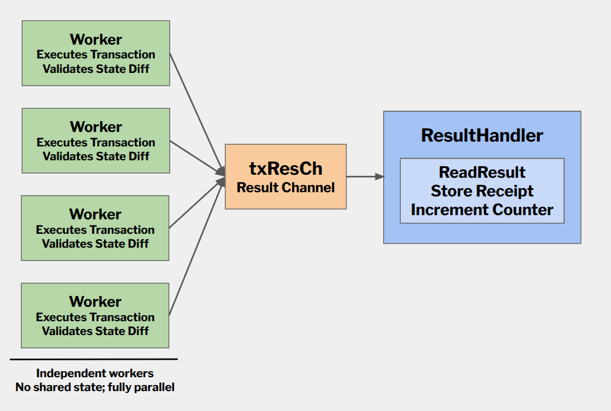
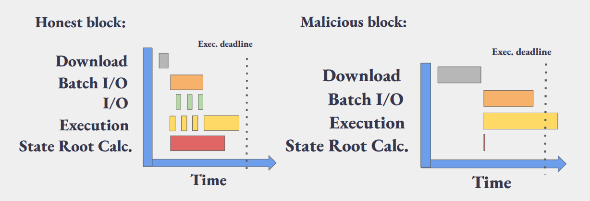
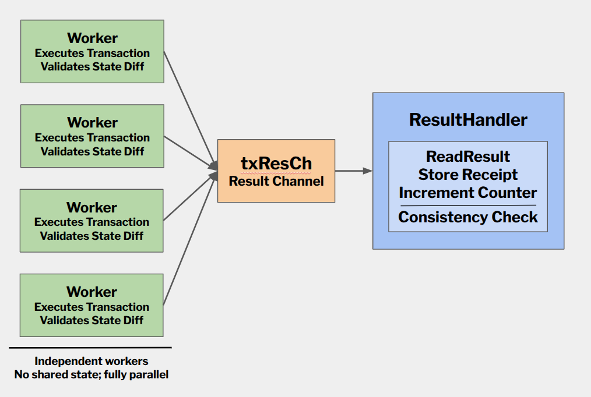

# Early Rejection of Adversarial BALs

> Special thanks to [Ansgar](https://x.com/adietrichs), [Marius](https://x.com/vdWijden), [Francesco](https://x.com/fradamt), [Carl](https://x.com/CarlBeek), [Gotti](https://github.com/GottfriedHerold), [Maria](https://x.com/misilva73) and [Jochem](https://x.com/JochemBrouwer96) for their input and collaboration.

[EIP-7928](https://eips.ethereum.org/EIPS/eip-7928) (Block-Level Access Lists, BALs) enables parallel execution and batch I/O for block validation by requiring builders to declare all state locations accessed during block execution, along with their state changes. This allows clients to prefetch state and execute transactions in parallel.

However, the current BAL spec could introduce a validation asymmetry that might be exploited to force unnecessary work during block validation. This doesn't break execution parallelization, but it nullifies the benefit of batch I/O prefetching while still imposing significant bandwidth and execution cost.

> **TL;DR:** Invalid blocks might not be invalidated as fast as valid worst-case blocks can be validated. This prevents us from scaling. The problem can be mitigated by clients with a simple gas-budget check. A draft PR against the EIP can be found [here](https://github.com/ethereum/EIPs/pull/11223).

To understand the issue and its solution, let's start with how BALs work.

## Background: BAL Structure

A BAL is organized per account:

```
[address,
 storage_changes,   # slot → [(block_access_index, post_value)]
 storage_reads,     # [slot]
 balance_changes,
 nonce_changes,
 code_changes]
```

A BAL contains two distinct types of information:

1. **Post-transaction state diffs** — *Writes* are annotated with `block_access_index`, so we know exactly which transactions change a certain part of the state.

2. **Post-block state locations** — *Reads* (`storage_reads` and addresses with no `*_changes`) are **not** mapped to transaction indices. We know they're accessed somewhere in the block, but not by which transaction.

**Why omit transaction indices for reads?** This saves bandwidth. When a transaction both reads and writes a storage slot, the write entry in storage_changes subsumes the read, avoiding duplication. Since parallelization only requires knowing which state locations are accessed (not when), the transaction index is unnecessary overhead.

This asymmetry is critical to understanding the vulnerability: writes can be validated early, but reads cannot.

## Block Validation with BALs

After receiving a block, clients use the BAL to:

- **Parallelize transaction execution** while delaying full BAL validation until after execution
- **Prefetch required state** via batch I/O to reduce disk latency
- **Compute the post-state root** in parallel with execution

> Before BALs, block validation was straightforward: the worst case was a block that simply consumed all available gas. You couldn’t make things worse by ignoring validity—clients would abort once the gas limit was hit and mark the block invalid. With BALs, this changes: we must ensure that the worst-case execution time of valid blocks is no worse than that of invalid ones.

### What Can Be Validated Early

**Post-transaction state diffs** can be enforced during transaction execution. Since writes are mapped to transaction indices, each transaction can be validated independently against its expected state changes.



### What Cannot Be Validated Early


**Post-block state locations** cannot be validated during individual transaction execution.

A storage slot read by transaction $x$ may be written by transaction $y$. When aggregating the final BAL, writes consume reads (the slot appears only in `storage_changes`, not `storage_reads`). Whether a slot ends up declared as a read depends on the complete set of writes across all transactions.

Therefore, validating declared reads requires executing all transactions first.

### Case Study: Geth


[Geth](https://github.com/ethereum/go-ethereum), for example, uses multiple worker goroutines that execute transactions and validate their state diffs in parallel. For state locations (reads), validation is deferred to a `ResultHandler` goroutine that aggregates results after all transactions complete.



In practice:
- Workers execute transactions and validate state diffs independently
- Results stream to the `ResultHandler` which collects accessed storage slots
- Only after all transactions complete can the handler verify declared reads against actual accesses

This deferred validation creates the attack opportunity.

## The Attack

Now let's examine what a malicious block builder could exploit.

### Setup

Let:
- $G$ = block gas limit
- $G_{\mathrm{tx}}$ = maximum per-transaction gas limit (≈ $2^{24}$ under [EIP-7825](https://eips.ethereum.org/EIPS/eip-7825))
- $g_{\mathrm{sload}} = 2100$ = minimum gas cost of a cold `SLOAD`

### Attack Construction

An adversarial proposer constructs a block in two steps:

**Step 1: Declare phantom storage reads**

Declare a set $S$ of storage slots in `storage_reads`:

$$
|S| = \left\lfloor \frac{G - G_{\mathrm{tx}}}{g_{\mathrm{sload}}} \right\rfloor
$$

This is the **maximum** number of distinct cold storage reads that could fit into the block if all remaining gas (after reserving one max-gas transaction) were spent on `SLOADs`.

**Step 2: Include computation-only transactions**

Include one or more transactions whose execution satisfies:

- Gas usage ≈ $G_{\mathrm{tx}}$
- No accesses to any slot in $S$
- Pure computation (e.g., arithmetic loops, hashing)

The resulting BAL is syntactically valid and respects all gas bounds, yet the declared storage reads are never accessed during execution.

### Why This Is Problematic

Clients would start prefetching while executing transactions in parallel. From the perspective of any single transaction, they cannot invalidate the block before finishing executing *all* transactions.

The result: an invalid block that entirely deactivates useful I/O prefetching, bloats the BAL to hundreds of KiB (0.6 MiB at 60M block gas limit), and burdens the network — all while its invalidation happens too late in the process.


**This effectively means we cannot scale as much as the worst-case _valid_ blocks would allow but we're bounded by invalid blocks.**

> **Why not just over-declare reads?** If the attacker declared $\left\lfloor \frac{G}{g_{\mathrm{sload}}} \right\rfloor$ storage slots (using the full gas budget), clients could invalidate the block as soon as any transaction wastes gas on operations that don't access storage. But by leaving space for at least one max-size transaction, no single transaction can independently invalidate the block early.

Check out [**BALrog**](https://github.com/nerolation/balrog), a simple proxy for the Engine API that injects worst-case BALs into blocks, useful for testing.

## Solution: Gas-Budget Feasibility Check

The attack leverages two facts:

1. Individual threads don't know what's happening on other threads
2. State locations are only validatable after executing all transactions

However, we can exploit a key constraint: the **first access** to a storage slot costs **at least** the cold `SLOAD` cost (2100 gas, or 2000 gas with [EIP-2930](https://eips.ethereum.org/EIPS/eip-2930) Access Lists, final value depends on [EIP-7981](https://eips.ethereum.org/EIPS/eip-7981)).

### The Invariant

Periodically during execution (e.g., every 8 transactions), the client verifies:

- How much gas has been used
- Which declared storage slots have been accessed
- How many declared reads remain

Then, let:
- $R_{\mathrm{declared}}$ = number of declared state reads in the BAL
- $R_{\mathrm{seen}}$ = number already accessed
- $R_{\mathrm{remaining}} = R_{\mathrm{declared}} - R_{\mathrm{seen}}$
- $G_{\mathrm{remaining}}$ = remaining block gas

A necessary condition for BAL validity is:

$$
G_{\mathrm{remaining}} \ge R_{\mathrm{remaining}} \cdot 2100
$$

**If this inequality fails, the block can be rejected immediately.**



Check out the draft PR for this specification [here](https://github.com/ethereum/EIPs/pull/11223).


### Benefits

The gas-budget check delivers early rejection of malicious blocks after just a single max-gas transaction (~16M gas / ~1 second). Parallel execution remains unchanged, preserving all parallelization benefits. The BAL format requires no changes, and batch I/O is fully restored for valid blocks. Implementation complexity is minimal—just simple accounting in the existing result handler—with negligible performance overhead from periodic arithmetic checks.

### Alternatives Considered

An alternative approach is annotating read-only accesses with a first-access transaction index, which would make BALs self-describing and simplify validation logic. The gas-budget approach achieves similar early rejection properties but with additional accounting during execution rather than additional data in the BAL. Mapping indices to reads would add an average of 4% additional (compressed) data to the BAL.

Another alternative would be ordering the state locations in the BAL by the time their access occurs in the block. However, this would introduce additional complexity, as well as make it more difficult to prove things against the BAL.

The gas-budget feasibility check provides a simple, effective mitigation: by verifying that remaining gas can cover remaining declared reads, clients can reject malicious blocks early without changing the BAL format or sacrificing parallelization benefits.

### Sample ResultHandler Logic

```python
MIN_GAS_PER_READ = 2100  # cold SLOAD cost
CHECK_EVERY_N_TXS = 8

def result_handler(block, bal, tx_results_channel):

    # Count expected storage reads from the BAL (once, upfront)
    expected_reads = sum(
        len(acc.storage_reads) for acc in bal.accounts
    )

    accessed_slots = set()
    total_gas_used = 0

    for i, result in enumerate(tx_results_channel, start=1):
        # Merge this transaction's accessed slots
        accessed_slots.update(result.accessed_slots)
        total_gas_used += result.gas_used

        # Periodic feasibility check
        if i % CHECK_EVERY_N_TXS == 0:
            remaining_gas = block.gas_limit - total_gas_used
            unaccessed_reads = expected_reads - len(accessed_slots)
            min_gas_needed = unaccessed_reads * MIN_GAS_PER_READ

            if min_gas_needed > remaining_gas:
                raise Exception(
                    "BAL infeasible: "
                    f"{unaccessed_reads} reads need {min_gas_needed} gas, "
                    f"only {remaining_gas} left"
                )
```

---

## Resources

* **EIP PR**: [https://github.com/ethereum/EIPs/pull/11223](https://github.com/ethereum/EIPs/pull/11223)
* **Max BAL items check**: [https://github.com/ethereum/execution-specs/pull/2109](https://github.com/ethereum/execution-specs/pull/2109)
* **BAL item cap (EIP)**: [https://github.com/ethereum/EIPs/pull/11234](https://github.com/ethereum/EIPs/pull/11234)
* **Engine API proxy (malicious BAL testing)**: [https://github.com/nerolation/balrog](https://github.com/nerolation/balrog)