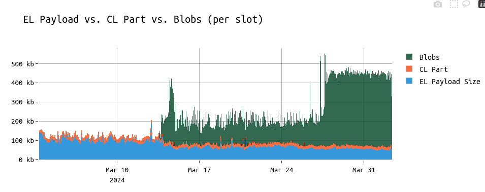
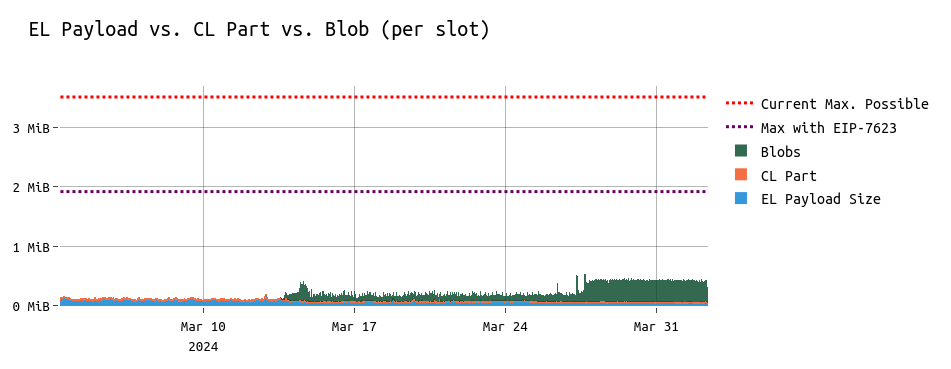
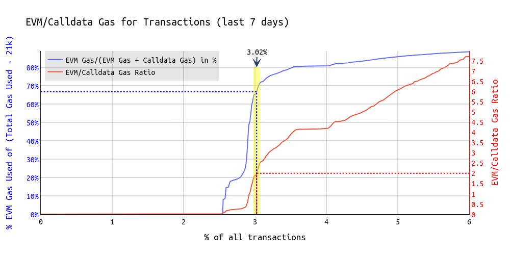

# EIP-7623 - Post-4844 Analysis

**[EIP-7623](https://eips.ethereum.org/EIPS/eip-7623) proposes to increase the calldata cost for transactions that use Ethereum mainly for DA.** 

This is done by setting a floor price for **non-zero bytes at 48 gas** and **zero-bytes at 12 gas**.
The goal is to reduce the maximum possible block size (incl. blobs) from **~3.5 MiB** to **~1.9 MiB**.

> It's important to again analyse the impact of the EIP, now that [EIP-4844](https://eips.ethereum.org/EIPS/eip-4844) went live, in order to form a decision for Pectra.

## Block sizes

* With EIP-4844, we increased the avg. block size (incl. blobs for simplicity) by around 4x compared to the pre-4844 times when the avg. block size was around 125 KiB.
* At the same time, we observe the EL part of blocks to become smaller and smaller since Dencun.

* The EL payload size trending down means that the gap between the maximum possible block size and the avg. block size increases even further. This is inefficient and max-size blocks have no use case except DoS.
* Currently by creating a **2.78 MiB** block (which is close to the max possible) + including 6 blobs, one ends up at a size of **3.51 MiB** (snappy compressed). Thus, the max possible block size (incl. blobs) is currently **8 times larger** than the average block size we observe.

## Impact of EIP-7623 on individual accounts

The following impact analysis is based on one week of data (Mar-26-2024 - Apr-03-2024). The dataset contains all transactions between the blocks 19,520,000 and 19,572,329.

* With EIP-7623 in place, **~3.02% of the transactions** of the last 7 days would have had to pay the floor price of 12 gas per calldata token. This translates to 48 gas per non-zero calldata byte and 12 gas per zero-byte. Those **3% of transactions** are executed by **1.4% of the active senders**  during that time frame.

* **Thus, the impact on users is minimal.** As shown in [this](https://ethresear.ch/t/analyzing-eip-7623-increase-calldata-cost/19002) previous analysis, there are two types of impacted users:
    * Using Calldata for DA = *Rollups*
    -> those can use blobs
    * Putting "messages" into transaction calldata
 -> those won't feel the difference because those transaction, for the majority, have very small messages attached.
 
> EIP-7623 initially proposed 16 gas instead of 12 gas as the floor price for every calldata token but based on further analysis, 12 made more sense and not heavily impact on-chain merkle proofs or post-quantum crypto (both of which require much calldata but still need to use the EVM in parallel).

**For more details on the individual methods impacted, check out [this table](https://nerolation.github.io/eip-7623-impact-analysis/index2.html) that lists method IDs and their canonical representation with stats on gas usage and impact of EIP-7623.**

For example, as visible in the [table](https://nerolation.github.io/eip-7623-impact-analysis/index2.html), among the affected methods is Starkware's *verifyFRI*, a function that is usually executed with 128,796 gas spent on calldata and 125,917 gas spent on EVM operations. The cost in gas for that function, assuming the block gas limit remains the same, would increase by 39.38%.  Similar applies to Scroll's *commitBatch* function (which could move to blobs, though). 

## The case for Pectra

EIP-7623 is a small change that brings clear benefits:
* reducing the maximum possible block size
    -> this is important in the context of further scaling the chain through initiatives such as [pumpthegas.org](https://pumpthegas.org/) or [EIP-XXXX](https://github.com/ethereum/EIPs/pull/8343) (*Stepwise Blob Throughput Increase*).
    -> reduces history growth
    -> it's inefficient to have this big discrepancy between the avg. size block and the max possible one. With decreasing average EL payload sizes this gap becomes even larger.
* We do observe that the block size impacts reorgs, but we don't observe block sizes getting even close to the maximum possible today. Big blocks, submitted to a proposer through MEV-Boost increase the chances of the proposer to miss its slot, benefitting the next proposer.

---

***Find more on that topic here:***
|  |   | 
| -------- | -------- | 
| Analyzing EIP-7623: Increase Calldata Cost  | [https://ethresear.ch/t/analyzing-eip-7623-increase-calldata-cost/19002](https://ethresear.ch/t/analyzing-eip-7623-increase-calldata-cost/19002)    |
| On Increasing the Block Gas Limit | [https://ethresear.ch/t/on-increasing-the-block-gas-limit/18567](https://ethresear.ch/t/on-increasing-the-block-gas-limit/18567)
| How to Raise the Gas Limit, Part 1: State Growth | [https://www.paradigm.xyz/2024/03/how-to-raise-the-gas-limit-1]( https://www.paradigm.xyz/2024/03/how-to-raise-the-gas-limit-1)
| Draft Implementation in Geth | [https://github.com/ethereum/go-ethereum/pull/29040](https://github.com/ethereum/go-ethereum/pull/29040)