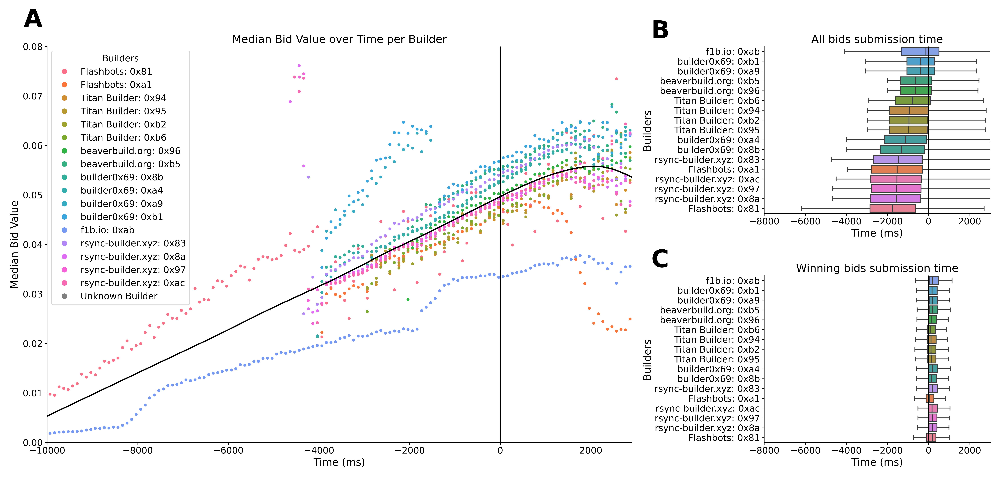
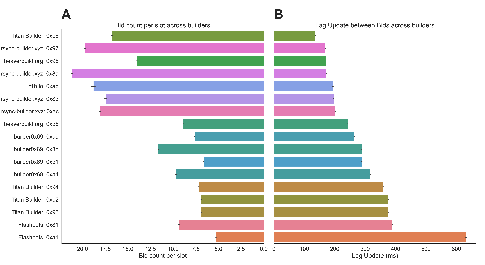
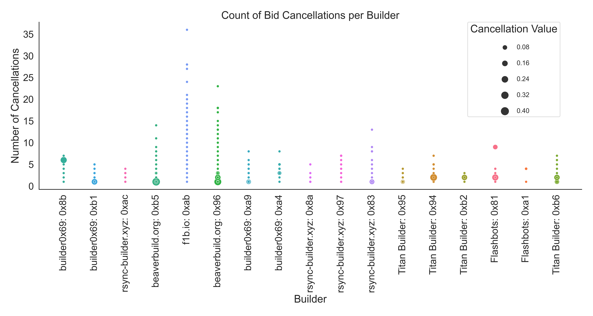
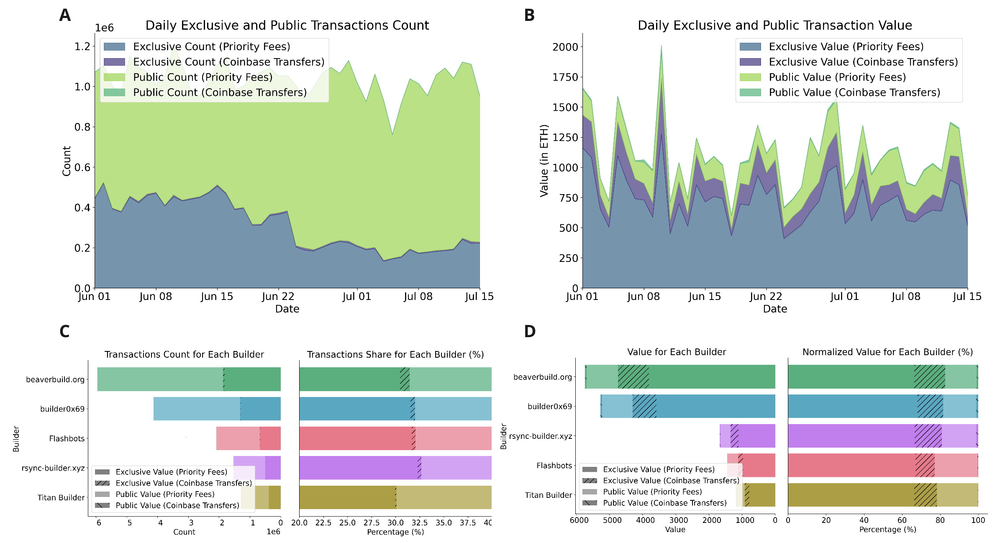
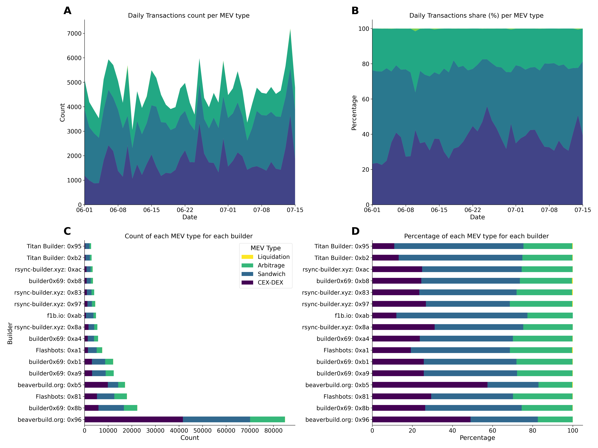
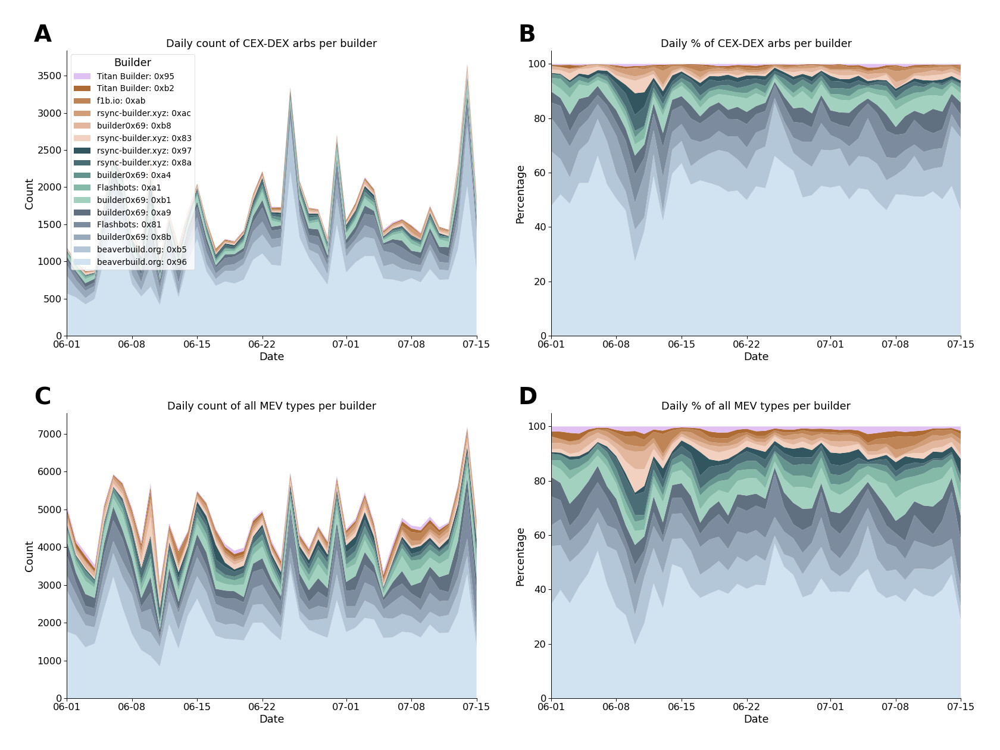

[Thomas Thiery](https://twitter.com/soispoke) - August 10th, 2023

Thanks to [Julian](https://twitter.com/_julianma), [Anders](https://twitter.com/weboftrees), [Barnabé](https://twitter.com/barnabemonnot), [Mike](https://twitter.com/mikeneuder) and [Toni](https://twitter.com/nero_eth) for helpful comments and feedback on the draft. A special mention to [Colin](https://twitter.com/0xcchan) for helping with the CEX-DEX data collection.

## Table of Contents
1. [Introduction](#Introduction)
2. [Timing, efficiency and cancellations](#Timing-efficiency-and-cancellations)
3. [Order flow and MEV strategies](#Order-flow-and-MEV-strategies)
4. [Conclusion](#Conclusion)

## Introduction

Today, nearly [95%](https://mevboost.pics/) of blocks on Ethereum are built via [MEV-Boost](https://github.com/flashbots/mev-boost#installing), an out-of-protocol piece of software allowing proposers to access blocks from a builder marketplace. Builders secure the right to build blocks by participating in MEV-Boost auctions, where they submit blocks alongside bids to trusted parties, known as relays. These bids represent the amount a builder is willing to pay the proposer for the right to build a given block, essentially reflecting the value generated via the block`ExecutionPayload` minus a profit margin determined by the builder (and minus the difference between the first and second highest bidders, for more details see "[Game-theoretic Model for MEV-boost Auctions](https://ethresear.ch/t/game-theoretic-model-for-mev-boost-auctions-mma/16206)"). Builder bids are updated throughout the duration of a slot (i.e., 12 seconds), and typically [increase over time](https://arxiv.org/abs/2305.09032) as block value is derived from priority fees and Maximal Extractable Value (MEV) (e.g., [arbitrages](https://arxiv.org/pdf/2101.05511.pdf), [sandwiches](https://arxiv.org/pdf/2101.05511.pdf), [liquidations](https://arxiv.org/pdf/2101.05511.pdf), [cross-domain MEV](https://arxiv.org/pdf/2112.01472.pdf)) associated with pending user transactions. The auction terminates when the proposer selects and commits to a block and its associated bid towards the slot's end. This marks the completion of one auction round and is repeated for every block proposed via MEV-Boost. 

Since the introduction of MEV-Boost, the builder landscape has evolved into a set of competitive, specialized actors running infrastructure to __(1)__ compete for order flow by partnering with searchers or running their own search strategies to extract MEV from submitted transactions, __(2)__ efficiently pack transactions and bundles into full, valid EVM blocks and __(3)__ bid accordingly during block auctions. 

In this post, we leverage empirical data to derive metrics that serve as a basis for constructing __Builders' Behavioral Profiles__ (__BBPs__): a collection of metrics that encapsulate builders' features and strategies when building blocks (e.g., packing transactions efficiently) and bidding during MEV-Boost auctions.

## Timing, efficiency and cancellations

We collected bids data from the ultra sound relay from `Jun 1, 2023` to `Jul 15, 2023`, and identified the set of builders’ addresses whose cumulative winning blocks constitute 90% of the total blocks on the ultra sound relay (accounting for around 25% of the total blocks built on Ethereum) during that time period. The mapping between builders’ public keys and their known entities was done using a combination of publicly available datasets (on [mevboost.pics](https://mevboost.pics/data.html) and [Dune’s spellbook](https://github.com/duneanalytics/spellbook/tree/main/models)), and this subset of builders was used for the remainder of the analyses in this post. We identified six distinct entities and 17 builders denoted as `name: public key` pairs (e.g., `Flashbots: 0x81`). Overall, a total of more than 19 million bids over 118,391 slots were used in this analysis.

First, we examine the timings and values of bids submitted to the relay by each builder over the slot duration. As shown in __Figure 1A__, the median bid value across all builders increases linearly (indicated by the black line) from -10s to 0s (t=0s being the slot boundary). This supports the assumption that the block value increases over time as new bundles and transactions continue to be included in the builders' blocks. We also observe different bidding trajectories from addresses belonging to the same entity. This could indicate the deployment of distinct building and bidding strategies, each executed using different addresses owned by the same underlying entity, underscoring the significance of maintaining distinct addresses rather than aggregating them by entities when analyzing builders' behavior. As demonstrated in __Figure 1B__, the distribution of bids fluctuates across builders, generally ranging between -3s and 0s. On the other hand, the distribution of winning bids is consistently homogeneous across all builders, implying that proposers consistently select the winning bid around 0s (__Figure 1C__), as suggested by [consensus specs](https://github.com/ethereum/consensus-specs) and consistent with results in our [latest paper on timing games](https://arxiv.org/abs/2305.09032).

> *__Figure 1.__  Builders' bids timing. __A.__ Scatter plot representing the median bid value over time for each builder, over 100ms time intervals. The black line drawn through the scatter plot represents a LOWESS line, illustrating the trend in the median bid value over time. __B.__ shows a box plot detailing the distribution of timings at which __all__ bids were submitted to relays relative to the slot boundary (t=0), for each builder and __C.__ represents the distribution of timings at which __winning__ bids were submitted to relays. The y-axis indicates different builders (n=17), while the x-axis illustrates the bid time in ms. Each box illustrates the interquartile range (IQR) of bid times for a builder, and the line within denotes the median bid time. The whiskers extend to the most extreme bid times within 1.5 times the IQR from the box. Black vertical lines at 0 ms indicate the start of slot n (t=0).*

Next, we compute the average number of bids submitted per slot for each builder (__Figure 2A__). We observe a significant variance among builders, ranging from 5 bids per slot for [`Flashbots: 0xa1`](https://www.flashbots.net/e5aaaa13ba604e09a31d944e8bf50318) to 20 bids per slot for [`rsync-builder.xyz: 0x8a`](https://twitter.com/rsyncbuilder). We also calculate the average time delay between bid updates for each builder (__Figure 2B__), showing a spread from 150 ms to over 600 ms. This suggests differing strategies of optimization and resource allocation among builders. These findings offer insights into the builders that emphasize latency optimizations. Optimizing for latency and being able to update bids more frequently likely gives a competitive advantage and increases chances to win blocks during MEV-Boost auctions. Being able to quickly react and adjust bids might be particularly useful for builders engaging in MEV strategies like Centralized Exchange (CEX) to Decentralized Exchange (DEX) arbitrages, where reducing latency is key to mitigating risks associated with trading volatile assets. Conversely, our results seem to support claims made by entities such as Flashbots, who have publicly stated their builder would be neutral and non-profit builder (as opposed to a strategic or integrated searcher-builder, see [Danning](https://twitter.com/sui414)'s [talk](https://www.youtube.com/watch?v=Ke4muS3wExY)).

> *__Figure 2.__ This figure provides a visual representation of the bid counts per slot and the lag update between bids. __A.__ Bid Count per slot across Builders: This bar chart represents the number of bids submitted by each builder for each slot. __B.__ Lag Update between Bids across Builders: This bar chart displays the lag update (in ms) between consecutive bids from the same builder.*

Lastly, we assessed the number of [bid cancellations](https://ethresear.ch/t/bid-cancellations-considered-harmful/15500) per slot and their values for each builder. Under the current implementation of mev-boost block auctions, builders can cancel bids by submitting a later bid with a lower value. Builder cancellations can be used to temporarily allow searchers to cancel bundles sent to builders: this is particularly useful for CEX-DEX arbitrageurs, where opportunities available at the beginning of a 12-second slot might not be available by the end. They could also be used as a bidding strategy like __bid erosion__ *– where a winning builder reduces their bid near the end of the slot* or [__bid bluffing__](https://ethresear.ch/t/game-theoretic-model-for-mev-boost-auctions-mma/16206) *– where a builder “hides” the true value of the highest bid with an artificially high bid that they know they will cancel*. We found that cancellations were used by all builders, only happened occasionally (in 0.04% of the blocks) and were used towards the end of the slot (mean cancellation time = -213 ms). As shown in __Figure 3__, the number of bid cancellations per slot for each builder varied between 1 and 35, with a mean cancellation value (i.e., the difference between the winning bid and the canceled bid value) of 0.002 ETH.

> *__Figure 3.__ Count of bid cancellations per slot, for each builder. This scatter plot visualizes the number of bid cancellations made by each block builder. Each data point represents a builder, with its position on the x-axis, and the corresponding number of cancellations per slot, shown on the y-axis. The size of each data point corresponds to the difference in value between the canceled bid and the replaced bid, known as "cancellation value". Larger points indicate a larger cancellation value difference, implying that the builder replaced the canceled bid with a substantially different bid.*

These metrics `- the temporal behavior and latency improvements, the frequency and strategic use of bid cancellations -` offer insights into the strategies and optimizations implemented by builders participating in MEV-Boost auctions. While these elements constitute critical aspects of Builders’ Behavioral profiles, the next section will extend the scope to consider other pivotal aspects such as order flow and the various categories of MEV strategies.

## Order flow and MEV strategies

When builders participate in MEV-Boost auctions, the value of their bids is based on potential earnings from searchers. Searchers are specialized entities who observe transactions pending in the mempool to spot MEV extraction opportunities. These opportunities often take the form of 'bundles', which are sets of atomic transactions that generate MEV. The searchers then pass these bundles and corresponding payments to builders for them to be included in a block. 

Builders are responsible for packing these bundles along with other transactions pending in the mempool to construct full, valid blocks. From a builder's viewpoint, the total `ExecutionPayload` value of a block thus comprises direct payments from searchers (also known as coinbase transfers) as well as priority fees from transactions included in the block. This value can be further broken down into public value, that stems from transactions seen in the public mempool and exclusive value derived from transactions, bundles and payments sent to dedicated mempools via custom RPC endpoints (e.g., MEV-share, MEV-blocker), or directly sent to builders. 

We collected and combined mempool data (using custom nodes set up by the Ethereum Foundation), bids (from the Ultrasound relay) and onchain (from Dune) data to quantify transactions count (__Figure 4A, C__) and value (__Figure 4B, D__) associated with exclusive and public value, from priority and coinbase transfers from `Jun 1, 2023` to `Jul 15, 2023`. Transactions that were included on-chain without having been observed in the public mempool are labeled as exclusive. We show that exclusive transactions represent between 25% and 35% of the total transactions count (__Figure 4C__). Interestingly, we also found that the share of exclusive transactions associated with coinbase transfers (__Figure 4C__, right panel) seems to be associated with the raw number of total transactions associated with builder entities (__Figure 4C__, left panel). 

These results highlight the crucial role of exclusive order flow and direct builder payments in winning MEV-Boost auctions and the right to build blocks. We also show that these exclusive transactions represent 30% of the transaction *count*, but account for 80% of the total *value* paid to builders (__Figure 4D__). This supports the hypothesis that the majority of valuable transactions generating MEV are packaged into bundles and transferred exclusively from searchers to builders. It is worth noting that exclusive order can be generated by builders running their own searchers (i.e., vertical integration). We also show that coinbase transfers from exclusive transactions, which only represent 0.45% of the total transactions count, account for 13.5% of transaction value paid to builders, underscoring their role in searcher-builder payments once again.

> *__Figure 4.__ Public and exclusive transaction count and value transferred to builders. __A.__ Daily count of public and exclusive transactions: This stacked area chart presents the daily count of public and exclusive transactions, differentiated into two categories: priority fees and coinbase transfers. The dark green area indicates the count of public transactions associated with priority fees, while the light green section illustrates public transactions tied to coinbase transfers. Conversely, the dark purple region marks the count of exclusive transactions associated with priority fees, and the light purple area corresponds to exclusive transactions linked with coinbase transfers. The y-axis signifies the count of transactions, and the x-axis designates the date. __B.__ Daily value transferred to builders, from public and exclusive transactions: This chart is analogous to (A), and it showcases the daily value of public and exclusive transactions paid to builders. The colors and their corresponding transaction types are consistent with (A). __C.__ Transactions count and share for each builder entity: The left-hand horizontal stacked bar chart depicts the raw count of transactions linked with each builder entity, and the right stacked bar chart represents the relative contribution (in percentages) of each transaction category per builder. Builders are sorted on the y-axis by the % of exclusive transactions with builder payments, and each bar is segmented into four categories: Exclusive Transactions (Priority Fees), Exclusive Transactions (coinbase Transfers), Public Transactions (Priority Fees), and Public Transactions (coinbase transfers). __D.__ Transactions value and share for each builder: This panel is similar to C, but it presents the total value of transactions (left) and relative contribution (right) paid to each builder. The y-axis by the % of all exclusive transactions.*

Next, we used data from [EigenPhi](https://eigenphi.io/) to quantify the number of transactions associated with various MEV strategies:
 - *Arbitrages* (on-chain): Taking advantage of price differences between different decentralized exchanges.
- *Sandwiches*: Transactions are placed on both sides of a trade (buy and sell) to profit from price slippage.
- *Liquidations*: Capitalizing on undercollateralized positions in lending platforms to liquidate them for profit.

In addition to these strategies, we also estimated the number of transactions related to *CEX-DEX arbitrages*. Using on-chain [Dune](https://dune.com/home) data, we identified these transactions by looking for instances that either contained a single swap followed by a direct builder payment (coinbase transfer), or two consecutive transactions where the first involved a single swap and the second a builder payment. __Figure 5A__ and __B__ display the daily transaction count associated with each MEV type and its corresponding share (in %). Our findings indicate that CEX-DEX arbitrages represented 37% of MEV transactions, sandwiches accounted for 40%, on-chain arbitrages made up 22%, and liquidations constituted 0.12%. In __Figure 5C__ and __D__, we show the raw transaction count and share for each builder, respectively. Interestingly, we noticed that CEX-DEX arbitrages represent a larger share of transactions for the two addresses belonging to the entity `beaverbuild` (57% and 49%, respectively). 

> *__Figure 5.__ MEV (Miner Extractable Value) transaction types over time and across builders. This figure presents a view of the different types of MEV transactions both over time and for each block builder. __A.__ Daily Transactions Count per MEV type: This stack plot depicts the total daily count of each MEV transaction type, categorized as 'CEX-DEX', 'Sandwich', 'Arbitrage', and 'Liquidation'. __B.__ Daily Transactions Share (%) per MEV type: Similar to (A), this stack plot showcases the share (in percentage) of each MEV type on a daily basis. __C.__ Count of each MEV type for each builder: This stacked horizontal bar chart presents the counts of the different MEV transaction types for each builder. Each color in a bar represents a different MEV type. The width of each color segment corresponds to the count of the respective MEV type. __D.__ Percentage of each MEV type for each builder: This plot mirrors panel __C__ but instead shows the percentages of the different MEV types per builder. The width of each color segment represents the percentage share of the respective MEV type in the total transactions of each builder.*

Having observed that `beaverbuild` has been winning a large proportion of blocks (see __Figure 4C__ and __5C__), we decided to explore this trend in greater detail by examining the breakdown of MEV transactions for builders over time. __Figure 6__ shows that addresses associated with beaverbuild represent approximately 40% of all MEV transactions that have been recorded on-chain (see __Figure 6A__ and __6B__). Furthermore, these addresses account for an average of 65% of all CEX-DEX transactions, reaching a peak of 85.6% on June 25th (__Figure 6D__). These observations lend significant support to the hypothesis that `beaverbuild`'s competitive advantage is primarily derived from its engagement in CEX-DEX arbitrages. It is also worth noting that our analysis only used data from the ultra sound relay, which utilizes [optimistic relaying](https://github.com/michaelneuder/optimistic-relay-documentation/blob/4fb032e92080383b7b5d8af5675ef2bf9855adc3/towards-epbs.md) to decrease the latency of block and bid submissions by builders. This increases chances of winning blocks as builders can submit higher bids (see 'Optimistic bid submission win-ratio' figure on [mevboost.pics](https://mevboost.pics/)). However, it's important to keep in mind that the ultra sound relay only accounts for approximately 25% of the total blocks constructed on Ethereum, and only provides a partial view of the overall builder landscape. Additionally, recent changes in MEV-boost allowing proposers to call getPayload on all relays makes it more difficult to account for which relay ended up delivering the payload. 

> *__Figure 6.__ Breakdown of the distribution of all MEV types and CEX-DEX arbitrages across different builders over time. __A.__ Daily Count of All MEV Types per Builder: The stack plot represents the daily count of all MEV types for each builder. Each colored region corresponds to a different builder, while the height of each region at a given point in time indicates the count of all MEV types executed by the builder on that day. __B.__ Daily Percentage of All MEV Types per Builder: This plot is similar to (A), but instead of the count, it represents the percentage of all MEV types executed by each builder each day. __C.__ Daily Count of CEX-DEX Arbitrages per Builder: This stack plot presents the daily count of the specific 'CEX-DEX' MEV type separated by different builders. Each color corresponds to a different builder, with the height of the colored region representing the count of 'CEX-DEX' MEV types executed by the builder on a particular day. __D.__ Daily Percentage of CEX-DEX Arbitrages per Builder: Similar to C, this plot displays the percentage share of the 'CEX-DEX' MEV type executed by each builder on a daily basis.*

## Conclusion

In this post, we investigated the bidding behavior of builders during MEV-Boost auctions. By analyzing the patterns and strategies employed by builders, we derived a set of metrics and insights that serve as a starting point to construct __Builders' Behavioral Profiles__ (__BBPs__). BBPs are composed of metrics that include, but are not limited to, bid timing, latency optimizations, bid cancellations, order flow access, and MEV strategies — including elements such as on-chain and CEX-DEX arbitrages, sandwiches, and liquidation. We hope the community will further enrich BBPs by incorporating new metrics and features that elucidate the roles of builders and their interactions with searchers, relays, and validators. We believe this is a foundational step toward creating robust mechanisms that limit centralizing tendencies and promote a balanced and efficient [supply network](https://docs.google.com/presentation/d/1zVx-kThMZJ_FPdL47QjLjfFV9qChVB1O5zHAb5tOnJ0/edit#slide=id.g25895e10a84_1_39).