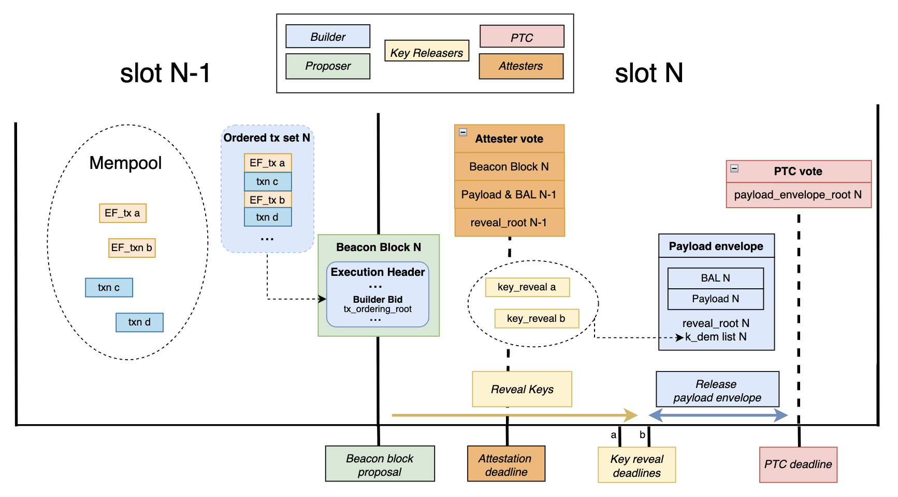

by [Thomas Thiery](https://x.com/soispoke)

*Thanks to [Julian Ma](https://x.com/_julianma), [Anders Elowsson](https://x.com/weboftrees), [Benedikt Wagner](@b-wagn) and [Gottfried Herold](@GottfriedHerold) for feedback and review.*

## TL;DR

Encrypted frame transactions hide the execution parameters that matter for MEV extraction until after the block's contents and ordering are fixed.

The builder commits to the full ordered transaction set before any decryption key is revealed. After reveal, it executes that already-committed ordering in the same slot. This makes same-slot encrypted execution possible without splitting the block into a special encrypted section and a plaintext remainder.

The design reuses [LUCID](https://ethresear.ch/t/lucid-encrypted-mempool-with-distributed-payload-propagation/24042)'s encryption scheme: users can release keys themselves, or delegate to a threshold committee, or any other entity. It builds on Frame Transaction ([EIP-8141](https://eips.ethereum.org/EIPS/eip-8141)), which replaces hardcoded authorization with programmable VERIFY logic (opening a path toward post-quantum-compatible schemes) and enables field-level selective disclosure through a frame-based transaction structure.

## High-level idea

One of the key ideas enabling same-slot encrypted execution is **order-execute separation**: the builder commits to the full ordered transaction set before any decryption key is revealed, then executes that already-committed ordering in the same slot after reveal.

In ePBS ([EIP-7732](https://eips.ethereum.org/EIPS/eip-7732)) block-auctions, the builder bid commits to a precomputed execution result. That doesn't work here, because the final payload depends on which encrypted transactions are revealed and what they decrypt to. For same-slot encrypted execution, the bid has to commit to transaction contents and ordering first, while execution-dependent outputs such as the final payload and BAL (Block-level Access List, [EIP-7928](https://eips.ethereum.org/EIPS/eip-7928)) are bound only after reveal.

This is a key difference from next-slot encrypted designs such as [LUCID](https://ethresear.ch/t/lucid-encrypted-mempool-with-distributed-payload-propagation/24042). In LUCID, encrypted transactions commit in slot N, keys are released during slot N, and execution happens in slot N+1 in a dedicated top-of-block lane. By the time the slot N+1 builder constructs the plaintext part of the block, it already knows the decrypted transactions.

The design also builds on Frame Transaction ([EIP-8141](https://eips.ethereum.org/EIPS/eip-8141)), which makes it future-compatible in two ways. VERIFY frames replace hardcoded authorization with programmable public validation, opening a path toward post-quantum-compatible schemes. A frame-based transaction structure avoids hardcoding one permanent public/hidden field split: as new frame types are defined, senders can choose which execution parameters to commit publicly and which to hide, without requiring a new transaction type.

## Slot N flow

Each encrypted frame transaction has a public VERIFY frame and a hidden encrypted execution phase. The transaction envelope commits to `exec_params_binding = H(exec_params)`, binding the ciphertext to the plaintext the sender intended.

The slot N flow is:

1. The **proposer** broadcasts the beacon block containing the winning builder bid. That bid commits to the full ordered transaction list before any key is revealed.
2. **Key-releasers** observe the beacon block and release `k_dem`, the per-transaction symmetric key, bound to `(slot, beacon_block_root, tx_reveal_id)`.
3. **Attesters** cache incoming reveals until `T_rev_a`, then freeze their local view.
4. The **builder** freezes its reveal view at `T_rev_b`, executes the committed ordering, and broadcasts the signed post-reveal payload envelope.
5. The **PTC** votes on that envelope at the `T_PTC` deadline.
6. **Attesters** in slot N+1 verify the slot N payload, including BAL and `reveal_root` against their cached view, then vote on the block.


*Includer and blob related duties are not shown on the diagram above to avoid overcrowding.*

> **Notes:**
> - Reveal timeliness is enforced through an attester view-merge mechanism similar to FOCIL (EIP-7805). A variant could require a reveal to have quorum support from the PTC before the corresponding decryption key may be included, further constraining builder discretion over reveal inclusion. In either case, the mechanism depends on attesters or PTC members having the underlying transaction bytes in time to validate reveals against `exec_params_binding`.
> - The design also assumes that, for a given `(slot, beacon_block_root)`, there is at most one canonical quorum-supported post-reveal payload envelope. Competing valid envelopes for the same slot should be considered as an equivocation condition.

## Roles

### Senders

Before submission, the sender runs the key-releaser's off-protocol KEM to produce `(k_dem, kem_ciphertext)`, encrypts `exec_params` with `k_dem` to produce `dem_ciphertext`, sets `exec_params_binding = H(exec_params)`, signs the envelope, and submits the transaction to the mempool.

For self-decryption, the sender generates a fresh `k_dem` directly and sets `kem_ciphertext` to empty.

### Includers

During slot N-1, includers build and broadcast inclusion lists. For encrypted transactions, they validate the transaction envelope and VERIFY frame while treating the encrypted execution bytes as opaque bytes subject to size bounds.

A skipped encrypted transaction, where `k_dem` is not revealed, counts as included for IL satisfaction in the narrow sense that the envelope was included, even though the hidden execution did not run.

### Proposer

At slot N, t = 0s, the proposer broadcasts the beacon block containing the builder's bid. The proposer selects a bid based on bid value and whether the bid's IL bitlist covers all ILs observed before the proposer's IL freeze deadline.

The bid commits to:

- `tx_ordering_root`, a Merkle root over the full ordered list of exact transaction contents
- the IL bitlist
- builder identity and bid value

The transaction set and ordering are locked at bid time, before any key is revealed. The builder commits to all content, but not yet to the final execution result. Execution-dependent outputs such as `state_root`, `receipts_root`, `block_hash`, and BAL remain unknown until after `T_rev_b`, because they depend on the decrypted contents of encrypted transactions. Since BAL is execution-derived, delaying execution binding also delays BAL binding.

Two commitments need to be distinguished. The ordering commitment must bind the exact transaction bytes, including VERIFY frame data, so that block content is fixed at bid time. Reveal matching, however, should use the stable identifier `tx_reveal_id` rather than the exact byte commitment, because EIP-8141 deliberately excludes `VERIFY.frame.data` from the canonical signature hash.

### Key-releasers

The role is called key-releaser rather than decryptor because its in-protocol job is to release `k_dem`, not to perform decryption. Depending on the off-protocol KEM used, a key-releaser may need to decrypt `kem_ciphertext` internally, but that step is invisible to the protocol.

Key-releasers publish off-protocol instructions describing how senders encapsulate `k_dem`, the KEM construction, and the associated key-derivation parameters.

The protocol itself places no constraints on the KEM construction, but `k_dem` must be context-bound to the specific transaction and reveal domain, so that releasing a key for one transaction reveals nothing about others. In practice that means binding it to at least `tx_reveal_id`, `exec_params_binding`, and the fork context used at reveal.

The protocol verifies `H(exec_params) == exec_params_binding` after decryption but cannot verify that the KEM achieves key independence. Users therefore have to trust their chosen key-releaser both for correct construction and not to leak plaintext or keys before the intended reveal point.

Upon seeing the beacon block in slot N, the key-releaser broadcasts `k_dem` alongside `(slot, beacon_block_root, tx_reveal_id)`, signed by `key_releaser_address`.

Encrypted transactions condition their validity on `valid_block_height`, so they cannot be reinserted at a different height after a reorg. Reveals are bound to `(slot, beacon_block_root)`, so a reveal for one fork is invalid on another. Note that this doesn't prevent reinclusion on a competing fork at the same height, so users should still treat a reorged slot as a privacy breach and avoid resubmitting the same `exec_params`.

### Builder

The builder determines the ordering of all transactions, encrypted and plaintext, subject to IL satisfaction. That ordering is committed in the bid via `tx_ordering_root` before any key is revealed.

At `T_rev_b`, the builder freezes its view of reveals. For each revealed entry, it decrypts `dem_ciphertext` using `k_dem` to recover `exec_params`. Unrevealed entries are skipped. It then executes the full block in committed order and broadcasts the signed `ExecutionPayloadEnvelope` containing the payload, BAL, `reveal_root`, and the `k_dem` list.

### PTC

At `T_PTC` in slot N, the PTC votes on `payload_envelope_root = hash_tree_root(ExecutionPayloadEnvelope)` bound to `(slot, beacon_block_root)`. PTC members verify each revealed `k_dem` against the corresponding `k_dem_commitment` in the transaction envelope. This lets the PTC vote on reveal availability without attempting to decrypt `dem_ciphertext` or re-derive `exec_params`. PTC members sign at most one `payload_envelope_root` per `(slot, beacon_block_root)`, namely the first valid envelope they observe.

A stricter variant would also let PTC members attest to reveal availability. Under that variant, a decryption key may be included only if the corresponding reveal has quorum support from the PTC.

### Attesters

Before the attestation deadline in slot N, attesters verify the slot N-1 execution payload and BAL as part of determining the chain head. Between the attestation deadline and `T_rev_a`, they cache incoming key reveals and freeze their local view at `T_rev_a`.

At t = 3s in slot N+1, attesters decrypt each revealed entry using `k_dem` from the envelope to recover `exec_params`, re-execute the slot N block, verify the block validity rules below, validate the slot N BAL, confirm blob data availability, and enforce IL satisfaction on the committed transaction envelopes in the slot N payload.

The intended local rule is: an attester who observed a valid `k_dem` for entry *i* before `T_rev_a` will not attest to a payload where `reveal_root` marks entry *i* as unrevealed.

PTC quorum is used to converge on a single payload, and the attester view-merge serves as a CR mechanism to ensure builders don't exclude reveals without losing attestations.

## Transaction format

The transaction layout is conceptually:

```
[VERIFY frame, plaintext] [ENCRYPTED phase, ciphertext]
```

A concrete version of this design would require an encrypted execution phase or an additional frame mode on top of FrameTx, since EIP-8141 as written does not itself define an ENCRYPTED frame.

An encrypted frame transaction contains exactly one encrypted execution phase. Transactions execute in committed order. For each encrypted transaction, the VERIFY frame runs first, followed by the encrypted execution phase if revealed. Otherwise the encrypted phase is skipped.

Because this builds on EIP-8141, the VERIFY frame inherits its semantics. It executes like `STATICCALL`, cannot modify state, and must successfully call `APPROVE`. If it fails to do so, the transaction is considered invalid. VERIFY frame data is also elided from the canonical signature hash and from other frames' introspection through `TXPARAM*`.

That means encrypted frame transactions have to be authored so that all pre-reveal validity checks are decidable from public data alone. In particular, the VERIFY frame's approval outcome must not depend on hidden execution effects of earlier encrypted transactions in the same block, otherwise a builder could commit an ordering that only becomes invalid after reveal.

The envelope-specific fields are:

| Field | Type | Description |
|---|---|---|
| `exec_params_binding` | `bytes32` | `H(exec_params)` |
| `k_dem_commitment` | `bytes32` | hiding commitment to `k_dem` |
| `key_releaser_address` | `address` | key-releaser identity |
| `dem_id` | `uint16` | AEAD suite plus hash identifier |
| `dem_ciphertext_len` | `uint32` | declared ciphertext bound |
| `valid_block_height` | `uint64` | only valid at this block height |

The `k_dem_commitment` field binds the envelope to a specific symmetric key before reveal. At reveal time, the released `k_dem` is checked against this commitment. This serves two purposes: it lets PTC members vote on reveal availability by checking the commitment alone, and it distinguishes key-releaser misbehavior (releasing a wrong key) from decryption failure (correct key that does not decrypt the ciphertext).

The encrypted execution phase contains:

| Field | Type | Description |
|---|---|---|
| `kem_ciphertext` | `bytes` | KEM encapsulation and metadata |
| `dem_ciphertext` | `bytes` | AEAD encryption of `exec_params` |

Clients reject any transaction whose encrypted bytes exceed declared or protocol-wide size limits. A global `MAX_TOTAL_ENCRYPTED_BYTES_PER_BLOCK` caps aggregate ciphertext size per block. This means the design has one execution fee market, but two constrained block resources: gas and encrypted byte capacity.

## Ordering and validity

The builder determines the full ordering of encrypted and plaintext transactions. There is no requirement that encrypted transactions be contiguous or top-of-block.

The bid commits to `tx_ordering_root = MerkleRoot(L_order)` where each `L_order[i]` commits to the exact encoded transaction contents.

Separately, `reveal_root = MerkleRoot(L_reveal)` where `L_reveal` covers only encrypted entries:

- `(tx_reveal_id_i, k_dem_i)` if revealed by `T_rev_b`
- `(tx_reveal_id_i, empty)` otherwise

Validators enforce three obligations:

- **Ordering obligation:** transaction contents and ordering match `tx_ordering_root`
- **Public-validity obligation:** all pre-reveal validity conditions are satisfied from public data alone
- **Encrypt obligation:** every entry marked as revealed decrypts correctly and satisfies `H(exec_params) == exec_params_binding`

Validators derive `tx_reveal_id` from each encrypted transaction in `L_order`, in order, and check that `L_reveal` covers exactly those encrypted entries.

Three cases govern reveal outcomes for each encrypted entry:

- **No reveal** arrives by `T_rev_b`. The entry is marked as unrevealed in `L_reveal` and the encrypted execution phase is skipped. The VERIFY frame still runs and gas costs for the public part are still charged.
- **Commitment mismatch:** the released `k_dem` does not match `k_dem_commitment`. The PTC rejects the reveal as invalid. The entry is treated as unrevealed. This case indicates key-releaser misbehavior: the released key does not correspond to what the sender committed.
- **Decryption failure:** the released `k_dem` matches `k_dem_commitment` but does not produce valid plaintext satisfying `H(exec_params) == exec_params_binding`. The builder can prove non-decryptability by exhibiting the committed key against the ciphertext. The entry is skipped rather than making the entire payload invalid, since the builder faithfully applied the key the sender bound.

Outside these skip paths, if an entry is marked as revealed in `L_reveal` but the supplied `k_dem` does not yield `exec_params` satisfying the binding and none of the above skip conditions apply, the payload envelope is invalid.

Under the stricter PTC-certified reveal variant, reveal inclusion would satisfy one more condition: a decryption key may be included only if the corresponding reveal has quorum support from the PTC.

## Builder constraints

The builder can still include conditional strategies and state-sensitive transactions. What changes is the timing: it has to choose the ordering without seeing the hidden execution parameters of encrypted transactions.

That also means the builder takes execution risk. If an earlier encrypted transaction changes state in a way that causes a later committed plaintext transaction to revert, that later transaction still consumes gas. The sender pays the gas. The builder loses the opportunity value of the wasted block space.

In the base design, the builder still has some discretion over reveals received near the cutoff. It can wait to see which keys propagate and condition inclusion on that. A stricter variant requiring quorum PTC attestations is described in the PTC section; it reduces builder discretion but tightens the timing budget.

## Encryption

The construction is a standard KEM-DEM split.

- The **KEM** lives entirely in `kem_ciphertext` and can change without consensus changes.
- The **DEM** is consensus-critical. At reveal time, every node decrypts `dem_ciphertext` locally using `k_dem`, reconstructs `exec_params`, and checks it against `exec_params_binding`.

A concrete version of the design would also have to fix the hash used in `H(exec_params)` and the nonce or IV derivation for each `dem_id`. This post leaves those details abstract, but they cannot be left implicit in a consensus implementation.

The AEAD `aad` is `(chain_id, tx_reveal_id, sender, tx_nonce, exec_params_binding, dem_id)` which binds the ciphertext to the intended transaction and prevents transplant attacks.

## Encrypted payload

`exec_params` is `RLP(blinding_nonce, target, calldata, priority_fee?, padding?)`

The optional tail fields must be encoded canonically, in that order and without gaps.

The blinding nonce ensures that identical targets and calldata still produce unrelated commitments. The target contract lives inside `exec_params`, so it remains hidden until reveal. The trailing padding field, when present, contains `padding_length` zero bytes that are stripped before EVM execution. Gas accounting refunds the calldata cost of padding bytes, so the protocol partially subsidizes length hiding. This is well-defined for stream ciphers such as ChaCha20 where one plaintext byte maps to one ciphertext byte; block cipher modes with their own padding semantics would need separate treatment under a different `dem_id`.

The sender chooses which fields stay public and which are hidden inside `exec_params`.

### Hidden priority fee

The public envelope carries `max_fee_per_gas`, and `APPROVE` authorizes `gas_limit * max_fee_per_gas`, just as in the EIP-1559 fee model adapted to FrameTx. The sender may place the actual `priority_fee` inside `exec_params` instead of publishing `max_priority_fee_per_gas` in the envelope. Before reveal, the builder sees the fee cap but not the exact tip.

After reveal, the protocol checks that `priority_fee <= max_fee_per_gas - base_fee` and charges `gas_used * (base_fee + priority_fee)`.

The builder receives the realized priority fee. Any unused authorized amount is refunded. If the encrypted frame is skipped because no key arrived by `T_rev_b`, hidden `priority_fee` is never charged, since `exec_params` was never decrypted. A sender that prefers more predictable inclusion can still publish a visible priority fee in the public envelope.

Note that this fee treatment is part of the encrypted transaction design. It is not something current FrameTx semantics already provide automatically.

## Fees, skips, and the free option

If `k_dem` does not arrive before `T_rev_b`, the transaction is skipped. The VERIFY frame still runs, the nonce is still consumed, and the sender still pays intrinsic costs, calldata costs, and VERIFY gas. The hidden execution phase does not run.

Because `APPROVE` authorizes the full gas budget up front and refunds unused gas afterward, skip behavior is clean: the sender is charged for the public part that actually ran, and the encrypted execution gas is refunded. Hidden `priority_fee` is not charged on skip because it is only defined after successful decryption.

The free option remains. A self-decrypting sender can observe the committed ordering and choose whether to reveal. If the ordering is favorable, it reveals and executes. If the ordering is unfavorable, it withholds and gets a skip.

Candidate mitigations include additional fees on encrypted transactions (fixed or dynamic, such as ToB fees in LUCID), or penalties for repeated skips.

## Privacy properties

Encrypted frame transactions only provide pre-trade privacy.

Before reveal, the builder sees public envelope data, the VERIFY frame, the gas limit, the fee cap, the key-releaser choice, and `dem_ciphertext_len`. It does not see the target contract, calldata, amounts, routes, or counterparties. When padding is used, the actual `exec_params` length is ambiguous within the declared ciphertext bound, further reducing information leakage from message size.

This does not provide sender anonymity at the network layer, and network-level metadata can still reveal information about who is sending the transaction or which system it came from.

After reveal, any node can recover `exec_params` for revealed entries from the published `k_dem` values. At that point the transaction has already executed, so the information can no longer be used to frontrun or sandwich it. But it is not permanently hidden.

The privacy guarantees also depend on key-releaser trust. If the key-releaser leaks plaintext or keys to a builder before the public reveal, the key blind-ordering property is lost.

## Failure modes

- A non-cooperating key-releaser can cause a skip.
- A colluding key-releaser can privately reveal to the builder after `T_rev_a` but before `T_rev_b`, causing execution that attesters did not observe early enough to protect through view-merge.
- A builder can withhold the post-reveal payload envelope after keys have propagated, causing a missed slot that is also a privacy breach.
- A builder can equivocate over `reveal_root`, sending different reveal sets to different PTC members. The transaction set and ordering remain fixed by `tx_ordering_root`, but the reveal set still changes execution and can split views. EIP-7732 already notes payload and PTC equivocations as part of the split-view risk surface in enshrined PBS.

## zkEVM path

The design extends naturally to a zkEVM setting. The reveal mechanism stays the same; what changes is that DEM decryption becomes a proving obligation rather than a direct execution-layer check. Note that a zkEVM upgrade does not automatically make `exec_params` permanently hidden: the proving system must be zero knowledge (not just succinct), and `k_dem` must remain a private witness. It also tightens the timing budget, as the number of encrypted transactions per block becomes jointly constrained by proof generation time and the per-transaction circuit cost of DEM verification.

## Relation to LUCID

Encrypted frame transactions and LUCID share the same basic key-releaser model and the same KEM-DEM intuition. The difference is where the builder's commitment happens and what block structure that implies.

LUCID commits encrypted transactions in slot N, releases keys during slot N, and executes them in a dedicated top-of-block lane in slot N+1. That leaves the next-slot builder with decrypted knowledge before placing the plaintext remainder of the block, and it introduces a separate `ToB_fee_per_gas` ordering rule for that lane.

Encrypted frame transactions commit transaction contents and order before reveal, execute in the same slot, keep encrypted and plaintext flow in one interleaved ordering, and place encrypted execution on the same substrate as programmable validation and field-level hiding.

## Open questions

**Reveal timing and attester view-merge.** The reveal window needs careful calibration: long enough for keys to propagate broadly, short enough to leave time for execution and payload publication. The attester view-merge rule that enforces this also needs a full specification, covering what counts as a valid observed reveal, what data attesters must already hold, and how to handle clock jitter and uneven propagation.

**ePBS commitment variant.** This design requires a different bid structure from EIP-7732. The builder commits to transaction contents and ordering before execution, whereas EIP-7732 bids on a precommitted `block_hash`. The exact changes to the bid object, PTC vote target, fork-choice rules, and post-reveal envelope canonicalization all need separate specification.

**Free-option problem.** A self-decrypting sender can observe the committed ordering and choose whether to reveal, effectively holding a free option on execution. The design needs a principled mitigation that does not reintroduce significant complexity or a second fee market.