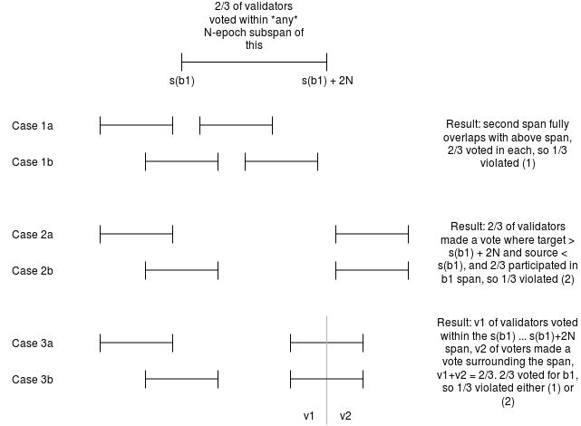

**Status: draft, pending verification.**

**Recommended pre-reading: the original Casper FFG paper: https://arxiv.org/abs/1710.09437**

Suppose that we extend Casper FFG as follows.

* Time is broken up into "slots" (periods of `d` seconds, eg. d=8).
* The validator set is split up ahead of time into N equal-sized slices, which are repeated (eg. slice 3 of the validator set is called to send messages during slots 3, N+3, 2N+3....).
* During each slot, a single validator can propose a block, and the slice of validators corresponding to that slot can vote for it.
* A vote votes both for a block (its "target") and for that block's N-1 nearest ancestors (ie. N blocks in total).
* A block is **justified** if 2/3 of the validator set votes for it (in any of the N slices that include or follow its slot). Note that _any_ block can be justified, not just epoch-transition blocks. The chain keeps track internally of what the "last justified block" is, and votes use this as their "source". Note also that a chain only accepts votes if their source is the source specified in the chain, which itself is guaranteed to be an ancestor of the head of the chain.
* If a sequence of N+1 blocks that are all part of the same chain is justified, then the earliest block in the sequence is **finalized**.
* The two slashing conditions are:
  1. A validator cannot make two distinct votes in the same slot
  2. A validator cannot make two votes `(s1, t1)`, `(s2, t2)`, where `slot(s1) < slot(s2) < slot(t2) < slot(t1)`, where `slot(x)` is the "slot number of x" function.

We prove safety as follows. Suppose that two conflicting blocks `b1`, `b2`, with `[slot(b1) ... slot(b1) + 2N)` being the span of slots in which `b1` is finalized. Suppose without loss of generality that `slot(b2) > slot(b1)`. Then, there exists some sequence of slots `j[0] < j[1] < ... < j[n]` representing the justification chain, where `j[0]` is the last justified checkpoint that is also part of the same chain as `b1` (ie. `j[1]` is the first one that is **not**), and `j[n] = slot(b2)`. For each `j[i]`, 2/3 of validators made votes whose slot numbers for the target are in `[j[i] ... j[i] + N)` and for the source are `<= j[i-1]`. We know such a sequence exists because we know `j[n]` is justified and justifying any checkpoint requires some previous justified checkpoint. Let `j[i]` be the highest slot in the sequence where `j[i] < slot(b1)`. We consider three cases:

**Case 1:** If `[j[i+1] ... j[i+1] + N)` is fully inside `[slot(b1) ... slot(b1) + 2N)`, then there would be 2/3 of validators voting for something in the `b2` chain intersecting 2/3 of validators voting for something in the b1 chain, implying at least 1/3 violated (1).

**Case 2:** If `j[i+1] >= slot(b1) + 2N`, then 2/3 of validators would have made a vote with a span surrounding `(slot(b1), slot(b1) + 2n)` and 2/3 of validators a vote with a span _within_ that same range, meaning at least 1/3 violated (2).

**Case 3:** Now consider the case where `slot(b1) + N < j[i+1] < slot(b1) + 2N`, so `[j[i+1] ... j[i+1] + N)` is partially inside and partially outside `[slot(b1) ... slot(b1) + 2N)`. There are now two subsets of validators: a set v1, which made votes surrounding the span `(slot(b1), slot(b1) + 2n)` and a set v2, which made votes inside of this span. The combined size of v1 and v2 is 2/3, meaning at least 1/3 of them also participated in the `b1` chain. These validators therefore violated conditions (1) or (2), or some combination of both.

Plausible liveness can be proven much more easily. Suppose that `h1` is the highest justified checkpoint. Then, no honest validator made a block with a source higher than `h1`. Suppose `h2` is the highest slot number used up to this point. Then, 2/3 of validators can justify `h2 + N`, using `h1` as a source, and then proceed to fill the span `[h2 + N ... h2 + 3N)`.