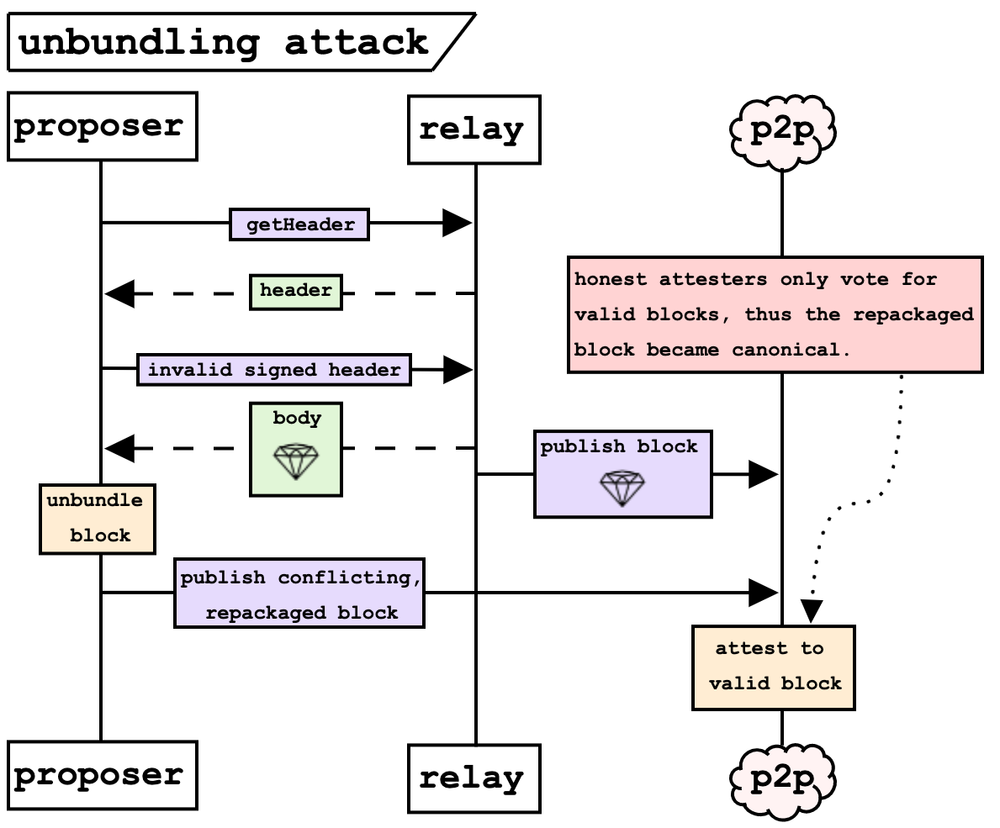
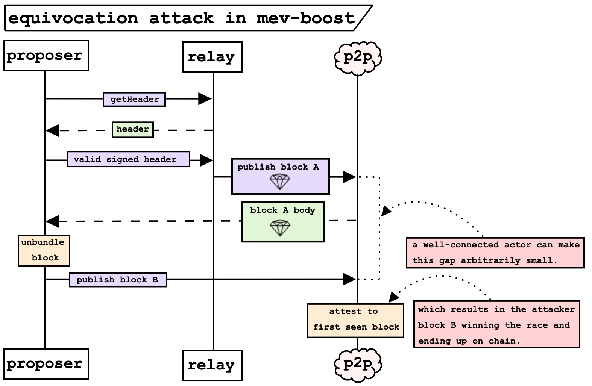
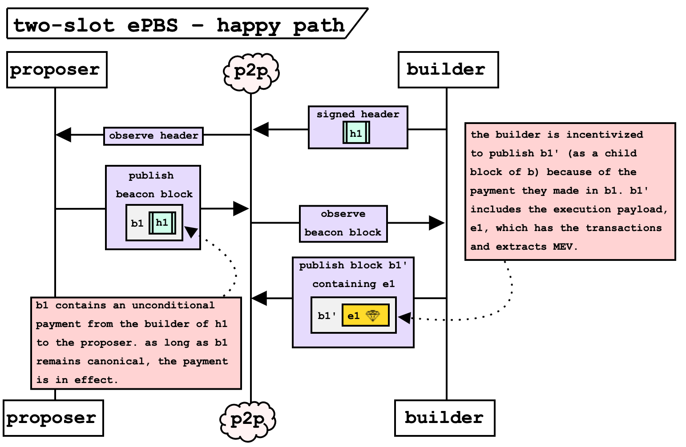
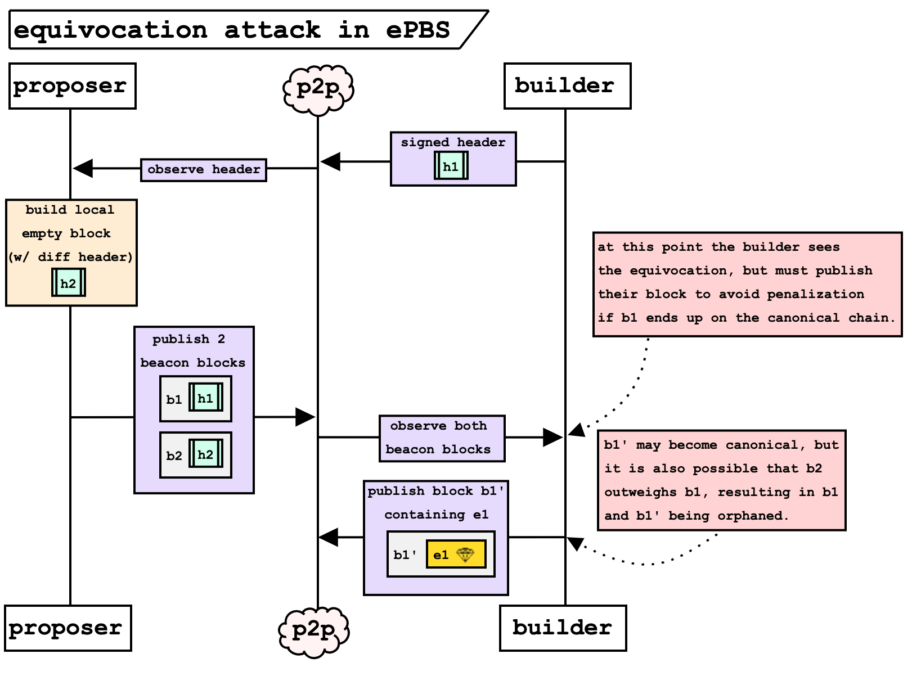
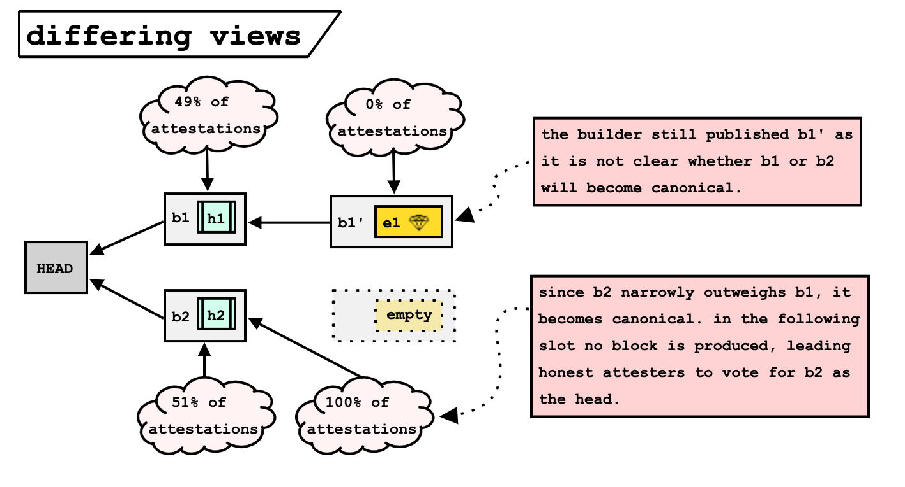
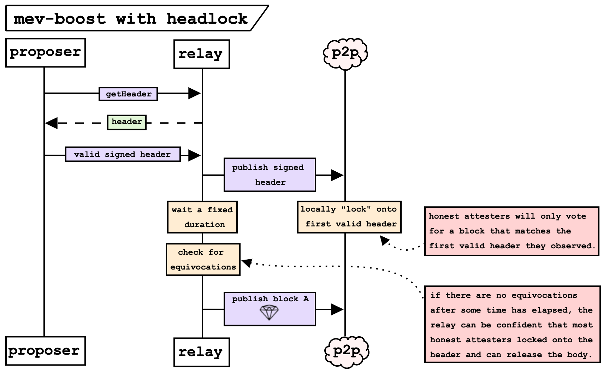
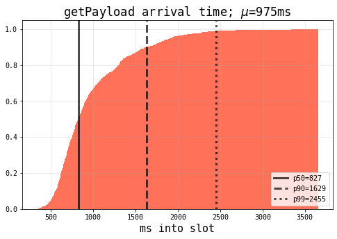
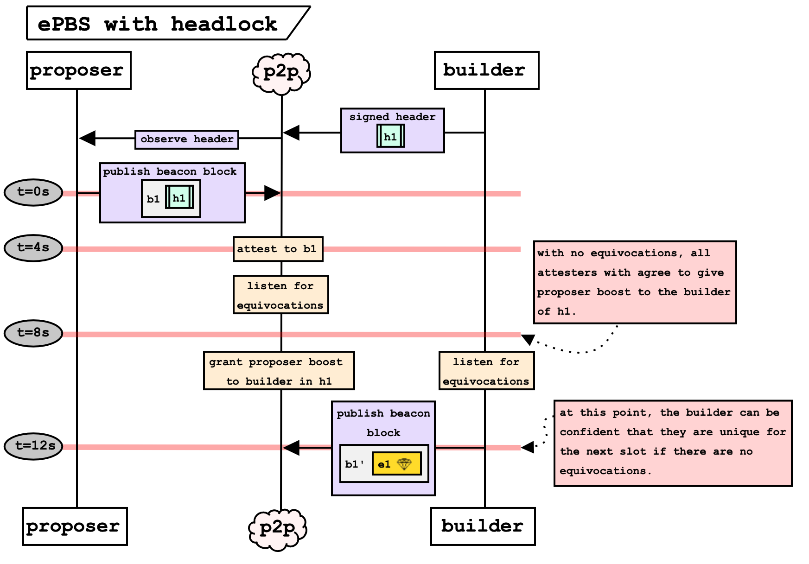

# Equivocation attacks in mev-boost and ePBS

*authors (alphabetically)
[francesco d'amato](https://twitter.com/fradamt) & [mike neuder](https://twitter.com/mikeneuder) – April 18, 2023*

cross posted at https://notes.ethereum.org/@mikeneuder/B1VIDkXG2

---
> *tl;dr; We analyze "equivocation" attacks, in which a malicious proposer double-signs a header in an attempt to unblind a builder block. These attacks can be used to steal MEV and unbundle transactions. We present "headlock", which is also explored in [Subverting the total eclipse (of the heart)](https://hackmd.io/@dmarz/total-eclipse-of-the-relay) by Dan Marzec and Louis Thibault, as a potential short-term solution for the current mev-boost ecosystem and discuss its implications as a long-term solution to equivocation attacks in two-slot ePBS.*
---

## Attacks

### April 2nd unbundling attack
During [slot 6137846](https://beaconcha.in/slot/6137846), a malicious proposer exploited the mev-boost relay to unbundle a sandwiching-searcher's transactions for a profit of over 20 million USD. This attack has been well analyzed; see [Further Reading](https://hackmd.io/@dmarz/total-eclipse-of-the-relay#Further-Reading) from [Subverting the total eclipse (of the heart)](https://hackmd.io/@dmarz/total-eclipse-of-the-relay). The figure below schematizes the attack.

Two factors made this attack easier to execute: (1) the relay didn't check for the validity of the signed header sent from the proposer, and (2) the relay returned the block body to the proposer before publishing it to the p2p layer. These relay weaknesses were quickly addressed in [commit 1](https://github.com/flashbots/mev-boost-relay/commit/3025635e3ae2837c66466cf089b7eb4e2d7da6ed) & [commit 2](https://github.com/flashbots/mev-boost-relay/commit/75823ce8d3690c08b3e7b64801d2b62e860ea623) respectively, and a number of other relay modifications were published in the days following the attack. Special thanks to Chris Hager and the Flashbots team for the huge effort leading the charge to patch the relays. As a result of this work, the attack as executed on April 2nd is no longer feasible. However, as the community began exploring the space of double-signing attacks, many individuals and teams coallesced to a more general (though harder to execute) attack that the relay in its current form cannot defend against.

### Equivocation attack mev-boost
The diagram below outlines the general version of the attack. Due the the fixes mentioned above, the proposer now must submit a valid signed header to the relay and will first observe the block body over the p2p network after it has been published by the relay. 

In order to successfully launch this attack in a single slot, the attacker must (1) observe the block body over the p2p, (2) unbundle it to construct a conflicting `block b`, and (3) publish `block b` fast enough to to win a majority of the attestations for that slot. It has been pointed out that if the attacker controls two slots in a row, the second slot block can build on `block b`, giving proposer boost to that fork. This reduces the proportion of attestations that the attacker needs. Nonetheless, the attacker still must acquire at least 30% attestation weight on `block b` (proposer boost gives 40%, so if a `block A` has more than 70% attestation weight, it won't be reorged out, even with proposer boost on the attacker fork).   

### Equivocation attack in ePBS

This attack has implications for the current ePBS proposals. For this section we use Vitalik's [two-slot ePBS](https://ethresear.ch/t/two-slot-proposer-builder-separation/10980) as the reference design. The figure below demonstrates the "happy path" of block production in two-slot ePBS.

In two-slot ePBS, each proposer slot (where validators are elected as block-producers according to the existing Proof-of-Stake protocol) is paired with a builder slot. During the proposer slot, the elected validator publishes a beacon block (`b1` above) that includes a builder block header (`h1` above). This block header elects the builder as the block-producer for the subsequent slot. If `b1` remains canonical, the builder of `h1` unconditionally pays the proposer. During the subsequent slot, an honest builder of `h1` publishes a new beacon block (`b1'` above) including the execution block body. Because `b1'` is a child block of `b1` and there are no equivocations, honest attesters will correctly grant proposer boost to the builder of `b1'` for the duration of the slot. The next PoS proposer will treat `b1'` as the head of the chain and use it as the parent of their beacon block. 

An equivocating proposer can execute a griefing attack against the builder as follows.

By concurrently publishing two conflicting beacon blocks (with different execution headers `h1 & h2`), the attacker partitions the attester set. The builder observes the equivocation, and is forced to make a decision: either (a) publish their beacon block (`b1'` above) and hope that it is not reorged, or (b) withhold their beacon block and run the risk of `b1` becoming canonical. In the former case, the builders exposes `e1` (the execution payload associated with `h1`), which contains the MEV and bundled transactions. If `b1` gets orphaned by `b2`, the builder does not make a payment, *but the transactions in `b1'` may be unbundled and the MEV stolen in the subsequent slot*. In the latter case, if `b1` becomes canonical, the builder unconditionally pays the proposer for the slot, but doesn't earn any MEV or block reward from the block publication. To drill down on the reason `e1` could easily be reorged, we can examine the different views of attesters during these slots.

This attack is made possible by the lack of a unique builder. With the attestations between `b1` and `b2` being so close, the builder has no way of knowing which will become canonical, thus is forced into making a decision. Because `h1 & h2` specify different builders, attesters that see `b1` vs `b2` as canonical assign proposer boost to their respective builders. Note that the single slot unbundling is not possible in this scenario because the attacker had to commit to a header `h2` before ever seeing the contents of `e1`. In this case, the attack griefs the builder into exposing `e1` without any guarantee that the block becomes canonical. 

## Defending against proposer equivocation

### Headlock in mev-boost
As proposed in [Subverting the total eclipse (of the heart)](https://hackmd.io/@dmarz/total-eclipse-of-the-relay), a near-term solution to the equivocation attack can be acheived by modifying the honest attestation behavior to "lock" into a specific header before the data of the body is made available. The idea relies on a new pub-sub topic on the p2p layer, where headers are propagated between beacon nodes. With this in place, "headlock" is instantiated through the following changes–
>  *New honest attesting behavior*
>  1. Listen on the header topic for incoming headers for the next slot. 
>  2. If a valid header is observed, the node will only accept a block with a matching body (this header is "locked").
>  3. If an equivocating header is observed, the node will reject it and not propagate it. 
>  4. If no block corresponding to the locked header is published by 4s (the attestation deadline), vote for the parent block.
> 
> *New relay behavior*
> 1. Gossip the first signed header that is received.
> 2. Wait for a fixed amount of time.
> 3. Check for equivocations and refuse to publish if any are observed.
> 4. Publish the block body otherwise.

These new mechanics are demonstrated in the figure below.

This allows the relay to only release the body of the block when they are confident that most honest attesters are locked on to the non-equivocating header that they have observed.

> ###### Headlock timing impact
> Headlock introduces more overhead into the relay publication time. The 4s attestation deadline is already a small window, and we saw a large increase in missed slots and orphaned blocks during the April 2nd attack response when relays were modifying the acceptable deadline for block publications. The figure below shows the distribution of the arrival of `getPayload` (signed header received) calls on the [ultra sound relay](https://relay.ultrasound.money/). The relay still has a number of checks to perform before broadcasting the block as quickly as possible to ensure most validators see it by the attestation deadline 4000ms into the slot.
>
>
>
> Trying to add an additional header propogation period and equivocation check would likely be not possible without extending the attestation deadline to 6s, which also implies reducing the attestation aggregation and propagation time from 4s to 3s each (or increasing the slot time). More data and discussion with the core-dev, staking, mev-boost, and research communities would need to take place before committing to this direction. 

### Headlock in ePBS

Headlock can also be extended to ePBS by making two changes to the two-slot ePBS design:
- A change in how the "proposer for builder slots" (the builder) is selected.
- A change in the payment logic, so that the payment is not released if equivocation evidence is available.

Together, the two changes ensure that  builders can safely abstain from publishing whenever there is no agreement on a single builder, due to proposer equivocation, without risking to have to make a payment anyway. If there is agreement on a single builder, they can be protected from reorgs to the same extent as proposers are protected in proposer slots, e.g., through proposer boost. The key here is that proposer boost works if everyone agrees on who is the proposer, implying that there's a unique recipient of the boost. 

The second change is straightforward, as it only entails delaying the payment for sufficiently long that equivocation evidence for the proposer (two signatures for the same slot) can be submitted on-chain. Let's now examine the first change, by going through the steps of a proposer slot.

>  *New proposer slot behavior*
>  1. Proposer broadcasts a beacon block normally at `t=0s` (we do not rely on honest timing)
>  2. Attesters cast attestations for beacon blocks normally at `t=4s`. 
>  3. Any validator locally selects the block builder for the following builder slot at `t=8s`. This is only a local update, based on the messages observed at this point. If no beacon block is seen, no builder is selected. Similarly, no builder is selected if two equivocating beacon blocks are seen. If only a single beacon block is seen, the builder is set to the one it specifies.

In other words, whereas the proposer for proposer slots is selected on-chain, the "proposer" for a builder slot is selected locally, 8s into the previous slot. During a builder slot, this selection affects attestation behavior, in the same way that the (on-chain) proposer selection affects it during proposer slots: if validator $v$ has selected builder $v'$ as the builder for slot $n$, $v$ treats $v'$ exactly as if it were the proposer of slot $n$ (in a world without PBS). In particular, *$v$ assigns proposer boost to $v'$*. If all validators agree on the builder selection, they all assign proposer boost to the same builder, which makes the proposer boost mechanism effective in protecting that builder from reorgs (alternative reorg resilience mechanisms to proposer boost, like [view-merge](https://ethresear.ch/t/view-merge-as-a-replacement-for-proposer-boost/13739), similarly require the identification of a unique proposer which is protected by the mechanism). To demonstrate this mechanism, let's go through a builder slot:

>  1. At `0s`, a builder $v$ which has observed a single beacon block `b` selecting it as builder runs the fork-choice and determines the head `b'`. If `b = b'`, $v$ publishes a beacon block extending `b`, with the appropriate payload. If `b != b'`, $v$ publishes a beacon block extending `b'`, *without a payload*. A builder which has observed equivocation from the proposer does not publish, regardless of whether they are selected by one of the equivocating blocks.
>  2. At `4s`, attesters cast attestations, giving proposer boost to the builder which they have selected in the previous slot, if there was one. If they had not selected any builder, they ignore any proposal and just vote for *the empty slot extending the head of the chain in their view*.

The new flow is represented below.

The key here is that the builder only needs to publish if no equivocations are present. If there is an equivocation, the builder can use it as proof to avoid the unconditional payment. This ensures that the builder only is required to releases the block body if they are certain their block will end up on chain by nature of being the only builder with proposer boost, which establishes the property of builder-uniqueness which is needed to properly protect the builder.

#### Guarantees of ePBS with headlock

Let's more thoroughly examine the guarantees which ePBS with headlock gives to honest builders. We want the following two properties:
- **Honest builder payload safety**: If an honest builder publishes a beacon block *with a payload*, it becomes canonical.
- **Honest builder payment safety**: If a payment from an honest builder is released, the corresponding payload becomes canonical.

Looking at the possible cases during a proposer slot assigned to a possibly malicious proposer:
- Proposer does not publish any beacon block on time, before `4s`: all attesters in the proposer slot vote for an empty slot. If the proposer publishes some beacon block `b` later, it will not become canonical, so no payment will be released. Moreover, the builder selected by `b` will either not publish (if it doesn't see `b` or sees an equivocation) or publish a block with empty payload (if it sees `b` and no equivocation): crucially, it will never publish a block with a payload, because that would require seeing `b` as the canonical head. Therefore, no builder loses money nor reveals their payload, satisfying both properties.
- Proposer publishes multiple beacon blocks before `8s`: any builder will observe the equivocation by `12s`, and not publish, satisfying the first property. Moreover, no payment will be released, satisfying the second property.
- Proposer publishes a single beacon block `b` before `4s`, and no equivocation before `8s`: all validators see `b` before `8s`, and do not see any equivocation by `8s`, so at `8s` they all locally set the builder to be the one selected by `b`, say $v$. Now $v$ is fully in control, because they are recognized by all as the "proposer" for the next slot, so all validators assign it boost. There are three possible cases:
    - $v$ sees an equivocation before `12s`. In this case, we again clearly satisfy all properties (no payment released, $v$ does not publish).
    - $v$ does not see an equivocation before `12s`, and sees `b` as the head of the chain. $v$ publishes a block extending `b`, with the right payload, which receives boost and becomes canonical. Both properties are satisfied.
    - $v$ does not see an equivocation before `12s`, and sees `b' != b` as the head of the chain. $v$ publishes a block *with empty payload* extending `b'`, which receives boost and becomes canonical. Therefore, `b` does *not* become canonical, so the payment is not released. Since neither the payment is released nor the payload published, both properties are satisfied.

Additionally, we still have a strong guarantee for honest proposers, i.e. **honest proposer reorg safety** (also known as *reorg resilience*): the beacon block proposed by an honest proposer becomes (and stays) canonical. This is simply due to the normal applications of reorg protections for proposers, such as proposer boost, and immediately implies **honest proposer payment safety** (that they receive the agreed-upon payment), because honest proposers do not equivocate, so the payment is always released.

Finally, the protocol is also protected from proposer *and* builders colluding to extract more MEV by releasing late: we have **time-buying collusion-resistance**. This is simply because we employ `(block, slot)`attestations (as in regular two-slot PBS), i.e. we allow (and require) validators to vote *against* late proposals. If sufficiently many validators do so, the builder is unable to do anything to force a late proposal to be canonical. This is similar to the [Allow honest validators to reorg late blocks](https://github.com/ethereum/consensus-specs/pull/3034) spec PR from Michael Sproul, where proposers uses their proposer boost to enforce timeliness in the *previous* slot. The key difference is that with `(block, slot)` attestations *we do not rely on honest behavior from the next proposer*, only on honest majority of attesters. This is particularly important here, given that *the next "proposer" is the chosen builder*, and we are precisely trying to guard against collusion of a proposer and the builder of their choice.