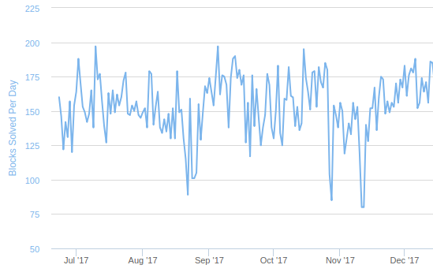
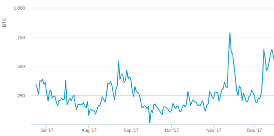
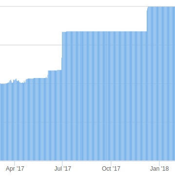
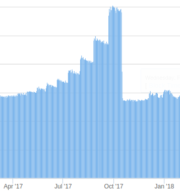
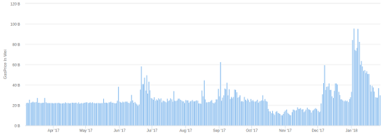
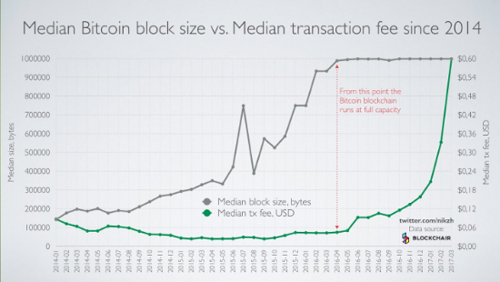
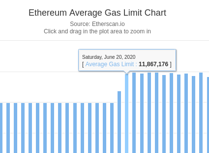
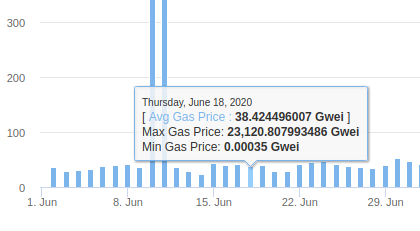

One variable of interest in cryptocurrency is the demand curve in the transaction fee market; that is, for any value X, what is the fee level that the highest-fee-paying set of users whose usage makes up X (gas | weight units | bytes) is willing to pay? This has relevance in block size policy design; to take an extreme example, if the elasticity is very low (eg. 0.1), then setting inflexible block size caps is a very bad idea, because setting a cap that is even 10% below the optimum would more than double the fees that users would have to pay, and an influx of 10% more users could have the same effect.

However, it is difficult to estimate demand directly. We can try to look at the levels of transaction fees that users are sending, but this data is highly imperfect because the fee levels do not actually reflect users' [reserve prices](https://en.wikipedia.org/wiki/Reservation_price); rather, they are a strategic choice, taking into account both the user's demand and market conditions (see https://en.wikipedia.org/wiki/First-price_sealed-bid_auction#Strategic_analysis). So what can we do instead? This post attempts a novel strategy, looking at "natural experiments" where the supply (ie. block size limit) changes for exogenous reasons that have nothing to do with cryptocurrency price or underlying adoption, and see how the equilibrium price adjusts. We will examine five situations:

* The [Bitcoin block rate](https://www.smartbit.com.au/charts/blocks) crunch of 2017 Aug 22-26 (a result of BTC/BCH difficulty adjustment interplay)
* The Bitcoin block rate crunch of 2017 Nov 11-12
* The [Ethereum gas limit](https://etherscan.io/chart/gaslimit) increase from 4.7m to 6.7m on 2017 Jun 29
* The Ethereum [block time decrease](https://etherscan.io/chart/blocks) on 2017 Oct 16 (a result of Byzantium cancelling the ice age)

We will ignore previous situations like the Ethereum DoS attacks and the Bitcoin block reward halvings because they occurred at a time of naturally non-full blocks, and in the former case involved a single exceptional actor greatly contributing to transaction demand. Note that these experiments give fairly short-run demand curves, looking at situations that last over the course of one week; long-run demand curves may be different.

### Data from Bitcoin

In the Bitcoin case, we can look at https://www.smartbit.com.au/charts/blocks for block rate data; from a natural rate of 150/day, the block rate decreased on Aug 22-26 to ~100/day, and on Nov 11-12 to ~80/day:



Transaction fees paid spiked during those same two intervals:



The last "fully normal" day before the August drop was Aug 19 (151 blocks) and the first "fully normal" day after is Aug 27 (155 blocks); the fees on those days are 209 and 378 BTC. During the peak, Aug 22 (89 blocks), fees rose to 542 BTC, and on the remaining days (~100 blocks) fees were at an average of ~400 BTC. Looking at the left side, this gives an elasticity of $log(\frac{151}{89}) \div log(\frac{542}{209}) \approx 0.55$. At the right side, transaction fees took longer to subside; they returned to ~280 at the beginning of September, when the block rate reached 175/day; this gives an elasticity of $log(\frac{175}{100}) \div log(\frac{400}{280}) \approx 1.57$.

In November, block rate went from 153 on Nov 9 to 80 on Nov 11-12 to 140 on Nov 13 and "returned to normal" to 152 on Nov 15. Transaction fees went from 320 BTC on Nov 9 to 783 BTC on Nov 12, eventually subsiding back at the 290 level on Nov 17. This gives an elasticity of $log(\frac{153}{80}) \div log(\frac{783}{320}) \approx 0.72$ on the left side and $log(\frac{152}{80}) \div log(\frac{783}{290}) \approx 0.64$ on the right side.

However, average fees may be misleading' they reflect the average transaction, and not the marginal transaction (ie. the cheapest transaction that got included). We can also look at [Jochen Hoenicke's mempool data](https://jochen-hoenicke.de/queue/#1,1y); we will use as our index the transaction fee level, in satoshis per byte, at which 2000 transactions are in the mempool (the rationale being that 2000 is the average number of transactions in a block, and so reflects the marginal (ie. cheapest) transactions that would make it into the next block). We will simply provide these levels for some key dates:

* Aug 19 (151 blocks): 20
* Aug 22 (89 blocks): 400
* Sep 1 (174 blocks): 200
* Nov 9 (153 blocks): 170
* Nov 13 (80 blocks): 500
* Nov 17 (167 blocks): 20

This gives possible elasticities of:

* $log(\frac{151}{89}) \div log(\frac{400}{20}) \approx 0.18$
* $log(\frac{174}{89}) \div log(\frac{400}{200}) \approx 0.97$
* $log(\frac{153}{80}) \div log(\frac{500}{170}) \approx 0.60$
* $log(\frac{167}{80}) \div log(\frac{500}{20}) \approx 0.22$

To summarize, we get (0.18, 0.22, 0.60, 0.97) using mempool (marginal) data, and (0.55, 0.64, 0.72, 1.57) using average fee data. The mode is 0.41 using marginal data and 0.68 using average data.

### Data from Ethereum

Here is the Ethereum [gas limit](https://etherscan.io/chart/gaslimit) over time:



And the Ethereum block time during the ice age:



Here are average fees during the same time period:



We will give average gasprices (in gwei) for some key dates:

* June 27-28: 31.5 and 43.4 (average 37.5)
* June 30-July 1: 27.2 and 26.6 (average 26.9)
* Oct 14: 24.2
* Oct 17: 14.2

Between June 28 and June 30, the gas limit increased from 4.7m to 6.7m (1.42x increase). Between Oct 14 and Oct 17, the block rate increased from 2900 to 6200 (2.13x increase). Between Dec 7 and Dec 11, the gas limit increased from 6.7m to 8m (1.19x increase). This gives possible elasticities of:

* $log(\frac{6.7*10^6}{4.7*10^6}) \div log(\frac{37.5}{26.9}) \approx 1.05$
* $log(\frac{6200}{2900}) \div log(\frac{24.2}{14.2}) \approx 1.41$

Of course, we can similarly look at marginal data. Here, we will scan through Ethereum blocks directly, and take the average of the 90th-percentile fees (ie. the Nth lowest fee in a block with 10N transactions) of the 5000 blocks starting from the start of a given day. Here are the values for key dates:

* June 27-28: 24.7 and 26.9 (average 25.8)
* June 30-July 1: 22.7 and 23.4 (average 23.0)
* Oct 14: 16.0
* Oct 17: 7.8

This gives possible elasticities of:

* $log(\frac{6.7*10^6}{4.7*10^6}) \div log(\frac{25.8}{23.0}) \approx 3.09$
* $log(\frac{6200}{2900}) \div log(\frac{16.0}{7.8}) \approx 1.06$

The first value is likely an outlier; the likely cause is wallet software that specified 20 gwei as a static gas price. In the second two cases, the wallet software was modified to have more dynamic gasprice setting, allowing gasprices to rise and fall more flexibly.

To summarize, the median elasticity is 1.23 looking at average data, and 2.07 looking at median data.

### Conclusions

In sum, Bitcoin's demand elasticity appears to be around 0.4-0.7, and Ethereum's around 1-2. Other, cruder, ways of estimating demand elasticity seem to confirm this on the Bitcoin side. Here is a chart of bitcoin's block usage versus transaction fees:



Block usage increased by ~3x between 2015 May and 2016 Apr, and when blocks became full the growth in demand switched to fees, growing ~11x in 11 months. Taking the extremely crude assumption that the rate in growth of demand was constant, this suggests a demand elasticity of $log(3) \div log(11) \approx 0.46$.

Ethereum's demand is more elastic likely because there is a wider array of applications that can be developed on Ethereum, with different costs per unit gas. For example, it is known that when gasprices went to an all-time high of ~70 gwei in early January, transaction counts hit an all-time high (despite no growth in _gas usage_), which showed that demand from more complex smart contract use cases was being substituted by demand for simpler transactions such as ETH and ERC20 token transfers.

In the case of Bitcoin, it is also known that many Bitcoin "tumblers" used to anonymize transactions [shut down](https://cointelegraph.com/news/worlds-largest-bitcoin-tumbling-service-announces-sudden-shutdown) between 2014-2017, raising the possibility that tumblers made up a large part of the low-cost-per-transaction demand and they were pushed out by higher-fee-paying "regular" transactions, though increasing law enforcement risk may have also been a factor.

It would be an interesting area of further study to evaluate this hypothesis, and also to try to more generally evaluate the composition of the Bitcoin and Ethereum blockchains at different fee levels, and try to understand the levels of willingness to pay transaction fees across different use cases, and particularly what use cases are most able to temporarily shut down "at a moment's notice" in the event of sudden transaction fee spikes. Another possible challenge is evaluating the role of cryptocurrency competition in increasing any single cryptocurrency's transaction demand elasticity.

### Sources

* http://etherscan.io
* https://blockchain.info/charts
* https://www.smartbit.com.au/charts/blocks
* https://jochen-hoenicke.de/queue/#1,1y

Here is the script used to calculate the 90th-percentile fees. Timestamps are the UTC time of the start of each day.

```
from web3.auto import w3

def binsearch(ts):
    value = 0
    skip = 2**22
    while skip:
        if value + skip <= w3.eth.blockNumber and w3.eth.getBlock(value + skip)['timestamp'] < ts:
            value += skip
        skip //= 2
    print('Binary search resolved:', ts, value)
    return value

def analyze(block):
    tot = 0
    for i in range(block, block + 5000):
        gps = sorted([w3.eth.getTransaction(tx)['gasPrice'] for tx in w3.eth.getBlock(i)['transactions']])
        tot += gps[len(gps)//10] if len(gps) else 0
        print(i, tot / (i+1-block))
    return tot / 5000
```

### Addendum (2020.09.02)

Here's a quick "eyeball analysis" of the most recent rise from 10m to 12m.

The gaslimit went up from 10m to 12m from June 18-20:

 

The average transaction fee went down from 38.4 gwei to 29.5 gwei over the same time period:

 

This implies an elasticity of $log(1.2) \div log(\frac{38.4}{29.5}) = 0.69$. Clearly, this is a rough estimate from noisy data (eg. on Jun 22 the gasprice went back up, and before June 15 the gasprice was lower for clearly unrelated reasons) but it does roughly align with the other measurements that we saw above.