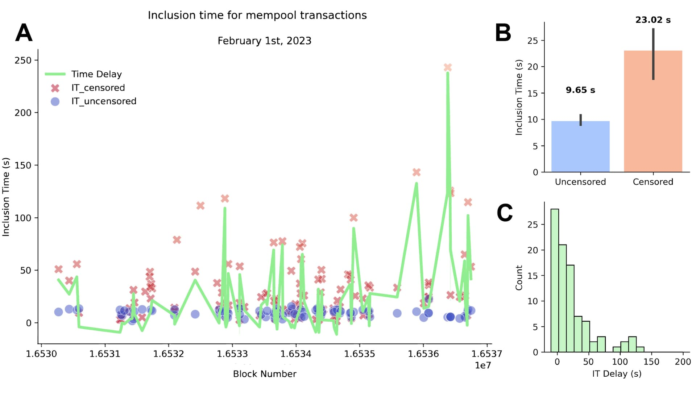

*The genesis of this post can be traced back to discussions between Justin Drake and Phil Daian during the [MEV Boost community call #1](https://collective.flashbots.net/t/mev-boost-community-call-1-9-mar-2023/1367), organized by Alex Stokes. Its objective is to serve as an exemplar resource for illustrating the recently announced ROP-5: Ethereum Supply Chain Health Framework.*

A special thanks to the RIG for feedback and comments.

Proposer Builder Separation (PBS) and the emergence of MEV-Boost relays regulated under specific jurisdictions has led to weak censorship for Ethereum transactions (https://www.mevwatch.info/). **This post aims to illustrate the importance of designing simple but robust metrics to estimate the impact censoring relays have on inclusion time (IT).**

IT delays for transactions subject to censorship have hitherto been measured as the duration during which a censored transaction remains in the mempool prior to its appearance on-chain in a block (i.e., confirmation). While such information is valuable, it may paint an erroneous picture of the issue at hand since it neglects the time taken for other uncensored transactions within the same block to be confirmed. When the mempool is congested, for example, due to the release of a new NFT collection, IT may increase without any relation to censorship.

Here, we compute the IT delay for a censored transaction. This delay will be determined by subtracting the median of ITs for uncensored transactions in the same block from the IT of the censored transaction. Moreover, we only consider uncensored transactions with priority fees that are within 10% of the priority fees of the censored transaction:

*IT_delay = IT_censored - median(IT_uncensored with priority fees ±10% of the censored tx)*

Our approach was illustrated by its application to the Blocknative mempool dataset of February 1, 2023, comprising 1,028,715 confirmed transactions, of which 133 were identified as originating from Ethereum addresses added to the Office of Foreign Assets Control (OFAC) sanctions list found on the [Ultra Sound Github](https://github.com/ultrasoundmoney/ofac-ethereum-addresses) repository. We selected the associated uncensored transactions that appeared in the same block and had priority fees within 10% of censored transactions (n = 1376), and computed the IT_delay across blocks in which a censored transaction appeared (see Figure 1A)

We found that the median inclusion times were 23.02 seconds for censored transactions and 9.65 seconds for uncensored transactions, respectively (Figure 1B). We observed a positively skewed distribution of IT delays, with a median of 11.43 seconds (Figure 1C). Importantly, using the canonical approach that consists in displaying the mean IT for censored transactions (e.g., https://relay.ultrasound.money/) results in 40.16 seconds, largely overestimating the impact of censoring relays. Finally, we used a similar approach to estimate the block delay for censored transactions and observed a median block delay of 1 block.

**Figure 1A displays the Inclusion Time (IT) of mempool blocks that contain censored transactions, indicated by red crosses. The blue dots represent the median IT of uncensored transactions that appeared in the same block and had priority fees within 10% of the censored transaction. The IT delay, calculated using Formula 1, is represented by the green line. (B) Bar graph representing median ITs for uncensored (blue) and censored (red) transactions, with their associated confidence intervals. (C) Distribution of Inclusion Time delays.**

The results of this analysis are limited by the amount of data used to derive these metrics, and will need to be updated by refining the choice of uncensored transactions to be included to compute the IT delay (presently selected based on an arbitrary criterion of priority fees within a 10% margin). Nonetheless, **our intention is to spark interest in the design of quantifiable metrics to enhance the visibility and assess the overall health of the Ethereum Supply Chain infrastructure.**