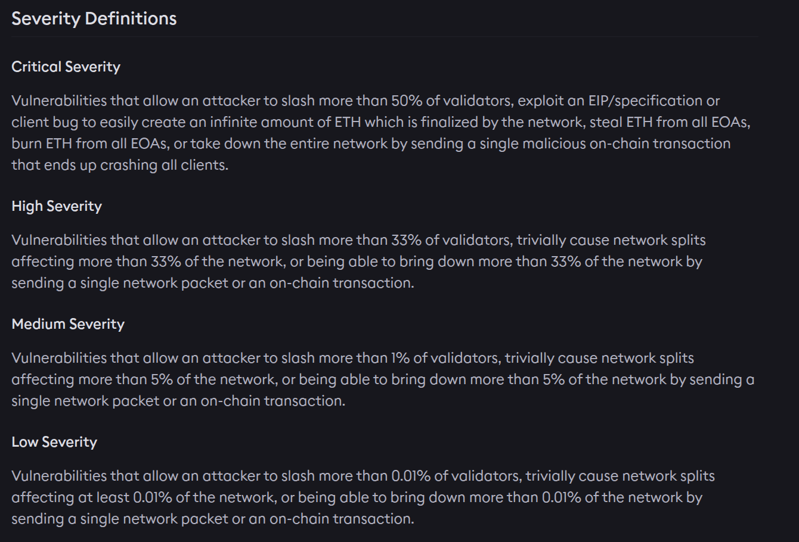

So if you can take the entire network down and steal all the funds, and it requires two transactions or two network packets, that is not even  low severity. Or should the sentence be read differently ?   :joy:

and then, what does “trivially cause network splits” even mean? If you “non-trivially cause network splits,” aren’t you paid $2M? :joy:

and then, if you have a vulnerability that slashes 1% of validators, you could trivially slash 33% of validators by applying the same exploit 33 times. :joy:

and then,  how do you “create an infinite amount of ETH”? That’s impossible, since an infinitely large number would have infinite length. :joy:

and then, what does “steal ETH from all EOAs” mean? If you can steal from one EOA, you can obviously repeat the exploit to steal from all EOAs. :joy:

Finally, what does “a network packet” mean here? There’s no notion of a network packet in the ETH spec—Ethereum runs over TCP.  Is it an IP packet, an Ethernet frame, or an ATM cell? Where does one send the packet—multicast it to the whole network or send it to a single node? :joy:

There are many more obvious things that make the definitions above flawed.  For instance, does one assume a particular client ratio on the network?  If an critical bug is found in an obscure client that noone uses, it may be be fatal to the network if the client runs 100% of the network, and totally unimportant if it runs 1% of the network.