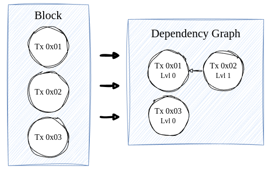
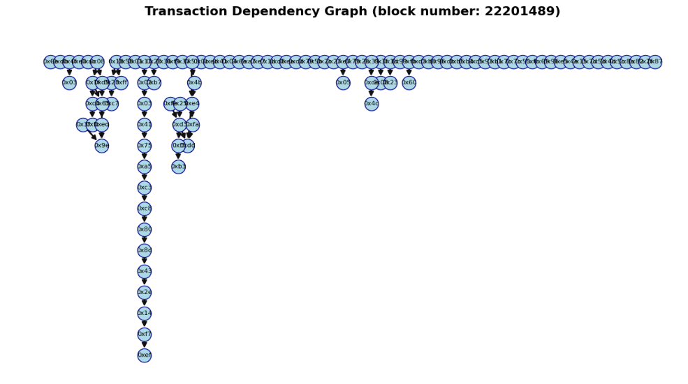
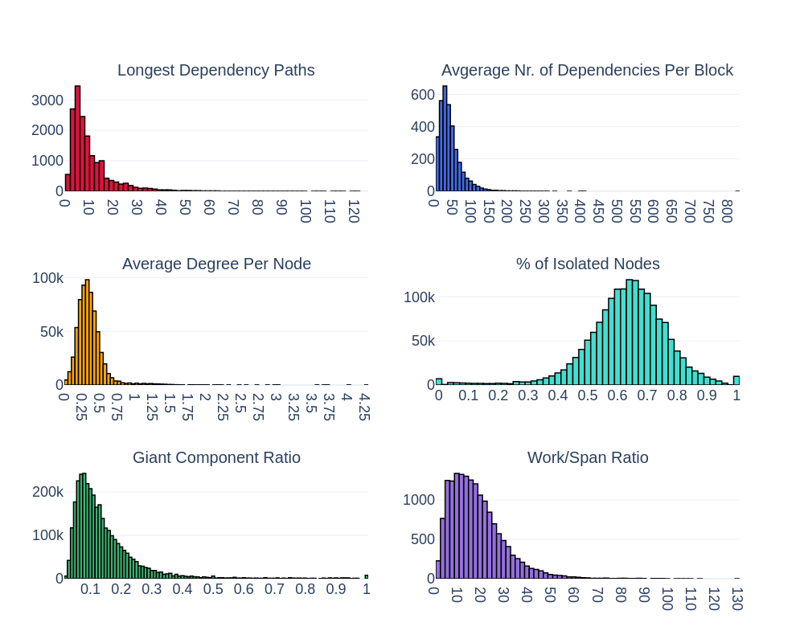
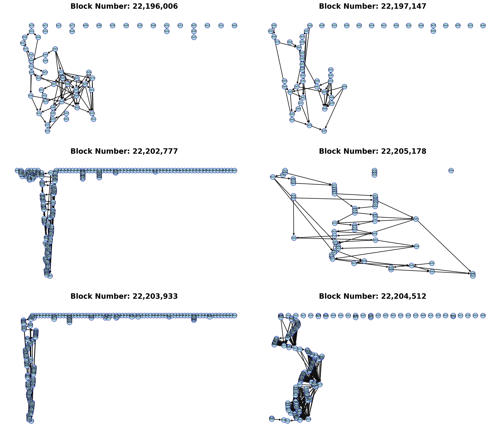
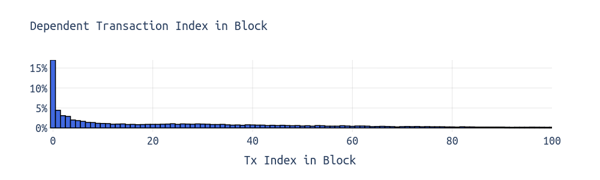
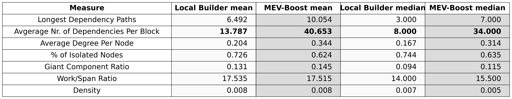
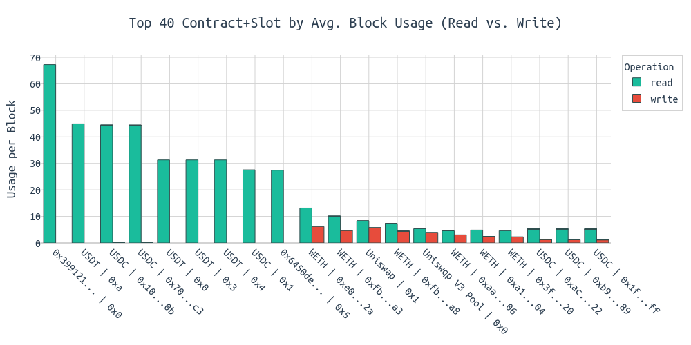

# Execution Dependencies

> Thanks to [Julian](https://x.com/_julianma), [Ignacio](https://x.com/ignaciohagopian) and [Ben](https://x.com/ben_a_adams) for feedback and review.

**TL;DR:** Most Ethereum blocks are highly parallelizable. On average, 60–80% of transactions are completely independent, and dependency chains are shallow. However, a small number of blocks have heavy entanglement and long critical paths, limiting parallelism — especially near the top-of-block (ToB), where MEV searchers compete for order. 
Explore some transaction dependency graphs on [dependency.pics](https://dependency.pics/).

---
## Transaction dependency graphs

For the following, the goal is to quantify how dependent transactions within blocks are on one another, guiding us in understanding how well blocks are parallelizable.

> The dataset includes blocks from 22,195,599 to 22,236,441. It focuses specifically on storage-related dependencies, while other potential sources of dependencies—such as account balances—were intentionally excluded.

For each block $B$, we define a directed graph:

$$
G_B = (V_B, E_B)
$$

Where:

- **Vertices**:  
  $V_B = \{ t_1, t_2, \dots, t_n \}$ represents the transactions in $B$, ordered by their transaction indices.

- **Edges**:  
  For any $t_i, t_j \in V_B$ with $i < j$, include a directed edge 
  $$
  (t_i, t_j) \in E_B
  $$
  if transaction $t_i$ writes to a storage slot that transaction $t_j$ later accesses (via SLOADs or SSTOREs).

This graph $G_B$ encodes the execution order imposed by the dependencies. The directed edges ensure that if $(t_i, t_j) \in E_B$, then $t_i$ must execute before $t_j$. Consequently, the structure of $G_B$ reveals the potential for parallel execution—transactions in disjoint subgraphs can be executed concurrently.

In the graph, weakly connected components capture both **sequential dependency chains**—such as tx $A$ depending on tx $B$, which in turn depends on $C$—and **convergent, bottleneck dependencies**, where multiple nodes (like tx $A$ and tx $B$) rely on a single node (e.g., tx $C$).

A representative example of a single block's dependency graph is shown below:

In this block, we observe that most transactions are isolated, indicating minimal dependencies. However, we also note some connected transactions forming larger weakly connected components.

Now, **zooming out** to see trends across many blocks, we focus on the following metrics:

* **Critical Path Lengths**: The longest chain of dependent transactions in a block. A shorter path suggests more parallelizable work.
* **Average Dependencies per Block**: The average number of dependency edges across blocks, reflecting how much inter-transaction coordination typically exists.
* **Average Degree per Node**: The average number of dependencies per transaction, indicating how entangled transactions are. Higher values imply tighter coupling.
* **Percentage of Isolated Nodes**: The share of transactions with no dependencies. A high percentage signals broad potential for parallel execution.
* **Giant Component Ratio**: The fraction of nodes in the largest weakly connected component. Values near 1 suggest most transactions are interconnected; lower values indicate fragmentation.
* **Work/Span Ratio**: Total transactions divided by the critical path length. This offers an upper bound on theoretical parallel speedup — the higher the ratio, the greater the potential for concurrency.

The histograms reveal that most blocks have **short dependency paths**, with a sharp drop beyond length 10, indicating rare deep sequential chains. **Average dependencies per block are low**, typically under 100, and the **average degree per node** centers around 0.3, showing that **transactions are only lightly interconnected**. **A large share of transactions—between 60% and 80%—are fully isolated**, making them ideal for parallel execution. The **giant component ratio** remains low across blocks, suggesting fragmented graphs with **many small components**. Lastly, the **work/span ratio** often exceeds 10, highlighting **substantial headroom for parallelism**.

While **average-case** insights are helpful, addressing **worst-case** scenarios is crucial for scalability. **Outlier blocks that have lengthy dependency chains, high entanglement, or low isolation could significantly impact throughput.**

On that note, we see worst-case examples for all of the above metrics in the following. Each graph represents a dependency graph of a single **Ethereum mainnet** block. **Transactions** are represented as **nodes** and **dependencies** as directed **edges**:

While most blocks are well parallelizable, we observe blocks with long dependency sequences that cannot be naively parallelized.

> Play around with such graphs yourself: [dependency.pics](https://dependency.pics/)

The **most dependent transactions** are generally found in the **top of the block** (ToB), a space that is particularly attractive for MEV searchers and builders.

Furthermore, we observe substantial differences between local builders and MEV-Boost builders, with the former typically building blocks with fewer dependencies. Locally built blocks, on average, have **~14 transactions** with dependencies on prior transactions in the block. For MEV-Boost builders, it's **~40 transactions** per block on average.

> Of course, the general trend towards the blocks of local builders getting smaller and smaller over time (more info [here](https://ethresear.ch/t/expanding-mempool-perspectives/22022)) also plays into that.

Finally, when looking into the **most frequently accessed contract and storage slot combinations**, we see several prominent projects among the top positions, including stablecoins, WETH, Uniswap, and MetaMask. Consistent with [findings from a previous analysis](https://ethresear.ch/t/block-level-warming/21452), we again identify the contract `0x399...` as the most frequently read contract (highest number of SLOADs). For further details and an explanation of this behavior, please refer to the linked analysis. Specific storage slots in contracts like WETH, USDC, or USDT experience reads and writes in nearly every block.

## Further readings

* https://writings.flashbots.net/parallel-builder
* https://www.scs.stanford.edu/24sp-cs244b/projects/Concerto_Transaction_Parallel_EVM.pdf
* https://www.microsoft.com/en-us/research/wp-content/uploads/2021/09/3477132.3483564.pdf
* https://writings.flashbots.net/speeding-up-evm-part-1